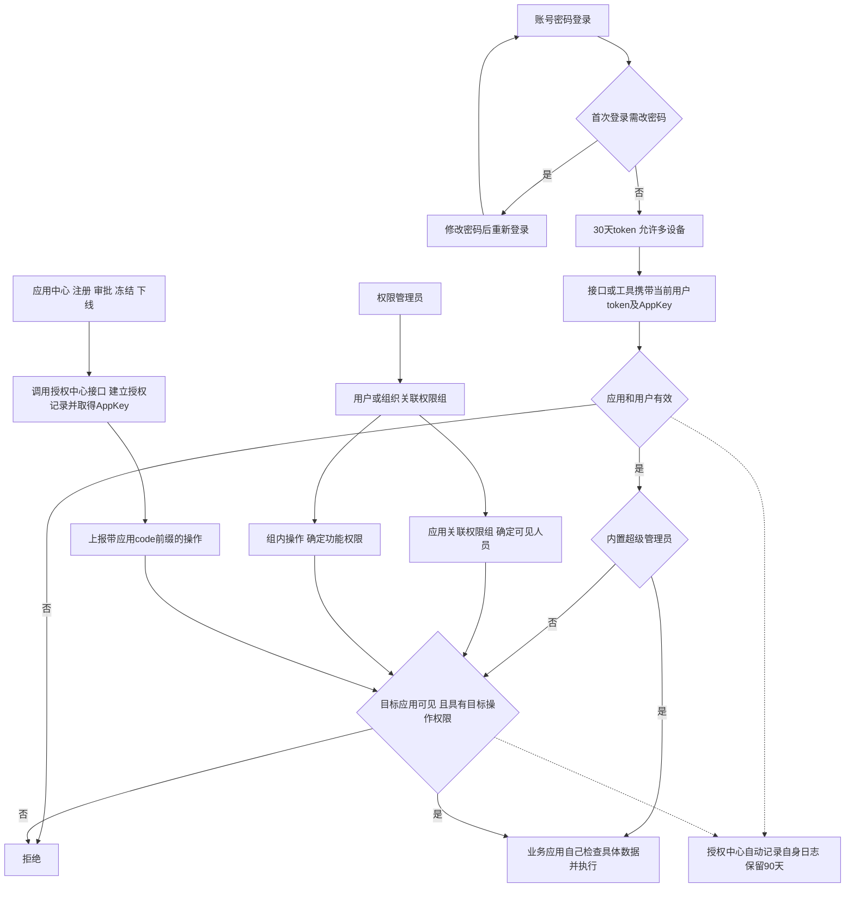
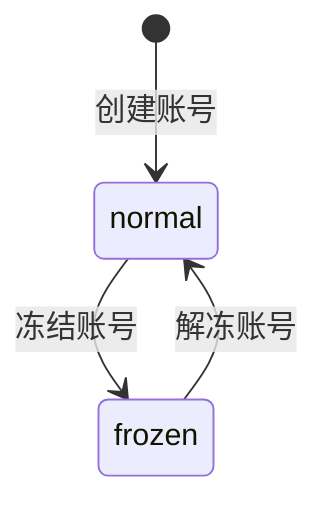
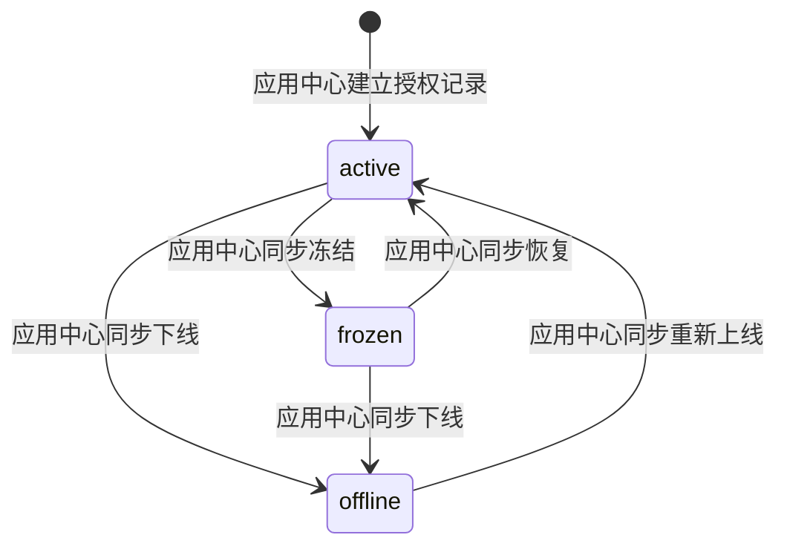
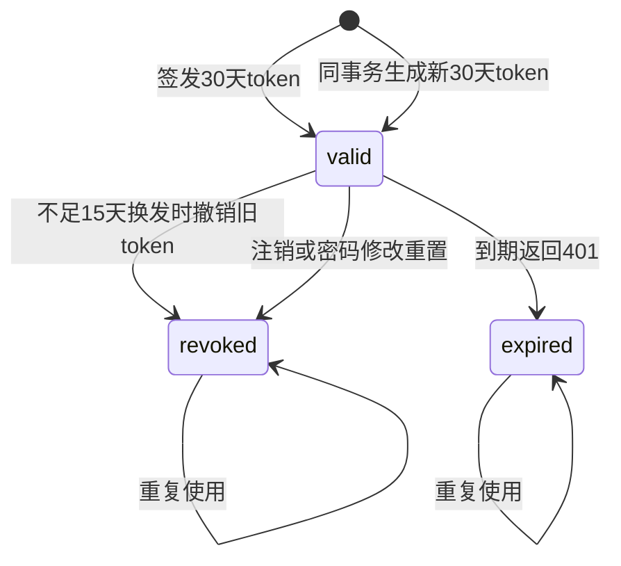
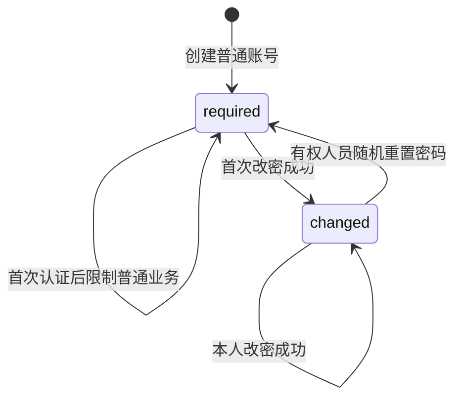

<!-- prd-workspace:{"schemaVersion":1,"docId":"safety-platform.authorization-center","version":"0.4.2","revision":9,"updatedAt":"2026-09-12T10:00:21.953Z"} -->

# 授权中心产品需求文档

授权中心为一家企业管理账号、组织、应用可见范围和功能权限。用户使用账号密码登录，应用通过 AppKey 标识身份，接口和工具传递当前登录人的 token。具体业务数据能否查看或修改，由各应用自己决定。

| 元信息   | 内容                                                                                                         |
| ----- | ---------------------------------------------------------------------------------------------------------- |
| 文档 ID | safety-platform.authorization-center                                                                       |
| 业务版本 | 0.4.2 |
| 状态 | 进入开发准备：本轮决定已落实；未决场景见第十二章，业务尚未验收 |
| 依据    | 用户在本文件第十二章填写的23项反馈和7项补充反馈                                                                                  |
| 日期    | 2026-09-12                                                                                                 |
| 技术目标  | Spring Boot 4.1.X、MyBatis、Docker单实例PostgreSQL 18.6、全新数据库；版本为用户指定，尚未安装验证                                                     |
| 表前缀   | `qs__auth__`；按反馈中Markdown转义还原后的字面值使用                                                                       |
| 原始资料  | [PRD.md](PRD.md)、[DDL.md](DDL.md)保留为输入，不代表当前要求                                                             |
| 反馈快照  | [用户填写的完整文档](history/v0.3.1-user-feedback/授权中心.prd.md)、[逐项反馈原文](history/v0.3.1-user-feedback/feedback.json) |
| 文件使用  | Markdown为正文来源；HTML为同一快照的离线阅读、编辑和导出文件                                                                       |
| 核验范围  | 需求资料、SQL文本、合成数据和文档工具；未执行数据库或业务接口，未作业务验收                                                                    |

### 编号说明

S表示来源，US表示功能，BR表示规则，API表示接口操作组，DB表示数据库事项，TC表示测试用例，TD表示测试数据，AC表示验收，Q表示反馈与待定细节。沿用原编号；删除的编号保留为N/A且不转给别的需求，新需求使用新编号。具体路径和错误码由第五章及[平台公约](../平台公约.md)定义，属于本轮制定的开发约定，尚未实现。

### 阅读导航

业务范围看第一、二章；字段、SQL和接口看第三至五章；状态和异常看第六至八章；用例与验收看第九、十章；用户决定与剩余问题看第十二章。

S-01为原始PRD，S-02为原始功能清单，S-03/S-04为原始DDL及其说明，S-05为历史模板背景，S-06为本次用户反馈。S-07为本轮13项补充反馈；S-06与S-07共同定义当前目标；旧资料冲突以反馈为准。[总体架构](../总体架构.md)的多租户描述不适用于本套单企业部署；[应用中心](../3-应用中心/DDL.md)负责应用业务注册和审批，两份跨模块资料未在本次修改。

## 一图统揽

图中应用授权决定谁能看到应用，权限组中的操作决定能做哪些功能。组织上下级只是组织关系，不自动增加权限继承；一个人可挂多个部门，没有主部门。



应用中心与授权中心是一起上线的内置应用；授权中心独立部署和运行，不依赖应用中心才能处理已经登记的应用。初始化方案仍需Q-16细化。

## 修订记录

0.4.2落实第三轮开发决定：多可见权限组、换发token、退出当前设备、随机密码一次展示、禁止关联删除，以及应用中心负责应用生命周期；公共接口规则统一采用[平台公约](../平台公约.md)。

0.4.1依据[第二轮用户反馈快照](history/v0.4.0-user-feedback/授权中心.prd.md)落实13项补充，保留既有决定和未决细节；业务实现和验收未执行。

| 版本    | 依据与影响                                                                                          | 验证状态                          |
| ----- | ---------------------------------------------------------------------------------------------- | ----------------------------- |
| 0.4.0 | 按S-06落实单企业、多部门、应用可见范围、30天摘要令牌、首次改密、自动删日志、物理删除、北京时间秒精度和version编辑；取消委托、中心行级数据权限及权限刷新；同步SQL、数据和验收 | 已有用户需求反馈；实现和业务验收未执行           |
| 0.3.1 | 操作增加所属应用，及后续需求评审、通俗化说明                                                                         | 完整正文与反馈保存在历史目录；历史检查不代表0.4.1通过 |

## 一、背景与目标

### 1.1 本期功能

一套系统只服务一家企业，不实现租户切换。默认内置超级管理员拥有所有权限，不参与权限组且不可删除；普通账号按应用可见范围与功能权限配置。身份无效、冻结、到期或未完成首次改密的超级管理员也不能绕过身份检查。

| US    | 功能       | 本期行为                                    | 优先级 |
| ----- | -------- | --------------------------------------- | --- |
| US-01 | 账号管理     | 新增、编辑、物理删除、详情、列表、冻结/解冻；普通账号密码登录         | P0  |
| US-02 | 组织管理     | 组织增改删查；一个人可关联多个部门，无主部门                  | P0  |
| US-03 | 用户组      | 跨部门成员分组及增改删查；用户组本身不授予权限                 | P1  |
| US-04 | 令牌管理 | 每次登录新token；不足15天换发新30天token并撤销旧token；退出当前设备；场景细则Q-06 | P0 |
| US-05 | 参数管理     | 仅授权中心自身参数；文字或数值，非空，保存后立即生效              | P1  |
| US-06 | 字典管理     | 仅授权中心自身字典；增改删查，项结构待Q-14                 | P1  |
| US-07 | 操作管理 | 应用中心调用接口上报、改名、详情及列表；操作保留稳定id，完整操作码唯一 | P0 |
| US-08 | 权限组      | 维护操作集合及增改删查                             | P0  |
| US-09 | 用户与权限组关联 | 新增、编辑、删除、详情、列表                          | P0  |
| US-10 | 组织与权限组关联 | 新增、编辑、删除、详情、列表；按明确成员关系取得组               | P0  |
| US-11 | 应用授权 | 应用中心调用建立授权记录、关联多个可见权限组、查询及鉴权；同步冻结/下线状态；无应用注册入口 | P0 |
| US-12 | 委托授权     | N/A：用户明确整个删除；不保留申请、审批、兜底或委托表            | N/A |
| US-13 | 授权中心日志   | 自动追加自身事件、受控详情/列表；保留90天，超过自动物理删除         | P0  |
| US-14 | 开放能力     | 获取/刷新/注销令牌、用户详情、用户权限；复用同一身份与权限计算        | P0  |
| US-15 | 密码维护     | 本人改密、首次强制改密、有权人员在账户中心随机重置他人密码；至少8位且含数字、字母、特殊字符；成功后重新登录 | P0  |

### 1.2 角色、范围与依赖

账号/组织管理员维护账号与成员；权限管理员维护权限组、关联及应用可见范围；应用中心调用登记接口；普通用户登录并使用获准功能；审计人员只读授权中心日志。超级管理员已确认全权；普通管理角色的授权配置仍由Q-01细化。

本期不提供委托、统一行级数据范围、授权刷新按钮或接口、跨应用独立授权链、应用发布审批、全平台参数字典日志汇聚、跨租户管理、旧库迁移。权限配置提交后需被鉴权读取，并非删除刷新接口就允许永远使用旧权限；传播时限留Q-08。

服务账号原有“禁密码、凭据或证书、IP白名单”要求未被用户取消，其凭据绑定及无人登录任务仍有Q-05/Q-06细节。普通跨应用接口和工具调用只使用当前登录账号权限，不自动转成服务账号。

### 1.3 成功指标

功能判断、登录与改密、token换发、90天清理和不连带删除按已确认规则验收。用户明确本期暂不考虑并发、延迟等性能指标，AC-30标N/A；不将未压测写成容量达标。

## 二、用户故事、规则与验收

### 2.1 当前业务规则

| BR    | 主题       | 规则                                                                                 |
| ----- | -------- | ---------------------------------------------------------------------------------- |
| BR-01 | AppKey验证 | 按用户决定，AppKey本身作为应用身份凭据；普通鉴权不再额外要求AppSecret或签名。未知键或授权应用冻结拒绝。                        |
| BR-02 | 账号身份     | 从当前token核验账号；冻结、撤销或到期拒绝。服务账号不允许密码登录，凭据/IP细则见Q-05。                                  |
| BR-03 | 应用可见范围 | 一个应用可关联多个可见权限组；普通用户取得任意一个关联组即可看到应用，功能仍按用户已取得组内的操作并集判断。可见组集合为空时普通用户不可见。超级管理员不参与权限组，默认全权。 |
| BR-04 | 功能判断     | 普通账号已取得权限组的操作取并集，目标应用可见且拥有目标操作才允许。超级管理员不依赖组即可使用全部已登记应用和功能；所有账号仍需通过AppKey、token、冻结/到期及首次改密检查。 |
| BR-05 | 数据权限     | 授权中心不计算或返回SELF/DEPT/SPECIFIED等行范围，不使用资源ID作为中心授权条件。业务应用负责实际数据能否查看或修改。               |
| BR-06 | 已删除      | N/A：委托匹配条件随委托整体删除。                                                                 |
| BR-07 | 已删除      | N/A：委托应用绑定及授出检查删除。                                                                 |
| BR-08 | 唯一性      | 账号名、非空手机/邮箱、组编码、参数/字典编码、AppKey、应用code、完整操作码保持单企业内唯一；大小写和复用细则见Q-10。                 |
| BR-09 | 多部门组织    | 组织类型包括单位、厂区、部门、岗位、班组；账号可关联多个组织，无主部门。只按实际所属组织取得组，父子关系不自动授予权限；新增/移动防环且维护路径。类型编码和允许的上下级组合见Q-02。 |
| BR-10 | 用户组      | 用户组仅维护跨部门人员集合；加入用户组不自动得到权限组或操作权限。                                                  |
| BR-11 | 操作集合     | 组内操作必须已登记；空组表示无操作。修改共用组必须显示受影响人员和应用；应用可关联多个可见组，编辑共用组须具备相应操作权限。                                    |
| BR-12 | 关联维护     | 用户/组织与权限组、账号与组织、用户组与账号的同一组合不能重复；编辑替换关联目标须完整成功，不能变为新增。                              |
| BR-13 | 应用授权接入 | 应用只在应用中心注册、审批、冻结和下线，appCode唯一且不可重复注册。应用中心受控调用授权中心接口建立授权记录、配置可见组、上报或改名操作、同步应用状态；授权中心无应用注册、冻结或下线管理入口。 |
| BR-14 | 已删除      | N/A：应用权限刷新入口、接口及密钥轮换暗含行为删除；令牌刷新是另一项未被删除的能力。                                        |
| BR-15 | 令牌期限     | 每次入口登录成功都签发一枚新的30天token，不撤销其他设备有效token。已到期token自动失效，返回HTTP 401，前端转登录；冻结、改密限制仍适用。 |
| BR-16 | 令牌换发 | 有效token剩余严格不足15天自动调用后台换发新token；新token自换发起有效30天、沿用当前sessionId，旧token同时撤销。剩余正好15天不触发，到期401。服务端事务与旧token状态比较只允许一次换发成功；重复使用旧token返回40103，前端同一登录实例串行续期。响应丢失后重新登录，不恢复旧token；其他设备不受影响。 |
| BR-17 | 冻结与退出 | 退出只撤销当前设备登录实例sessionId下的token，不能由客户端指定其他设备退出。冻结期间拒绝；解冻后未过期、未撤销的token可继续用。改密或重置撤销该账号全部设备token；旧token换发、退出后不得因解冻恢复。 |
| BR-18 | 已删除      | N/A：委托申请、批准、拒绝、撤销和自然过期流程全部删除。                                                      |
| BR-19 | 删除不连带 | 删除账号、组织、权限组不连带删除其他数据，包括关联记录、成员、token、子组织和业务记录。有引用时展示有权查看的引用信息并返回40903，目标和所有关联保持不变，不提供“确认后一起删除”。先通过各自有权限的操作解除引用，再带最新version删除目标；超级管理员始终不可删除。其他业务是否关联删除由该业务自行决定。 |
| BR-20 | 配置       | 参数仅供授权中心自身使用，可填文字或数值，缺失/null/空白拒绝，提交成功后立即生效。字典也是自身配置，项结构/敏感字段另见Q-14。               |
| BR-21 | 审计范围     | 自动记录授权中心自身事件、当前操作账号及结果；中心的允许结果不等于业务应用执行成功。不汇聚其他应用业务日志。                             |
| BR-22 | 审计保护     | 普通用户不能伪造、修改或删除审计事件；身份未知可明确为空，敏感数据脱敏，AppKey也按凭据保护，不写入普通日志。                          |
| BR-23 | 旧归档流程删除  | N/A：超过90天自动删除，不提供原先复制归档、恢复归档的生命周期。保留清理失败告警与重试要求。                                   |
| BR-24 | 开放能力     | 开放接口共用身份、应用可见性和操作权限规则，仅返回获准字段，不返回散列、摘要或其他账号秘密。                                     |
| BR-25 | 字段保护     | 接口不直接输出数据库实体；客户端不能覆盖只读审计字段、密码散列或令牌摘要。                                              |
| BR-26 | 新增与部分编辑 | 新增、PATCH字段缺失/null/空字符串、集合替换与只读字段规则统一采用平台公约。PATCH漏填保持原值，显式null仅能清空可空字段，未知或只读字段拒绝；新增不接受id/version。 |
| BR-27 | 版本并发     | 编辑请求带读取时的version；提交时与数据库一致才可修改，成功后version加1；不一致拒绝且保留用户输入。                          |
| BR-28 | 时间 | 统一北京时间YYYY-MM-DD HH:mm:ss；数据库维护秒精度更新时间；同秒编辑仍用version判断冲突。 |
| BR-29 | 故障       | 无法核验当前身份/权限时不返回许可；审计写失败是否阻断业务仍见Q-09。不能把服务异常当作无权限之外的允许路径。                           |
| BR-30 | 重复与重试 | 按平台公约处理：应用编码和关联组合重复返回40902，不覆盖既有记录；编辑旧version返回40901；重复删除40401。操作上报超时后按应用及操作码查询，不能重新建立相同对象；登录或换发响应丢失按登录恢复流程处理。 |
| BR-31 | 首次改密     | 首次账号密码认证成功后强制修改初始密码，完成前不开放普通业务。密码至少8位，必须同时包含数字、字母、特殊字符；首次、本人修改和随机重置密码都遵守该规则。成功后旧token失效并重新登录。 |
| BR-32 | 密码修改与重置 | 本人改密必须验证原密码；首次登录使用只能改密的受限身份。已登录且有重置权限的人员在账户中心为目标账号生成随机初始密码，成功响应只返回一次，前端弹框供复制，关闭或刷新后无法再次查看。只存密码散列，不写日志或本地存储；结果丢失则再次重置。新密码至少8位且含数字、字母、特殊字符，目标下次登录强制改密；改密/重置与全部旧token撤销原子完成。 |
| BR-33 | 操作前缀     | 完整操作码由app_code、类名、方法名三部分组成，保持全局唯一并与所属应用一致。点号拼接appCode.ClassName.methodName仍是序列化草案；用户确认的是三段组成，具体分隔符和长度仍待Q-18。 |
| BR-34 | 跨应用调用    | 接口或工具传递当前登录人的token，按目标应用可见范围和目标操作检查；不额外构造应用A向应用B转授权限的链。                            |
| BR-35 | 日志清理     | 授权中心自身日志自动追加，超过90天自动彻底删除，不是按3个自然月计算。北京时间秒精度，保留期恰好90天的日志保留，超过才删除；清理任务周期、重试、审计失败和分区键仍待Q-09。 |
| BR-36 | 新库和独立运行  | 单企业全新库、qs__auth__前缀，Docker部署单实例PostgreSQL 18.6，Spring Boot 4.1.X配MyBatis。内置超级管理员默认全权、不进权限组、不可删除；授权中心和应用中心同批上线，授权中心完全独立。初始化凭据及部署细则待Q-16。 |

### 2.2 权限计算示例

普通用户102属于部门11和21，直接关联组403，部门11关联组401，因此取得401和403。应用A可见组为401和402，命中任一组即可看见A；功能取实际取得组的操作并集，未取得的可见组402不会额外授予操作。超级管理员101不配组仍全权。多个可见组通过应用授权与权限组关联表保存。

### 2.3 管理权限与交互

账号、组织、权限组删除不连带删除任何其他记录；有引用先提示并阻止，需分别解除引用后重试。其他对象的删除策略由所属业务决定。密码重置成功弹框一次显示随机密码并提供复制，关闭后不可找回；超级管理员始终不可删。

本人的改密入口与首次登录改密入口分别可见。无应用可见权限时应用不展示，直接访问接口也拒绝；应用可见但无操作权限时，不显示可用操作按钮且后端拒绝。无数据操作权限的提示由业务应用负责。

### 2.4 验收入口

当前AC及对应TC统一见第十章，删除项也保留编号和N/A原因。字段、状态、接口的未定部分只阻断对应断言，不推翻已确认的业务决定。

## 三、字段配置与数据规则

### 3.1 字段约定

数据库表名均带qs__auth__前缀。API字段采用camelCase，ID、version和时间按平台公约序列化。新增不接受id/version及只读审计字段；PATCH漏填保持、null清空可空字段、未知字段拒绝，比较version后整体提交。密码和只读字段不得通过普通编辑接口写入。实际Java实体及DTO待开发实现。

password只接收密码输入，持久化为散列；token签发只返回原文，持久化字段为token\_digest。响应不返回password散列或token\_digest。首次账号must\_change\_password=true；服务账号不使用该密码流程。AppKey按用户决定即可证明应用身份，因此须作为凭据受控交付和保管，不能作为公开展示信息。

### 3.2 关系及条件

账号组织关系使用独立关联表，没有主部门。组织以0为根，维护org_path并防环。应用与可见权限组由app_permission_group关联表保存，一个应用可关联多组；用户命中任一可见组即可见，功能权限仍按实际取得的组计算。

操作app_code必填，外键引用应用授权记录。应用在应用中心注册后，应用中心调用授权中心建立授权记录，再上报操作并配置权限；一个应用可关联多个可见权限组。operation_ids保存操作稳定id，改名不改变id或已有授权关系；如果修改完整操作码，仍须应用前缀正确和全局唯一，调用方同步采用新码，旧码不保留别名。SQL保留RESTRICT；有引用时阻止删除，不自动清理关联。

参数值以TEXT存储文字或数值；保存立即生效，空值拒绝。所有值使用MyBatis绑定参数，禁止把用户输入、参数值、排序字段直接拼接SQL；动态排序/列名使用固定白名单。数字传输格式、敏感参数和字典项结构继续待Q-14。

### 3.3 完整字段映射

下表列出当前草案每个字段的数据库声明；NOT NULL是数据库必填，未标则可空，DEFAULT是新增默认。除上述只读字段外，业务字段仅可由对应管理角色写，秘密字段只进入专用流程。所有编辑都需version；审计只追加。通用字段写入规则遵循平台公约；管理身份的具体操作集合见Q-01。

#### 账号：qs\_\_auth\_\_account

| 数据库列                   | API / Java候选       | 类型、空值及默认                                                                                             | 含义                                                  |
| ---------------------- | ------------------ | ---------------------------------------------------------------------------------------------------- | --------------------------------------------------- |
| id                     | id                 | BIGSERIAL PRIMARY KEY                                                                                | 主键，自增                                               |
| uuid                   | uuid               | UUID DEFAULT gen\_random\_uuid() NOT NULL UNIQUE                                                     | 唯一标识符，全局唯一                                          |
| username               | username           | VARCHAR(64) NOT NULL UNIQUE                                                                          | 用户名，全局唯一                                            |
| password               | password           | VARCHAR(128)                                                                                         | 密码散列，仅自然人账号适用；服务账号不得密码登录                            |
| phone                  | phone              | VARCHAR(20) UNIQUE                                                                                   | 手机号，全局唯一                                            |
| email                  | email              | VARCHAR(128) UNIQUE                                                                                  | 邮箱，全局唯一                                             |
| logo                   | logo               | VARCHAR(512)                                                                                         | 头像URL                                               |
| remark                 | remark             | VARCHAR(512)                                                                                         | 备注                                                  |
| account\_type          | accountType        | VARCHAR(16) NOT NULL DEFAULT 'person'                                                                | person:自然人, service:服务账号                            |
| status                 | status             | VARCHAR(16) NOT NULL DEFAULT 'normal'                                                                | normal:正常, frozen:冻结                                |
| ip\_whitelist          | ipWhitelist        | JSONB DEFAULT '\[]'                                                                                  | 服务账号IP白名单，JSON数组格式: \["192.168.1.1", "10.0.0.0/24"] |
| last\_login\_at        | lastLoginAt        | TIMESTAMP(0)                                                                                         | 最后登录时间                                              |
| created\_at            | createdAt          | TIMESTAMP(0) NOT NULL DEFAULT date\_trunc('second', clock\_timestamp() AT TIME ZONE 'Asia/Shanghai') | 创建时间，北京时间，精确到秒                                      |
| updated\_at            | updatedAt          | TIMESTAMP(0) NOT NULL DEFAULT date\_trunc('second', clock\_timestamp() AT TIME ZONE 'Asia/Shanghai') | 更新时间，北京时间，数据库更新触发器维护，精确到秒                           |
| created\_by            | createdBy          | BIGINT                                                                                               | 创建账号标识，由可信服务上下文提供                                   |
| updated\_by            | updatedBy          | BIGINT                                                                                               | 更新账号标识，由可信服务上下文提供                                   |
| version                | version            | BIGINT NOT NULL DEFAULT 1                                                                            | 编辑版本；保存时比较读取版本，成功后由数据库增加1                           |
| must\_change\_password | mustChangePassword | BOOLEAN NOT NULL DEFAULT TRUE                                                                        | 首次登录须修改密码；修改成功前不开放普通业务权限                            |
| is_super_admin | isSuperAdmin | BOOLEAN NOT NULL DEFAULT FALSE | 内置超级管理员标识，初始化设置；普通API不可写，不参与权限组且不可删除 |

#### 组织结构：qs\_\_auth\_\_organization

| 数据库列        | API / Java候选 | 类型、空值及默认                                                                                             | 含义                                          |
| ----------- | ------------ | ---------------------------------------------------------------------------------------------------- | ------------------------------------------- |
| id          | id           | BIGSERIAL PRIMARY KEY                                                                                | 主键，自增                                       |
| parent\_id  | parentId     | BIGINT DEFAULT 0 NOT NULL                                                                            | 父组织标识，0为根；树关系不自动增加权限组继承                     |
| org\_path   | orgPath      | VARCHAR(512) NOT NULL                                                                                | 物化路径，用于快速查询所有子节点，如 /1/23/456                |
| org\_name   | orgName      | VARCHAR(128) NOT NULL                                                                                | 组织名称                                        |
| org\_type   | orgType      | VARCHAR(32) NOT NULL                                                                                 | company:单位, plant:厂区, department:部门, post:岗位, team:班组；编码待Q-02 |
| leader      | leader       | VARCHAR(64)                                                                                          | 负责人姓名                                       |
| sort\_order | sortOrder    | INT DEFAULT 0                                                                                        | 排序顺序，默认0                                    |
| remark      | remark       | VARCHAR(512)                                                                                         | 备注                                          |
| created\_at | createdAt    | TIMESTAMP(0) NOT NULL DEFAULT date\_trunc('second', clock\_timestamp() AT TIME ZONE 'Asia/Shanghai') | 创建时间，北京时间，精确到秒                              |
| updated\_at | updatedAt    | TIMESTAMP(0) NOT NULL DEFAULT date\_trunc('second', clock\_timestamp() AT TIME ZONE 'Asia/Shanghai') | 更新时间，北京时间，数据库更新触发器维护，精确到秒                   |
| created\_by | createdBy    | BIGINT                                                                                               | 创建账号标识，由可信服务上下文提供                           |
| updated\_by | updatedBy    | BIGINT                                                                                               | 更新账号标识，由可信服务上下文提供                           |
| version     | version      | BIGINT NOT NULL DEFAULT 1                                                                            | 编辑版本；保存时比较读取版本，成功后由数据库增加1                   |

#### 账号与组织关联：qs\_\_auth\_\_account\_organization

| 数据库列        | API / Java候选 | 类型、空值及默认                                                                                             | 含义                          |
| ----------- | ------------ | ---------------------------------------------------------------------------------------------------- | --------------------------- |
| id          | id           | BIGSERIAL PRIMARY KEY                                                                                | 账号与组织关联的id                  |
| account\_id | accountId    | BIGINT NOT NULL                                                                                      | 账号标识；审计中允许未知身份，其他关系必须引用真实账号 |
| org\_id     | orgId        | BIGINT NOT NULL                                                                                      | 组织标识；成员可以关联多个组织，不设主部门       |
| created\_at | createdAt    | TIMESTAMP(0) NOT NULL DEFAULT date\_trunc('second', clock\_timestamp() AT TIME ZONE 'Asia/Shanghai') | 创建时间，北京时间，精确到秒              |
| updated\_at | updatedAt    | TIMESTAMP(0) NOT NULL DEFAULT date\_trunc('second', clock\_timestamp() AT TIME ZONE 'Asia/Shanghai') | 更新时间，北京时间，数据库更新触发器维护，精确到秒   |
| created\_by | createdBy    | BIGINT                                                                                               | 创建账号标识，由可信服务上下文提供           |
| updated\_by | updatedBy    | BIGINT                                                                                               | 更新账号标识，由可信服务上下文提供           |
| version     | version      | BIGINT NOT NULL DEFAULT 1                                                                            | 编辑版本；保存时比较读取版本，成功后由数据库增加1   |

#### 用户组：qs\_\_auth\_\_user\_group

| 数据库列        | API / Java候选 | 类型、空值及默认                                                                                             | 含义                        |
| ----------- | ------------ | ---------------------------------------------------------------------------------------------------- | ------------------------- |
| id          | id           | BIGSERIAL PRIMARY KEY                                                                                | 主键，自增                     |
| group\_code | groupCode    | VARCHAR(64) NOT NULL UNIQUE                                                                          | 用户组编码，全局唯一                |
| group\_name | groupName    | VARCHAR(128) NOT NULL                                                                                | 用户组名称                     |
| description | description  | VARCHAR(512)                                                                                         | 用户组描述                     |
| created\_at | createdAt    | TIMESTAMP(0) NOT NULL DEFAULT date\_trunc('second', clock\_timestamp() AT TIME ZONE 'Asia/Shanghai') | 创建时间，北京时间，精确到秒            |
| updated\_at | updatedAt    | TIMESTAMP(0) NOT NULL DEFAULT date\_trunc('second', clock\_timestamp() AT TIME ZONE 'Asia/Shanghai') | 更新时间，北京时间，数据库更新触发器维护，精确到秒 |
| created\_by | createdBy    | BIGINT                                                                                               | 创建账号标识，由可信服务上下文提供         |
| updated\_by | updatedBy    | BIGINT                                                                                               | 更新账号标识，由可信服务上下文提供         |
| version     | version      | BIGINT NOT NULL DEFAULT 1                                                                            | 编辑版本；保存时比较读取版本，成功后由数据库增加1 |

#### 用户组成员：qs\_\_auth\_\_user\_group\_account

| 数据库列            | API / Java候选 | 类型、空值及默认                                                                                             | 含义                          |
| --------------- | ------------ | ---------------------------------------------------------------------------------------------------- | --------------------------- |
| id              | id           | BIGSERIAL PRIMARY KEY                                                                                | 主键，自增                       |
| user\_group\_id | userGroupId  | BIGINT NOT NULL                                                                                      | 用户组ID，关联用户组表，级联删除           |
| account\_id     | accountId    | BIGINT NOT NULL                                                                                      | 账号标识；审计中允许未知身份，其他关系必须引用真实账号 |
| created\_at     | createdAt    | TIMESTAMP(0) NOT NULL DEFAULT date\_trunc('second', clock\_timestamp() AT TIME ZONE 'Asia/Shanghai') | 创建时间，北京时间，精确到秒              |
| created\_by     | createdBy    | BIGINT                                                                                               | 创建账号标识，由可信服务上下文提供           |
| updated\_by     | updatedBy    | BIGINT                                                                                               | 更新账号标识，由可信服务上下文提供           |
| updated\_at     | updatedAt    | TIMESTAMP(0) NOT NULL DEFAULT date\_trunc('second', clock\_timestamp() AT TIME ZONE 'Asia/Shanghai') | 更新时间，北京时间，数据库更新触发器维护，精确到秒   |
| version         | version      | BIGINT NOT NULL DEFAULT 1                                                                            | 编辑版本；保存时比较读取版本，成功后由数据库增加1   |

#### 授权中心参数：qs\_\_auth\_\_sys\_param

| 数据库列         | API / Java候选 | 类型、空值及默认                                                                                             | 含义                        |
| ------------ | ------------ | ---------------------------------------------------------------------------------------------------- | ------------------------- |
| id           | id           | BIGSERIAL PRIMARY KEY                                                                                | 主键，自增                     |
| param\_code  | paramCode    | VARCHAR(64) NOT NULL UNIQUE                                                                          | 参数编码，全局唯一                 |
| param\_value | paramValue   | TEXT NOT NULL                                                                                        | 参数值                       |
| description  | description  | VARCHAR(512)                                                                                         | 参数描述                      |
| created\_at  | createdAt    | TIMESTAMP(0) NOT NULL DEFAULT date\_trunc('second', clock\_timestamp() AT TIME ZONE 'Asia/Shanghai') | 创建时间，北京时间，精确到秒            |
| updated\_at  | updatedAt    | TIMESTAMP(0) NOT NULL DEFAULT date\_trunc('second', clock\_timestamp() AT TIME ZONE 'Asia/Shanghai') | 更新时间，北京时间，数据库更新触发器维护，精确到秒 |
| created\_by  | createdBy    | BIGINT                                                                                               | 创建账号标识，由可信服务上下文提供         |
| updated\_by  | updatedBy    | BIGINT                                                                                               | 更新账号标识，由可信服务上下文提供         |
| version      | version      | BIGINT NOT NULL DEFAULT 1                                                                            | 编辑版本；保存时比较读取版本，成功后由数据库增加1 |

#### 授权中心字典：qs\_\_auth\_\_sys\_dict

| 数据库列        | API / Java候选 | 类型、空值及默认                                                                                             | 含义                             |
| ----------- | ------------ | ---------------------------------------------------------------------------------------------------- | ------------------------------ |
| id          | id           | BIGSERIAL PRIMARY KEY                                                                                | 主键，自增                          |
| dict\_code  | dictCode     | VARCHAR(64) NOT NULL UNIQUE                                                                          | 字典编码，全局唯一                      |
| dict\_items | dictItems    | JSONB NOT NULL                                                                                       | 字典项JSON数组，如 \["启用","禁用","待审核"] |
| description | description  | VARCHAR(512)                                                                                         | 字典描述                           |
| created\_at | createdAt    | TIMESTAMP(0) NOT NULL DEFAULT date\_trunc('second', clock\_timestamp() AT TIME ZONE 'Asia/Shanghai') | 创建时间，北京时间，精确到秒                 |
| updated\_at | updatedAt    | TIMESTAMP(0) NOT NULL DEFAULT date\_trunc('second', clock\_timestamp() AT TIME ZONE 'Asia/Shanghai') | 更新时间，北京时间，数据库更新触发器维护，精确到秒      |
| created\_by | createdBy    | BIGINT                                                                                               | 创建账号标识，由可信服务上下文提供              |
| updated\_by | updatedBy    | BIGINT                                                                                               | 更新账号标识，由可信服务上下文提供              |
| version     | version      | BIGINT NOT NULL DEFAULT 1                                                                            | 编辑版本；保存时比较读取版本，成功后由数据库增加1      |

#### 权限组：qs\_\_auth\_\_permission\_group

| 数据库列           | API / Java候选 | 类型、空值及默认                                                                                             | 含义                        |
| -------------- | ------------ | ---------------------------------------------------------------------------------------------------- | ------------------------- |
| id             | id           | BIGSERIAL PRIMARY KEY                                                                                | 主键，自增                     |
| name           | name         | VARCHAR(128) NOT NULL                                                                                | 权限组名称                     |
| description    | description  | VARCHAR(512)                                                                                         | 权限组描述                     |
| operation\_ids | operationIds | JSONB NOT NULL DEFAULT '\[]'                                                                         | 操作ID JSON数组，如 \[1,2,3]    |
| created\_at    | createdAt    | TIMESTAMP(0) NOT NULL DEFAULT date\_trunc('second', clock\_timestamp() AT TIME ZONE 'Asia/Shanghai') | 创建时间，北京时间，精确到秒            |
| updated\_at    | updatedAt    | TIMESTAMP(0) NOT NULL DEFAULT date\_trunc('second', clock\_timestamp() AT TIME ZONE 'Asia/Shanghai') | 更新时间，北京时间，数据库更新触发器维护，精确到秒 |
| created\_by    | createdBy    | BIGINT                                                                                               | 创建账号标识，由可信服务上下文提供         |
| updated\_by    | updatedBy    | BIGINT                                                                                               | 更新账号标识，由可信服务上下文提供         |
| version        | version      | BIGINT NOT NULL DEFAULT 1                                                                            | 编辑版本；保存时比较读取版本，成功后由数据库增加1 |

#### 应用可见范围授权：qs\_\_auth\_\_app\_authorization

| 数据库列                  | API / Java候选      | 类型、空值及默认                                                                                             | 含义                              |
| --------------------- | ----------------- | ---------------------------------------------------------------------------------------------------- | ------------------------------- |
| id                    | id                | BIGSERIAL PRIMARY KEY                                                                                | 主键，自增                           |
| app\_code             | appCode           | VARCHAR(64) NOT NULL UNIQUE                                                                          | 应用编码；操作表中表示操作所属应用               |
| app\_key              | appKey            | VARCHAR(64) NOT NULL UNIQUE                                                                          | 应用密钥，唯一标识应用                     |
| app\_secret           | appSecret         | VARCHAR(128) NOT NULL                                                                                | 加密存储                            |
| status                | status            | VARCHAR(16) NOT NULL DEFAULT 'active'                                                                | active:生效, frozen:冻结, offline:下线；应用中心同步            |
| secret\_expire\_at    | secretExpireAt    | TIMESTAMP(0)                                                                                         | AppSecret 过期时间                  |
| created\_at           | createdAt         | TIMESTAMP(0) NOT NULL DEFAULT date\_trunc('second', clock\_timestamp() AT TIME ZONE 'Asia/Shanghai') | 创建时间，北京时间，精确到秒                  |
| updated\_at           | updatedAt         | TIMESTAMP(0) NOT NULL DEFAULT date\_trunc('second', clock\_timestamp() AT TIME ZONE 'Asia/Shanghai') | 更新时间，北京时间，数据库更新触发器维护，精确到秒       |
| created\_by           | createdBy         | BIGINT                                                                                               | 创建账号标识，由可信服务上下文提供               |
| updated\_by           | updatedBy         | BIGINT                                                                                               | 更新账号标识，由可信服务上下文提供               |
| version               | version           | BIGINT NOT NULL DEFAULT 1                                                                            | 编辑版本；保存时比较读取版本，成功后由数据库增加1       |


#### 应用与可见权限组：qs__auth__app_permission_group

| 数据库列 | API / Java | 声明 | 含义 |
| --- | --- | --- | --- |
| id | id | BIGSERIAL PRIMARY KEY | 关联主键 |
| app_authorization_id | appAuthorizationId | BIGINT NOT NULL | 应用授权记录标识 |
| permission_group_id | permissionGroupId | BIGINT NOT NULL | 应用可见权限组标识 |
| created_at | createdAt | TIMESTAMP(0) NOT NULL DEFAULT date_trunc('second', clock_timestamp() AT TIME ZONE 'Asia/Shanghai') | 创建时间，北京时间秒精度 |
| updated_at | updatedAt | TIMESTAMP(0) NOT NULL DEFAULT date_trunc('second', clock_timestamp() AT TIME ZONE 'Asia/Shanghai') | 更新时间，由数据库维护 |
| created_by | createdBy | BIGINT | 创建人，由可信身份提供 |
| updated_by | updatedBy | BIGINT | 修改人，由可信身份提供 |
| version | version | BIGINT NOT NULL DEFAULT 1 | 版本，编辑时比较并递增 |

#### 应用功能操作：qs\_\_auth\_\_operation

| 数据库列            | API / Java候选  | 类型、空值及默认                                                                                             | 含义                               |
| --------------- | ------------- | ---------------------------------------------------------------------------------------------------- | -------------------------------- |
| app\_code       | appCode       | VARCHAR(64) NOT NULL                                                                                 | 应用编码；操作表中表示操作所属应用                |
| id              | id            | BIGSERIAL PRIMARY KEY                                                                                | 主键，自增                            |
| operation\_code | operationCode | VARCHAR(128) NOT NULL UNIQUE                                                                         | 全平台唯一操作码，必须以所属应用code开头；点号分隔为草案约定 |
| operation\_name | operationName | VARCHAR(128) NOT NULL                                                                                | 操作名称，如 deleteDevice              |
| operation\_desc | operationDesc | VARCHAR(512)                                                                                         | 操作描述，如 删除设备                      |
| resource\_type  | resourceType  | VARCHAR(64)                                                                                          | 可选业务事件类型；不参与授权中心行级数据权限计算         |
| created\_at     | createdAt     | TIMESTAMP(0) NOT NULL DEFAULT date\_trunc('second', clock\_timestamp() AT TIME ZONE 'Asia/Shanghai') | 创建时间，北京时间，精确到秒                   |
| updated\_at     | updatedAt     | TIMESTAMP(0) NOT NULL DEFAULT date\_trunc('second', clock\_timestamp() AT TIME ZONE 'Asia/Shanghai') | 更新时间，北京时间，数据库更新触发器维护，精确到秒        |
| created\_by     | createdBy     | BIGINT                                                                                               | 创建账号标识，由可信服务上下文提供                |
| updated\_by     | updatedBy     | BIGINT                                                                                               | 更新账号标识，由可信服务上下文提供                |
| version         | version       | BIGINT NOT NULL DEFAULT 1                                                                            | 编辑版本；保存时比较读取版本，成功后由数据库增加1        |

#### 用户权限组关联：qs\_\_auth\_\_permission\_group\_account

| 数据库列                  | API / Java候选      | 类型、空值及默认                                                                                             | 含义                              |
| --------------------- | ----------------- | ---------------------------------------------------------------------------------------------------- | ------------------------------- |
| id                    | id                | BIGSERIAL PRIMARY KEY                                                                                | 主键，自增                           |
| permission\_group\_id | permissionGroupId | BIGINT NOT NULL                                                                                      | 权限组标识；应用授权用于可见范围，用户和组织关联用于取得权限组 |
| account\_id           | accountId         | BIGINT NOT NULL                                                                                      | 账号标识；审计中允许未知身份，其他关系必须引用真实账号     |
| created\_at           | createdAt         | TIMESTAMP(0) NOT NULL DEFAULT date\_trunc('second', clock\_timestamp() AT TIME ZONE 'Asia/Shanghai') | 创建时间，北京时间，精确到秒                  |
| created\_by           | createdBy         | BIGINT                                                                                               | 创建账号标识，由可信服务上下文提供               |
| updated\_at           | updatedAt         | TIMESTAMP(0) NOT NULL DEFAULT date\_trunc('second', clock\_timestamp() AT TIME ZONE 'Asia/Shanghai') | 更新时间，北京时间，数据库更新触发器维护，精确到秒       |
| version               | version           | BIGINT NOT NULL DEFAULT 1                                                                            | 编辑版本；保存时比较读取版本，成功后由数据库增加1       |

#### 组织权限组关联：qs\_\_auth\_\_permission\_group\_org

| 数据库列                  | API / Java候选      | 类型、空值及默认                                                                                             | 含义                              |
| --------------------- | ----------------- | ---------------------------------------------------------------------------------------------------- | ------------------------------- |
| id                    | id                | BIGSERIAL PRIMARY KEY                                                                                | 主键，自增                           |
| permission\_group\_id | permissionGroupId | BIGINT NOT NULL                                                                                      | 权限组标识；应用授权用于可见范围，用户和组织关联用于取得权限组 |
| org\_id               | orgId             | BIGINT NOT NULL                                                                                      | 组织标识；成员可以关联多个组织，不设主部门           |
| created\_at           | createdAt         | TIMESTAMP(0) NOT NULL DEFAULT date\_trunc('second', clock\_timestamp() AT TIME ZONE 'Asia/Shanghai') | 创建时间，北京时间，精确到秒                  |
| created\_by           | createdBy         | BIGINT                                                                                               | 创建账号标识，由可信服务上下文提供               |
| updated\_at           | updatedAt         | TIMESTAMP(0) NOT NULL DEFAULT date\_trunc('second', clock\_timestamp() AT TIME ZONE 'Asia/Shanghai') | 更新时间，北京时间，数据库更新触发器维护，精确到秒       |
| version               | version           | BIGINT NOT NULL DEFAULT 1                                                                            | 编辑版本；保存时比较读取版本，成功后由数据库增加1       |

#### 登录令牌摘要：qs\_\_auth\_\_token

| 数据库列          | API / Java候选 | 类型、空值及默认                                                                                             | 含义                                        |
| ------------- | ------------ | ---------------------------------------------------------------------------------------------------- | ----------------------------------------- |
| id            | id           | BIGSERIAL PRIMARY KEY                                                                                | 主键，自增                                     |
| token\_digest | tokenDigest  | TEXT NOT NULL UNIQUE                                                                                 | 令牌核验摘要；不得保存或返回完整令牌，摘要算法待Q-06              |
| account\_id   | accountId    | BIGINT NOT NULL                                                                                      | 账号标识；审计中允许未知身份，其他关系必须引用真实账号               |
| token\_type   | tokenType    | VARCHAR(16) NOT NULL                                                                                 | Master-Token或Scene-Token；场景细则待Q-06        |
| refresh\_type | refreshType  | VARCHAR(16) NOT NULL                                                                                 | access\_token或refresh\_token；普通换发已明确，场景凭据细则待Q-06    |
| expires\_at   | expiresAt    | TIMESTAMP(0) NOT NULL                                                                                | 到期时间，北京时间秒精度，签发或最近续期后30天                       |
| scene\_id     | sceneId      | VARCHAR(64)                                                                                          | Scene-Token绑定的场景ID，如音视频会话ID、WebSocket连接ID |
| client\_ip    | clientIp     | VARCHAR(64)                                                                                          | 客户端IP                                     |
| user\_agent   | userAgent    | VARCHAR(256)                                                                                         | 用户代理                                      |
| revoked       | revoked      | BOOLEAN NOT NULL DEFAULT FALSE                                                                       | 是否已撤销，默认false                             |
| created\_at   | createdAt    | TIMESTAMP(0) NOT NULL DEFAULT date\_trunc('second', clock\_timestamp() AT TIME ZONE 'Asia/Shanghai') | 创建时间，北京时间，精确到秒                            |
| updated\_at   | updatedAt    | TIMESTAMP(0) NOT NULL DEFAULT date\_trunc('second', clock\_timestamp() AT TIME ZONE 'Asia/Shanghai') | 更新时间，北京时间，数据库更新触发器维护，精确到秒                 |
| created\_by   | createdBy    | BIGINT                                                                                               | 创建账号标识，由可信服务上下文提供                         |
| updated\_by   | updatedBy    | BIGINT                                                                                               | 更新账号标识，由可信服务上下文提供                         |
| version       | version      | BIGINT NOT NULL DEFAULT 1                                                                            | 编辑版本；保存时比较读取版本，成功后由数据库增加1                 |
| session\_id   | sessionId    | UUID NOT NULL                                                                                        | 登录实例标识；换发沿用，退出仅当前实例，改密撤销所有实例            |

#### 授权中心审计日志：qs\_\_auth\_\_audit\_log

| 数据库列            | API / Java候选  | 类型、空值及默认                                                                                             | 含义                                             |
| --------------- | ------------- | ---------------------------------------------------------------------------------------------------- | ---------------------------------------------- |
| id              | id            | BIGSERIAL NOT NULL                                                                                   | 序列生成标识；与created\_at共同组成分区主键，单列无唯一约束，待Q-09/Q-16 |
| trace\_id       | traceId       | UUID NOT NULL                                                                                        | 全链路追踪ID                                        |
| account\_id     | accountId     | BIGINT                                                                                               | 账号标识；审计中允许未知身份，其他关系必须引用真实账号                    |
| app\_code       | appCode       | VARCHAR(64)                                                                                          | 应用编码；操作表中表示操作所属应用                              |
| operation\_code | operationCode | VARCHAR(128)                                                                                         | 全平台唯一操作码，必须以所属应用code开头；点号分隔为草案约定               |
| resource\_id    | resourceId    | VARCHAR(128)                                                                                         | 可选事件对象标识；不作为授权中心数据范围判据                         |
| resource\_type  | resourceType  | VARCHAR(64)                                                                                          | 可选业务事件类型；不参与授权中心行级数据权限计算                       |
| request\_ip     | requestIp     | VARCHAR(64)                                                                                          | 请求IP                                           |
| user\_agent     | userAgent     | VARCHAR(512)                                                                                         | 用户代理                                           |
| result          | result        | VARCHAR(16) NOT NULL                                                                                 | success:成功, failure:业务失败, denied:权限拒绝          |
| reason          | reason        | VARCHAR(512)                                                                                         | 授权中心事件原因，不含秘密或令牌                               |
| log\_level      | logLevel      | VARCHAR(16) NOT NULL DEFAULT 'info'                                                                  | info / warn / error                            |
| request\_body   | requestBody   | TEXT                                                                                                 | 请求体（脱敏后）                                       |
| response\_body  | responseBody  | TEXT                                                                                                 | 响应体（脱敏后）                                       |
| cost\_ms        | costMs        | INT                                                                                                  | 接口耗时                                           |
| created\_at     | createdAt     | TIMESTAMP(0) NOT NULL DEFAULT date\_trunc('second', clock\_timestamp() AT TIME ZONE 'Asia/Shanghai') | 创建时间，北京时间，精确到秒                                 |

## 四、数据库设计与验证

### 4.1 当前目标与待定技术项

这是新库建表草案，使用用户指定技术版本，不包含旧库迁移。15张业务表：删除委托表，新增账号组织关联表；另有1张默认日志分区。应用授权不再含数据范围字段，token原文字段改为摘要，增加首次改密、登录实例及编辑version。北京时间秒精度由列默认值及数据库更新触发器维护；触发器加版本不代替接口UPDATE时比较version。

DB-01/DB-02为旧DDL语法和重名问题，新脚本按完整对象重新生成；DB-03为日志分区主键方案，仍待Q-09；DB-04/DB-07/DB-12由多部门关联且无行级范围的设计替代；DB-05保留服务凭据细节；DB-06应用组仅用于可见范围；DB-08摘要和多登录已落实，刷新细节待Q-06；DB-09委托删除；DB-10保留JSON元素/跨表完整性要求；DB-11时间和version已落实；DB-13引用删除待Q-10；DB-14初始化待Q-16；DB-15索引计划待实测；DB-16日志允许未知主体；DB-17归档取消、改为90天清理；DB-18目标版本和前缀由用户指定。

SQL为全新库开发草案，应用与可见权限组采用关联表；没有业务注册表或级联删除。点号操作码分隔、服务账号凭据和日志分区细节仍需对应Q处理。日志保留90天；跨表JSON引用、防环、受控状态同步、密码及token事务需服务层实现，SQL静态校验不代表业务已经实现。

### 4.2 完整建表SQL

```sql
-- 授权中心0.4.2新库建表草案；依据用户在Q-01—Q-23及补充表的反馈。
-- 用户指定：Spring Boot 4.1.X、MyBatis、Docker单实例PostgreSQL 18.6；版本安装与SQL执行未验证。
-- 表前缀按反馈Markdown转义后的字面值qs__auth__使用。
-- 仅供独立新库验证，无存量迁移；在调用方批准的专用schema/search_path执行。
-- 所有时间存北京时间秒精度；密码与令牌只存散列/摘要。
-- 已确认应用多可见组、删除不级联、换发撤销旧token；操作码分隔和日志分区细节仍见第十二章。
-- 不含初始化账号、秘密、数据删除任务或生产执行命令。

CREATE TABLE qs__auth__account (
    id BIGSERIAL PRIMARY KEY,
    uuid UUID DEFAULT gen_random_uuid() NOT NULL UNIQUE,
    username VARCHAR(64) NOT NULL UNIQUE,
    password VARCHAR(128),
    phone VARCHAR(20) UNIQUE,
    email VARCHAR(128) UNIQUE,
    logo VARCHAR(512),
    remark VARCHAR(512),
    account_type VARCHAR(16) NOT NULL DEFAULT 'person',
    status VARCHAR(16) NOT NULL DEFAULT 'normal',
    ip_whitelist JSONB DEFAULT '[]',
    last_login_at TIMESTAMP(0),
    created_at TIMESTAMP(0) NOT NULL DEFAULT date_trunc('second', clock_timestamp() AT TIME ZONE 'Asia/Shanghai'),
    updated_at TIMESTAMP(0) NOT NULL DEFAULT date_trunc('second', clock_timestamp() AT TIME ZONE 'Asia/Shanghai'),
    created_by BIGINT,
    updated_by BIGINT,
    version BIGINT NOT NULL DEFAULT 1,
    must_change_password BOOLEAN NOT NULL DEFAULT TRUE,
    is_super_admin BOOLEAN NOT NULL DEFAULT FALSE,
    CHECK (account_type IN ('person','service')),
    CHECK (status IN ('normal','frozen')),
    CHECK ((account_type = 'person' AND password IS NOT NULL) OR (account_type = 'service' AND password IS NULL)),
    CHECK (account_type <> 'service' OR (ip_whitelist IS NOT NULL AND jsonb_typeof(ip_whitelist) = 'array' AND ip_whitelist <> '[]'::jsonb)),
    CHECK (version >= 1)
 );
COMMENT ON TABLE qs__auth__account IS '账号；目标设计草案';
COMMENT ON COLUMN qs__auth__account.id IS '主键，自增';
COMMENT ON COLUMN qs__auth__account.uuid IS '唯一标识符，全局唯一';
COMMENT ON COLUMN qs__auth__account.username IS '用户名，全局唯一';
COMMENT ON COLUMN qs__auth__account.password IS '密码散列，仅自然人账号适用；服务账号不得密码登录';
COMMENT ON COLUMN qs__auth__account.phone IS '手机号，全局唯一';
COMMENT ON COLUMN qs__auth__account.email IS '邮箱，全局唯一';
COMMENT ON COLUMN qs__auth__account.logo IS '头像URL';
COMMENT ON COLUMN qs__auth__account.remark IS '备注';
COMMENT ON COLUMN qs__auth__account.account_type IS 'person:自然人, service:服务账号';
COMMENT ON COLUMN qs__auth__account.status IS 'normal:正常, frozen:冻结';
COMMENT ON COLUMN qs__auth__account.ip_whitelist IS '服务账号IP白名单，JSON数组格式: ["192.168.1.1", "10.0.0.0/24"]';
COMMENT ON COLUMN qs__auth__account.last_login_at IS '最后登录时间';
COMMENT ON COLUMN qs__auth__account.created_at IS '创建时间，北京时间，精确到秒';
COMMENT ON COLUMN qs__auth__account.updated_at IS '更新时间，北京时间，数据库更新触发器维护，精确到秒';
COMMENT ON COLUMN qs__auth__account.created_by IS '创建账号标识，由可信服务上下文提供';
COMMENT ON COLUMN qs__auth__account.updated_by IS '更新账号标识，由可信服务上下文提供';
COMMENT ON COLUMN qs__auth__account.version IS '编辑版本；保存时比较读取版本，成功后由数据库增加1';
COMMENT ON COLUMN qs__auth__account.must_change_password IS '首次登录须修改密码；修改成功前不开放普通业务权限';

CREATE TABLE qs__auth__organization (
    id BIGSERIAL PRIMARY KEY,
    parent_id BIGINT DEFAULT 0 NOT NULL,
    org_path VARCHAR(512) NOT NULL,
    org_name VARCHAR(128) NOT NULL,
    org_type VARCHAR(32) NOT NULL,
    leader VARCHAR(64),
    sort_order INT DEFAULT 0,
    remark VARCHAR(512),
    created_at TIMESTAMP(0) NOT NULL DEFAULT date_trunc('second', clock_timestamp() AT TIME ZONE 'Asia/Shanghai'),
    updated_at TIMESTAMP(0) NOT NULL DEFAULT date_trunc('second', clock_timestamp() AT TIME ZONE 'Asia/Shanghai'),
    created_by BIGINT,
    updated_by BIGINT,
    version BIGINT NOT NULL DEFAULT 1,
    CHECK (version >= 1)
 );
COMMENT ON COLUMN qs__auth__account.is_super_admin IS '内置超级管理员标识；初始化专用，不参与权限组，不可删除或改身份';

COMMENT ON TABLE qs__auth__organization IS '组织结构；目标设计草案';
COMMENT ON COLUMN qs__auth__organization.id IS '主键，自增';
COMMENT ON COLUMN qs__auth__organization.parent_id IS '父组织标识，0为根；树关系不自动增加权限组继承';
COMMENT ON COLUMN qs__auth__organization.org_path IS '物化路径，用于快速查询所有子节点，如 /1/23/456';
COMMENT ON COLUMN qs__auth__organization.org_name IS '组织名称';
COMMENT ON COLUMN qs__auth__organization.org_type IS 'company:单位, plant:厂区, department:部门, post:岗位, team:班组；类型编码待Q-02';
COMMENT ON COLUMN qs__auth__organization.leader IS '负责人姓名';
COMMENT ON COLUMN qs__auth__organization.sort_order IS '排序顺序，默认0';
COMMENT ON COLUMN qs__auth__organization.remark IS '备注';
COMMENT ON COLUMN qs__auth__organization.created_at IS '创建时间，北京时间，精确到秒';
COMMENT ON COLUMN qs__auth__organization.updated_at IS '更新时间，北京时间，数据库更新触发器维护，精确到秒';
COMMENT ON COLUMN qs__auth__organization.created_by IS '创建账号标识，由可信服务上下文提供';
COMMENT ON COLUMN qs__auth__organization.updated_by IS '更新账号标识，由可信服务上下文提供';
COMMENT ON COLUMN qs__auth__organization.version IS '编辑版本；保存时比较读取版本，成功后由数据库增加1';

CREATE TABLE qs__auth__account_organization (
    id BIGSERIAL PRIMARY KEY,
    account_id BIGINT NOT NULL,
    org_id BIGINT NOT NULL,
    created_at TIMESTAMP(0) NOT NULL DEFAULT date_trunc('second', clock_timestamp() AT TIME ZONE 'Asia/Shanghai'),
    updated_at TIMESTAMP(0) NOT NULL DEFAULT date_trunc('second', clock_timestamp() AT TIME ZONE 'Asia/Shanghai'),
    created_by BIGINT,
    updated_by BIGINT,
    version BIGINT NOT NULL DEFAULT 1,
    UNIQUE (account_id, org_id),
    FOREIGN KEY (account_id) REFERENCES qs__auth__account(id) ON DELETE RESTRICT ON UPDATE RESTRICT,
    FOREIGN KEY (org_id) REFERENCES qs__auth__organization(id) ON DELETE RESTRICT ON UPDATE RESTRICT,
    CHECK (version >= 1)
 );
COMMENT ON TABLE qs__auth__account_organization IS '账号与组织关联；目标设计草案';
COMMENT ON COLUMN qs__auth__account_organization.id IS 'id；含义见字段表';
COMMENT ON COLUMN qs__auth__account_organization.account_id IS '账号标识；审计中允许未知身份，其他关系必须引用真实账号';
COMMENT ON COLUMN qs__auth__account_organization.org_id IS '组织标识；成员可以关联多个组织，不设主部门';
COMMENT ON COLUMN qs__auth__account_organization.created_at IS '创建时间，北京时间，精确到秒';
COMMENT ON COLUMN qs__auth__account_organization.updated_at IS '更新时间，北京时间，数据库更新触发器维护，精确到秒';
COMMENT ON COLUMN qs__auth__account_organization.created_by IS '创建账号标识，由可信服务上下文提供';
COMMENT ON COLUMN qs__auth__account_organization.updated_by IS '更新账号标识，由可信服务上下文提供';
COMMENT ON COLUMN qs__auth__account_organization.version IS '编辑版本；保存时比较读取版本，成功后由数据库增加1';

CREATE TABLE qs__auth__user_group (
    id BIGSERIAL PRIMARY KEY,
    group_code VARCHAR(64) NOT NULL UNIQUE,
    group_name VARCHAR(128) NOT NULL,
    description VARCHAR(512),
    created_at TIMESTAMP(0) NOT NULL DEFAULT date_trunc('second', clock_timestamp() AT TIME ZONE 'Asia/Shanghai'),
    updated_at TIMESTAMP(0) NOT NULL DEFAULT date_trunc('second', clock_timestamp() AT TIME ZONE 'Asia/Shanghai'),
    created_by BIGINT,
    updated_by BIGINT,
    version BIGINT NOT NULL DEFAULT 1,
    CHECK (version >= 1)
 );
COMMENT ON TABLE qs__auth__user_group IS '用户组；目标设计草案';
COMMENT ON COLUMN qs__auth__user_group.id IS '主键，自增';
COMMENT ON COLUMN qs__auth__user_group.group_code IS '用户组编码，全局唯一';
COMMENT ON COLUMN qs__auth__user_group.group_name IS '用户组名称';
COMMENT ON COLUMN qs__auth__user_group.description IS '用户组描述';
COMMENT ON COLUMN qs__auth__user_group.created_at IS '创建时间，北京时间，精确到秒';
COMMENT ON COLUMN qs__auth__user_group.updated_at IS '更新时间，北京时间，数据库更新触发器维护，精确到秒';
COMMENT ON COLUMN qs__auth__user_group.created_by IS '创建账号标识，由可信服务上下文提供';
COMMENT ON COLUMN qs__auth__user_group.updated_by IS '更新账号标识，由可信服务上下文提供';
COMMENT ON COLUMN qs__auth__user_group.version IS '编辑版本；保存时比较读取版本，成功后由数据库增加1';

CREATE TABLE qs__auth__user_group_account (
    id BIGSERIAL PRIMARY KEY,
    user_group_id BIGINT NOT NULL,
    account_id BIGINT NOT NULL,
    created_at TIMESTAMP(0) NOT NULL DEFAULT date_trunc('second', clock_timestamp() AT TIME ZONE 'Asia/Shanghai'),
    created_by BIGINT,
    updated_by BIGINT,
    updated_at TIMESTAMP(0) NOT NULL DEFAULT date_trunc('second', clock_timestamp() AT TIME ZONE 'Asia/Shanghai'),
    version BIGINT NOT NULL DEFAULT 1,
    UNIQUE (user_group_id, account_id),
    FOREIGN KEY (account_id) REFERENCES qs__auth__account(id) ON DELETE RESTRICT ON UPDATE RESTRICT,
    FOREIGN KEY (user_group_id) REFERENCES qs__auth__user_group(id) ON DELETE RESTRICT ON UPDATE RESTRICT,
    CHECK (version >= 1)
 );
COMMENT ON TABLE qs__auth__user_group_account IS '用户组成员；目标设计草案';
COMMENT ON COLUMN qs__auth__user_group_account.id IS '主键，自增';
COMMENT ON COLUMN qs__auth__user_group_account.user_group_id IS '用户组ID，关联用户组表，级联删除';
COMMENT ON COLUMN qs__auth__user_group_account.account_id IS '账号标识；审计中允许未知身份，其他关系必须引用真实账号';
COMMENT ON COLUMN qs__auth__user_group_account.created_at IS '创建时间，北京时间，精确到秒';
COMMENT ON COLUMN qs__auth__user_group_account.created_by IS '创建账号标识，由可信服务上下文提供';
COMMENT ON COLUMN qs__auth__user_group_account.updated_by IS '更新账号标识，由可信服务上下文提供';
COMMENT ON COLUMN qs__auth__user_group_account.updated_at IS '更新时间，北京时间，数据库更新触发器维护，精确到秒';
COMMENT ON COLUMN qs__auth__user_group_account.version IS '编辑版本；保存时比较读取版本，成功后由数据库增加1';

CREATE TABLE qs__auth__sys_param (
    id BIGSERIAL PRIMARY KEY,
    param_code VARCHAR(64) NOT NULL UNIQUE,
    param_value TEXT NOT NULL,
    description VARCHAR(512),
    created_at TIMESTAMP(0) NOT NULL DEFAULT date_trunc('second', clock_timestamp() AT TIME ZONE 'Asia/Shanghai'),
    updated_at TIMESTAMP(0) NOT NULL DEFAULT date_trunc('second', clock_timestamp() AT TIME ZONE 'Asia/Shanghai'),
    created_by BIGINT,
    updated_by BIGINT,
    version BIGINT NOT NULL DEFAULT 1,
    CHECK (btrim(param_value) <> ''),
    CHECK (version >= 1)
 );
COMMENT ON TABLE qs__auth__sys_param IS '授权中心参数；目标设计草案';
COMMENT ON COLUMN qs__auth__sys_param.id IS '主键，自增';
COMMENT ON COLUMN qs__auth__sys_param.param_code IS '参数编码，全局唯一';
COMMENT ON COLUMN qs__auth__sys_param.param_value IS '参数值';
COMMENT ON COLUMN qs__auth__sys_param.description IS '参数描述';
COMMENT ON COLUMN qs__auth__sys_param.created_at IS '创建时间，北京时间，精确到秒';
COMMENT ON COLUMN qs__auth__sys_param.updated_at IS '更新时间，北京时间，数据库更新触发器维护，精确到秒';
COMMENT ON COLUMN qs__auth__sys_param.created_by IS '创建账号标识，由可信服务上下文提供';
COMMENT ON COLUMN qs__auth__sys_param.updated_by IS '更新账号标识，由可信服务上下文提供';
COMMENT ON COLUMN qs__auth__sys_param.version IS '编辑版本；保存时比较读取版本，成功后由数据库增加1';

CREATE TABLE qs__auth__sys_dict (
    id BIGSERIAL PRIMARY KEY,
    dict_code VARCHAR(64) NOT NULL UNIQUE,
    dict_items JSONB NOT NULL,
    description VARCHAR(512),
    created_at TIMESTAMP(0) NOT NULL DEFAULT date_trunc('second', clock_timestamp() AT TIME ZONE 'Asia/Shanghai'),
    updated_at TIMESTAMP(0) NOT NULL DEFAULT date_trunc('second', clock_timestamp() AT TIME ZONE 'Asia/Shanghai'),
    created_by BIGINT,
    updated_by BIGINT,
    version BIGINT NOT NULL DEFAULT 1,
    CHECK (jsonb_typeof(dict_items) = 'array'),
    CHECK (version >= 1)
 );
COMMENT ON TABLE qs__auth__sys_dict IS '授权中心字典；目标设计草案';
COMMENT ON COLUMN qs__auth__sys_dict.id IS '主键，自增';
COMMENT ON COLUMN qs__auth__sys_dict.dict_code IS '字典编码，全局唯一';
COMMENT ON COLUMN qs__auth__sys_dict.dict_items IS '字典项JSON数组，如 ["启用","禁用","待审核"]';
COMMENT ON COLUMN qs__auth__sys_dict.description IS '字典描述';
COMMENT ON COLUMN qs__auth__sys_dict.created_at IS '创建时间，北京时间，精确到秒';
COMMENT ON COLUMN qs__auth__sys_dict.updated_at IS '更新时间，北京时间，数据库更新触发器维护，精确到秒';
COMMENT ON COLUMN qs__auth__sys_dict.created_by IS '创建账号标识，由可信服务上下文提供';
COMMENT ON COLUMN qs__auth__sys_dict.updated_by IS '更新账号标识，由可信服务上下文提供';
COMMENT ON COLUMN qs__auth__sys_dict.version IS '编辑版本；保存时比较读取版本，成功后由数据库增加1';

CREATE TABLE qs__auth__permission_group (
    id BIGSERIAL PRIMARY KEY,
    name VARCHAR(128) NOT NULL,
    description VARCHAR(512),
    operation_ids JSONB NOT NULL DEFAULT '[]',
    created_at TIMESTAMP(0) NOT NULL DEFAULT date_trunc('second', clock_timestamp() AT TIME ZONE 'Asia/Shanghai'),
    updated_at TIMESTAMP(0) NOT NULL DEFAULT date_trunc('second', clock_timestamp() AT TIME ZONE 'Asia/Shanghai'),
    created_by BIGINT,
    updated_by BIGINT,
    version BIGINT NOT NULL DEFAULT 1,
    CHECK (jsonb_typeof(operation_ids) = 'array'),
    CHECK (version >= 1)
 );
COMMENT ON TABLE qs__auth__permission_group IS '权限组；目标设计草案';
COMMENT ON COLUMN qs__auth__permission_group.id IS '主键，自增';
COMMENT ON COLUMN qs__auth__permission_group.name IS '权限组名称';
COMMENT ON COLUMN qs__auth__permission_group.description IS '权限组描述';
COMMENT ON COLUMN qs__auth__permission_group.operation_ids IS '操作ID JSON数组，如 [1,2,3]';
COMMENT ON COLUMN qs__auth__permission_group.created_at IS '创建时间，北京时间，精确到秒';
COMMENT ON COLUMN qs__auth__permission_group.updated_at IS '更新时间，北京时间，数据库更新触发器维护，精确到秒';
COMMENT ON COLUMN qs__auth__permission_group.created_by IS '创建账号标识，由可信服务上下文提供';
COMMENT ON COLUMN qs__auth__permission_group.updated_by IS '更新账号标识，由可信服务上下文提供';
COMMENT ON COLUMN qs__auth__permission_group.version IS '编辑版本；保存时比较读取版本，成功后由数据库增加1';

CREATE TABLE qs__auth__app_authorization (
    id BIGSERIAL PRIMARY KEY,
    app_code VARCHAR(64) NOT NULL UNIQUE,
    app_key VARCHAR(64) NOT NULL UNIQUE,
    app_secret VARCHAR(128) NOT NULL,
    status VARCHAR(16) NOT NULL DEFAULT 'active',
    secret_expire_at TIMESTAMP(0),
    created_at TIMESTAMP(0) NOT NULL DEFAULT date_trunc('second', clock_timestamp() AT TIME ZONE 'Asia/Shanghai'),
    updated_at TIMESTAMP(0) NOT NULL DEFAULT date_trunc('second', clock_timestamp() AT TIME ZONE 'Asia/Shanghai'),
    created_by BIGINT,
    updated_by BIGINT,
    version BIGINT NOT NULL DEFAULT 1,
    CHECK (status IN ('active','frozen','offline')),
    CHECK (version >= 1)
 );
COMMENT ON TABLE qs__auth__app_authorization IS '应用可见范围授权；目标设计草案';
COMMENT ON COLUMN qs__auth__app_authorization.id IS '主键，自增';
COMMENT ON COLUMN qs__auth__app_authorization.app_code IS '应用编码；操作表中表示操作所属应用';
COMMENT ON COLUMN qs__auth__app_authorization.app_key IS '应用密钥，唯一标识应用';
COMMENT ON COLUMN qs__auth__app_authorization.app_secret IS '加密存储';
COMMENT ON COLUMN qs__auth__app_authorization.status IS 'active:生效, frozen:冻结, offline:下线；仅接受应用中心受控同步';
COMMENT ON COLUMN qs__auth__app_authorization.secret_expire_at IS 'AppSecret 过期时间';
COMMENT ON COLUMN qs__auth__app_authorization.created_at IS '创建时间，北京时间，精确到秒';
COMMENT ON COLUMN qs__auth__app_authorization.updated_at IS '更新时间，北京时间，数据库更新触发器维护，精确到秒';
COMMENT ON COLUMN qs__auth__app_authorization.created_by IS '创建账号标识，由可信服务上下文提供';
COMMENT ON COLUMN qs__auth__app_authorization.updated_by IS '更新账号标识，由可信服务上下文提供';
COMMENT ON COLUMN qs__auth__app_authorization.version IS '编辑版本；保存时比较读取版本，成功后由数据库增加1';

CREATE TABLE qs__auth__app_permission_group (
    id BIGSERIAL PRIMARY KEY,
    app_authorization_id BIGINT NOT NULL,
    permission_group_id BIGINT NOT NULL,
    created_at TIMESTAMP(0) NOT NULL DEFAULT date_trunc('second', clock_timestamp() AT TIME ZONE 'Asia/Shanghai'),
    updated_at TIMESTAMP(0) NOT NULL DEFAULT date_trunc('second', clock_timestamp() AT TIME ZONE 'Asia/Shanghai'),
    created_by BIGINT,
    updated_by BIGINT,
    version BIGINT NOT NULL DEFAULT 1,
    UNIQUE (app_authorization_id, permission_group_id),
    FOREIGN KEY (app_authorization_id) REFERENCES qs__auth__app_authorization(id) ON DELETE RESTRICT ON UPDATE RESTRICT,
    FOREIGN KEY (permission_group_id) REFERENCES qs__auth__permission_group(id) ON DELETE RESTRICT ON UPDATE RESTRICT,
    CHECK (version >= 1)
 );
COMMENT ON TABLE qs__auth__app_permission_group IS '应用与可见权限组关联；命中任一组可见，功能权限另算';
COMMENT ON COLUMN qs__auth__app_permission_group.id IS '关联主键';
COMMENT ON COLUMN qs__auth__app_permission_group.app_authorization_id IS '应用授权记录标识';
COMMENT ON COLUMN qs__auth__app_permission_group.permission_group_id IS '应用可见权限组标识';
COMMENT ON COLUMN qs__auth__app_permission_group.created_at IS '创建时间，北京时间秒精度';
COMMENT ON COLUMN qs__auth__app_permission_group.updated_at IS '更新时间，由数据库维护';
COMMENT ON COLUMN qs__auth__app_permission_group.created_by IS '创建人，由可信身份提供';
COMMENT ON COLUMN qs__auth__app_permission_group.updated_by IS '修改人，由可信身份提供';
COMMENT ON COLUMN qs__auth__app_permission_group.version IS '版本，编辑时比较并递增';

CREATE TABLE qs__auth__operation (
    app_code VARCHAR(64) NOT NULL,
    id BIGSERIAL PRIMARY KEY,
    operation_code VARCHAR(128) NOT NULL UNIQUE,
    operation_name VARCHAR(128) NOT NULL,
    operation_desc VARCHAR(512),
    resource_type VARCHAR(64),
    created_at TIMESTAMP(0) NOT NULL DEFAULT date_trunc('second', clock_timestamp() AT TIME ZONE 'Asia/Shanghai'),
    updated_at TIMESTAMP(0) NOT NULL DEFAULT date_trunc('second', clock_timestamp() AT TIME ZONE 'Asia/Shanghai'),
    created_by BIGINT,
    updated_by BIGINT,
    version BIGINT NOT NULL DEFAULT 1,
    CHECK (left(operation_code, length(app_code) + 1) = app_code || '.'),
    FOREIGN KEY (app_code) REFERENCES qs__auth__app_authorization(app_code) ON DELETE RESTRICT ON UPDATE RESTRICT,
    CHECK (version >= 1)
 );
COMMENT ON TABLE qs__auth__operation IS '应用功能操作；目标设计草案';
COMMENT ON COLUMN qs__auth__operation.app_code IS '应用编码；操作表中表示操作所属应用';
COMMENT ON COLUMN qs__auth__operation.id IS '主键，自增';
COMMENT ON COLUMN qs__auth__operation.operation_code IS '全平台唯一操作码，必须以所属应用code开头；点号分隔为草案约定';
COMMENT ON COLUMN qs__auth__operation.operation_name IS '操作名称，如 deleteDevice';
COMMENT ON COLUMN qs__auth__operation.operation_desc IS '操作描述，如 删除设备';
COMMENT ON COLUMN qs__auth__operation.resource_type IS '可选业务事件类型；不参与授权中心行级数据权限计算';
COMMENT ON COLUMN qs__auth__operation.created_at IS '创建时间，北京时间，精确到秒';
COMMENT ON COLUMN qs__auth__operation.updated_at IS '更新时间，北京时间，数据库更新触发器维护，精确到秒';
COMMENT ON COLUMN qs__auth__operation.created_by IS '创建账号标识，由可信服务上下文提供';
COMMENT ON COLUMN qs__auth__operation.updated_by IS '更新账号标识，由可信服务上下文提供';
COMMENT ON COLUMN qs__auth__operation.version IS '编辑版本；保存时比较读取版本，成功后由数据库增加1';

CREATE TABLE qs__auth__permission_group_account (
    id BIGSERIAL PRIMARY KEY,
    permission_group_id BIGINT NOT NULL,
    account_id BIGINT NOT NULL,
    created_at TIMESTAMP(0) NOT NULL DEFAULT date_trunc('second', clock_timestamp() AT TIME ZONE 'Asia/Shanghai'),
    created_by BIGINT,
    updated_at TIMESTAMP(0) NOT NULL DEFAULT date_trunc('second', clock_timestamp() AT TIME ZONE 'Asia/Shanghai'),
    version BIGINT NOT NULL DEFAULT 1,
    UNIQUE (permission_group_id, account_id),
    FOREIGN KEY (account_id) REFERENCES qs__auth__account(id) ON DELETE RESTRICT ON UPDATE RESTRICT,
    FOREIGN KEY (permission_group_id) REFERENCES qs__auth__permission_group(id) ON DELETE RESTRICT ON UPDATE RESTRICT,
    CHECK (version >= 1)
 );
COMMENT ON TABLE qs__auth__permission_group_account IS '用户权限组关联；目标设计草案';
COMMENT ON COLUMN qs__auth__permission_group_account.id IS '主键，自增';
COMMENT ON COLUMN qs__auth__permission_group_account.permission_group_id IS '权限组标识；应用授权用于可见范围，用户和组织关联用于取得权限组';
COMMENT ON COLUMN qs__auth__permission_group_account.account_id IS '账号标识；审计中允许未知身份，其他关系必须引用真实账号';
COMMENT ON COLUMN qs__auth__permission_group_account.created_at IS '创建时间，北京时间，精确到秒';
COMMENT ON COLUMN qs__auth__permission_group_account.created_by IS '创建账号标识，由可信服务上下文提供';
COMMENT ON COLUMN qs__auth__permission_group_account.updated_at IS '更新时间，北京时间，数据库更新触发器维护，精确到秒';
COMMENT ON COLUMN qs__auth__permission_group_account.version IS '编辑版本；保存时比较读取版本，成功后由数据库增加1';

CREATE TABLE qs__auth__permission_group_org (
    id BIGSERIAL PRIMARY KEY,
    permission_group_id BIGINT NOT NULL,
    org_id BIGINT NOT NULL,
    created_at TIMESTAMP(0) NOT NULL DEFAULT date_trunc('second', clock_timestamp() AT TIME ZONE 'Asia/Shanghai'),
    created_by BIGINT,
    updated_at TIMESTAMP(0) NOT NULL DEFAULT date_trunc('second', clock_timestamp() AT TIME ZONE 'Asia/Shanghai'),
    version BIGINT NOT NULL DEFAULT 1,
    UNIQUE (permission_group_id, org_id),
    FOREIGN KEY (org_id) REFERENCES qs__auth__organization(id) ON DELETE RESTRICT ON UPDATE RESTRICT,
    FOREIGN KEY (permission_group_id) REFERENCES qs__auth__permission_group(id) ON DELETE RESTRICT ON UPDATE RESTRICT,
    CHECK (version >= 1)
 );
COMMENT ON TABLE qs__auth__permission_group_org IS '组织权限组关联；目标设计草案';
COMMENT ON COLUMN qs__auth__permission_group_org.id IS '主键，自增';
COMMENT ON COLUMN qs__auth__permission_group_org.permission_group_id IS '权限组标识；应用授权用于可见范围，用户和组织关联用于取得权限组';
COMMENT ON COLUMN qs__auth__permission_group_org.org_id IS '组织标识；成员可以关联多个组织，不设主部门';
COMMENT ON COLUMN qs__auth__permission_group_org.created_at IS '创建时间，北京时间，精确到秒';
COMMENT ON COLUMN qs__auth__permission_group_org.created_by IS '创建账号标识，由可信服务上下文提供';
COMMENT ON COLUMN qs__auth__permission_group_org.updated_at IS '更新时间，北京时间，数据库更新触发器维护，精确到秒';
COMMENT ON COLUMN qs__auth__permission_group_org.version IS '编辑版本；保存时比较读取版本，成功后由数据库增加1';

CREATE TABLE qs__auth__token (
    id BIGSERIAL PRIMARY KEY,
    token_digest TEXT NOT NULL UNIQUE,
    account_id BIGINT NOT NULL,
    token_type VARCHAR(16) NOT NULL,
    refresh_type VARCHAR(16) NOT NULL,
    expires_at TIMESTAMP(0) NOT NULL,
    scene_id VARCHAR(64),
    client_ip VARCHAR(64),
    user_agent VARCHAR(256),
    revoked BOOLEAN NOT NULL DEFAULT FALSE,
    created_at TIMESTAMP(0) NOT NULL DEFAULT date_trunc('second', clock_timestamp() AT TIME ZONE 'Asia/Shanghai'),
    updated_at TIMESTAMP(0) NOT NULL DEFAULT date_trunc('second', clock_timestamp() AT TIME ZONE 'Asia/Shanghai'),
    created_by BIGINT,
    updated_by BIGINT,
    version BIGINT NOT NULL DEFAULT 1,
    session_id UUID NOT NULL,
    CHECK (token_type IN ('Master-Token','Scene-Token')),
    CHECK (refresh_type IN ('access_token','refresh_token')),
    CHECK (expires_at > created_at),
    CHECK (btrim(token_digest) <> ''),
    FOREIGN KEY (account_id) REFERENCES qs__auth__account(id) ON DELETE RESTRICT ON UPDATE RESTRICT,
    CHECK (version >= 1)
 );
COMMENT ON TABLE qs__auth__token IS '登录令牌摘要；目标设计草案';
COMMENT ON COLUMN qs__auth__token.id IS '主键，自增';
COMMENT ON COLUMN qs__auth__token.token_digest IS '令牌核验摘要；不得持久化完整令牌；明文仅在签发或换发成功响应返回，摘要算法待Q-06';
COMMENT ON COLUMN qs__auth__token.account_id IS '账号标识；审计中允许未知身份，其他关系必须引用真实账号';
COMMENT ON COLUMN qs__auth__token.token_type IS 'Master-Token或Scene-Token；场景细则待Q-06';
COMMENT ON COLUMN qs__auth__token.refresh_type IS 'access_token或refresh_token；刷新协议待Q-06';
COMMENT ON COLUMN qs__auth__token.expires_at IS '到期时间，北京时间秒精度，签发后30天；续期新建token记录并撤销旧记录';
COMMENT ON COLUMN qs__auth__token.scene_id IS 'Scene-Token绑定的场景ID，如音视频会话ID、WebSocket连接ID';
COMMENT ON COLUMN qs__auth__token.client_ip IS '客户端IP';
COMMENT ON COLUMN qs__auth__token.user_agent IS '用户代理';
COMMENT ON COLUMN qs__auth__token.revoked IS '是否已撤销，默认false';
COMMENT ON COLUMN qs__auth__token.created_at IS '创建时间，北京时间，精确到秒';
COMMENT ON COLUMN qs__auth__token.updated_at IS '更新时间，北京时间，数据库更新触发器维护，精确到秒';
COMMENT ON COLUMN qs__auth__token.created_by IS '创建账号标识，由可信服务上下文提供';
COMMENT ON COLUMN qs__auth__token.updated_by IS '更新账号标识，由可信服务上下文提供';
COMMENT ON COLUMN qs__auth__token.version IS '编辑版本；保存时比较读取版本，成功后由数据库增加1';
COMMENT ON COLUMN qs__auth__token.session_id IS '登录实例标识；换发沿用当前实例，退出只撤销当前实例，改密撤销账号全部实例';

CREATE TABLE qs__auth__audit_log (
    id BIGSERIAL NOT NULL,
    trace_id UUID NOT NULL,
    account_id BIGINT,
    app_code VARCHAR(64),
    operation_code VARCHAR(128),
    resource_id VARCHAR(128),
    resource_type VARCHAR(64),
    request_ip VARCHAR(64),
    user_agent VARCHAR(512),
    result VARCHAR(16) NOT NULL,
    reason VARCHAR(512),
    log_level VARCHAR(16) NOT NULL DEFAULT 'info',
    request_body TEXT,
    response_body TEXT,
    cost_ms INT,
    created_at TIMESTAMP(0) NOT NULL DEFAULT date_trunc('second', clock_timestamp() AT TIME ZONE 'Asia/Shanghai'),
    PRIMARY KEY (id, created_at),
    CHECK (result IN ('success','failure','denied')),
    CHECK (cost_ms IS NULL OR cost_ms >= 0)
 ) PARTITION BY RANGE (created_at);
COMMENT ON TABLE qs__auth__audit_log IS '授权中心审计日志；目标设计草案';
COMMENT ON COLUMN qs__auth__audit_log.id IS '序列生成标识；与created_at共同组成分区主键，单列无唯一约束，';
COMMENT ON COLUMN qs__auth__audit_log.trace_id IS '全链路追踪ID';
COMMENT ON COLUMN qs__auth__audit_log.account_id IS '账号标识；审计中允许未知身份，其他关系必须引用真实账号';
COMMENT ON COLUMN qs__auth__audit_log.app_code IS '应用编码；操作表中表示操作所属应用';
COMMENT ON COLUMN qs__auth__audit_log.operation_code IS '全平台唯一操作码，必须以所属应用code开头；点号分隔为草案约定';
COMMENT ON COLUMN qs__auth__audit_log.resource_id IS '可选事件对象标识；不作为授权中心数据范围判据';
COMMENT ON COLUMN qs__auth__audit_log.resource_type IS '可选业务事件类型；不参与授权中心行级数据权限计算';
COMMENT ON COLUMN qs__auth__audit_log.request_ip IS '请求IP';
COMMENT ON COLUMN qs__auth__audit_log.user_agent IS '用户代理';
COMMENT ON COLUMN qs__auth__audit_log.result IS 'success:成功, failure:业务失败, denied:权限拒绝';
COMMENT ON COLUMN qs__auth__audit_log.reason IS '授权中心事件原因，不含秘密或令牌';
COMMENT ON COLUMN qs__auth__audit_log.log_level IS 'info / warn / error';
COMMENT ON COLUMN qs__auth__audit_log.request_body IS '请求体（脱敏后）';
COMMENT ON COLUMN qs__auth__audit_log.response_body IS '响应体（脱敏后）';
COMMENT ON COLUMN qs__auth__audit_log.cost_ms IS '接口耗时';
COMMENT ON COLUMN qs__auth__audit_log.created_at IS '创建时间，北京时间，精确到秒';

CREATE INDEX qs__auth__account_organization_org_id_idx ON qs__auth__account_organization(org_id);
CREATE INDEX qs__auth__user_group_account_account_id_idx ON qs__auth__user_group_account(account_id);
CREATE INDEX qs__auth__app_permission_group_permission_group_id_idx ON qs__auth__app_permission_group(permission_group_id);
CREATE INDEX qs__auth__operation_app_code_idx ON qs__auth__operation(app_code);
CREATE INDEX qs__auth__permission_group_account_account_id_idx ON qs__auth__permission_group_account(account_id);
CREATE INDEX qs__auth__permission_group_org_org_id_idx ON qs__auth__permission_group_org(org_id);
CREATE INDEX qs__auth__token_account_id_idx ON qs__auth__token(account_id);
CREATE INDEX qs__auth__organization_parent_id_idx ON qs__auth__organization(parent_id);
CREATE INDEX qs__auth__audit_log_created_at_idx ON qs__auth__audit_log(created_at);
CREATE INDEX qs__auth__audit_log_trace_id_idx ON qs__auth__audit_log(trace_id);
CREATE INDEX qs__auth__audit_log_account_id_idx ON qs__auth__audit_log(account_id);
CREATE INDEX qs__auth__audit_log_app_code_idx ON qs__auth__audit_log(app_code);
CREATE INDEX qs__auth__token_expires_at_idx ON qs__auth__token(expires_at);
CREATE INDEX qs__auth__token_session_id_idx ON qs__auth__token(session_id);

CREATE TABLE qs__auth__audit_log_default PARTITION OF qs__auth__audit_log DEFAULT;
COMMENT ON TABLE qs__auth__audit_log_default IS '默认审计分区；超过90天自动物理删除；清理调度待Q-09';
COMMENT ON COLUMN qs__auth__audit_log_default.id IS '同审计主表id';
COMMENT ON COLUMN qs__auth__audit_log_default.trace_id IS '同审计主表trace_id';
COMMENT ON COLUMN qs__auth__audit_log_default.account_id IS '同审计主表account_id';
COMMENT ON COLUMN qs__auth__audit_log_default.app_code IS '同审计主表app_code';
COMMENT ON COLUMN qs__auth__audit_log_default.operation_code IS '同审计主表operation_code';
COMMENT ON COLUMN qs__auth__audit_log_default.resource_id IS '同审计主表resource_id';
COMMENT ON COLUMN qs__auth__audit_log_default.resource_type IS '同审计主表resource_type';
COMMENT ON COLUMN qs__auth__audit_log_default.request_ip IS '同审计主表request_ip';
COMMENT ON COLUMN qs__auth__audit_log_default.user_agent IS '同审计主表user_agent';
COMMENT ON COLUMN qs__auth__audit_log_default.result IS '同审计主表result';
COMMENT ON COLUMN qs__auth__audit_log_default.reason IS '同审计主表reason';
COMMENT ON COLUMN qs__auth__audit_log_default.log_level IS '同审计主表log_level';
COMMENT ON COLUMN qs__auth__audit_log_default.request_body IS '同审计主表request_body';
COMMENT ON COLUMN qs__auth__audit_log_default.response_body IS '同审计主表response_body';
COMMENT ON COLUMN qs__auth__audit_log_default.cost_ms IS '同审计主表cost_ms';
COMMENT ON COLUMN qs__auth__audit_log_default.created_at IS '同审计主表created_at';

CREATE FUNCTION qs__auth__maintain_update() RETURNS trigger LANGUAGE plpgsql AS $$
BEGIN
    NEW.updated_at := date_trunc('second', clock_timestamp() AT TIME ZONE 'Asia/Shanghai');
    NEW.version := OLD.version + 1;
    RETURN NEW;
END;
$$;
COMMENT ON FUNCTION qs__auth__maintain_update() IS '维护北京时间秒精度更新时间并增加版本；调用方仍需在UPDATE条件中比较version';
CREATE TRIGGER qs__auth__account_update BEFORE UPDATE ON qs__auth__account FOR EACH ROW EXECUTE FUNCTION qs__auth__maintain_update();
CREATE TRIGGER qs__auth__organization_update BEFORE UPDATE ON qs__auth__organization FOR EACH ROW EXECUTE FUNCTION qs__auth__maintain_update();
CREATE TRIGGER qs__auth__account_organization_update BEFORE UPDATE ON qs__auth__account_organization FOR EACH ROW EXECUTE FUNCTION qs__auth__maintain_update();
CREATE TRIGGER qs__auth__user_group_update BEFORE UPDATE ON qs__auth__user_group FOR EACH ROW EXECUTE FUNCTION qs__auth__maintain_update();
CREATE TRIGGER qs__auth__user_group_account_update BEFORE UPDATE ON qs__auth__user_group_account FOR EACH ROW EXECUTE FUNCTION qs__auth__maintain_update();
CREATE TRIGGER qs__auth__sys_param_update BEFORE UPDATE ON qs__auth__sys_param FOR EACH ROW EXECUTE FUNCTION qs__auth__maintain_update();
CREATE TRIGGER qs__auth__sys_dict_update BEFORE UPDATE ON qs__auth__sys_dict FOR EACH ROW EXECUTE FUNCTION qs__auth__maintain_update();
CREATE TRIGGER qs__auth__permission_group_update BEFORE UPDATE ON qs__auth__permission_group FOR EACH ROW EXECUTE FUNCTION qs__auth__maintain_update();
CREATE TRIGGER qs__auth__app_authorization_update BEFORE UPDATE ON qs__auth__app_authorization FOR EACH ROW EXECUTE FUNCTION qs__auth__maintain_update();
CREATE TRIGGER qs__auth__operation_update BEFORE UPDATE ON qs__auth__operation FOR EACH ROW EXECUTE FUNCTION qs__auth__maintain_update();
CREATE TRIGGER qs__auth__permission_group_account_update BEFORE UPDATE ON qs__auth__permission_group_account FOR EACH ROW EXECUTE FUNCTION qs__auth__maintain_update();
CREATE TRIGGER qs__auth__permission_group_org_update BEFORE UPDATE ON qs__auth__permission_group_org FOR EACH ROW EXECUTE FUNCTION qs__auth__maintain_update();
CREATE TRIGGER qs__auth__token_update BEFORE UPDATE ON qs__auth__token FOR EACH ROW EXECUTE FUNCTION qs__auth__maintain_update();

-- 内置超级管理员最多一名；必须由受控初始化建立，不能用普通账号编辑接口设置。
CREATE UNIQUE INDEX qs__auth__account_super_admin_idx ON qs__auth__account(is_super_admin) WHERE is_super_admin;
CREATE FUNCTION qs__auth__protect_super_admin() RETURNS trigger LANGUAGE plpgsql AS $$
BEGIN
    IF TG_OP = 'DELETE' THEN
        IF OLD.is_super_admin THEN
            RAISE EXCEPTION '内置超级管理员不可删除';
        END IF;
        RETURN OLD;
    END IF;
    IF NEW.is_super_admin IS DISTINCT FROM OLD.is_super_admin THEN
        RAISE EXCEPTION '超级管理员身份不可通过编辑变更';
    END IF;
    RETURN NEW;
END;
$$;
COMMENT ON FUNCTION qs__auth__protect_super_admin() IS '拒绝删除超级管理员和修改内置身份；不赋予未认证者权限';
CREATE TRIGGER qs__auth__account_protect BEFORE DELETE OR UPDATE ON qs__auth__account FOR EACH ROW EXECUTE FUNCTION qs__auth__protect_super_admin();

CREATE TRIGGER qs__auth__app_permission_group_update BEFORE UPDATE ON qs__auth__app_permission_group FOR EACH ROW EXECUTE FUNCTION qs__auth__maintain_update();
```

### 4.3 索引与执行验证

| 索引表                                      | 列                     | 查询依据                              |
| ---------------------------------------- | --------------------- | --------------------------------- |
| qs\_\_auth\_\_account\_organization      | org\_id               | 关联或按该字段查询；所有索引均有写入和存储成本，需实际查询计划验证 |
| qs\_\_auth\_\_user\_group\_account       | account\_id           | 关联或按该字段查询；所有索引均有写入和存储成本，需实际查询计划验证 |
| qs__auth__app_permission_group | permission\_group\_id | 关联或按该字段查询；所有索引均有写入和存储成本，需实际查询计划验证 |
| qs\_\_auth\_\_operation                  | app\_code             | 关联或按该字段查询；所有索引均有写入和存储成本，需实际查询计划验证 |
| qs\_\_auth\_\_permission\_group\_account | account\_id           | 关联或按该字段查询；所有索引均有写入和存储成本，需实际查询计划验证 |
| qs\_\_auth\_\_permission\_group\_org     | org\_id               | 关联或按该字段查询；所有索引均有写入和存储成本，需实际查询计划验证 |
| qs\_\_auth\_\_token                      | account\_id           | 关联或按该字段查询；所有索引均有写入和存储成本，需实际查询计划验证 |
| qs\_\_auth\_\_organization               | parent\_id            | 关联或按该字段查询；所有索引均有写入和存储成本，需实际查询计划验证 |
| qs\_\_auth\_\_audit\_log                 | created\_at           | 关联或按该字段查询；所有索引均有写入和存储成本，需实际查询计划验证 |
| qs\_\_auth\_\_audit\_log                 | trace\_id             | 关联或按该字段查询；所有索引均有写入和存储成本，需实际查询计划验证 |
| qs\_\_auth\_\_audit\_log                 | account\_id           | 关联或按该字段查询；所有索引均有写入和存储成本，需实际查询计划验证 |
| qs\_\_auth\_\_audit\_log                 | app\_code             | 关联或按该字段查询；所有索引均有写入和存储成本，需实际查询计划验证 |
| qs\_\_auth\_\_token                      | expires\_at           | 关联或按该字段查询；所有索引均有写入和存储成本，需实际查询计划验证 |
| qs\_\_auth\_\_token                      | session\_id           | 关联或按该字段查询；所有索引均有写入和存储成本，需实际查询计划验证 |
| qs__auth__account | is_super_admin | 部分唯一索引，仅限制内置超级管理员记录；初始化维护该身份 |

主键和UNIQUE提供的索引不重复创建。组织路径前缀查询、JSON操作集合、日志量和筛选分布尚未实测，不能因有索引声称性能达标。表列注释随SQL交付，不依赖SQL行尾注释充当数据库注释。

在批准的独立空库执行建表后，应验证15表、默认分区、约束、版本触发器及北京时间；非法外键、重复关联、空参数、无前缀操作应拒绝。完整数据库验证和执行计划均未运行，仍须AC-29。没有旧数据，存量迁移N/A；备份与恢复操作方案待Q-16；本期不设容量性能验收。

## 五、接口操作定义

### 5.1 公共协议

本模块采用[平台公约](../平台公约.md)1.0：路径、分页、错误码、ID与version字符串、北京时间、PATCH字段缺失和空值规则均以公约为准。以下路径是本轮制定的开发约定，不代表已有服务可调用。正常响应HTTP 200/code 200；token到期401/40102，旧token换发后401/40103；引用阻止删除409/40903。

操作权限由当前用户和调用应用共同核验。建立应用授权记录、状态同步、操作上报及改名仅允许应用中心的受控调用，不能仅凭任意有效AppKey执行。应用中心调用身份的初始化仍由Q-16细化。

### 5.2 操作总表

| API    | 操作                | 主体                 | 输入                                                              | 输出与结果                                   | US          | AC                |
| ------ | ----------------- | ------------------ | --------------------------------------------------------------- | --------------------------------------- | ----------- | ----------------- |
| API-01 | 账号增改删查            | 账号管理员              | 新增账号字段；编辑id/version/变化字段；删除id/version；查询id或筛选分页                 | 获准账号字段；不含密码散列                           | US-01       | AC-09/AC-38 |
| API-02 | 组织增改删查            | 组织管理员              | parentId、orgName、orgType、sortOrder；编辑/删除带id/version；详情/列表条件     | 组织及路径，移动结果                              | US-02       | AC-10             |
| API-03 | 用户组增改删查           | 用户组管理员             | groupCode、groupName、description；编辑/删除带id/version；详情/列表条件        | 组及获准成员摘要                                | US-03       | AC-11             |
| API-04 | 参数增改删查            | 配置管理员              | paramCode、paramValue、description；编辑带id/version；删除/查询标识          | 参数；保存后立即消费新值                            | US-05       | AC-12             |
| API-05 | 字典增改删查            | 配置管理员              | dictCode、dictItems、description；编辑带id/version；删除/查询标识            | 自身字典，项结构待Q-14                           | US-06       | AC-12             |
| API-06 | 操作上报、改名、详情、列表 | 应用中心受控调用者 | 新增appCode/operationCode/operationName；改名用稳定id/version，允许更新名称或完整码 | 完整码唯一，id及已有权限引用不变；不提供操作删除接口 | US-07 | AC-13/AC-42 |
| API-07 | 权限组增改删查           | 权限管理员              | name、description、operationIds；编辑带id/version；删除/查询标识             | 组和操作集合、版本及影响提示                          | US-08       | AC-13/AC-40 |
| API-08 | 用户权限组关联增改删查       | 权限管理员              | permissionGroupId、accountId；编辑/删除带关联id/version；查询条件             | 唯一关联及版本                                 | US-09       | AC-14             |
| API-09 | 组织权限组关联增改删查       | 权限管理员              | permissionGroupId、orgId；编辑/删除带关联id/version；查询条件                 | 唯一关联及版本                                 | US-10       | AC-14             |
| API-10 | 登录、当前设备退出、token换发 | 当前用户登录实例 | 登录账号密码；换发和退出从当前token确定sessionId，不接受其他设备id | 新token仅成功响应返回；换发撤销旧token；退出只影响本设备 | US-04 | AC-17/AC-18/AC-19/AC-43 |
| API-11 | 建立授权记录、多组配置、查询、鉴权和状态同步 | 应用中心受控调用；有权权限管理员配置组；当前用户鉴权 | appCode唯一；permissionGroupIds数组；编辑version；应用中心同步status/version | 无应用注册入口；多个可见组命中任一个即可见；状态来自应用中心 | US-11 | AC-01/AC-03/AC-15/AC-41/AC-42 |
| API-13 | 日志自动追加、详情、列表、超过90天清理 | 可信事件生成器/审计员/内部定时任务 | 自动事件；详情候选id+createdAt；列表时间/账号/应用/动作/结果；清理内部调度                   | 脱敏自身日志；清理状态，不提供普通用户手工追加/删除              | US-13       | AC-22/AC-34       |
| API-14 | 开放令牌及用户详情/权限      | 已接入应用及当前登录账号       | 令牌动作复用API-10；用户详情/权限请求带当前身份与目标应用上下文                             | 获准字段及当前应用操作；不返回token摘要；不提供独立跨应用授权链      | US-14       | AC-24             |
| API-15 | 组织成员与用户组成员维护/查询   | 组织或用户组管理员          | accountId+orgId；userGroupId+accountId；编辑带id/version；无主部门字段      | 唯一关联和成员列表                               | US-02/US-03 | AC-04/AC-11       |
| API-17 | 场景token签发/兑换      | 当前登录账号             | 主token/场景上下文；具体字段与重连规则Q-06                                      | 按当前登录账号签发场景token；同样适用30天及不足15天续期规则，场景签发/重连细节Q-06 | US-04       | AC-17             |
| API-18 | 本人及首次改密、随机重置 | 本人/受限改密身份；有重置权限的登录者 | 本人原密码及新密码；首次受限凭据及新密码；重置目标id/version | 随机密码一次弹框供复制，不可再次查询；全部旧token失效，下次强制改密 | US-15 | AC-31/AC-32/AC-39 |

API-12、API-16是已删除的委托申请/处理，不注册路由；API-11中的权限刷新操作删除。API-17场景令牌没有被取消，其具体兑换语义仍待定。应用中心发布审批不在授权中心增加新的审批API。

### 5.3 验证应用授权

调用顺序：检查AppKey→检查当前token、冻结及首次改密→根据完整操作码找到目标应用。超级管理员无需权限组检查即获得全部应用和功能权限；普通账号继续检查应用可见性及操作权限。权限通过后由业务应用检查自己的数据。有效期剩余不足15天时自动发起后台续期；到期直接401并转登录，不用过期token续期。

```json
{"operationCode":"app-a.DeviceController.control"}
```

AppKey和当前用户token由认证上下文提供；示例不含真实凭据。以下仅示意允许结果中的业务数据，采用已确认的统一响应字段；消息文案及具体数据结构为示例：

```json
{"code":200,"message":"成功","data":{"allowed":true,"operationCode":"app-a.DeviceController.control","appCode":"app-a","accountId":"102"}}
```

不返回dataScope、delegationId或委托资源集合。应用A调用应用B的接口或工具时传递当前用户token，目标按B的可见性和功能权限判断；AppKey标识实际调用应用，不强制它等于目标应用。此处是身份校验与目标用户权限判断，不是独立跨应用授予关系。

### 5.4 授权中心路径表

前缀统一为 `/api/v1/auth`。下表列出具体资源与动作；CRUD表示POST集合新增、GET集合分页、GET /{id}详情、PATCH /{id}编辑、DELETE /{id}?version=...删除。各操作仍受5.2主体与字段约束。

| API | 相对路径及方法 | 说明 |
| --- | --- | --- |
| API-01 | /accounts：CRUD；POST /accounts/{id}/freeze、/unfreeze | 冻结/解冻带version；账号无关联才允许删除 |
| API-02 | /organizations：CRUD | parentId编辑表示移动；防环且有子组织不允许删除 |
| API-03 | /user-groups：CRUD | 仅用户集合，不自动授予权限 |
| API-04 | /parameters：CRUD | 参数值非空 |
| API-05 | /dictionaries：CRUD | 字典项结构仍见Q-14 |
| API-06 | POST/GET /operations；GET/PATCH /operations/{id} | PATCH改名，不开放DELETE |
| API-07 | /permission-groups：CRUD | 集合operationIds整组替换；有引用不删 |
| API-08 | /account-permission-groups：CRUD | 删除只解除该条用户与组关系 |
| API-09 | /organization-permission-groups：CRUD | 删除只解除该条组织与组关系 |
| API-10 | POST /sessions/login、/sessions/renew、/sessions/logout | 续期使用当前有效token，退出仅当前实例 |
| API-11 | POST/GET /application-authorizations；GET/PATCH /application-authorizations/{id}；POST /application-authorizations/{id}/state-sync；POST /authorization-checks | POST由应用中心建立授权记录；PATCH仅配置permissionGroupIds；state-sync仅应用中心可调用 |
| API-13 | GET /audit-logs；GET /audit-logs/{id}?createdAt=... | 复合定位；写日志与清理为内部任务，无公网写/删接口 |
| API-14 | GET /users/me、/users/me/permissions | 权限查询传目标appCode；令牌动作复用API-10 |
| API-15 | /account-organizations、/user-group-memberships：CRUD | 独立解除关联，不自动删账号或组织 |
| API-17 | POST /scene-tokens | 场景凭据细则未定，不以路径已定义代替场景完成 |
| API-18 | POST /password-changes、/initial-password-changes、/accounts/{id}/password-reset | 随机重置结果data仅本次包含initialPassword |

分页资源默认按id排序；日志按createdAt排序，再按id排序。列表支持的业务筛选：账号username/status/accountType；组织parentId/orgType；用户组groupCode；参数paramCode；字典dictCode；权限组name；操作appCode/operationCode；应用授权appCode/status；关联表按其两端id；日志accountId/appCode/result及createdAtFrom/createdAtTo。其他筛选或排序字段拒绝；后续增加时须同步接口说明。

应用状态同步用授权记录version判断冲突；应用中心按本应用串行发送，冲突先读最新状态和version，再发送当前期望状态，不重放已过时的冻结或上线事件。应用中心收到同步成功前不得宣称授权端已完成变更；失败重试和告警由应用中心负责。下线或冻结后旧token不能访问该应用，其他应用不受影响；授权端保留记录和关联，不删除数据。恢复只有应用中心能同步为active。

## 六、业务状态机

### 6.1 账号与应用授权

应用中心管理注册、审批、冻结和下线；授权中心保存active/frozen/offline作为鉴权状态投影，仅接受应用中心受控同步，协议见5.4。账号解冻或应用授权解冻不延长token有效期。





| 对象/当前     | 事件/主体    | 下一状态   | 前置、影响与失败                       |
| --------- | -------- | ------ | ------------------------------ |
| 账号/未创建    | 管理员创建    | normal | 唯一/字段/管理权限通过；首次改密标记开启；失败不写账号   |
| 账号/normal | 获准管理员冻结  | frozen | 比较version；保留token摘要但鉴权拒绝；冲突不变  |
| 账号/frozen | 获准管理员解冻  | normal | 比较version；未到期未撤销token可继续用；冲突不变 |
| 应用/未登记 | 应用中心建立授权记录 | active | appCode唯一；重复40902，不更新原AppKey |
| 应用/active | 应用中心同步冻结 | frozen | 比较version，收到成功响应后冻结生效，失败保持原状态 |
| 应用/frozen | 应用中心同步恢复 | active | 比较version，旧token仅在有效未撤销时可继续用 |
| 应用/active或frozen | 应用中心同步下线 | offline | 比较version；拒绝该应用鉴权，保留记录和关联 |
| 应用/offline | 应用中心同步重新上线 | active | 比较version；已撤销token不恢复 |

### 6.2 令牌与改密

有效token剩余不足15天触发换发：旧记录valid→revoked，新建一条valid记录，有效30天且sessionId保持不变；两项写入一起成功或失败。重复旧token不能再换发，响应丢失后重新登录；客户端同一登录实例不得并行换发。已改密账号被有权人员重置后changed→required，所有旧token失效。

冻结是身份/应用的暂停状态，不把token改成永久撤销。token图描述单枚token生命周期；新token在换发事务中创建，旧token撤销，场景绑定仍见Q-06。





| 当前              | 事件/主体        | 下一状态     | 前置、影响与失败                                      |
| --------------- | ------------ | -------- | --------------------------------------------- |
| 无token          | 当前用户登录签发     | valid    | 普通账号已完成首次改密；30天，不撤销其他设备token；只落摘要             |
| valid | 不足15天后台换发 | revoked；另建valid记录 | 同事务撤销旧token并新建30天token；失败全部回滚；同实例sessionId不变 |
| valid           | 服务器到期判断      | expired  | 到期精确到秒，now>=expiresAt拒绝并返回HTTP 401，前端转登录；不依赖清理任务   |
| valid           | 有权注销或账号改密/重置 | revoked  | 改密须原子完成密码更新与该账号旧token失效；失败不能半完成；退出仅当前sessionId     |
| expired/revoked | 任意重复使用       | 原状态      | 拒绝，不因解冻或重试恢复                                  |
| required        | 首次认证         | required | 只可改密，拒绝普通业务；受限凭据方式Q-05                        |
| required        | 本人首次改密       | changed  | 关闭must\_change\_password，作废原凭据，提示重新登录；失败不解除限制 |
| changed         | 本人改密         | changed  | 新密码生效，旧token失效，必须重新登录；失败保留原密码与一致状态            |
| changed/required | 已登录且有权人员随机重置 | required | 随机密码满足复杂度；密码更新、开启强制改密与旧token失效一起成功或一起失败；交付方式待Q-05 |

委托及归档状态机N/A：功能已删除。组织、用户组、参数、字典、权限组及关联仅有CRUD和版本，不新增未批准业务状态。物理删除后对象不存在；重复删除返回404/40401。日志清理是内部任务，90天截点已确认，周期和重试仍待Q-09，不新增未经确认的归档任务表。

## 七、非功能需求

### 7.1 安全与数据责任

AppKey按用户选择作为身份凭据使用，需保护传输、存储、交付和日志；具体更换流程待Q-05，不通过恢复已删除的权限刷新实现。账号密码只存散列，token只存摘要，凭据不进入列表或错误详情。纯文本安全输出，数据库值参数化，排序/字段白名单；大ID不得丢精度。错误不泄露其他账号、散列或密钥。

各应用承担自己的数据权限；授权中心仍须保护自身账号、权限配置和审计记录的访问，不能把“不管业务行权限”解释为管理接口不鉴权。

### 7.2 容量与运行

用户明确本期暂不考虑人数、并发、延迟等容量性能目标，AC-30和原性能TC标N/A，不再作为本期阻断项。version一致性、重复请求处理、身份验证和删除原子性属于功能正确性，仍保留；部署备份和故障恢复操作方案仍待Q-16，不把未做压测写成性能通过。

### 7.3 日志与用户体验

自动记录自身登录、改密、权限配置、鉴权允许/拒绝、清理失败等事件；未知账号允许明确为空。只保存最近90天，删除任务失败告警并可重试，不能借失败永久保留超期数据。任务周期与日志写失败策略待Q-09。

页面区分应用不可见与应用内操作不可用；冲突保留表单、字段错误定位、物理删除展示关联影响。首次改密和重新登录有明确提示。键盘可访问、空列表有空态、日志字段按权限脱敏。此HTML是需求阅读工具，不是授权中心产品界面。

## 八、边界、异常与恢复

| 情况                        | 结果与恢复                                      |
| ------------------------- | ------------------------------------------ |
| 无效AppKey、冻结账号、已撤销或过期token | 不返回许可；过期token返回HTTP 401并转登录，其他状态码按平台公约，不能转到委托                  |
| token有效但用户不在目标应用可见组       | 应用不展示且直接调用拒绝；增加操作权限不能代替应用可见性               |
| 应用可见但没有目标操作               | 拒绝该功能；不能使用可见组作为“应用内全部功能”许可                 |
| 属于多个部门或移动上下级              | 合并实际所属组织的组；单纯父子关系不增加授权；移除成员关系后重算           |
| 业务数据归属改变                  | 授权中心功能判断不返回行范围；具体允许/拒绝由业务应用执行并负责测试         |
| 同账号登录新设备                  | 旧设备token保持有效；新旧token分别记录摘要和登录实例            |
| 修改密码或重置成功                 | 该账号旧token不能继续调用，必须重新登录；其他账号不受影响            |
| 冻结后解冻                     | 未到期未撤销token恢复使用；已过期/已注销/被改密撤销的token不恢复     |
| 两人同时编辑、同秒更新               | version比较最多一个旧版本写入成功；失败者刷新后重新提交，不用时间相同绕过比较 |
| 物理删除遇引用或并发新引用 | 返回40903，目标与关联都不删除；先通过独立操作解除引用，再读取version重试，不提供确认后关联删除 |
| 应用登记成功但操作上报失败             | 能查询已登记状态再补报；不得将部分成功表述为全部成功，先按appCode和operationCode查询，再补报缺少的操作  |
| 参数为空或保存失败                 | 拒绝，保留原值；成功保存后不得继续消费旧值                      |
| 授权服务故障                    | 不返回允许，保留可诊断标识；恢复后按当前规则判断                   |
| 日志写入或清理失败                 | 按Q-09处理阻断/补记及重试；清理不得误删保留期内日志               |
| 接口超时                      | 结果未知，按可查询标识核对，再按批准幂等规则重试                   |

## 九、测试用例、测试数据与追溯

### 9.1 执行规则

以下是当前版本的业务测试计划，不是已运行自动化测试。所有例使用独立隔离环境；超级管理员不分配组；其他管理身份按获准权限配置，不能仅靠前端角色标签认定权限。路径与公共协议按第五章及平台公约执行；仅尚未明确的场景阻断对应用例。普通凭据需隔离环境真实签发，不能使用合成占位值登录。

通用验证：每例记录接口请求/响应（脱敏）、数据库前后值、界面反馈、适用审计及代码/DDL/配置版本。写入失败无部分提交；查询不得泄露秘密。通用清理：按返回id精确清理auth-v040测试对象，先成员和权限关联、token，再账号/组/应用；审计按测试环境批准方式处理，不删除共享或生产数据。每次重跑先核对既有对象，禁止全库清空。

### 9.2 当前用例清单

| TC | 目标 | US / BR | AC / API | TD |
| --- | --- | --- | --- | --- |
| TC-09-001 | 账号新增 | US-01 / BR-08/BR-25/BR-26 | AC-09 / API-01 | TD-01/TD-02/TD-05 |
| TC-09-002 | 账号编辑 | US-01 / BR-19/BR-25/BR-26/BR-27 | AC-09 / API-01 | TD-01/TD-02/TD-05 |
| TC-09-003 | 账号详情 | US-01 / BR-08/BR-25/BR-26 | AC-09 / API-01 | TD-01/TD-02/TD-05 |
| TC-09-004 | 账号列表 | US-01 / BR-08/BR-25/BR-26 | AC-09 / API-01 | TD-01/TD-02/TD-05 |
| TC-09-005 | 账号删除 | US-01 / BR-19/BR-25/BR-26/BR-27 | AC-09 / API-01 | TD-01/TD-02/TD-05 |
| TC-10-001 | 组织新增 | US-02 / BR-08/BR-25/BR-26 | AC-10 / API-02 | TD-01/TD-02/TD-05 |
| TC-10-002 | 组织编辑 | US-02 / BR-19/BR-25/BR-26/BR-27 | AC-10 / API-02 | TD-01/TD-02/TD-05 |
| TC-10-003 | 组织详情 | US-02 / BR-08/BR-25/BR-26 | AC-10 / API-02 | TD-01/TD-02/TD-05 |
| TC-10-004 | 组织列表 | US-02 / BR-08/BR-25/BR-26 | AC-10 / API-02 | TD-01/TD-02/TD-05 |
| TC-10-005 | 组织删除 | US-02 / BR-19/BR-25/BR-26/BR-27 | AC-10 / API-02 | TD-01/TD-02/TD-05 |
| TC-11-001 | 用户组新增 | US-03 / BR-08/BR-25/BR-26 | AC-11 / API-03 | TD-01/TD-02/TD-05 |
| TC-11-002 | 用户组编辑 | US-03 / BR-19/BR-25/BR-26/BR-27 | AC-11 / API-03 | TD-01/TD-02/TD-05 |
| TC-11-003 | 用户组详情 | US-03 / BR-08/BR-25/BR-26 | AC-11 / API-03 | TD-01/TD-02/TD-05 |
| TC-11-004 | 用户组列表 | US-03 / BR-08/BR-25/BR-26 | AC-11 / API-03 | TD-01/TD-02/TD-05 |
| TC-11-005 | 用户组删除 | US-03 / BR-19/BR-25/BR-26/BR-27 | AC-11 / API-03 | TD-01/TD-02/TD-05 |
| TC-12-001 | 参数新增 | US-05 / BR-08/BR-25/BR-26 | AC-12 / API-04 | TD-01/TD-02/TD-05 |
| TC-12-002 | 参数编辑 | US-05 / BR-19/BR-25/BR-26/BR-27 | AC-12 / API-04 | TD-01/TD-02/TD-05 |
| TC-12-003 | 参数详情 | US-05 / BR-08/BR-25/BR-26 | AC-12 / API-04 | TD-01/TD-02/TD-05 |
| TC-12-004 | 参数列表 | US-05 / BR-08/BR-25/BR-26 | AC-12 / API-04 | TD-01/TD-02/TD-05 |
| TC-12-005 | 参数删除 | US-05 / BR-19/BR-25/BR-26/BR-27 | AC-12 / API-04 | TD-01/TD-02/TD-05 |
| TC-12-006 | 字典新增 | US-06 / BR-08/BR-25/BR-26 | AC-12 / API-05 | TD-01/TD-02/TD-05 |
| TC-12-007 | 字典编辑 | US-06 / BR-19/BR-25/BR-26/BR-27 | AC-12 / API-05 | TD-01/TD-02/TD-05 |
| TC-12-008 | 字典详情 | US-06 / BR-08/BR-25/BR-26 | AC-12 / API-05 | TD-01/TD-02/TD-05 |
| TC-12-009 | 字典列表 | US-06 / BR-08/BR-25/BR-26 | AC-12 / API-05 | TD-01/TD-02/TD-05 |
| TC-12-010 | 字典删除 | US-06 / BR-19/BR-25/BR-26/BR-27 | AC-12 / API-05 | TD-01/TD-02/TD-05 |
| TC-13-001 | 权限组新增 | US-08 / BR-08/BR-25/BR-26 | AC-13 / API-07 | TD-01/TD-02/TD-05 |
| TC-13-002 | 权限组编辑 | US-08 / BR-19/BR-25/BR-26/BR-27 | AC-13 / API-07 | TD-01/TD-02/TD-05 |
| TC-13-003 | 权限组详情 | US-08 / BR-08/BR-25/BR-26 | AC-13 / API-07 | TD-01/TD-02/TD-05 |
| TC-13-004 | 权限组列表 | US-08 / BR-08/BR-25/BR-26 | AC-13 / API-07 | TD-01/TD-02/TD-05 |
| TC-13-005 | 权限组删除 | US-08 / BR-19/BR-25/BR-26/BR-27 | AC-13 / API-07 | TD-01/TD-02/TD-05 |
| TC-14-001 | 用户授权关联新增 | US-09 / BR-08/BR-25/BR-26 | AC-14 / API-08 | TD-01/TD-02/TD-05 |
| TC-14-002 | 用户授权关联编辑 | US-09 / BR-19/BR-25/BR-26/BR-27 | AC-14 / API-08 | TD-01/TD-02/TD-05 |
| TC-14-003 | 用户授权关联详情 | US-09 / BR-08/BR-25/BR-26 | AC-14 / API-08 | TD-01/TD-02/TD-05 |
| TC-14-004 | 用户授权关联列表 | US-09 / BR-08/BR-25/BR-26 | AC-14 / API-08 | TD-01/TD-02/TD-05 |
| TC-14-005 | 用户授权关联删除 | US-09 / BR-19/BR-25/BR-26/BR-27 | AC-14 / API-08 | TD-01/TD-02/TD-05 |
| TC-14-006 | 组织授权关联新增 | US-10 / BR-08/BR-25/BR-26 | AC-14 / API-09 | TD-01/TD-02/TD-05 |
| TC-14-007 | 组织授权关联编辑 | US-10 / BR-19/BR-25/BR-26/BR-27 | AC-14 / API-09 | TD-01/TD-02/TD-05 |
| TC-14-008 | 组织授权关联详情 | US-10 / BR-08/BR-25/BR-26 | AC-14 / API-09 | TD-01/TD-02/TD-05 |
| TC-14-009 | 组织授权关联列表 | US-10 / BR-08/BR-25/BR-26 | AC-14 / API-09 | TD-01/TD-02/TD-05 |
| TC-14-010 | 组织授权关联删除 | US-10 / BR-19/BR-25/BR-26/BR-27 | AC-14 / API-09 | TD-01/TD-02/TD-05 |
| TC-31-001 | 无效AppKey | US-11 / BR-01 | AC-01 / API-11 | TD-04 |
| TC-31-002 | 应用授权暂停与恢复 | US-11 / BR-01/BR-17 | AC-01 / API-11 | TD-01/TD-08 |
| TC-31-003 | 服务账号认证限制 | US-01 / BR-02 | AC-02 / API-10 | TD-04 |
| TC-31-004 | 可见组不充当操作上限 | US-11 / BR-03/BR-04 | AC-03 / API-11 | TD-01 |
| TC-31-005 | 可见与功能分别拒绝 | US-11 / BR-03/BR-04 | AC-03 / API-11 | TD-01 |
| TC-31-006 | 多部门无主部门 | US-02 / BR-09/BR-12 | AC-04 / API-15 | TD-01/TD-07 |
| TC-31-007 | 层级不自动继承 | US-02 / BR-09 | AC-04 / API-15 | TD-01 |
| TC-31-008 | 组织防环及子树移动 | US-02 / BR-09/BR-27 | AC-10 / API-02 | TD-01 |
| TC-31-009 | 用户组成员管理 | US-03 / BR-10/BR-12 | AC-11 / API-15 | TD-01 |
| TC-31-010 | 操作上报与前缀 | US-07 / BR-13/BR-33 | AC-13 / API-06 | TD-01/TD-05 |
| TC-31-011 | 组内操作完整性 | US-08 / BR-11 | AC-13 / API-07 | TD-01/TD-05 |
| TC-31-012 | 关联并发与编辑去重 | US-09 / BR-12/BR-27/BR-30 | AC-14 / API-08 | TD-01/TD-07 |
| TC-31-013 | 应用中心登记和操作上报 | US-11 / BR-13 | AC-15 / API-11 | TD-01/TD-07 |
| TC-31-014 | 上报部分失败恢复 | US-11 / BR-13/BR-30 | AC-15 / API-11 | TD-09 |
| TC-31-015 | 30天及多设备登录 | US-04 / BR-15/BR-16 | AC-17 / API-10 | TD-06/TD-08 |
| TC-31-016 | 秒精度到期及场景 | US-04 / BR-15/BR-28 | AC-17 / API-17 | TD-06 |
| TC-31-017 | 换发新token与旧token失效 | US-04 / BR-16/BR-30 | AC-18 / API-10 | TD-06/TD-08 |
| TC-31-018 | 退出注销及重复调用 | US-04 / BR-17 | AC-19 / API-10 | TD-08 |
| TC-31-019 | 账号冻结解冻 | US-01 / BR-17 | AC-19 / API-01 | TD-01/TD-08 |
| TC-31-020 | 物理删除引用安全 | US-08 / BR-19 | AC-21 / API-07 | TD-01 |
| TC-31-021 | 自身日志及未知身份 | US-13 / BR-21/BR-22 | AC-22 / API-13 | TD-09 |
| TC-31-022 | 开放信息和当前用户跨应用调用 | US-14 / BR-24/BR-25/BR-34 | AC-24 / API-14 | TD-01/TD-08 |
| TC-31-023 | version比较和数据库更新时间 | US-08 / BR-27/BR-28 | AC-25 / API-07 | TD-07 |
| TC-31-024 | 北京时间转换 | US-04 / BR-28 | AC-26 / API-10 | TD-06 |
| TC-31-025 | 授权依赖失败 | US-11 / BR-29 | AC-27 / API-11 | TD-09 |
| TC-31-026 | 字段边界、秘密与越权 | US-01 / BR-08/BR-25/BR-26 | AC-28 / API-01 | TD-05 |
| TC-31-027 | 新库DDL与约束 | US-01 / BR-27/BR-28/BR-36 | AC-29 / N/A：数据库验证 | TD-01/TD-05 |
| TC-31-029 | 首次登录强制改密 | US-15 / BR-31 | AC-31 / API-18 | TD-01 |
| TC-31-030 | 本人改密和全账号旧token失效 | US-15 / BR-32 | AC-32 / API-18 | TD-01/TD-08 |
| TC-31-031 | 跨应用同名操作和重复上报 | US-07 / BR-33 | AC-33 / API-06 | TD-01/TD-05 |
| TC-31-032 | 90天自动物理清理 | US-13 / BR-35 | AC-34 / API-13 | TD-06/TD-09 |
| TC-31-033 | 参数非空且立即生效 | US-05 / BR-20 | AC-35 / API-04 | TD-05 |
| TC-31-034 | 内置应用与独立启动 | US-11 / BR-36 | AC-36 / API-11 | TD-01 |
| TC-31-035 | 数据权限留在业务应用 | US-11 / BR-05 | AC-37 / API-11 | TD-01/TD-03 |
| TC-31-036 | 字典项及敏感配置校验 | US-06 / BR-20/BR-25 | AC-12 / API-05 | TD-05 |
| TC-32-001 | 超级管理员不依赖权限组 | US-01 / BR-03/BR-04/BR-36 | AC-38 / API-11 | TD-01/TD-05/TD-06/TD-07 |
| TC-32-002 | 超级管理员不可删除 | US-01 / BR-19/BR-36 | AC-38 / API-01 | TD-01/TD-05/TD-06/TD-07 |
| TC-32-003 | 随机重置密码和复杂度 | US-15 / BR-31/BR-32 | AC-39 / API-18 | TD-01/TD-05/TD-06/TD-07 |
| TC-32-004 | 有引用阻止删除与竞态 | US-08 / BR-19/BR-27 | AC-40 / API-07 | TD-01/TD-05/TD-06/TD-07 |
| TC-32-005 | 参数SQL注入防护 | US-05 / BR-20/BR-25 | AC-35 / API-04 | TD-01/TD-05/TD-06/TD-07 |
| TC-32-006 | 五类组织结构 | US-02 / BR-09 | AC-10 / API-02 | TD-01/TD-05/TD-06/TD-07 |
| TC-33-001 | 多个可见权限组 | US-11 / BR-03/BR-04 | AC-41 / API-11 | TD-01/TD-05/TD-07/TD-08 |
| TC-33-002 | 应用中心接入与状态同步 | US-11 / BR-13/BR-30 | AC-42 / API-11 | TD-01/TD-05/TD-07/TD-08 |
| TC-33-003 | 操作改名保留授权 | US-07 / BR-13/BR-33 | AC-42 / API-06 | TD-01/TD-05/TD-07/TD-08 |
| TC-33-004 | 退出只影响当前设备 | US-04 / BR-15/BR-16/BR-17 | AC-43 / API-10 | TD-01/TD-05/TD-07/TD-08 |
| TC-33-005 | 平台公约分页与编辑 | US-01 / BR-25/BR-26/BR-27 | AC-44 / API-01 | TD-01/TD-05/TD-07/TD-08 |

### 9.3 逐条用例

全部业务用例未执行。请求路径及公共断言按第五章和平台公约；其余依赖列入各例。

#### TC-09-001：账号新增

| 项目 | 内容 |
| --- | --- |
| 关联 | US-01；BR-08/BR-25/BR-26；AC-09；API-01 |
| 角色与前提 | TD-02对应已获准身份；隔离环境，实际可用凭据；超级管理员不配组。 |
| 输入与数据 | TD-01/TD-02/TD-05；{"username": "auth-v040-case", "accountType": "person", "password": "SYNTHETIC-INPUT-ONLY"} |
| 步骤 | 1. 用获准管理员准备本例临时对象及上游引用；2. 提交所列请求；3. 查详情、数据库和日志核对结果。 |
| 预期及禁止效果 | 创建一条完整记录，返回id；不覆盖既有对象；默认值符合第三章。 |
| 清理与重跑 | 按9.1仅清理本例对象；先分别解除引用，再删除目标；不得删内置超级管理员。 |
| 状态/依赖 | 未执行；Q-01 |
| 实际结果/证据 | 环境、版本、人员、时间和业务证据均未提供。 |

#### TC-09-002：账号编辑

| 项目 | 内容 |
| --- | --- |
| 关联 | US-01；BR-19/BR-25/BR-26/BR-27；AC-09；API-01 |
| 角色与前提 | TD-02对应已获准身份；隔离环境，实际可用凭据；超级管理员不配组。 |
| 输入与数据 | TD-01/TD-02/TD-05；路径/{id}=上一步创建的临时对象id；PATCH请求体={"version": "详情读取值", "remark": "已修改"} |
| 步骤 | 1. 用获准管理员准备本例临时对象及上游引用；2. 提交所列请求；3. 查详情、数据库和日志核对结果。 |
| 预期及禁止效果 | 仅目标对象按平台公约字段语义修改，version增加1、updatedAt由数据库维护；其他对象不变。 |
| 清理与重跑 | 按9.1仅清理本例对象；先分别解除引用，再删除目标；不得删内置超级管理员。 |
| 状态/依赖 | 未执行；Q-01 |
| 实际结果/证据 | 环境、版本、人员、时间和业务证据均未提供。 |

#### TC-09-003：账号详情

| 项目 | 内容 |
| --- | --- |
| 关联 | US-01；BR-08/BR-25/BR-26；AC-09；API-01 |
| 角色与前提 | TD-02对应已获准身份；隔离环境，实际可用凭据；超级管理员不配组。 |
| 输入与数据 | TD-01/TD-02/TD-05；GET路径/{id}=上一步创建的临时对象id |
| 步骤 | 1. 用获准管理员准备本例临时对象及上游引用；2. 提交所列请求；3. 查详情、数据库和日志核对结果。 |
| 预期及禁止效果 | 返回已建对象的获准字段，不含密码散列、token摘要等秘密。 |
| 清理与重跑 | 按9.1仅清理本例对象；先分别解除引用，再删除目标；不得删内置超级管理员。 |
| 状态/依赖 | 未执行；Q-01 |
| 实际结果/证据 | 环境、版本、人员、时间和业务证据均未提供。 |

#### TC-09-004：账号列表

| 项目 | 内容 |
| --- | --- |
| 关联 | US-01；BR-08/BR-25/BR-26；AC-09；API-01 |
| 角色与前提 | TD-02对应已获准身份；隔离环境，实际可用凭据；超级管理员不配组。 |
| 输入与数据 | TD-01/TD-02/TD-05；page=1&pageSize=20；按5.4为本资源定义的字段筛选本例对象；不支持的筛选参数应返回40001 |
| 步骤 | 1. 用获准管理员准备本例临时对象及上游引用；2. 提交所列请求；3. 查详情、数据库和日志核对结果。 |
| 预期及禁止效果 | 能找到本例对象，筛选、稳定排序、分页和total按批准规则一致；不能看到越权对象。 |
| 清理与重跑 | 按9.1仅清理本例对象；先分别解除引用，再删除目标；不得删内置超级管理员。 |
| 状态/依赖 | 未执行；Q-01 |
| 实际结果/证据 | 环境、版本、人员、时间和业务证据均未提供。 |

#### TC-09-005：账号删除

| 项目 | 内容 |
| --- | --- |
| 关联 | US-01；BR-19/BR-25/BR-26/BR-27；AC-09；API-01 |
| 角色与前提 | TD-02对应已获准身份；隔离环境，实际可用凭据；超级管理员不配组。 |
| 输入与数据 | TD-01/TD-02/TD-05；路径/{id}=上一步创建的临时对象id；查询参数version=详情读取值 |
| 步骤 | 1. 创建仅本例使用的目标及引用；2. 删除目标；3. 分别解除引用并读取新版本；4. 再删目标；5. 模拟删除前出现新引用或版本变化。 |
| 预期及禁止效果 | 有引用返回40903，目标、关联和其他记录均不变，不提供关联删除按钮；无引用且版本一致只删目标；并发新增引用拒绝，不产生悬空关系；过旧版本40901；超级管理员始终不可删。 |
| 清理与重跑 | 按9.1仅清理本例对象；先分别解除引用，再删除目标；不得删内置超级管理员。 |
| 状态/依赖 | 未执行；Q-01 |
| 实际结果/证据 | 环境、版本、人员、时间和业务证据均未提供。 |

#### TC-10-001：组织新增

| 项目 | 内容 |
| --- | --- |
| 关联 | US-02；BR-08/BR-25/BR-26；AC-10；API-02 |
| 角色与前提 | TD-02对应已获准身份；隔离环境，实际可用凭据；超级管理员不配组。 |
| 输入与数据 | TD-01/TD-02/TD-05；{"parentId": "10", "orgName": "测试部门", "orgType": "department"} |
| 步骤 | 1. 用获准管理员准备本例临时对象及上游引用；2. 提交所列请求；3. 查详情、数据库和日志核对结果。 |
| 预期及禁止效果 | 创建一条完整记录，返回id；不覆盖既有对象；默认值符合第三章。 |
| 清理与重跑 | 按9.1仅清理本例对象；先分别解除引用，再删除目标；不得删内置超级管理员。 |
| 状态/依赖 | 未执行；Q-01 |
| 实际结果/证据 | 环境、版本、人员、时间和业务证据均未提供。 |

#### TC-10-002：组织编辑

| 项目 | 内容 |
| --- | --- |
| 关联 | US-02；BR-19/BR-25/BR-26/BR-27；AC-10；API-02 |
| 角色与前提 | TD-02对应已获准身份；隔离环境，实际可用凭据；超级管理员不配组。 |
| 输入与数据 | TD-01/TD-02/TD-05；路径/{id}=上一步创建的临时对象id；PATCH请求体={"version": "详情读取值", "orgName": "修改后部门"} |
| 步骤 | 1. 用获准管理员准备本例临时对象及上游引用；2. 提交所列请求；3. 查详情、数据库和日志核对结果。 |
| 预期及禁止效果 | 仅目标对象按平台公约字段语义修改，version增加1、updatedAt由数据库维护；其他对象不变。 |
| 清理与重跑 | 按9.1仅清理本例对象；先分别解除引用，再删除目标；不得删内置超级管理员。 |
| 状态/依赖 | 未执行；Q-01 |
| 实际结果/证据 | 环境、版本、人员、时间和业务证据均未提供。 |

#### TC-10-003：组织详情

| 项目 | 内容 |
| --- | --- |
| 关联 | US-02；BR-08/BR-25/BR-26；AC-10；API-02 |
| 角色与前提 | TD-02对应已获准身份；隔离环境，实际可用凭据；超级管理员不配组。 |
| 输入与数据 | TD-01/TD-02/TD-05；GET路径/{id}=上一步创建的临时对象id |
| 步骤 | 1. 用获准管理员准备本例临时对象及上游引用；2. 提交所列请求；3. 查详情、数据库和日志核对结果。 |
| 预期及禁止效果 | 返回已建对象的获准字段，不含密码散列、token摘要等秘密。 |
| 清理与重跑 | 按9.1仅清理本例对象；先分别解除引用，再删除目标；不得删内置超级管理员。 |
| 状态/依赖 | 未执行；Q-01 |
| 实际结果/证据 | 环境、版本、人员、时间和业务证据均未提供。 |

#### TC-10-004：组织列表

| 项目 | 内容 |
| --- | --- |
| 关联 | US-02；BR-08/BR-25/BR-26；AC-10；API-02 |
| 角色与前提 | TD-02对应已获准身份；隔离环境，实际可用凭据；超级管理员不配组。 |
| 输入与数据 | TD-01/TD-02/TD-05；page=1&pageSize=20；按5.4为本资源定义的字段筛选本例对象；不支持的筛选参数应返回40001 |
| 步骤 | 1. 用获准管理员准备本例临时对象及上游引用；2. 提交所列请求；3. 查详情、数据库和日志核对结果。 |
| 预期及禁止效果 | 能找到本例对象，筛选、稳定排序、分页和total按批准规则一致；不能看到越权对象。 |
| 清理与重跑 | 按9.1仅清理本例对象；先分别解除引用，再删除目标；不得删内置超级管理员。 |
| 状态/依赖 | 未执行；Q-01 |
| 实际结果/证据 | 环境、版本、人员、时间和业务证据均未提供。 |

#### TC-10-005：组织删除

| 项目 | 内容 |
| --- | --- |
| 关联 | US-02；BR-19/BR-25/BR-26/BR-27；AC-10；API-02 |
| 角色与前提 | TD-02对应已获准身份；隔离环境，实际可用凭据；超级管理员不配组。 |
| 输入与数据 | TD-01/TD-02/TD-05；路径/{id}=上一步创建的临时对象id；查询参数version=详情读取值 |
| 步骤 | 1. 创建仅本例使用的目标及引用；2. 删除目标；3. 分别解除引用并读取新版本；4. 再删目标；5. 模拟删除前出现新引用或版本变化。 |
| 预期及禁止效果 | 有引用返回40903，目标、关联和其他记录均不变，不提供关联删除按钮；无引用且版本一致只删目标；并发新增引用拒绝，不产生悬空关系；过旧版本40901；超级管理员始终不可删。 |
| 清理与重跑 | 按9.1仅清理本例对象；先分别解除引用，再删除目标；不得删内置超级管理员。 |
| 状态/依赖 | 未执行；Q-01 |
| 实际结果/证据 | 环境、版本、人员、时间和业务证据均未提供。 |

#### TC-11-001：用户组新增

| 项目 | 内容 |
| --- | --- |
| 关联 | US-03；BR-08/BR-25/BR-26；AC-11；API-03 |
| 角色与前提 | TD-02对应已获准身份；隔离环境，实际可用凭据；超级管理员不配组。 |
| 输入与数据 | TD-01/TD-02/TD-05；{"groupCode": "auth-v040-case", "groupName": "测试组"} |
| 步骤 | 1. 用获准管理员准备本例临时对象及上游引用；2. 提交所列请求；3. 查详情、数据库和日志核对结果。 |
| 预期及禁止效果 | 创建一条完整记录，返回id；不覆盖既有对象；默认值符合第三章。 |
| 清理与重跑 | 按9.1仅清理本例对象；先分别解除引用，再删除目标；不得删内置超级管理员。 |
| 状态/依赖 | 未执行；Q-01 |
| 实际结果/证据 | 环境、版本、人员、时间和业务证据均未提供。 |

#### TC-11-002：用户组编辑

| 项目 | 内容 |
| --- | --- |
| 关联 | US-03；BR-19/BR-25/BR-26/BR-27；AC-11；API-03 |
| 角色与前提 | TD-02对应已获准身份；隔离环境，实际可用凭据；超级管理员不配组。 |
| 输入与数据 | TD-01/TD-02/TD-05；路径/{id}=上一步创建的临时对象id；PATCH请求体={"version": "详情读取值", "groupName": "修改后组"} |
| 步骤 | 1. 用获准管理员准备本例临时对象及上游引用；2. 提交所列请求；3. 查详情、数据库和日志核对结果。 |
| 预期及禁止效果 | 仅目标对象按平台公约字段语义修改，version增加1、updatedAt由数据库维护；其他对象不变。 |
| 清理与重跑 | 按9.1仅清理本例对象；先分别解除引用，再删除目标；不得删内置超级管理员。 |
| 状态/依赖 | 未执行；Q-01 |
| 实际结果/证据 | 环境、版本、人员、时间和业务证据均未提供。 |

#### TC-11-003：用户组详情

| 项目 | 内容 |
| --- | --- |
| 关联 | US-03；BR-08/BR-25/BR-26；AC-11；API-03 |
| 角色与前提 | TD-02对应已获准身份；隔离环境，实际可用凭据；超级管理员不配组。 |
| 输入与数据 | TD-01/TD-02/TD-05；GET路径/{id}=上一步创建的临时对象id |
| 步骤 | 1. 用获准管理员准备本例临时对象及上游引用；2. 提交所列请求；3. 查详情、数据库和日志核对结果。 |
| 预期及禁止效果 | 返回已建对象的获准字段，不含密码散列、token摘要等秘密。 |
| 清理与重跑 | 按9.1仅清理本例对象；先分别解除引用，再删除目标；不得删内置超级管理员。 |
| 状态/依赖 | 未执行；Q-01 |
| 实际结果/证据 | 环境、版本、人员、时间和业务证据均未提供。 |

#### TC-11-004：用户组列表

| 项目 | 内容 |
| --- | --- |
| 关联 | US-03；BR-08/BR-25/BR-26；AC-11；API-03 |
| 角色与前提 | TD-02对应已获准身份；隔离环境，实际可用凭据；超级管理员不配组。 |
| 输入与数据 | TD-01/TD-02/TD-05；page=1&pageSize=20；按5.4为本资源定义的字段筛选本例对象；不支持的筛选参数应返回40001 |
| 步骤 | 1. 用获准管理员准备本例临时对象及上游引用；2. 提交所列请求；3. 查详情、数据库和日志核对结果。 |
| 预期及禁止效果 | 能找到本例对象，筛选、稳定排序、分页和total按批准规则一致；不能看到越权对象。 |
| 清理与重跑 | 按9.1仅清理本例对象；先分别解除引用，再删除目标；不得删内置超级管理员。 |
| 状态/依赖 | 未执行；Q-01 |
| 实际结果/证据 | 环境、版本、人员、时间和业务证据均未提供。 |

#### TC-11-005：用户组删除

| 项目 | 内容 |
| --- | --- |
| 关联 | US-03；BR-19/BR-25/BR-26/BR-27；AC-11；API-03 |
| 角色与前提 | TD-02对应已获准身份；隔离环境，实际可用凭据；超级管理员不配组。 |
| 输入与数据 | TD-01/TD-02/TD-05；路径/{id}=上一步创建的临时对象id；查询参数version=详情读取值 |
| 步骤 | 1. 用获准管理员准备本例临时对象及上游引用；2. 提交所列请求；3. 查详情、数据库和日志核对结果。 |
| 预期及禁止效果 | 本例无下游引用，删除后数据库记录物理消失；不能只改删除标记，其他对象不变。 |
| 清理与重跑 | 按9.1仅清理本例对象；先分别解除引用，再删除目标；不得删内置超级管理员。 |
| 状态/依赖 | 未执行；Q-01 |
| 实际结果/证据 | 环境、版本、人员、时间和业务证据均未提供。 |

#### TC-12-001：参数新增

| 项目 | 内容 |
| --- | --- |
| 关联 | US-05；BR-08/BR-25/BR-26；AC-12；API-04 |
| 角色与前提 | TD-02对应已获准身份；隔离环境，实际可用凭据；超级管理员不配组。 |
| 输入与数据 | TD-01/TD-02/TD-05；{"paramCode": "auth-v040-case", "paramValue": "42"} |
| 步骤 | 1. 用获准管理员准备本例临时对象及上游引用；2. 提交所列请求；3. 查详情、数据库和日志核对结果。 |
| 预期及禁止效果 | 创建一条完整记录，返回id；不覆盖既有对象；默认值符合第三章。 |
| 清理与重跑 | 按9.1仅清理本例对象；先分别解除引用，再删除目标；不得删内置超级管理员。 |
| 状态/依赖 | 未执行；Q-01/Q-14 |
| 实际结果/证据 | 环境、版本、人员、时间和业务证据均未提供。 |

#### TC-12-002：参数编辑

| 项目 | 内容 |
| --- | --- |
| 关联 | US-05；BR-19/BR-25/BR-26/BR-27；AC-12；API-04 |
| 角色与前提 | TD-02对应已获准身份；隔离环境，实际可用凭据；超级管理员不配组。 |
| 输入与数据 | TD-01/TD-02/TD-05；路径/{id}=上一步创建的临时对象id；PATCH请求体={"version": "详情读取值", "paramValue": "文字新值"} |
| 步骤 | 1. 用获准管理员准备本例临时对象及上游引用；2. 提交所列请求；3. 查详情、数据库和日志核对结果。 |
| 预期及禁止效果 | 仅目标对象按平台公约字段语义修改，version增加1、updatedAt由数据库维护；其他对象不变。 |
| 清理与重跑 | 按9.1仅清理本例对象；先分别解除引用，再删除目标；不得删内置超级管理员。 |
| 状态/依赖 | 未执行；Q-01/Q-14 |
| 实际结果/证据 | 环境、版本、人员、时间和业务证据均未提供。 |

#### TC-12-003：参数详情

| 项目 | 内容 |
| --- | --- |
| 关联 | US-05；BR-08/BR-25/BR-26；AC-12；API-04 |
| 角色与前提 | TD-02对应已获准身份；隔离环境，实际可用凭据；超级管理员不配组。 |
| 输入与数据 | TD-01/TD-02/TD-05；GET路径/{id}=上一步创建的临时对象id |
| 步骤 | 1. 用获准管理员准备本例临时对象及上游引用；2. 提交所列请求；3. 查详情、数据库和日志核对结果。 |
| 预期及禁止效果 | 返回已建对象的获准字段，不含密码散列、token摘要等秘密。 |
| 清理与重跑 | 按9.1仅清理本例对象；先分别解除引用，再删除目标；不得删内置超级管理员。 |
| 状态/依赖 | 未执行；Q-01/Q-14 |
| 实际结果/证据 | 环境、版本、人员、时间和业务证据均未提供。 |

#### TC-12-004：参数列表

| 项目 | 内容 |
| --- | --- |
| 关联 | US-05；BR-08/BR-25/BR-26；AC-12；API-04 |
| 角色与前提 | TD-02对应已获准身份；隔离环境，实际可用凭据；超级管理员不配组。 |
| 输入与数据 | TD-01/TD-02/TD-05；page=1&pageSize=20；按5.4为本资源定义的字段筛选本例对象；不支持的筛选参数应返回40001 |
| 步骤 | 1. 用获准管理员准备本例临时对象及上游引用；2. 提交所列请求；3. 查详情、数据库和日志核对结果。 |
| 预期及禁止效果 | 能找到本例对象，筛选、稳定排序、分页和total按批准规则一致；不能看到越权对象。 |
| 清理与重跑 | 按9.1仅清理本例对象；先分别解除引用，再删除目标；不得删内置超级管理员。 |
| 状态/依赖 | 未执行；Q-01/Q-14 |
| 实际结果/证据 | 环境、版本、人员、时间和业务证据均未提供。 |

#### TC-12-005：参数删除

| 项目 | 内容 |
| --- | --- |
| 关联 | US-05；BR-19/BR-25/BR-26/BR-27；AC-12；API-04 |
| 角色与前提 | TD-02对应已获准身份；隔离环境，实际可用凭据；超级管理员不配组。 |
| 输入与数据 | TD-01/TD-02/TD-05；路径/{id}=上一步创建的临时对象id；查询参数version=详情读取值 |
| 步骤 | 1. 用获准管理员准备本例临时对象及上游引用；2. 提交所列请求；3. 查详情、数据库和日志核对结果。 |
| 预期及禁止效果 | 本例无下游引用，删除后数据库记录物理消失；不能只改删除标记，其他对象不变。 |
| 清理与重跑 | 按9.1仅清理本例对象；先分别解除引用，再删除目标；不得删内置超级管理员。 |
| 状态/依赖 | 未执行；Q-01/Q-14 |
| 实际结果/证据 | 环境、版本、人员、时间和业务证据均未提供。 |

#### TC-12-006：字典新增

| 项目 | 内容 |
| --- | --- |
| 关联 | US-06；BR-08/BR-25/BR-26；AC-12；API-05 |
| 角色与前提 | TD-02对应已获准身份；隔离环境，实际可用凭据；超级管理员不配组。 |
| 输入与数据 | TD-01/TD-02/TD-05；{"dictCode": "auth-v040-case", "dictItems": ["启用", "禁用"]} |
| 步骤 | 1. 用获准管理员准备本例临时对象及上游引用；2. 提交所列请求；3. 查详情、数据库和日志核对结果。 |
| 预期及禁止效果 | 创建一条完整记录，返回id；不覆盖既有对象；默认值符合第三章。 |
| 清理与重跑 | 按9.1仅清理本例对象；先分别解除引用，再删除目标；不得删内置超级管理员。 |
| 状态/依赖 | 未执行；Q-01/Q-14 |
| 实际结果/证据 | 环境、版本、人员、时间和业务证据均未提供。 |

#### TC-12-007：字典编辑

| 项目 | 内容 |
| --- | --- |
| 关联 | US-06；BR-19/BR-25/BR-26/BR-27；AC-12；API-05 |
| 角色与前提 | TD-02对应已获准身份；隔离环境，实际可用凭据；超级管理员不配组。 |
| 输入与数据 | TD-01/TD-02/TD-05；路径/{id}=上一步创建的临时对象id；PATCH请求体={"version": "详情读取值", "description": "修改后说明"} |
| 步骤 | 1. 用获准管理员准备本例临时对象及上游引用；2. 提交所列请求；3. 查详情、数据库和日志核对结果。 |
| 预期及禁止效果 | 仅目标对象按平台公约字段语义修改，version增加1、updatedAt由数据库维护；其他对象不变。 |
| 清理与重跑 | 按9.1仅清理本例对象；先分别解除引用，再删除目标；不得删内置超级管理员。 |
| 状态/依赖 | 未执行；Q-01/Q-14 |
| 实际结果/证据 | 环境、版本、人员、时间和业务证据均未提供。 |

#### TC-12-008：字典详情

| 项目 | 内容 |
| --- | --- |
| 关联 | US-06；BR-08/BR-25/BR-26；AC-12；API-05 |
| 角色与前提 | TD-02对应已获准身份；隔离环境，实际可用凭据；超级管理员不配组。 |
| 输入与数据 | TD-01/TD-02/TD-05；GET路径/{id}=上一步创建的临时对象id |
| 步骤 | 1. 用获准管理员准备本例临时对象及上游引用；2. 提交所列请求；3. 查详情、数据库和日志核对结果。 |
| 预期及禁止效果 | 返回已建对象的获准字段，不含密码散列、token摘要等秘密。 |
| 清理与重跑 | 按9.1仅清理本例对象；先分别解除引用，再删除目标；不得删内置超级管理员。 |
| 状态/依赖 | 未执行；Q-01/Q-14 |
| 实际结果/证据 | 环境、版本、人员、时间和业务证据均未提供。 |

#### TC-12-009：字典列表

| 项目 | 内容 |
| --- | --- |
| 关联 | US-06；BR-08/BR-25/BR-26；AC-12；API-05 |
| 角色与前提 | TD-02对应已获准身份；隔离环境，实际可用凭据；超级管理员不配组。 |
| 输入与数据 | TD-01/TD-02/TD-05；page=1&pageSize=20；按5.4为本资源定义的字段筛选本例对象；不支持的筛选参数应返回40001 |
| 步骤 | 1. 用获准管理员准备本例临时对象及上游引用；2. 提交所列请求；3. 查详情、数据库和日志核对结果。 |
| 预期及禁止效果 | 能找到本例对象，筛选、稳定排序、分页和total按批准规则一致；不能看到越权对象。 |
| 清理与重跑 | 按9.1仅清理本例对象；先分别解除引用，再删除目标；不得删内置超级管理员。 |
| 状态/依赖 | 未执行；Q-01/Q-14 |
| 实际结果/证据 | 环境、版本、人员、时间和业务证据均未提供。 |

#### TC-12-010：字典删除

| 项目 | 内容 |
| --- | --- |
| 关联 | US-06；BR-19/BR-25/BR-26/BR-27；AC-12；API-05 |
| 角色与前提 | TD-02对应已获准身份；隔离环境，实际可用凭据；超级管理员不配组。 |
| 输入与数据 | TD-01/TD-02/TD-05；路径/{id}=上一步创建的临时对象id；查询参数version=详情读取值 |
| 步骤 | 1. 用获准管理员准备本例临时对象及上游引用；2. 提交所列请求；3. 查详情、数据库和日志核对结果。 |
| 预期及禁止效果 | 本例无下游引用，删除后数据库记录物理消失；不能只改删除标记，其他对象不变。 |
| 清理与重跑 | 按9.1仅清理本例对象；先分别解除引用，再删除目标；不得删内置超级管理员。 |
| 状态/依赖 | 未执行；Q-01/Q-14 |
| 实际结果/证据 | 环境、版本、人员、时间和业务证据均未提供。 |

#### TC-13-001：权限组新增

| 项目 | 内容 |
| --- | --- |
| 关联 | US-08；BR-08/BR-25/BR-26；AC-13；API-07 |
| 角色与前提 | TD-02对应已获准身份；隔离环境，实际可用凭据；超级管理员不配组。 |
| 输入与数据 | TD-01/TD-02/TD-05；{"name": "测试权限", "operationIds": [201]} |
| 步骤 | 1. 用获准管理员准备本例临时对象及上游引用；2. 提交所列请求；3. 查详情、数据库和日志核对结果。 |
| 预期及禁止效果 | 创建一条完整记录，返回id；不覆盖既有对象；默认值符合第三章。 |
| 清理与重跑 | 按9.1仅清理本例对象；先分别解除引用，再删除目标；不得删内置超级管理员。 |
| 状态/依赖 | 未执行；Q-01 |
| 实际结果/证据 | 环境、版本、人员、时间和业务证据均未提供。 |

#### TC-13-002：权限组编辑

| 项目 | 内容 |
| --- | --- |
| 关联 | US-08；BR-19/BR-25/BR-26/BR-27；AC-13；API-07 |
| 角色与前提 | TD-02对应已获准身份；隔离环境，实际可用凭据；超级管理员不配组。 |
| 输入与数据 | TD-01/TD-02/TD-05；路径/{id}=上一步创建的临时对象id；PATCH请求体={"version": "详情读取值", "description": "修改后说明"} |
| 步骤 | 1. 用获准管理员准备本例临时对象及上游引用；2. 提交所列请求；3. 查详情、数据库和日志核对结果。 |
| 预期及禁止效果 | 仅目标对象按平台公约字段语义修改，version增加1、updatedAt由数据库维护；其他对象不变。 |
| 清理与重跑 | 按9.1仅清理本例对象；先分别解除引用，再删除目标；不得删内置超级管理员。 |
| 状态/依赖 | 未执行；Q-01 |
| 实际结果/证据 | 环境、版本、人员、时间和业务证据均未提供。 |

#### TC-13-003：权限组详情

| 项目 | 内容 |
| --- | --- |
| 关联 | US-08；BR-08/BR-25/BR-26；AC-13；API-07 |
| 角色与前提 | TD-02对应已获准身份；隔离环境，实际可用凭据；超级管理员不配组。 |
| 输入与数据 | TD-01/TD-02/TD-05；GET路径/{id}=上一步创建的临时对象id |
| 步骤 | 1. 用获准管理员准备本例临时对象及上游引用；2. 提交所列请求；3. 查详情、数据库和日志核对结果。 |
| 预期及禁止效果 | 返回已建对象的获准字段，不含密码散列、token摘要等秘密。 |
| 清理与重跑 | 按9.1仅清理本例对象；先分别解除引用，再删除目标；不得删内置超级管理员。 |
| 状态/依赖 | 未执行；Q-01 |
| 实际结果/证据 | 环境、版本、人员、时间和业务证据均未提供。 |

#### TC-13-004：权限组列表

| 项目 | 内容 |
| --- | --- |
| 关联 | US-08；BR-08/BR-25/BR-26；AC-13；API-07 |
| 角色与前提 | TD-02对应已获准身份；隔离环境，实际可用凭据；超级管理员不配组。 |
| 输入与数据 | TD-01/TD-02/TD-05；page=1&pageSize=20；按5.4为本资源定义的字段筛选本例对象；不支持的筛选参数应返回40001 |
| 步骤 | 1. 用获准管理员准备本例临时对象及上游引用；2. 提交所列请求；3. 查详情、数据库和日志核对结果。 |
| 预期及禁止效果 | 能找到本例对象，筛选、稳定排序、分页和total按批准规则一致；不能看到越权对象。 |
| 清理与重跑 | 按9.1仅清理本例对象；先分别解除引用，再删除目标；不得删内置超级管理员。 |
| 状态/依赖 | 未执行；Q-01 |
| 实际结果/证据 | 环境、版本、人员、时间和业务证据均未提供。 |

#### TC-13-005：权限组删除

| 项目 | 内容 |
| --- | --- |
| 关联 | US-08；BR-19/BR-25/BR-26/BR-27；AC-13；API-07 |
| 角色与前提 | TD-02对应已获准身份；隔离环境，实际可用凭据；超级管理员不配组。 |
| 输入与数据 | TD-01/TD-02/TD-05；路径/{id}=上一步创建的临时对象id；查询参数version=详情读取值 |
| 步骤 | 1. 创建仅本例使用的目标及引用；2. 删除目标；3. 分别解除引用并读取新版本；4. 再删目标；5. 模拟删除前出现新引用或版本变化。 |
| 预期及禁止效果 | 有引用返回40903，目标、关联和其他记录均不变，不提供关联删除按钮；无引用且版本一致只删目标；并发新增引用拒绝，不产生悬空关系；过旧版本40901；超级管理员始终不可删。 |
| 清理与重跑 | 按9.1仅清理本例对象；先分别解除引用，再删除目标；不得删内置超级管理员。 |
| 状态/依赖 | 未执行；Q-01 |
| 实际结果/证据 | 环境、版本、人员、时间和业务证据均未提供。 |

#### TC-14-001：用户授权关联新增

| 项目 | 内容 |
| --- | --- |
| 关联 | US-09；BR-08/BR-25/BR-26；AC-14；API-08 |
| 角色与前提 | TD-02对应已获准身份；隔离环境，实际可用凭据；超级管理员不配组。 |
| 输入与数据 | TD-01/TD-02/TD-05；{"permissionGroupId": "402", "accountId": "103"} |
| 步骤 | 1. 用获准管理员准备本例临时对象及上游引用；2. 提交所列请求；3. 查详情、数据库和日志核对结果。 |
| 预期及禁止效果 | 创建一条完整记录，返回id；不覆盖既有对象；默认值符合第三章。 |
| 清理与重跑 | 按9.1仅清理本例对象；先分别解除引用，再删除目标；不得删内置超级管理员。 |
| 状态/依赖 | 未执行；Q-01 |
| 实际结果/证据 | 环境、版本、人员、时间和业务证据均未提供。 |

#### TC-14-002：用户授权关联编辑

| 项目 | 内容 |
| --- | --- |
| 关联 | US-09；BR-19/BR-25/BR-26/BR-27；AC-14；API-08 |
| 角色与前提 | TD-02对应已获准身份；隔离环境，实际可用凭据；超级管理员不配组。 |
| 输入与数据 | TD-01/TD-02/TD-05；路径/{id}=上一步创建的临时对象id；PATCH请求体={"version": "详情读取值", "permissionGroupId": "403"} |
| 步骤 | 1. 用获准管理员准备本例临时对象及上游引用；2. 提交所列请求；3. 查详情、数据库和日志核对结果。 |
| 预期及禁止效果 | 仅目标对象按平台公约字段语义修改，version增加1、updatedAt由数据库维护；其他对象不变。 |
| 清理与重跑 | 按9.1仅清理本例对象；先分别解除引用，再删除目标；不得删内置超级管理员。 |
| 状态/依赖 | 未执行；Q-01 |
| 实际结果/证据 | 环境、版本、人员、时间和业务证据均未提供。 |

#### TC-14-003：用户授权关联详情

| 项目 | 内容 |
| --- | --- |
| 关联 | US-09；BR-08/BR-25/BR-26；AC-14；API-08 |
| 角色与前提 | TD-02对应已获准身份；隔离环境，实际可用凭据；超级管理员不配组。 |
| 输入与数据 | TD-01/TD-02/TD-05；GET路径/{id}=上一步创建的临时对象id |
| 步骤 | 1. 用获准管理员准备本例临时对象及上游引用；2. 提交所列请求；3. 查详情、数据库和日志核对结果。 |
| 预期及禁止效果 | 返回已建对象的获准字段，不含密码散列、token摘要等秘密。 |
| 清理与重跑 | 按9.1仅清理本例对象；先分别解除引用，再删除目标；不得删内置超级管理员。 |
| 状态/依赖 | 未执行；Q-01 |
| 实际结果/证据 | 环境、版本、人员、时间和业务证据均未提供。 |

#### TC-14-004：用户授权关联列表

| 项目 | 内容 |
| --- | --- |
| 关联 | US-09；BR-08/BR-25/BR-26；AC-14；API-08 |
| 角色与前提 | TD-02对应已获准身份；隔离环境，实际可用凭据；超级管理员不配组。 |
| 输入与数据 | TD-01/TD-02/TD-05；page=1&pageSize=20；按5.4为本资源定义的字段筛选本例对象；不支持的筛选参数应返回40001 |
| 步骤 | 1. 用获准管理员准备本例临时对象及上游引用；2. 提交所列请求；3. 查详情、数据库和日志核对结果。 |
| 预期及禁止效果 | 能找到本例对象，筛选、稳定排序、分页和total按批准规则一致；不能看到越权对象。 |
| 清理与重跑 | 按9.1仅清理本例对象；先分别解除引用，再删除目标；不得删内置超级管理员。 |
| 状态/依赖 | 未执行；Q-01 |
| 实际结果/证据 | 环境、版本、人员、时间和业务证据均未提供。 |

#### TC-14-005：用户授权关联删除

| 项目 | 内容 |
| --- | --- |
| 关联 | US-09；BR-19/BR-25/BR-26/BR-27；AC-14；API-08 |
| 角色与前提 | TD-02对应已获准身份；隔离环境，实际可用凭据；超级管理员不配组。 |
| 输入与数据 | TD-01/TD-02/TD-05；路径/{id}=上一步创建的临时对象id；查询参数version=详情读取值 |
| 步骤 | 1. 用获准管理员准备本例临时对象及上游引用；2. 提交所列请求；3. 查详情、数据库和日志核对结果。 |
| 预期及禁止效果 | 本例无下游引用，删除后数据库记录物理消失；不能只改删除标记，其他对象不变。 |
| 清理与重跑 | 按9.1仅清理本例对象；先分别解除引用，再删除目标；不得删内置超级管理员。 |
| 状态/依赖 | 未执行；Q-01 |
| 实际结果/证据 | 环境、版本、人员、时间和业务证据均未提供。 |

#### TC-14-006：组织授权关联新增

| 项目 | 内容 |
| --- | --- |
| 关联 | US-10；BR-08/BR-25/BR-26；AC-14；API-09 |
| 角色与前提 | TD-02对应已获准身份；隔离环境，实际可用凭据；超级管理员不配组。 |
| 输入与数据 | TD-01/TD-02/TD-05；{"permissionGroupId": "402", "orgId": "21"} |
| 步骤 | 1. 用获准管理员准备本例临时对象及上游引用；2. 提交所列请求；3. 查详情、数据库和日志核对结果。 |
| 预期及禁止效果 | 创建一条完整记录，返回id；不覆盖既有对象；默认值符合第三章。 |
| 清理与重跑 | 按9.1仅清理本例对象；先分别解除引用，再删除目标；不得删内置超级管理员。 |
| 状态/依赖 | 未执行；Q-01 |
| 实际结果/证据 | 环境、版本、人员、时间和业务证据均未提供。 |

#### TC-14-007：组织授权关联编辑

| 项目 | 内容 |
| --- | --- |
| 关联 | US-10；BR-19/BR-25/BR-26/BR-27；AC-14；API-09 |
| 角色与前提 | TD-02对应已获准身份；隔离环境，实际可用凭据；超级管理员不配组。 |
| 输入与数据 | TD-01/TD-02/TD-05；路径/{id}=上一步创建的临时对象id；PATCH请求体={"version": "详情读取值", "permissionGroupId": "403"} |
| 步骤 | 1. 用获准管理员准备本例临时对象及上游引用；2. 提交所列请求；3. 查详情、数据库和日志核对结果。 |
| 预期及禁止效果 | 仅目标对象按平台公约字段语义修改，version增加1、updatedAt由数据库维护；其他对象不变。 |
| 清理与重跑 | 按9.1仅清理本例对象；先分别解除引用，再删除目标；不得删内置超级管理员。 |
| 状态/依赖 | 未执行；Q-01 |
| 实际结果/证据 | 环境、版本、人员、时间和业务证据均未提供。 |

#### TC-14-008：组织授权关联详情

| 项目 | 内容 |
| --- | --- |
| 关联 | US-10；BR-08/BR-25/BR-26；AC-14；API-09 |
| 角色与前提 | TD-02对应已获准身份；隔离环境，实际可用凭据；超级管理员不配组。 |
| 输入与数据 | TD-01/TD-02/TD-05；GET路径/{id}=上一步创建的临时对象id |
| 步骤 | 1. 用获准管理员准备本例临时对象及上游引用；2. 提交所列请求；3. 查详情、数据库和日志核对结果。 |
| 预期及禁止效果 | 返回已建对象的获准字段，不含密码散列、token摘要等秘密。 |
| 清理与重跑 | 按9.1仅清理本例对象；先分别解除引用，再删除目标；不得删内置超级管理员。 |
| 状态/依赖 | 未执行；Q-01 |
| 实际结果/证据 | 环境、版本、人员、时间和业务证据均未提供。 |

#### TC-14-009：组织授权关联列表

| 项目 | 内容 |
| --- | --- |
| 关联 | US-10；BR-08/BR-25/BR-26；AC-14；API-09 |
| 角色与前提 | TD-02对应已获准身份；隔离环境，实际可用凭据；超级管理员不配组。 |
| 输入与数据 | TD-01/TD-02/TD-05；page=1&pageSize=20；按5.4为本资源定义的字段筛选本例对象；不支持的筛选参数应返回40001 |
| 步骤 | 1. 用获准管理员准备本例临时对象及上游引用；2. 提交所列请求；3. 查详情、数据库和日志核对结果。 |
| 预期及禁止效果 | 能找到本例对象，筛选、稳定排序、分页和total按批准规则一致；不能看到越权对象。 |
| 清理与重跑 | 按9.1仅清理本例对象；先分别解除引用，再删除目标；不得删内置超级管理员。 |
| 状态/依赖 | 未执行；Q-01 |
| 实际结果/证据 | 环境、版本、人员、时间和业务证据均未提供。 |

#### TC-14-010：组织授权关联删除

| 项目 | 内容 |
| --- | --- |
| 关联 | US-10；BR-19/BR-25/BR-26/BR-27；AC-14；API-09 |
| 角色与前提 | TD-02对应已获准身份；隔离环境，实际可用凭据；超级管理员不配组。 |
| 输入与数据 | TD-01/TD-02/TD-05；路径/{id}=上一步创建的临时对象id；查询参数version=详情读取值 |
| 步骤 | 1. 用获准管理员准备本例临时对象及上游引用；2. 提交所列请求；3. 查详情、数据库和日志核对结果。 |
| 预期及禁止效果 | 本例无下游引用，删除后数据库记录物理消失；不能只改删除标记，其他对象不变。 |
| 清理与重跑 | 按9.1仅清理本例对象；先分别解除引用，再删除目标；不得删内置超级管理员。 |
| 状态/依赖 | 未执行；Q-01 |
| 实际结果/证据 | 环境、版本、人员、时间和业务证据均未提供。 |

#### TC-31-001：无效AppKey

| 项目 | 内容 |
| --- | --- |
| 关联 | US-11；BR-01；AC-01；API-11 |
| 角色与前提 | TD-02对应已获准身份；隔离环境，实际可用凭据；超级管理员不配组。 |
| 输入与数据 | TD-04；unknownAppKey；合法用户token |
| 步骤 | 1. 按TD准备隔离环境和批准身份；2. 换成未知AppKey调用目标操作；3. 核对响应、界面、持久记录及适用日志。 |
| 预期及禁止效果 | 拒绝，不返回许可、不执行业务；合法AppKey对照通过后续检查 |
| 清理与重跑 | 按9.1仅清理本例对象；先分别解除引用，再删除目标；不得删内置超级管理员。 |
| 状态/依赖 | 未执行；无额外业务待定；按平台公约执行 |
| 实际结果/证据 | 环境、版本、人员、时间和业务证据均未提供。 |

#### TC-31-002：应用授权暂停与恢复

| 项目 | 内容 |
| --- | --- |
| 关联 | US-11；BR-01/BR-17；AC-01；API-11 |
| 角色与前提 | TD-02对应已获准身份；隔离环境，实际可用凭据；超级管理员不配组。 |
| 输入与数据 | TD-01/TD-08；app-a；有效phone token |
| 步骤 | 1. 按TD准备隔离环境和批准身份；2. 先暂停授权调用，再恢复授权调用；3. 核对响应、界面、持久记录及适用日志。 |
| 预期及禁止效果 | 暂停期间拒绝；恢复后同一未到期未撤销token按用户当前权限可用 |
| 清理与重跑 | 按9.1仅清理本例对象；先分别解除引用，再删除目标；不得删内置超级管理员。 |
| 状态/依赖 | 未执行；Q-08 |
| 实际结果/证据 | 环境、版本、人员、时间和业务证据均未提供。 |

#### TC-31-003：服务账号认证限制

| 项目 | 内容 |
| --- | --- |
| 关联 | US-01；BR-02；AC-02；API-10 |
| 角色与前提 | TD-02对应已获准身份；隔离环境，实际可用凭据；超级管理员不配组。 |
| 输入与数据 | TD-04；serviceCredentialRef；allowedIp与deniedIp |
| 步骤 | 1. 按TD准备隔离环境和批准身份；2. 分别密码登录、白名单外登录、合法凭据/IP登录；3. 核对响应、界面、持久记录及适用日志。 |
| 预期及禁止效果 | 前两种不签发token；合法方式按批准服务身份配置执行 |
| 清理与重跑 | 按9.1仅清理本例对象；先分别解除引用，再删除目标；不得删内置超级管理员。 |
| 状态/依赖 | 未执行；Q-05 |
| 实际结果/证据 | 环境、版本、人员、时间和业务证据均未提供。 |

#### TC-31-004：可见组不充当操作上限

| 项目 | 内容 |
| --- | --- |
| 关联 | US-11；BR-03/BR-04；AC-03；API-11 |
| 角色与前提 | TD-02对应已获准身份；隔离环境，实际可用凭据；超级管理员不配组。 |
| 输入与数据 | TD-01；用户102、应用A、操作202 |
| 步骤 | 1. 按TD准备隔离环境和批准身份；2. 用当前用户token调用app-a.DeviceController.control；3. 核对响应、界面、持久记录及适用日志。 |
| 预期及禁止效果 | 用户取得401可见组及403操作组，允许；即使202不在401内也不应误拒绝 |
| 清理与重跑 | 按9.1仅清理本例对象；先分别解除引用，再删除目标；不得删内置超级管理员。 |
| 状态/依赖 | 未执行；无额外业务待定；按平台公约执行 |
| 实际结果/证据 | 环境、版本、人员、时间和业务证据均未提供。 |

#### TC-31-005：可见与功能分别拒绝

| 项目 | 内容 |
| --- | --- |
| 关联 | US-11；BR-03/BR-04；AC-03；API-11 |
| 角色与前提 | TD-02对应已获准身份；隔离环境，实际可用凭据；超级管理员不配组。 |
| 输入与数据 | TD-01；用户103；用户102访问应用B |
| 步骤 | 1. 按TD准备隔离环境和批准身份；2. 依次尝试无可见组的应用及可见但未授权的操作；3. 核对响应、界面、持久记录及适用日志。 |
| 预期及禁止效果 | 分别拒绝；不能靠AppKey或应用可见性取得全部功能 |
| 清理与重跑 | 按9.1仅清理本例对象；先分别解除引用，再删除目标；不得删内置超级管理员。 |
| 状态/依赖 | 未执行；无额外业务待定；按平台公约执行 |
| 实际结果/证据 | 环境、版本、人员、时间和业务证据均未提供。 |

#### TC-31-006：多部门无主部门

| 项目 | 内容 |
| --- | --- |
| 关联 | US-02；BR-09/BR-12；AC-04；API-15 |
| 角色与前提 | TD-02对应已获准身份；隔离环境，实际可用凭据；超级管理员不配组。 |
| 输入与数据 | TD-01/TD-07；102关联11和21；重复关联11 |
| 步骤 | 1. 按TD准备隔离环境和批准身份；2. 新增、列出两个成员关系，再重复添加11；3. 核对响应、界面、持久记录及适用日志。 |
| 预期及禁止效果 | 两个有效成员关系并存，不出现主部门；重复组合拒绝或按批准幂等返回同一关系 |
| 清理与重跑 | 按9.1仅清理本例对象；先分别解除引用，再删除目标；不得删内置超级管理员。 |
| 状态/依赖 | 未执行；Q-02 |
| 实际结果/证据 | 环境、版本、人员、时间和业务证据均未提供。 |

#### TC-31-007：层级不自动继承

| 项目 | 内容 |
| --- | --- |
| 关联 | US-02；BR-09；AC-04；API-15 |
| 角色与前提 | TD-02对应已获准身份；隔离环境，实际可用凭据；超级管理员不配组。 |
| 输入与数据 | TD-01；用户102在11，12为11子节点并关联组404 |
| 步骤 | 1. 按TD准备隔离环境和批准身份；2. 查询权限；再将102明确加入12后查询；移除后再查；3. 核对响应、界面、持久记录及适用日志。 |
| 预期及禁止效果 | 仅父子关系时无404；显式加入才取得；移除后失去，不改变其他所属部门授权 |
| 清理与重跑 | 按9.1仅清理本例对象；先分别解除引用，再删除目标；不得删内置超级管理员。 |
| 状态/依赖 | 未执行；Q-02/Q-08 |
| 实际结果/证据 | 环境、版本、人员、时间和业务证据均未提供。 |

#### TC-31-008：组织防环及子树移动

| 项目 | 内容 |
| --- | --- |
| 关联 | US-02；BR-09/BR-27；AC-10；API-02 |
| 角色与前提 | TD-02对应已获准身份；隔离环境，实际可用凭据；超级管理员不配组。 |
| 输入与数据 | TD-01；组织11、子节点12，parentId=12 |
| 步骤 | 1. 按TD准备隔离环境和批准身份；2. 先尝试把11移到12下，再将11移到合法根10下；3. 核对响应、界面、持久记录及适用日志。 |
| 预期及禁止效果 | 成环拒绝、原树不变；合法移动全部受影响路径一致；越权目标组织拒绝 |
| 清理与重跑 | 按9.1仅清理本例对象；先分别解除引用，再删除目标；不得删内置超级管理员。 |
| 状态/依赖 | 未执行；Q-01 |
| 实际结果/证据 | 环境、版本、人员、时间和业务证据均未提供。 |

#### TC-31-009：用户组成员管理

| 项目 | 内容 |
| --- | --- |
| 关联 | US-03；BR-10/BR-12；AC-11；API-15 |
| 角色与前提 | TD-02对应已获准身份；隔离环境，实际可用凭据；超级管理员不配组。 |
| 输入与数据 | TD-01；组301、账号103 |
| 步骤 | 1. 按TD准备隔离环境和批准身份；2. 加入、查询、重复加入、移除；前后查询操作权限；3. 核对响应、界面、持久记录及适用日志。 |
| 预期及禁止效果 | 成员组合唯一、移除有效；仅加入用户组不增加功能权限 |
| 清理与重跑 | 按9.1仅清理本例对象；先分别解除引用，再删除目标；不得删内置超级管理员。 |
| 状态/依赖 | 未执行；Q-01 |
| 实际结果/证据 | 环境、版本、人员、时间和业务证据均未提供。 |

#### TC-31-010：操作上报与前缀

| 项目 | 内容 |
| --- | --- |
| 关联 | US-07；BR-13/BR-33；AC-13；API-06 |
| 角色与前提 | TD-02对应已获准身份；隔离环境，实际可用凭据；超级管理员不配组。 |
| 输入与数据 | TD-01/TD-05；app-a.DeviceController.list；无前缀DeviceController.list |
| 步骤 | 1. 按TD准备隔离环境和批准身份；2. 合法登记新副本，详情/按应用列表查询；再提交无前缀码和错误应用前缀；3. 核对响应、界面、持久记录及适用日志。 |
| 预期及禁止效果 | 合法码归属明确；错误码拒绝，无半成品；登记不改变任何用户授权 |
| 清理与重跑 | 按9.1仅清理本例对象；先分别解除引用，再删除目标；不得删内置超级管理员。 |
| 状态/依赖 | 未执行；Q-18 |
| 实际结果/证据 | 环境、版本、人员、时间和业务证据均未提供。 |

#### TC-31-011：组内操作完整性

| 项目 | 内容 |
| --- | --- |
| 关联 | US-08；BR-11；AC-13；API-07 |
| 角色与前提 | TD-02对应已获准身份；隔离环境，实际可用凭据；超级管理员不配组。 |
| 输入与数据 | TD-01/TD-05；operationIds=[999999]、null、{}、[201,201] |
| 步骤 | 1. 按TD准备隔离环境和批准身份；2. 分别保存组；保存前记录原集合和version；3. 核对响应、界面、持久记录及适用日志。 |
| 预期及禁止效果 | 不存在/错误类型拒绝且原集合不变；重复元素按批准去重或拒绝，不能形成额外权限 |
| 清理与重跑 | 按9.1仅清理本例对象；先分别解除引用，再删除目标；不得删内置超级管理员。 |
| 状态/依赖 | 未执行；无额外业务待定；按平台公约执行 |
| 实际结果/证据 | 环境、版本、人员、时间和业务证据均未提供。 |

#### TC-31-012：关联并发与编辑去重

| 项目 | 内容 |
| --- | --- |
| 关联 | US-09；BR-12/BR-27/BR-30；AC-14；API-08 |
| 角色与前提 | TD-02对应已获准身份；隔离环境，实际可用凭据；超级管理员不配组。 |
| 输入与数据 | TD-01/TD-07；同一账号103与组402组合 |
| 步骤 | 1. 按TD准备隔离环境和批准身份；2. 两个请求同时新增；再编辑为已有组合；3. 核对响应、界面、持久记录及适用日志。 |
| 预期及禁止效果 | 最多一条生效；冲突不产生重复授权，失败不删除原关联 |
| 清理与重跑 | 按9.1仅清理本例对象；先分别解除引用，再删除目标；不得删内置超级管理员。 |
| 状态/依赖 | 未执行；无额外业务待定；按平台公约执行 |
| 实际结果/证据 | 环境、版本、人员、时间和业务证据均未提供。 |

#### TC-31-013：应用中心登记和操作上报

| 项目 | 内容 |
| --- | --- |
| 关联 | US-11；BR-13；AC-15；API-11 |
| 角色与前提 | TD-02对应已获准身份；隔离环境，实际可用凭据；超级管理员不配组。 |
| 输入与数据 | TD-01/TD-07；appCode=auth-v040-new、可见组402 |
| 步骤 | 1. 按TD准备隔离环境和批准身份；2. 应用中心登记取得AppKey；上报带该code的操作；查询明细；3. 核对响应、界面、持久记录及适用日志。 |
| 预期及禁止效果 | 只维护授权信息与组关联，不新增发布审批；AppKey受控返回，明细不泄露秘密 |
| 清理与重跑 | 按9.1仅清理本例对象；先分别解除引用，再删除目标；不得删内置超级管理员。 |
| 状态/依赖 | 未执行；Q-05 |
| 实际结果/证据 | 环境、版本、人员、时间和业务证据均未提供。 |

#### TC-31-014：上报部分失败恢复

| 项目 | 内容 |
| --- | --- |
| 关联 | US-11；BR-13/BR-30；AC-15；API-11 |
| 角色与前提 | TD-02对应已获准身份；隔离环境，实际可用凭据；超级管理员不配组。 |
| 输入与数据 | TD-09；registration-partial-failure |
| 步骤 | 1. 按TD准备隔离环境和批准身份；2. 登记完成后使上报失败，查询现状，再按同请求标识重试；3. 核对响应、界面、持久记录及适用日志。 |
| 预期及禁止效果 | 不谎报全部成功；已登记内容可确认，重试不意外重复创建 |
| 清理与重跑 | 按9.1仅清理本例对象；先分别解除引用，再删除目标；不得删内置超级管理员。 |
| 状态/依赖 | 未执行；无额外业务待定；按平台公约执行 |
| 实际结果/证据 | 环境、版本、人员、时间和业务证据均未提供。 |

#### TC-31-015：30天及多设备登录

| 项目 | 内容 |
| --- | --- |
| 关联 | US-04；BR-15/BR-16；AC-17；API-10 |
| 角色与前提 | TD-02对应已获准身份；隔离环境，实际可用凭据；超级管理员不配组。 |
| 输入与数据 | TD-06/TD-08；同账号手机、电脑；issuedAt与expiresAt |
| 步骤 | 1. 按TD准备隔离环境和批准身份；2. 分别登录并使用两枚token；检查数据库；3. 核对响应、界面、持久记录及适用日志。 |
| 预期及禁止效果 | 两枚token同时有效，到期均为签发加30天；只保存摘要，不出现原文token |
| 清理与重跑 | 按9.1仅清理本例对象；先分别解除引用，再删除目标；不得删内置超级管理员。 |
| 状态/依赖 | 未执行；Q-06 |
| 实际结果/证据 | 环境、版本、人员、时间和业务证据均未提供。 |

#### TC-31-016：秒精度到期及场景

| 项目 | 内容 |
| --- | --- |
| 关联 | US-04；BR-15/BR-28；AC-17；API-17 |
| 角色与前提 | TD-02对应已获准身份；隔离环境，实际可用凭据；超级管理员不配组。 |
| 输入与数据 | TD-06；beforeExpiry、atExpiry、afterExpiry和错误scene |
| 步骤 | 1. 按TD准备隔离环境和批准身份；2. 控制服务器时间逐秒调用；用不匹配场景访问；3. 核对响应、界面、持久记录及适用日志。 |
| 预期及禁止效果 | 到期前可用，到期后拒绝；等于或晚于到期秒拒绝并HTTP 401、前端跳登录；错误场景不得越权，清理任务未运行不延长有效期 |
| 清理与重跑 | 按9.1仅清理本例对象；先分别解除引用，再删除目标；不得删内置超级管理员。 |
| 状态/依赖 | 未执行；Q-06 |
| 实际结果/证据 | 环境、版本、人员、时间和业务证据均未提供。 |

#### TC-31-017：换发新token与旧token失效

| 项目 | 内容 |
| --- | --- |
| 关联 | US-04；BR-16/BR-30；AC-18；API-10 |
| 角色与前提 | TD-02对应已获准身份；隔离环境，实际可用凭据；超级管理员不配组。 |
| 输入与数据 | TD-06/TD-08；renewAt15Days、renewBelow15Days、phone、computer、rotatedPhone |
| 步骤 | 1. 正好15天访问；2. 不足15天发起换发；3. 以新旧token分别请求；4. 同时提交两次旧token换发并模拟响应丢失。 |
| 预期及禁止效果 | 正好15天不换发；不足15天成功返回不同token，新记录有效30天且sessionId不变，旧记录撤销；旧token返回40103。最多一次换发成功，失败事务无半完成；响应丢失重新登录，电脑token不受影响。 |
| 清理与重跑 | 按9.1仅清理本例对象；先分别解除引用，再删除目标；不得删内置超级管理员。 |
| 状态/依赖 | 未执行；Q-06 |
| 实际结果/证据 | 环境、版本、人员、时间和业务证据均未提供。 |

#### TC-31-018：退出注销及重复调用

| 项目 | 内容 |
| --- | --- |
| 关联 | US-04；BR-17；AC-19；API-10 |
| 角色与前提 | TD-02对应已获准身份；隔离环境，实际可用凭据；超级管理员不配组。 |
| 输入与数据 | TD-08；phone和computer登录实例 |
| 步骤 | 1. 按TD准备隔离环境和批准身份；2. 注销phone再重复调用；使用computer；退出当前设备登录实例；3. 核对响应、界面、持久记录及适用日志。 |
| 预期及禁止效果 | 被注销token不可用且不可恢复；其他实例是否保留按Q-06已批准范围判断；重复不恢复凭证 |
| 清理与重跑 | 按9.1仅清理本例对象；先分别解除引用，再删除目标；不得删内置超级管理员。 |
| 状态/依赖 | 未执行；Q-06 |
| 实际结果/证据 | 环境、版本、人员、时间和业务证据均未提供。 |

#### TC-31-019：账号冻结解冻

| 项目 | 内容 |
| --- | --- |
| 关联 | US-01；BR-17；AC-19；API-01 |
| 角色与前提 | TD-02对应已获准身份；隔离环境，实际可用凭据；超级管理员不配组。 |
| 输入与数据 | TD-01/TD-08；用户102及phone token |
| 步骤 | 1. 按TD准备隔离环境和批准身份；2. 冻结后使用原token；解冻再用；再测试已到期和已注销token；3. 核对响应、界面、持久记录及适用日志。 |
| 预期及禁止效果 | 冻结拒绝，解冻后未到期未撤销token恢复；已过期已注销仍拒绝 |
| 清理与重跑 | 按9.1仅清理本例对象；先分别解除引用，再删除目标；不得删内置超级管理员。 |
| 状态/依赖 | 未执行；Q-01/Q-08 |
| 实际结果/证据 | 环境、版本、人员、时间和业务证据均未提供。 |

#### TC-31-020：物理删除引用安全

| 项目 | 内容 |
| --- | --- |
| 关联 | US-08；BR-19；AC-21；API-07 |
| 角色与前提 | TD-02对应已获准身份；隔离环境，实际可用凭据；超级管理员不配组。 |
| 输入与数据 | TD-01；应用A引用组401；无引用临时组 |
| 步骤 | 1. 创建仅本例使用的目标及引用；2. 删除目标；3. 分别解除引用并读取新版本；4. 再删目标；5. 模拟删除前出现新引用或版本变化。 |
| 预期及禁止效果 | 有引用返回40903，目标、关联和其他记录均不变，不提供关联删除按钮；无引用且版本一致只删目标；并发新增引用拒绝，不产生悬空关系；过旧版本40901；超级管理员始终不可删。 |
| 清理与重跑 | 按9.1仅清理本例对象；先分别解除引用，再删除目标；不得删内置超级管理员。 |
| 状态/依赖 | 未执行；无额外业务待定；按平台公约执行 |
| 实际结果/证据 | 环境、版本、人员、时间和业务证据均未提供。 |

#### TC-31-021：自身日志及未知身份

| 项目 | 内容 |
| --- | --- |
| 关联 | US-13；BR-21/BR-22；AC-22；API-13 |
| 角色与前提 | TD-02对应已获准身份；隔离环境，实际可用凭据；超级管理员不配组。 |
| 输入与数据 | TD-09；登录失败、鉴权成功、未知AppKey、业务执行成功 |
| 步骤 | 1. 按TD准备隔离环境和批准身份；2. 触发前三类中心事件，查询自身日志；检查是否混写业务执行成功；3. 核对响应、界面、持久记录及适用日志。 |
| 预期及禁止效果 | 中心事件自动追加、未知账号为空、凭据脱敏；业务应用执行日志不默认汇入；普通用户不能伪造或改删日志 |
| 清理与重跑 | 按9.1仅清理本例对象；先分别解除引用，再删除目标；不得删内置超级管理员。 |
| 状态/依赖 | 未执行；Q-09 |
| 实际结果/证据 | 环境、版本、人员、时间和业务证据均未提供。 |

#### TC-31-022：开放信息和当前用户跨应用调用

| 项目 | 内容 |
| --- | --- |
| 关联 | US-14；BR-24/BR-25/BR-34；AC-24；API-14 |
| 角色与前提 | TD-02对应已获准身份；隔离环境，实际可用凭据；超级管理员不配组。 |
| 输入与数据 | TD-01/TD-08；102的token；目标应用B与A；篡改accountId=101 |
| 步骤 | 1. 按TD准备隔离环境和批准身份；2. 通过接口/工具传递102 token，分别查目标权限及详情；3. 核对响应、界面、持久记录及适用日志。 |
| 预期及禁止效果 | 始终按102权限判断；B无可见权限拒绝；不能冒用101，不能返回秘密；令牌动作复用同一实现 |
| 清理与重跑 | 按9.1仅清理本例对象；先分别解除引用，再删除目标；不得删内置超级管理员。 |
| 状态/依赖 | 未执行；Q-01 |
| 实际结果/证据 | 环境、版本、人员、时间和业务证据均未提供。 |

#### TC-31-023：version比较和数据库更新时间

| 项目 | 内容 |
| --- | --- |
| 关联 | US-08；BR-27/BR-28；AC-25；API-07 |
| 角色与前提 | TD-02对应已获准身份；隔离环境，实际可用凭据；超级管理员不配组。 |
| 输入与数据 | TD-07；两个请求均version=7，同一秒提交 |
| 步骤 | 1. 按TD准备隔离环境和批准身份；2. 先后提交firstEdit/secondEdit，读取version和updatedAt；3. 核对响应、界面、持久记录及适用日志。 |
| 预期及禁止效果 | 仅一个旧版本写入成功，版本为8；另一个冲突且保留输入；更新时间由数据库维护，不能因同秒而覆盖 |
| 清理与重跑 | 按9.1仅清理本例对象；先分别解除引用，再删除目标；不得删内置超级管理员。 |
| 状态/依赖 | 未执行；无额外业务待定；按平台公约执行 |
| 实际结果/证据 | 环境、版本、人员、时间和业务证据均未提供。 |

#### TC-31-024：北京时间转换

| 项目 | 内容 |
| --- | --- |
| 关联 | US-04；BR-28；AC-26；API-10 |
| 角色与前提 | TD-02对应已获准身份；隔离环境，实际可用凭据；超级管理员不配组。 |
| 输入与数据 | TD-06；referenceTime与sameInstantUTC |
| 步骤 | 1. 按TD准备隔离环境和批准身份；2. 将两种表达传入批准时间接口，读回到期/更新时间；3. 核对响应、界面、持久记录及适用日志。 |
| 预期及禁止效果 | 接口和页面统一北京时间YYYY-MM-DD HH:mm:ss，数据库秒精度一致，同秒并发仍由version拒绝旧写入。 |
| 清理与重跑 | 按9.1仅清理本例对象；先分别解除引用，再删除目标；不得删内置超级管理员。 |
| 状态/依赖 | 未执行；Q-11 |
| 实际结果/证据 | 环境、版本、人员、时间和业务证据均未提供。 |

#### TC-31-025：授权依赖失败

| 项目 | 内容 |
| --- | --- |
| 关联 | US-11；BR-29；AC-27；API-11 |
| 角色与前提 | TD-02对应已获准身份；隔离环境，实际可用凭据；超级管理员不配组。 |
| 输入与数据 | TD-09；authorization-unavailable、audit-write-failed |
| 步骤 | 1. 按TD准备隔离环境和批准身份；2. 注入依赖失败后发请求，恢复后重试；3. 核对响应、界面、持久记录及适用日志。 |
| 预期及禁止效果 | 权限不可核验时不允许；审计失败按Q-09处理；恢复不使用未知旧许可 |
| 清理与重跑 | 按9.1仅清理本例对象；先分别解除引用，再删除目标；不得删内置超级管理员。 |
| 状态/依赖 | 未执行；Q-08/Q-09 |
| 实际结果/证据 | 环境、版本、人员、时间和业务证据均未提供。 |

#### TC-31-026：字段边界、秘密与越权

| 项目 | 内容 |
| --- | --- |
| 关联 | US-01；BR-08/BR-25/BR-26；AC-28；API-01 |
| 角色与前提 | TD-02对应已获准身份；隔离环境，实际可用凭据；超级管理员不配组。 |
| 输入与数据 | TD-05；username64/65、largeId、readonly、未知枚举 |
| 步骤 | 1. 按TD准备隔离环境和批准身份；2. 逐项提交合法/非法字段，换无管理权限身份读写；3. 核对响应、界面、持久记录及适用日志。 |
| 预期及禁止效果 | 超长/只读/错误枚举拒绝，无越权数据或秘密；大ID按批准格式无损往返；非法排序不拼接SQL |
| 清理与重跑 | 按9.1仅清理本例对象；先分别解除引用，再删除目标；不得删内置超级管理员。 |
| 状态/依赖 | 未执行；Q-01 |
| 实际结果/证据 | 环境、版本、人员、时间和业务证据均未提供。 |

#### TC-31-027：新库DDL与约束

| 项目 | 内容 |
| --- | --- |
| 关联 | US-01；BR-27/BR-28/BR-36；AC-29；N/A：数据库验证 |
| 角色与前提 | TD-02对应已获准身份；隔离环境，实际可用凭据；超级管理员不配组。 |
| 输入与数据 | TD-01/TD-05；批准独立空库，当前schema.sql |
| 步骤 | 1. 按TD准备隔离环境和批准身份；2. 执行SQL，核对表列注释/外键/索引；测试重复关联、空参数、版本触发器；显式ID装载后校正序列；3. 核对响应、界面、持久记录及适用日志。 |
| 预期及禁止效果 | 15张业务表，应用多可见组通过独立关联表保存且组合唯一；外键RESTRICT、超级管理员保护及version触发器完整；换发新建token记录并撤销旧token，旧库迁移N/A。 |
| 清理与重跑 | 按9.1仅清理本例对象；先分别解除引用，再删除目标；不得删内置超级管理员。 |
| 状态/依赖 | 未执行；Q-05/Q-06/Q-09/Q-14/Q-16/Q-18 |
| 实际结果/证据 | 环境、版本、人员、时间和业务证据均未提供。 |

#### TC-31-029：首次登录强制改密

| 项目 | 内容 |
| --- | --- |
| 关联 | US-15；BR-31；AC-31；API-18 |
| 角色与前提 | TD-02对应已获准身份；隔离环境，实际可用凭据；超级管理员不配组。 |
| 输入与数据 | TD-01；账号103，mustChangePassword=true |
| 步骤 | 1. 按TD准备隔离环境和批准身份；2. 首次认证后尝试普通业务；完成改密；使用原token；重新登录；3. 核对响应、界面、持久记录及适用日志。 |
| 预期及禁止效果 | 首次仅可改密，普通业务拒绝；成功后原凭据不能使用，重新登录才能进入业务 密码少于8位或缺数字、字母、特殊字符任一类时拒绝，失败不得修改密码或撤销token。 |
| 清理与重跑 | 按9.1仅清理本例对象；先分别解除引用，再删除目标；不得删内置超级管理员。 |
| 状态/依赖 | 未执行；Q-05 |
| 实际结果/证据 | 环境、版本、人员、时间和业务证据均未提供。 |

#### TC-31-030：本人改密和全账号旧token失效

| 项目 | 内容 |
| --- | --- |
| 关联 | US-15；BR-32；AC-32；API-18 |
| 角色与前提 | TD-02对应已获准身份；隔离环境，实际可用凭据；超级管理员不配组。 |
| 输入与数据 | TD-01/TD-08；102手机/电脑token；试传目标101 |
| 步骤 | 1. 按TD准备隔离环境和批准身份；2. 以102身份改密并检查两设备；尝试改101密码；重新登录；3. 核对响应、界面、持久记录及适用日志。 |
| 预期及禁止效果 | 改密仅作用当前账号；102两枚旧token均失效，101不变；新密码登录有效，失败不得半改 密码少于8位或缺数字、字母、特殊字符任一类时拒绝，失败不得修改密码或撤销token。 |
| 清理与重跑 | 按9.1仅清理本例对象；先分别解除引用，再删除目标；不得删内置超级管理员。 |
| 状态/依赖 | 未执行；Q-05 |
| 实际结果/证据 | 环境、版本、人员、时间和业务证据均未提供。 |

#### TC-31-031：跨应用同名操作和重复上报

| 项目 | 内容 |
| --- | --- |
| 关联 | US-07；BR-33；AC-33；API-06 |
| 角色与前提 | TD-02对应已获准身份；隔离环境，实际可用凭据；超级管理员不配组。 |
| 输入与数据 | TD-01/TD-05；app-a.DeviceController.list、app-b.DeviceController.list |
| 步骤 | 1. 按TD准备隔离环境和批准身份；2. 分别上报两个全码；重复A；用B身份冒报A；3. 核对响应、界面、持久记录及适用日志。 |
| 预期及禁止效果 | 两个全码可并存；重复按批准协议去重或冲突；越权登记拒绝且不修改A操作 操作码由app_code、类名、方法名三段组成，具体分隔符待Q-18。 |
| 清理与重跑 | 按9.1仅清理本例对象；先分别解除引用，再删除目标；不得删内置超级管理员。 |
| 状态/依赖 | 未执行；Q-18 |
| 实际结果/证据 | 环境、版本、人员、时间和业务证据均未提供。 |

#### TC-31-032：90天自动物理清理

| 项目 | 内容 |
| --- | --- |
| 关联 | US-13；BR-35；AC-34；API-13 |
| 角色与前提 | TD-02对应已获准身份；隔离环境，实际可用凭据；超级管理员不配组。 |
| 输入与数据 | TD-06/TD-09；retentionReference=2026-12-12 10:00:00；截点=2026-09-13 10:00:00及前后1秒 |
| 步骤 | 1. 按TD准备隔离环境和批准身份；2. Q-09确认截点后运行清理任务；重复运行；注入失败后恢复；3. 核对响应、界面、持久记录及适用日志。 |
| 预期及禁止效果 | 早于当前时刻减90天的日志自动物理删除；恰好90天及更新日志保留。重复清理不误删；失败可告警重试；不按3个自然月计算。 |
| 清理与重跑 | 按9.1仅清理本例对象；先分别解除引用，再删除目标；不得删内置超级管理员。 |
| 状态/依赖 | 未执行；Q-09 |
| 实际结果/证据 | 环境、版本、人员、时间和业务证据均未提供。 |

#### TC-31-033：参数非空且立即生效

| 项目 | 内容 |
| --- | --- |
| 关联 | US-05；BR-20；AC-35；API-04 |
| 角色与前提 | TD-02对应已获准身份；隔离环境，实际可用凭据；超级管理员不配组。 |
| 输入与数据 | TD-05；text、number、empty、spaces、null、missing |
| 步骤 | 1. 按TD准备隔离环境和批准身份；2. 依次合法保存并立刻由消费方读取；再提交非法值；3. 核对响应、界面、持久记录及适用日志。 |
| 预期及禁止效果 | 文字和数值有效，保存后首次消费新值；空值拒绝，原值保留；不要求重启 |
| 清理与重跑 | 按9.1仅清理本例对象；先分别解除引用，再删除目标；不得删内置超级管理员。 |
| 状态/依赖 | 未执行；Q-14 |
| 实际结果/证据 | 环境、版本、人员、时间和业务证据均未提供。 |

#### TC-31-034：内置应用与独立启动

| 项目 | 内容 |
| --- | --- |
| 关联 | US-11；BR-36；AC-36；API-11 |
| 角色与前提 | TD-02对应已获准身份；隔离环境，实际可用凭据；超级管理员不配组。 |
| 输入与数据 | TD-01；批准初始化脚本、全新隔离库 |
| 步骤 | 1. 按TD准备隔离环境和批准身份；2. 两中心同批上线；停应用中心后使用已登记应用；重跑初始化；3. 核对响应、界面、持久记录及适用日志。 |
| 预期及禁止效果 | 授权中心独立处理既有身份与权限，不依赖应用中心在线；初始化不得覆盖有效账号或建立通用绕过入口 |
| 清理与重跑 | 按9.1仅清理本例对象；先分别解除引用，再删除目标；不得删内置超级管理员。 |
| 状态/依赖 | 未执行；Q-16 |
| 实际结果/证据 | 环境、版本、人员、时间和业务证据均未提供。 |

#### TC-31-035：数据权限留在业务应用

| 项目 | 内容 |
| --- | --- |
| 关联 | US-11；BR-05；AC-37；API-11 |
| 角色与前提 | TD-02对应已获准身份；隔离环境，实际可用凭据；超级管理员不配组。 |
| 输入与数据 | TD-01/TD-03；用户102、操作202、dev-001和dev-002 |
| 步骤 | 1. 按TD准备隔离环境和批准身份；2. 分别对两条数据请求相同功能许可；检查中心响应，再由业务应用按自己的规则执行；3. 核对响应、界面、持久记录及适用日志。 |
| 预期及禁止效果 | 授权中心按相同应用和操作权限判断，不返回dataScope或委托字段；业务应用可以独立拒绝某条数据，中心允许不代表执行成功 |
| 清理与重跑 | 按9.1仅清理本例对象；先分别解除引用，再删除目标；不得删内置超级管理员。 |
| 状态/依赖 | 未执行；无额外业务待定；按平台公约执行 |
| 实际结果/证据 | 环境、版本、人员、时间和业务证据均未提供。 |

#### TC-31-036：字典项及敏感配置校验

| 项目 | 内容 |
| --- | --- |
| 关联 | US-06；BR-20/BR-25；AC-12；API-05 |
| 角色与前提 | TD-02对应已获准身份；隔离环境，实际可用凭据；超级管理员不配组。 |
| 输入与数据 | TD-05；dictItems={}、null、重复项；普通账号读取敏感参数 |
| 步骤 | 1. 按TD准备隔离环境和批准身份；2. 按Q-14批准项结构逐项提交，记录原字典；再用无字段权限账号读取；3. 核对响应、界面、持久记录及适用日志。 |
| 预期及禁止效果 | 不合法结构拒绝且原值保留；重复项按批准规则；敏感值不因属于本中心就对所有人公开 |
| 清理与重跑 | 按9.1仅清理本例对象；先分别解除引用，再删除目标；不得删内置超级管理员。 |
| 状态/依赖 | 未执行；Q-14 |
| 实际结果/证据 | 环境、版本、人员、时间和业务证据均未提供。 |

#### TC-32-001：超级管理员不依赖权限组

| 项目 | 内容 |
| --- | --- |
| 关联 | US-01；BR-03/BR-04/BR-36；AC-38；API-11 |
| 角色与前提 | TD-02对应已获准身份；隔离环境，实际可用凭据；超级管理员不配组。 |
| 输入与数据 | TD-01/TD-05/TD-06/TD-07；账号101、无任何组关联 |
| 步骤 | 以101登录访问全部已登记应用和功能，再冻结账号或使用到期token |
| 预期及禁止效果 | 无组仍全权；普通账号不能伪造isSuperAdmin；冻结/到期/首次改密限制仍拒绝 |
| 清理与重跑 | 按9.1仅清理本例对象；先分别解除引用，再删除目标；不得删内置超级管理员。 |
| 状态/依赖 | 未执行；无额外业务待定；按平台公约执行 |
| 实际结果/证据 | 环境、版本、人员、时间和业务证据均未提供。 |

#### TC-32-002：超级管理员不可删除

| 项目 | 内容 |
| --- | --- |
| 关联 | US-01；BR-19/BR-36；AC-38；API-01 |
| 角色与前提 | TD-02对应已获准身份；隔离环境，实际可用凭据；超级管理员不配组。 |
| 输入与数据 | TD-01/TD-05/TD-06/TD-07；内置超级管理员101、普通账号102；isSuperAdmin伪造字段 |
| 步骤 | 1. 删除超级管理员；2. 用普通编辑接口修改isSuperAdmin；3. 删除有引用的普通账号；4. 核对所有账号和关联。 |
| 预期及禁止效果 | 超级管理员不可删除，普通编辑不能改内置身份；普通账号有引用40903；所有被拒绝请求不改变目标、关联或其他数据。 |
| 清理与重跑 | 按9.1仅清理本例对象；先分别解除引用，再删除目标；不得删内置超级管理员。 |
| 状态/依赖 | 未执行；无额外业务待定；按平台公约执行 |
| 实际结果/证据 | 环境、版本、人员、时间和业务证据均未提供。 |

#### TC-32-003：随机重置密码和复杂度

| 项目 | 内容 |
| --- | --- |
| 关联 | US-15；BR-31/BR-32；AC-39；API-18 |
| 角色与前提 | TD-02对应已获准身份；隔离环境，实际可用凭据；超级管理员不配组。 |
| 输入与数据 | TD-01/TD-05/TD-06/TD-07；目标102；有重置权限与无权限账号；TD-05密码正反例 |
| 步骤 | 有权人员登录账户中心重置102；用随机密码登录；强制改密；逐项提交复杂度反例；无权账号再重置 |
| 预期及禁止效果 | 随机初始密码至少8位且含数字字母特殊字符，102所有旧token失效，下次登录必须改密；无权请求拒绝；明文不持久化或入日志 成功仅本次data.initialPassword返回并弹框供复制，关闭/刷新不可再看；无查询明文接口、不入日志或本地存储；未保存或响应丢失只能再重置。 |
| 清理与重跑 | 按9.1仅清理本例对象；先分别解除引用，再删除目标；不得删内置超级管理员。 |
| 状态/依赖 | 未执行；Q-05 |
| 实际结果/证据 | 环境、版本、人员、时间和业务证据均未提供。 |

#### TC-32-004：有引用阻止删除与竞态

| 项目 | 内容 |
| --- | --- |
| 关联 | US-08；BR-19/BR-27；AC-40；API-07 |
| 角色与前提 | TD-02对应已获准身份；隔离环境，实际可用凭据；超级管理员不配组。 |
| 输入与数据 | TD-01/TD-05/TD-06/TD-07；组401及关联应用、账号、组织，version=7 |
| 步骤 | 1. 创建仅本例使用的目标及引用；2. 删除目标；3. 分别解除引用并读取新版本；4. 再删目标；5. 模拟删除前出现新引用或版本变化。 |
| 预期及禁止效果 | 有引用返回40903，目标、关联和其他记录均不变，不提供关联删除按钮；无引用且版本一致只删目标；并发新增引用拒绝，不产生悬空关系；过旧版本40901；超级管理员始终不可删。 |
| 清理与重跑 | 按9.1仅清理本例对象；先分别解除引用，再删除目标；不得删内置超级管理员。 |
| 状态/依赖 | 未执行；无额外业务待定；按平台公约执行 |
| 实际结果/证据 | 环境、版本、人员、时间和业务证据均未提供。 |

#### TC-32-005：参数SQL注入防护

| 项目 | 内容 |
| --- | --- |
| 关联 | US-05；BR-20/BR-25；AC-35；API-04 |
| 角色与前提 | TD-02对应已获准身份；隔离环境，实际可用凭据；超级管理员不配组。 |
| 输入与数据 | TD-01/TD-05/TD-06/TD-07；TD-05.sqlInput及正常文字、数值 |
| 步骤 | 通过MyBatis保存和查询输入值，尝试非法排序字段 |
| 预期及禁止效果 | 值被当作数据存储或按业务验证拒绝，不执行注入SQL；动态列名排序走白名单；普通参数仍立即生效 |
| 清理与重跑 | 按9.1仅清理本例对象；先分别解除引用，再删除目标；不得删内置超级管理员。 |
| 状态/依赖 | 未执行；Q-14 |
| 实际结果/证据 | 环境、版本、人员、时间和业务证据均未提供。 |

#### TC-32-006：五类组织结构

| 项目 | 内容 |
| --- | --- |
| 关联 | US-02；BR-09；AC-10；API-02 |
| 角色与前提 | TD-02对应已获准身份；隔离环境，实际可用凭据；超级管理员不配组。 |
| 输入与数据 | TD-01/TD-05/TD-06/TD-07；单位、厂区、部门、岗位、班组及未知类型 |
| 步骤 | 按批准编码新增五类并查询，提交未知类型和成环父级 |
| 预期及禁止效果 | 五类业务类型可表达；未知类型和成环拒绝；类型编码/层级组合待Q-02，不自动强制只有单一路径 |
| 清理与重跑 | 按9.1仅清理本例对象；先分别解除引用，再删除目标；不得删内置超级管理员。 |
| 状态/依赖 | 未执行；Q-02 |
| 实际结果/证据 | 环境、版本、人员、时间和业务证据均未提供。 |

#### TC-33-001：多个可见权限组

| 项目 | 内容 |
| --- | --- |
| 关联 | US-11；BR-03/BR-04；AC-41；API-11 |
| 角色与前提 | TD-02对应已获准身份；隔离环境，实际可用凭据；超级管理员不配组。 |
| 输入与数据 | TD-01/TD-05/TD-07/TD-08；app-a关联401、402；用户只有401或只有402，另设无组用户 |
| 步骤 | 1. 分别用只命中一个组的用户访问；2. 用无组用户访问；3. 清空可见组；4. 提交重复组或不存在组。 |
| 预期及禁止效果 | 命中任一组即可见；功能仍按实际取得的操作并集；普通无组不可见，空集合普通用户不可见；重复或非法组整体拒绝，已有配置不变。 |
| 清理与重跑 | 按9.1仅清理本例对象；先分别解除引用，再删除目标；不得删内置超级管理员。 |
| 状态/依赖 | 未执行；无额外业务待定；按平台公约执行 |
| 实际结果/证据 | 环境、版本、人员、时间和业务证据均未提供。 |

#### TC-33-002：应用中心接入与状态同步

| 项目 | 内容 |
| --- | --- |
| 关联 | US-11；BR-13/BR-30；AC-42；API-11 |
| 角色与前提 | TD-02对应已获准身份；隔离环境，实际可用凭据；超级管理员不配组。 |
| 输入与数据 | TD-01/TD-05/TD-07/TD-08；唯一app-a、重复app-a；active/frozen/offline及旧version |
| 步骤 | 1. 应用中心建立授权记录；2. 同码重复建立；3. 冻结、下线、恢复并鉴权；4. 普通用户冒充调用及旧version重放。 |
| 预期及禁止效果 | 重复40902且AppKey不变；仅受控应用中心可同步状态；冻结/下线拒绝鉴权，恢复不恢复已撤销token；旧version40901，记录与组关联不删除。 |
| 清理与重跑 | 按9.1仅清理本例对象；先分别解除引用，再删除目标；不得删内置超级管理员。 |
| 状态/依赖 | 未执行；无额外业务待定；按平台公约执行 |
| 实际结果/证据 | 环境、版本、人员、时间和业务证据均未提供。 |

#### TC-33-003：操作改名保留授权

| 项目 | 内容 |
| --- | --- |
| 关联 | US-07；BR-13/BR-33；AC-42；API-06 |
| 角色与前提 | TD-02对应已获准身份；隔离环境，实际可用凭据；超级管理员不配组。 |
| 输入与数据 | TD-01/TD-05/TD-07/TD-08；操作201及组401；新名称、新合法完整码、重复完整码 |
| 步骤 | 1. 修改名称；2. 修改完整码；3. 以新旧码调用；4. 提交其他操作已占用的码。 |
| 预期及禁止效果 | 稳定id和组内operationIds不变；新码有效、旧码不再匹配；重复40902且旧记录不变；操作所属应用不能借改名更换。 |
| 清理与重跑 | 按9.1仅清理本例对象；先分别解除引用，再删除目标；不得删内置超级管理员。 |
| 状态/依赖 | 未执行；无额外业务待定；按平台公约执行 |
| 实际结果/证据 | 环境、版本、人员、时间和业务证据均未提供。 |

#### TC-33-004：退出只影响当前设备

| 项目 | 内容 |
| --- | --- |
| 关联 | US-04；BR-15/BR-16/BR-17；AC-43；API-10 |
| 角色与前提 | TD-02对应已获准身份；隔离环境，实际可用凭据；超级管理员不配组。 |
| 输入与数据 | TD-01/TD-05/TD-07/TD-08；手机和电脑同账号不同sessionId |
| 步骤 | 1. 手机换发；2. 手机退出；3. 新旧手机token与电脑token分别请求；4. 尝试指定电脑sessionId退出。 |
| 预期及禁止效果 | 手机当前实例token全部撤销，电脑保持有效；客户端不能指定其他设备，非法字段40001；已撤销旧token不能换发或恢复。 |
| 清理与重跑 | 按9.1仅清理本例对象；先分别解除引用，再删除目标；不得删内置超级管理员。 |
| 状态/依赖 | 未执行；无额外业务待定；按平台公约执行 |
| 实际结果/证据 | 环境、版本、人员、时间和业务证据均未提供。 |

#### TC-33-005：平台公约分页与编辑

| 项目 | 内容 |
| --- | --- |
| 关联 | US-01；BR-25/BR-26/BR-27；AC-44；API-01 |
| 角色与前提 | TD-02对应已获准身份；隔离环境，实际可用凭据；超级管理员不配组。 |
| 输入与数据 | TD-01/TD-05/TD-07/TD-08；page=0/1，pageSize=0/20/101；缺失remark、null、未知字段、version=7 |
| 步骤 | 1. 校验默认分页与越界；2. 分别PATCH漏填、null、空数组和只读字段；3. 并发旧version更新；4. 核对HTTP、code、字符串id/version。 |
| 预期及禁止效果 | 默认1/20；越界40001；漏填保持、可空null清空、只读/未知拒绝；数组按适用字段整体替换；旧version40901；失败无部分修改，所有响应符合平台公约。 |
| 清理与重跑 | 按9.1仅清理本例对象；先分别解除引用，再删除目标；不得删内置超级管理员。 |
| 状态/依赖 | 未执行；无额外业务待定；按平台公约执行 |
| 实际结果/证据 | 环境、版本、人员、时间和业务证据均未提供。 |

### 9.4 旧版用例处理

TC-31-028及AC-30本期N/A：用户明确暂不考虑并发、延迟等性能目标，不能继续作为实现放行阻断。

以下旧版编号不再作为本版执行项；委托、中心行范围、权限刷新、归档用例因功能删除为N/A，其余被本版同一AC下更完整的TC-31场景替代，不沿用历史通过状态。旧步骤保存在反馈快照，编号不复用。

TC-01-001, TC-01-002, TC-02-001, TC-02-002, TC-02-003, TC-02-004, TC-02-005, TC-03-001, TC-03-002, TC-03-003, TC-04-001, TC-04-002, TC-05-001, TC-05-002, TC-05-003, TC-05-004, TC-06-001, TC-06-002, TC-06-003, TC-06-004, TC-06-005, TC-06-006, TC-06-007, TC-07-001, TC-07-002, TC-07-003, TC-07-004, TC-07-005, TC-07-006, TC-08-001, TC-09-006, TC-09-007, TC-09-008, TC-09-009, TC-10-006, TC-11-006, TC-12-011, TC-13-006, TC-13-007, TC-13-008, TC-13-009, TC-14-011, TC-15-001, TC-15-002, TC-15-003, TC-15-004, TC-15-005, TC-15-006, TC-16-001, TC-17-001, TC-17-002, TC-17-003, TC-17-004, TC-17-005, TC-18-001, TC-18-002, TC-18-003, TC-18-004, TC-19-001, TC-19-002, TC-19-003, TC-20-001, TC-20-002, TC-20-003, TC-20-004, TC-20-005, TC-20-006, TC-20-007, TC-20-008, TC-20-009, TC-20-010, TC-20-011, TC-21-001, TC-21-002, TC-21-003, TC-22-001, TC-22-002, TC-23-001, TC-23-002, TC-23-003, TC-23-004, TC-23-005, TC-23-006, TC-23-007, TC-23-008, TC-24-001, TC-24-002, TC-25-001, TC-26-001, TC-26-002, TC-26-003, TC-26-004, TC-26-005, TC-27-001, TC-27-002, TC-27-003, TC-28-001, TC-28-002, TC-29-001, TC-29-002, TC-30-001

### 9.5 合成数据及生成方式

TD-01为账号、组织、多部门、组、应用与操作关系；TD-02是角色及测试上下文；TD-03为业务应用自行管理的数据样例；TD-04是不可用凭据/IP标记；TD-05为字段正反例；TD-06为北京时间及30天边界；TD-07为version并发/重复关联；TD-08为两个设备摘要；TD-09为故障/未知身份；TD-10保留未定性能目标。这些是接口测试上下文，不是可直接INSERT的数据库种子。

固定种子20260912、命名空间auth-v040、参考时间2026-09-12 10:00:00北京时间。生成器不读取环境密钥或连接业务；输出相同则允许重复生成，不同内容拒绝覆盖。保留期限截点按90天计算，续期数据分别覆盖剩余正好15天、不足15天及续期后30天。

在仓库根目录执行：

```powershell
python -X utf8 applications/PRD/2-授权中心/测试数据/生成测试数据.py --out-dir applications/PRD/2-授权中心/测试数据/v0.4.2
```

装载顺序：账号/组织→账号组织与用户组→权限组→应用授权→操作→组操作集合及用户/组织权限组关联→由隔离认证系统签发token→日志。必须映射真实ID并校正序列；摘要样例不代表可用token，密码需要实际散列流程。路由见第五章；实际装载适配与隔离环境执行仍待Q-16。

完整可复制脚本：

```python
#!/usr/bin/env python3
"""生成授权中心0.4.2合成样例；不连接数据库，不生成可登录凭据。"""
import argparse, hashlib, json, uuid
from pathlib import Path

def generate():
    now='2026-09-12T10:00:00+08:00'
    return {
      'meta': {'synthetic':True,'credentialsUsable':False,'version':'0.4.2','seed':20260912,'namespace':'auth-v040','referenceTime':now},
      'TD-01': {'accounts':[{'id':101,'username':'auth-v040-admin','status':'normal','mustChangePassword':False,'isSuperAdmin':True},{'id':102,'username':'auth-v040-member','status':'normal','mustChangePassword':False},{'id':103,'username':'auth-v040-new','status':'normal','mustChangePassword':True}], 'organizations':[{'id':10,'parentId':0},{'id':11,'parentId':10},{'id':12,'parentId':11},{'id':21,'parentId':10}], 'memberships':[{'accountId':102,'orgId':11},{'accountId':102,'orgId':21}], 'userGroup':{'id':301,'members':[102,103]}, 'operations':[{'id':201,'appCode':'app-a','operationCode':'app-a.DeviceController.list'},{'id':202,'appCode':'app-a','operationCode':'app-a.DeviceController.control'},{'id':203,'appCode':'app-b','operationCode':'app-b.DeviceController.list'}], 'permissionGroups':[{'id':401,'operationIds':[201]},{'id':402,'operationIds':[]},{'id':403,'operationIds':[202]},{'id':404,'operationIds':[203]}], 'accountGroups':[{'accountId':102,'groupId':403}], 'organizationGroups':[{'orgId':11,'groupId':401},{'orgId':12,'groupId':404}], 'apps':[{'appCode':'app-a','visibilityGroupIds':[401,402],'status':'active'},{'appCode':'app-b','visibilityGroupIds':[404],'status':'active'}]},
      'TD-02': {'roles':{'administrator':101,'member':102,'firstLogin':103},'notice':'这些是接口测试上下文，不是数据库种子；管理动作的授权集合需Q-01确认后配置。'},
      'TD-03': {'businessOwnedResources':[{'id':'dev-001','owner':102},{'id':'dev-002','owner':103}],'notice':'仅业务应用行权限对照；授权中心不生成过滤条件。'},
      'TD-04': {'validAppKey':'SYNTHETIC-APP-A-KEY','unknownAppKey':'SYNTHETIC-UNKNOWN','allowedIp':'192.0.2.10','deniedIp':'198.51.100.10','serviceCredentialRef':'fixture:service','notice':'AppKey占位值不可用，真实测试由隔离环境签发；不保存完整token。'},
      'TD-05': {'missing':{},'null':{'paramValue':None},'empty':{'paramValue':''},'spaces':{'paramValue':'   '},'text':{'paramValue':'中文配置'},'number':{'paramValue':'42'},'largeId':'9007199254740993','passwordShort':'Ab1!xyz','passwordValid':'Ab1!xyza','passwordNoDigit':'Abcd!xyz','passwordNoLetter':'1234!567','passwordNoSpecial':'Abcd1234','sqlInput':"x'; DROP TABLE example; --",'unknownGroupId':999999,'oldOperationCode':'DeviceController.list','foreignOperationCode':'app-b.DeviceController.list','readonly':{'createdBy':103},'username64':'u'*64,'username65':'u'*65},
      'TD-06': {'issuedAt':now,'expiresAt':'2026-10-12T10:00:00+08:00','beforeExpiry':'2026-10-12T09:59:59+08:00','atExpiry':'2026-10-12T10:00:00+08:00','afterExpiry':'2026-10-12T10:00:01+08:00','sameInstantUTC':'2026-09-12T02:00:00Z','retentionReference':'2026-12-12T10:00:00+08:00','retentionCutoff':'2026-09-13T10:00:00+08:00','renewAt15Days':'2026-09-27T10:00:00+08:00','renewBelow15Days':'2026-09-27T10:00:01+08:00','renewedExpiresAt':'2026-10-27T10:00:01+08:00'},
      'TD-07': {'readVersion':7,'firstEdit':{'version':7,'description':'甲修改'},'secondEdit':{'version':7,'description':'乙修改'},'duplicateAssociation':{'accountId':102,'orgId':11},'idempotencyKey':'auth-v040-register-a'},
      'TD-08': {'phone':{'sessionId':str(uuid.UUID(int=1)),'tokenDigest':hashlib.sha256(b'SYNTHETIC-PHONE-NOT-TOKEN').hexdigest(),'revoked':False},'computer':{'sessionId':str(uuid.UUID(int=2)),'tokenDigest':hashlib.sha256(b'SYNTHETIC-PC-NOT-TOKEN').hexdigest(),'revoked':False},'rotatedPhone':{'sessionId':str(uuid.UUID(int=1)),'tokenDigest':hashlib.sha256(b'SYNTHETIC-PHONE-ROTATED-NOT-TOKEN').hexdigest(),'revoked':False},'notice':'摘要样例仅用于字段测试，不代表批准了SHA-256算法或可签发凭证。'},
      'TD-09': {'faults':['authorization-unavailable','audit-write-failed','registration-partial-failure','cleanup-failed'],'unknownActor':{'accountId':None,'appCode':None,'result':'denied'}},
      'TD-10': {'users':None,'concurrency':None,'latencyTarget':None,'notice':'本期不设容量性能验收，不用样例数量代表生产规模。'}
    }

if __name__=='__main__':
    parser=argparse.ArgumentParser(description=__doc__)
    parser.add_argument('--out-dir',type=Path,required=True)
    args=parser.parse_args()
    data=(json.dumps(generate(),ensure_ascii=False,indent=2)+'\n').encode('utf-8')
    target=args.out_dir/'authorization-fixtures.json'
    if target.exists() and target.read_bytes()!=data:
        parser.error('输出已有不同内容；请选择新的目录。')
    args.out_dir.mkdir(parents=True,exist_ok=True)
    target.write_bytes(data)
    manifest={'version':'0.4.2','sha256':hashlib.sha256(data).hexdigest(),'synthetic':True,'credentialsUsable':False}
    (args.out_dir/'manifest.json').write_text(json.dumps(manifest,ensure_ascii=False,indent=2)+'\n',encoding='utf-8')
    print(json.dumps(manifest,ensure_ascii=False))
```

## 十、逐项验收计划与结果

### 10.1 验收标准与追溯

每项执行所列TC全部步骤；业务均未执行。

| AC | Then放行标准 | TC | TD / 关联US、BR |
| --- | --- | --- | --- |
| AC-01 | 未知AppKey和授权冻结拒绝；按用户决定仅AppKey即可识别应用 | TC-31-001, TC-31-002 | TD-01/TD-08；US-11；BR-01/BR-17; TD-04；US-11；BR-01 |
| AC-02 | 服务账号禁止密码和白名单外登录，合法凭据对照可用 | TC-31-003 | TD-04；US-01；BR-02 |
| AC-03 | 应用可见与用户功能权限分别检查，可见组不是功能上限 | TC-31-004, TC-31-005 | TD-01；US-11；BR-03/BR-04 |
| AC-04 | 多部门同时生效、无主部门、父子关系不自动继承、重复关联受控 | TC-31-006, TC-31-007 | TD-01/TD-07；US-02；BR-09/BR-12; TD-01；US-02；BR-09 |
| AC-09 | 账号CRUD和秘密保护符合字段要求 | TC-09-001, TC-09-002, TC-09-003, TC-09-004, TC-09-005 | TD-01/TD-02/TD-05；US-01；BR-08/BR-25/BR-26; TD-01/TD-02/TD-05；US-01；BR-19/BR-25/BR-26/BR-27 |
| AC-10 | 组织CRUD、防环、路径和原子移动一致 | TC-10-001, TC-10-002, TC-10-003, TC-10-004, TC-10-005, TC-31-008, TC-32-006 | TD-01/TD-02/TD-05；US-02；BR-08/BR-25/BR-26; TD-01/TD-02/TD-05；US-02；BR-19/BR-25/BR-26/BR-27; TD-01/TD-05/TD-06/TD-07；US-02；BR-09; TD-01；US-02；BR-09/BR-27 |
| AC-11 | 用户组及成员CRUD不隐含授予权限 | TC-11-001, TC-11-002, TC-11-003, TC-11-004, TC-11-005, TC-31-009 | TD-01/TD-02/TD-05；US-03；BR-08/BR-25/BR-26; TD-01/TD-02/TD-05；US-03；BR-19/BR-25/BR-26/BR-27; TD-01；US-03；BR-10/BR-12 |
| AC-12 | 自身参数字典CRUD、引用和字段校验完整 | TC-12-001, TC-12-002, TC-12-003, TC-12-004, TC-12-005, TC-12-006, TC-12-007, TC-12-008, TC-12-009, TC-12-010, TC-31-036 | TD-01/TD-02/TD-05；US-05；BR-08/BR-25/BR-26; TD-01/TD-02/TD-05；US-05；BR-19/BR-25/BR-26/BR-27; TD-01/TD-02/TD-05；US-06；BR-08/BR-25/BR-26; TD-01/TD-02/TD-05；US-06；BR-19/BR-25/BR-26/BR-27; TD-05；US-06；BR-20/BR-25 |
| AC-13 | 操作登记和权限组CRUD，非法引用不提交 | TC-13-001, TC-13-002, TC-13-003, TC-13-004, TC-13-005, TC-31-010, TC-31-011 | TD-01/TD-02/TD-05；US-08；BR-08/BR-25/BR-26; TD-01/TD-02/TD-05；US-08；BR-19/BR-25/BR-26/BR-27; TD-01/TD-05；US-07；BR-13/BR-33; TD-01/TD-05；US-08；BR-11 |
| AC-14 | 授权关联CRUD、组合唯一、并发不重复 | TC-14-001, TC-14-002, TC-14-003, TC-14-004, TC-14-005, TC-14-006, TC-14-007, TC-14-008, TC-14-009, TC-14-010, TC-31-012 | TD-01/TD-02/TD-05；US-09；BR-08/BR-25/BR-26; TD-01/TD-02/TD-05；US-09；BR-19/BR-25/BR-26/BR-27; TD-01/TD-02/TD-05；US-10；BR-08/BR-25/BR-26; TD-01/TD-02/TD-05；US-10；BR-19/BR-25/BR-26/BR-27; TD-01/TD-07；US-09；BR-12/BR-27/BR-30 |
| AC-15 | 应用中心调用登记上报，授权中心不维护发布审批，部分失败可核对 | TC-31-013, TC-31-014 | TD-01/TD-07；US-11；BR-13; TD-09；US-11；BR-13/BR-30 |
| AC-17 | 30天、多设备、仅摘要持久化；场景和边界按批准细则 | TC-31-015, TC-31-016 | TD-06/TD-08；US-04；BR-15/BR-16; TD-06；US-04；BR-15/BR-28 |
| AC-18 | 不足15天换发新30天token，旧token撤销且最多换发一次，当前sessionId不变 | TC-31-017 | TD-06/TD-08；US-04；BR-16/BR-30 |
| AC-19 | 注销不可恢复，冻结暂停、解冻恢复尚有效token | TC-31-018, TC-31-019 | TD-01/TD-08；US-01；BR-17; TD-08；US-04；BR-17 |
| AC-21 | 有引用拒绝删除且不连带清理，无引用只删目标，超级管理员禁止删除 | TC-31-020 | TD-01；US-08；BR-19 |
| AC-22 | 自动记录自身日志、允许未知主体、拒绝伪造、秘密脱敏 | TC-31-021 | TD-09；US-13；BR-21/BR-22 |
| AC-24 | 开放接口只按当前登录账号及目标应用权限，秘密不返回 | TC-31-022 | TD-01/TD-08；US-14；BR-24/BR-25/BR-34 |
| AC-25 | version一致才编辑，数据库增加版本并维护时间，同秒不覆盖 | TC-31-023 | TD-07；US-08；BR-27/BR-28 |
| AC-26 | 北京时间年月日时分秒，数据库秒精度 | TC-31-024 | TD-06；US-04；BR-28 |
| AC-27 | 权限不可核验不允许；审计故障按批准策略 | TC-31-025 | TD-09；US-11；BR-29 |
| AC-28 | 字段/枚举/长度/只读/权限/大ID/分页排序边界可判定 | TC-31-026 | TD-05；US-01；BR-08/BR-25/BR-26 |
| AC-29 | 新库前缀、15表、注释约束、更新时间/version及摘要模型实测 | TC-31-027 | TD-01/TD-05；US-01；BR-27/BR-28/BR-36 |
| AC-31 | 首次登录先改密且重新登录，不得越过受限阶段 | TC-31-029 | TD-01；US-15；BR-31 |
| AC-32 | 本人改密后该账号旧token失效，不影响他人 | TC-31-030 | TD-01/TD-08；US-15；BR-32 |
| AC-33 | 操作码应用前缀、同名跨应用、重复/越权上报处理一致 | TC-31-031 | TD-01/TD-05；US-07；BR-33 |
| AC-34 | 超过90天自动彻底删除，恰好90天保留，失败可重试 | TC-31-032 | TD-06/TD-09；US-13；BR-35 |
| AC-35 | 参数文字/数值非空，成功后立即被消费 | TC-31-033, TC-32-005 | TD-01/TD-05/TD-06/TD-07；US-05；BR-20/BR-25; TD-05；US-05；BR-20 |
| AC-36 | 两中心同批上线，授权中心可独立运行，初始化受控可重跑 | TC-31-034 | TD-01；US-11；BR-36 |
| AC-37 | 中心只返回功能授权，业务应用单独控制数据访问和执行结果 | TC-31-035 | TD-01/TD-03；US-11；BR-05 |
| AC-38 | 内置超级管理员不依赖权限组全权，身份仍检查，直接或关联删除均禁止 | TC-32-001, TC-32-002 | TD-01/TD-05/TD-06/TD-07；US-01；BR-03/BR-04/BR-36; TD-01/TD-05/TD-06/TD-07；US-01；BR-19/BR-36 |
| AC-39 | 随机密码成功弹框一次显示供复制，不可再查；目标全部token失效且下次强制改密 | TC-32-003 | TD-01/TD-05/TD-06/TD-07；US-15；BR-31/BR-32 |
| AC-40 | 删除前新引用和版本变化均能拒绝，全部关联保持一致 | TC-32-004 | TD-01/TD-05/TD-06/TD-07；US-08；BR-19/BR-27 |
| AC-41 | 应用关联多可见组，任一命中即可见，功能只取实际取得组 | TC-33-001 | TD-01/TD-05/TD-07/TD-08；US-11；BR-03/BR-04 |
| AC-42 | 应用中心独占生命周期入口、唯一编码不覆盖；操作改名保留稳定id与授权 | TC-33-002, TC-33-003 | TD-01/TD-05/TD-07/TD-08；US-07；BR-13/BR-33; TD-01/TD-05/TD-07/TD-08；US-11；BR-13/BR-30 |
| AC-43 | 退出仅当前设备登录实例，换发不影响其他设备 | TC-33-004 | TD-01/TD-05/TD-07/TD-08；US-04；BR-15/BR-16/BR-17 |
| AC-44 | 路径、分页、错误码和PATCH行为符合平台公约 | TC-33-005 | TD-01/TD-05/TD-07/TD-08；US-01；BR-25/BR-26/BR-27 |

### 10.2 删除项与实际执行记录

| AC | 状态 | 原因 |
| --- | --- | --- |
| AC-05 | N/A | 中心数据权限删除 |
| AC-06 | N/A | 委托删除 |
| AC-07 | N/A | 委托删除 |
| AC-08 | N/A | 中心范围与委托组合删除 |
| AC-16 | N/A | 权限刷新删除 |
| AC-20 | N/A | 委托流程删除 |
| AC-23 | N/A | 归档恢复删除 |
| AC-30 | N/A | 本期暂不考虑并发、延迟等性能指标 |

| AC | 实际状态 | 环境/版本/人员/时间/结果/证据 |
| --- | --- | --- |
| AC-01 | 未执行；相关Q未定则阻断 | 均未提供，不以文档生成代替业务验证 |
| AC-02 | 未执行；相关Q未定则阻断 | 均未提供，不以文档生成代替业务验证 |
| AC-03 | 未执行；相关Q未定则阻断 | 均未提供，不以文档生成代替业务验证 |
| AC-04 | 未执行；相关Q未定则阻断 | 均未提供，不以文档生成代替业务验证 |
| AC-09 | 未执行；相关Q未定则阻断 | 均未提供，不以文档生成代替业务验证 |
| AC-10 | 未执行；相关Q未定则阻断 | 均未提供，不以文档生成代替业务验证 |
| AC-11 | 未执行；相关Q未定则阻断 | 均未提供，不以文档生成代替业务验证 |
| AC-12 | 未执行；相关Q未定则阻断 | 均未提供，不以文档生成代替业务验证 |
| AC-13 | 未执行；相关Q未定则阻断 | 均未提供，不以文档生成代替业务验证 |
| AC-14 | 未执行；相关Q未定则阻断 | 均未提供，不以文档生成代替业务验证 |
| AC-15 | 未执行；相关Q未定则阻断 | 均未提供，不以文档生成代替业务验证 |
| AC-17 | 未执行；相关Q未定则阻断 | 均未提供，不以文档生成代替业务验证 |
| AC-18 | 未执行；相关Q未定则阻断 | 均未提供，不以文档生成代替业务验证 |
| AC-19 | 未执行；相关Q未定则阻断 | 均未提供，不以文档生成代替业务验证 |
| AC-21 | 未执行；相关Q未定则阻断 | 均未提供，不以文档生成代替业务验证 |
| AC-22 | 未执行；相关Q未定则阻断 | 均未提供，不以文档生成代替业务验证 |
| AC-24 | 未执行；相关Q未定则阻断 | 均未提供，不以文档生成代替业务验证 |
| AC-25 | 未执行；相关Q未定则阻断 | 均未提供，不以文档生成代替业务验证 |
| AC-26 | 未执行；相关Q未定则阻断 | 均未提供，不以文档生成代替业务验证 |
| AC-27 | 未执行；相关Q未定则阻断 | 均未提供，不以文档生成代替业务验证 |
| AC-28 | 未执行；相关Q未定则阻断 | 均未提供，不以文档生成代替业务验证 |
| AC-29 | 未执行；相关Q未定则阻断 | 均未提供，不以文档生成代替业务验证 |
| AC-31 | 未执行；相关Q未定则阻断 | 均未提供，不以文档生成代替业务验证 |
| AC-32 | 未执行；相关Q未定则阻断 | 均未提供，不以文档生成代替业务验证 |
| AC-33 | 未执行；相关Q未定则阻断 | 均未提供，不以文档生成代替业务验证 |
| AC-34 | 未执行；相关Q未定则阻断 | 均未提供，不以文档生成代替业务验证 |
| AC-35 | 未执行；相关Q未定则阻断 | 均未提供，不以文档生成代替业务验证 |
| AC-36 | 未执行；相关Q未定则阻断 | 均未提供，不以文档生成代替业务验证 |
| AC-37 | 未执行；相关Q未定则阻断 | 均未提供，不以文档生成代替业务验证 |
| AC-38 | 未执行；相关Q未定则阻断 | 均未提供，不以文档生成代替业务验证 |
| AC-39 | 未执行；相关Q未定则阻断 | 均未提供，不以文档生成代替业务验证 |
| AC-40 | 未执行；相关Q未定则阻断 | 均未提供，不以文档生成代替业务验证 |

| AC | 实际状态 | 证据 |
| --- | --- | --- |
| AC-41 | 未执行 | 尚无实际环境和执行记录 |
| AC-42 | 未执行 | 尚无实际环境和执行记录 |
| AC-43 | 未执行 | 尚无实际环境和执行记录 |
| AC-44 | 未执行 | 尚无实际环境和执行记录 |

### 10.3 放行和重验

逐项填写请求/响应、前后数据、界面、日志及原始测量，关联缺陷；修复后重跑受影响AC的全部子例。Q-03变更重验可见组与操作组；Q-05/Q-06重验身份、改密和设备；Q-09重验清理与审计；Q-10/Q-12重验删除并发；Q-15重验所有接口映射。没有业务执行环境，本次不签署上线验收。

## 十一、技术简报与发布

### 11.1 实施顺序

按已确认统一响应外层细化剩余接口、身份/组/删除细节，再建立全新数据库和受控初始管理身份；实现账号、多组织、组及关联；对接应用中心登记和操作上报；完成可见性加功能权限判断；实现摘要令牌、首次改密、多设备及冻结恢复；最后实现自身配置立即生效和90天日志清理。用户已删除的能力不作为前置工作重新加入。

### 11.2 交付与运行

Spring Boot 4.1.X、MyBatis、Docker单实例PostgreSQL 18.6是用户指定目标，未从现有后端代码核验。精确依赖、初始化工具、隔离库运行和部署证据仍需提供。SQL只用于新库设计验证，不包含示例默认密码、可登录token或跨库写入。授权中心完全独立；应用中心负责业务注册审批并调用授权登记，两者作为基础内置应用同批上线。

放行时记录代码、DDL、配置及接口版本、批准的剩余Q、实际AC结果；备份和恢复操作方案待Q-16；本期不设Q-13容量性能验收。解冻不会恢复密码重置或注销作废的token。没有旧数据，旧库兼容迁移N/A；历史PRD及数据只用于追溯，不能当当前装载入口。

## 十二、待决策事项与反馈落实

用户已填写的反馈是本版需求调整依据，不再笼统标成“全部待决策”。“部分确认”表示已明确的内容已经写入需求，只有同一问题中尚未回答的细节保留待定；并不撤回已确认内容。业务实现和验收仍未执行。负责人/期限未指定的继续待指定。

### 12.1 逐项决定、落实与剩余问题

| Q    | 状态   | 用户反馈原文                                                       | 当前需求                                                                    | 仍需确认/处理                                           | 决策                                                                                | 本轮补充决定 |
| ---- | ---- | ------------------------------------------------------------ | ----------------------------------------------------------------------- | ------------------------------------------------- | :-------------------------------------------------------------------------------- | --- |
| Q-01 | 部分确认 | 单个企业使用                                                       | 内置超级管理员默认全权、不参与权限组、不可删除；普通账号按自定义组授权。 | 普通管理角色的分配和初始秘密交付仍待细化；超级管理员行为已确认。 | 默认内置超级管理员，默认拥有所有权限。不参与权限组、也没法删除；                                                  |  |
| Q-02 | 部分确认 | 一个人可以挂在多个部门；不存在主部门；权限是用户或组织机构关联对应的权限组获取的权限； 上级包含下级只是部门岗位的关系； | 组织业务类型为单位、厂区、部门、岗位、班组；多部门无主部门。 | 具体类型编码、可用父子组合、成员维护来源仍待细化。 | 单位名称、厂区、部门、岗位、班组                                                                  |  |
| Q-03 | 已确认 | 应用有个应用授权表；在某个应用的授权范围的人才能看得到这个应用；  那些人能操作那个应用的功能是由权限组来决定的；    | 一个应用关联多个可见权限组，命中任一组可见；采用独立关联表。 | 共同维护同一组时仍检查操作权限和version。 | 权限组是自定义配置的，在自定义分配关联那些应用                                                           | 一个应用能关联多个权限组； |
| Q-04 | 已确认  | 能不能操作这条数据由该应用的业务自行控制，暂不设定数据权限；                               | 不在授权中心设置数据权限，具体数据操作由业务应用控制。                                             | 无本期中心行权限待定项；相关字段/返回/用例已移除。                        | |  |
| Q-05 | 部分确认 | 普通用户就普通账号密码登录；应用只报 AppKey 就能证明身份；                            | 随机密码只在成功弹框显示一次供复制；本人改密验证原密码；结果丢失需再次重置。 | 普通密码流程已明确；服务账号凭据、首次改密受限身份的实现需技术设计。 | 首次登录成功 强制改初始密码；密码不得小于8位.必须包含数字字母特殊字符；重置密码需要有权限的人登录系统在账户中心 可直接重置该人的密码。重置默认密码为随机密码。 | 随机密码回弹让用户复制，只显示一次； |
| Q-06 | 部分确认 | 令牌有效期30天、允许一个账号同时登录手机、电脑等设备，允许一个账户多个有效令牌；只保存核验摘要。            | 不足15天换新token并撤销旧token；退出当前设备，改密撤销全部设备。 | 普通换发已明确；场景token和无人登录调用细则仍待定。 | 单个入口登录都是获取一个新的token， token过期后自动失效返回401 前端跳转登录。在token快到期小于15天就自动从后台刷新一次token保持30天。 | 续期更换 token；退出只退出当前设备； |
| Q-07 | 已删除  | 去掉委托授权申请逻辑；                                                  | 委托整体取消，包括申请、批准、拒绝、撤销、查询及兜底。                                             | 委托表、流程、接口与当前测试删除；保留历史编号N/A。                       | |  |
| Q-08 | 部分确认 | 去掉权限刷新                                                       | 删除权限刷新；解冻后原凭据能继续用。                                                      | 仅尚有效未撤销token恢复；权限编辑到各节点生效时限、缓存及故障窗口仍待定。           | |  |
| Q-09 | 部分确认 | 日志自动追加，仅保留3个月日志记录，超过的自动删除；                                   | 只保留90天，超过自动物理删除；不再按自然月计算。 | 任务周期/失败重试、日志写失败策略和分区详情键待定。 | 90天、彻底删除                                                                          |  |
| Q-10 | 已确认 | 删除是彻底清除                                                      | 账号、组织、权限组不连带删除，有引用提示并阻止；其他业务自己决定。 | 先单独解除引用再删目标；任何删除都不能删除超级管理员。 | 存在引用对象时提示是否进行关联删除，弹框中明确给出那些数据关联该数据                                                | 删除账号、组织、权限组时都不关联删除其他数据，其他删除要不要关联删除数据由业务自己来定； |
| Q-11 | 已确认 | 统一都按北京时间；到期精确到秒；更新时间由数据库自动维护                                 | 北京时间，年月日时分秒，数据库维护更新时间；到期秒拒绝，90天截点已明确。 | 平台公约已统一为YYYY-MM-DD HH:mm:ss。 | 年月日时分秒                                                                            |  |
| Q-12 | 已确认 | 编辑接口判断version字段是否一致                                          | 按平台公约执行PATCH：漏填保持、null清空可空字段、带version比较；唯一冲突不覆盖。 | 开发和测试落实，无需再确认通用编辑规则。 | | 路径、分页、错误码、编辑时漏填字段怎么处理，编写都写入到平台公约中； |
| Q-13 | 本期不纳入 | 不确定多少人用                                                      | 本期暂不考虑并发、延迟等性能目标；AC-30与对应TC为N/A。 | 不阻断本期交付，也不宣称已压测达标；功能并发正确性要求保留。 | 暂不考虑并发、延迟等。                                                                       |  |
| Q-14 | 部分确认 | 参数值 可以填文字、数值、不能为空、改完能立即生效                                    | 参数文字/数值非空且立即生效，必须防SQL注入；MyBatis绑定参数和动态字段白名单。 | 数值传输、敏感参数、字典项结构仍待明确。 | 需要防止SQL注入                                                                         |  |
| Q-15 | 已确认 | 采用统一返回状体码和格式                                                 | 平台公约统一路径、分页、ID、时间、错误码和响应；本模块路径见第五章。 | 这些是本轮新增的开发约定，待实现和接口验证。 | {code:200,message:XXXX, data: Object}                                             | 路径、分页、错误码、编辑时漏填字段怎么处理，编写都写入到平台公约中； |
| Q-16 | 部分确认 | 后端使用 spring boot 4.1.X、pgsql 18.6、没有旧数据、数据库表前缀 qs\__auth_\_  | Spring Boot 4.1.X、MyBatis；Docker安装单实例PostgreSQL18.6，新库qs__auth__前缀。 | 初始化密码交付、镜像/配置、专用schema与备份恢复步骤待实施核验。 | docker安装单实例的数据库即可、ORM 使用mybatis                                                   |  |
| Q-17 | 已确认  | 不存在这个，应用之间都是 接口或 工具来掉用的，会传递当前登录人的 token。                     | 应用间经接口或工具传递当前登录人的token，按当前账号权限处理。                                       | 不增加独立跨应用授权链；目标应用可见性及操作仍须检查。                       | |  |
| Q-18 | 部分确认 | 操作前缀需要加上应用code                                               | 操作码由app_code、类名、方法名组成，完整码唯一且所属应用一致。 | 分隔符、转义和长度仍待定；点号示例不冒充已确认格式。 | app\_code + 类名 + 方法名                                                              |  |
| Q-19 | 已确认 | 提供接口出来。应用中心自己来调用 注册过来（应用注册获取授权、把操作也上报过来）；                    | 应用中心注册应用并调用授权中心建立授权记录，appCode唯一；操作可改名且id不变。 | 上报和状态同步协议见5.4；授权中心没有应用注册入口。 | | 应用不能重复注册（应用编码唯一）、操作改名可以；授权中心不存在应用注册，应用中心调用授权中心的接口； |
| Q-20 | 已确认 | 应用中心来管理注册、审批之类的。 授权中心只负责应用授权（关联权限组）；                         | 应用中心管理冻结、下线和恢复，授权中心仅同步状态并执行鉴权。 | 应用中心负责状态同步失败重试；授权中心不提供相应业务管理入口。 | | 应用下线、应用冻结都是在应用中心进行； |
| Q-21 | 已确认  | 只管授权中心自己的                                                    | 参数、字典、日志只管授权中心自己的。                                                      | 不承担全平台配置或业务日志汇聚。                                  | |  |
| Q-22 | 已确认  | 数据权限由应用自生业务来管理。                                              | 数据权限由应用自身业务管理。                                                          | 不实现按岗位/操作的中心数据范围模型。                               | |  |
| Q-23 | 已删除  | 委托授权整个都去掉                                                    | 委托授权整个删除。                                                               | 不再设计委托按钮、入口或资源级临时许可。                              | |  |


### 12.2 补充反馈原文及落实

这七条是用户在补充表填写的原文；与主表一起生效，不重复提问已回答的范围。

| Q    | 补充反馈原文                                         | 落实位置                                 |
| ---- | ---------------------------------------------- | ------------------------------------ |
| Q-01 | 不需要多租户，一套系统就是一家企业                              | 1.1、BR-36：单企业，无多租户                   |
| Q-04 | 由应用业务自己设定                                      | BR-05、5.3：业务数据由应用控制                  |
| Q-05 | 当前登录账号可以自己修改密码、首次登录需要重置密码； 重置密码后token需要重新登录获取。 | US-15、BR-31/BR-32、API-18、AC-31/AC-32 |
| Q-06 | 使用的都是当前登录账号的权限；                                | BR-34、API-14、AC-24：当前用户权限            |
| Q-07 | 本项不存在-标注删除                                     | US-12/API-12/API-16及相关AC均N/A         |
| Q-08 | 解冻后 能用                                         | BR-17、6.1/6.2、AC-19：解冻恢复仍有效token     |
| Q-16 | 应用中心和授权中心是基础内置应用，授权中心是完全独立的。两个都是一起上线的。         | BR-36、4.1、11.2、AC-36：内置同批上线且授权中心独立   |

### 12.3 剩余问题如何收口

本轮决定已落实到多可见组关系、token换发和设备退出、一次密码展示、非级联删除及应用中心对接。Q-03/Q-10/Q-12/Q-15/Q-19/Q-20已收口。服务账号、场景token、日志失败处理和字典细节仍按相应Q继续处理，不撤回已确认普通账号流程。

## 文档评审记录

本版依据用户书面反馈修订，并按产品、技术、开发和业务使用四个视角自检：删除项在流程、字段、API和测试中退出；应用可见与功能权限分开；登录、改密和冻结恢复互相一致；SQL及数据按新规则生成。未调用独立评审人，未冒充业务验收通过。实际文档、数据和浏览器检查见同目录交付验证报告。
