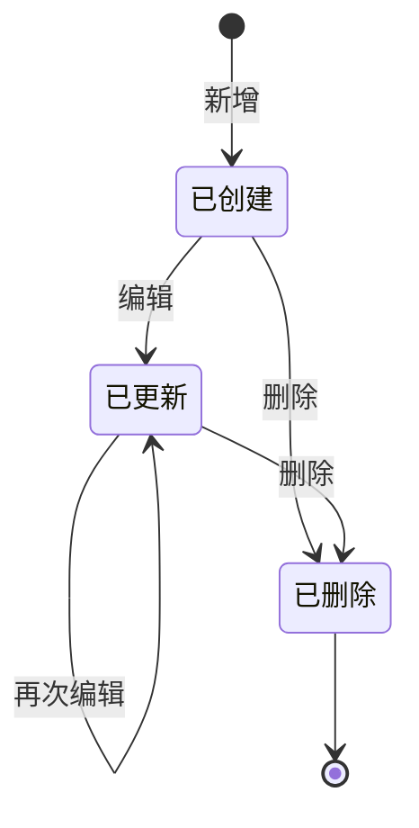

# PRD Writer — up-sl-back 项目 PRD 撰写技能

本技能定义了 up-sl-back 项目 PRD（产品需求文档）的撰写规范、模板结构和质量检查标准。适用于所有后端管理模块的 PRD 编写。

---

## 一、PRD 整体结构（12 章模板）

```markdown
# <模块名> PRD

---

## 修订记录
## 一、背景与目标
### 1.1 业务背景
### 1.2 业务目标
### 1.3 范围说明

## 二、用户故事与验收标准
### US-01 ~ US-NN

## 三、字段配置详表
### 3.1 数据库字段
### 3.2 特殊字段格式规则（如有）

## 四、PostgreSQL 建表 DDL

## 五、接口操作定义
### 5.1 接口总览
### 5.2 通用响应结构
### 5.3 接口详情（逐接口展开）

## 六、状态机

## 七、非功能需求

## 八、边界与异常处理

## 九、测试关注点
### 9.1 接口测试用例
### 9.2 测试数据

## 十、验收结果

## 十一、技术简报

## 十二、待决策事项

---
```

---

## 二、各章节写作规范

### 2.1 修订记录

| 规则 | 说明 |
|------|------|
| 格式 | Markdown 表格：版本 / 日期 / 修订人 / 修订说明 |
| 版本号 | 语义化版本 v1.0 / v1.1 / v2.0 |
| 日期 | yyyy-MM-dd |

```markdown
| 版本 | 日期 | 修订人 | 修订说明 |
|------|------|--------|----------|
| v1.0 | 2026-05-19 | PM | 初始版本，完成<模块名>全部功能定义 |
```

---

### 2.2 背景与目标

| 子章节 | 写作要点 |
|--------|----------|
| 业务背景 | 1-3 段，解释为什么需要这个功能，当下有什么痛点 |
| 业务目标 | 3-5 条 bullet，业务视角的目标描述（非技术实现） |
| 范围说明 | **必须区分本期范围与非本期范围**，用加粗标注，防止范围蔓延 |

```markdown
### 1.3 范围说明
- **本期范围**：功能 A、功能 B、功能 C
- **不在本期范围**：功能 X、功能 Y、功能 Z
```

---

### 2.3 用户故事与验收标准

#### 用户故事格式

```markdown
### US-01：<动作名称>
> 作为**<角色>**，我想要**<做什么>**，以便**<达成什么价值>**。
```

#### 验收标准格式（Given-When-Then 表格）

```markdown
| 编号 | 场景 | Given | When | Then |
|------|------|-------|------|------|
| AC-01-01 | 正向-成功场景描述 | 前置条件 | 触发动作 | 预期结果 |
| AC-01-02 | 异常-失败场景描述 | 前置条件 | 触发动作 | 错误码+提示 |
| AC-01-03 | 边界-边界场景描述 | 边界条件 | 触发动作 | 预期表现 |
```

**验收标准覆盖维度（必须全部覆盖）：**

| 维度 | 说明 | 示例 |
|------|------|------|
| 正向 | 正常业务流程 | 提交完整数据→返回成功 |
| 异常-必填为空 | name/code 等必填字段为空 | 返回 400 + 提示信息 |
| 异常-唯一性冲突 | 编码/名称等唯一字段重复 | 返回 3001 + 提示信息 |
| 异常-格式错误 | 字段格式不符合规则 | 返回 400 + 格式错误提示 |
| 异常-资源不存在 | 操作的 ID 不存在 | 返回 2001 |
| 边界-字段超长 | 字符串字段超出长度限制 | 返回 400 |
| 边界-数值越界 | 页码 ≤0、数量超出等 | 返回 400 |
| 边界-空结果 | 查询无匹配数据 | HTTP 200，空列表 |
| 幂等 | 重复执行同一操作 | 返回一致结果 |

---

### 2.4 字段配置详表

#### 数据库字段表格模板

```markdown
| 字段名 | 数据类型 | 是否必填 | 默认值 | 约束 | 说明 |
|--------|----------|----------|--------|------|------|
| id | BIGSERIAL | 自动 | 自增 | PRIMARY KEY | 主键ID |
| xxx | VARCHAR(N) | 是/否 | 默认值 | NOT NULL / UNIQUE | 字段说明 |
```

**字段类型映射（本项目约定）：**

| 业务含义 | PostgreSQL 类型 | JPA 注解 |
|----------|----------------|----------|
| 主键ID | BIGSERIAL | @Id @GeneratedValue(strategy = GenerationType.IDENTITY) |
| 短字符串（编码/名称） | VARCHAR(64/128) | @Column(length=64/128) |
| 长字符串（描述/备注） | TEXT | @Column(columnDefinition="TEXT") |
| JSON 格式 | TEXT | @Column(columnDefinition="TEXT")，存储 JSON 字符串 |
| 时间 | TIMESTAMP | LocalDateTime |
| 状态枚举 | VARCHAR(16/32) | 存储状态值字符串 |

**字段命名约定：**
- 表名：`tb_<module>` 小写下划线
- 列名：`lower_snake_case`
- Java 实体：驼峰命名，如 `updateUser` → 数据库 `update_user`
- 唯一索引：`uk_<table>_<column>`
- 普通索引：`idx_<table>_<column>`

---

### 2.5 PostgreSQL 建表 DDL 规范

```sql
-- ============================================================
-- <模块名>表
-- ============================================================
CREATE TABLE IF NOT EXISTS tb_<table> (
    id          BIGSERIAL       PRIMARY KEY,
    ...
);

-- 唯一约束（如有）
CREATE UNIQUE INDEX IF NOT EXISTS uk_<table>_<col> ON tb_<table> (<col>);

-- 查询索引（如有）
CREATE INDEX IF NOT EXISTS idx_<table>_<col> ON tb_<table> (<col>);

-- 排序索引（如有）
CREATE INDEX IF NOT EXISTS idx_<table>_update_time ON tb_<table> (update_time DESC);

-- 表与字段注释
COMMENT ON TABLE  tb_<table>       IS '<模块>表';
COMMENT ON COLUMN tb_<table>.id    IS '主键ID';
...
```

**DDL 检查清单：**
- [ ] 使用 `CREATE TABLE IF NOT EXISTS`
- [ ] 主键为 `BIGSERIAL`
- [ ] 必填字段有 `NOT NULL`
- [ ] 字符串字段有合理长度限制
- [ ] 唯一字段有 `UNIQUE INDEX`
- [ ] 时间字段有 `DEFAULT CURRENT_TIMESTAMP`
- [ ] 表与所有字段有 `COMMENT ON`

---

### 2.6 接口操作定义规范

#### 接口总览表格

```markdown
| 序号 | 接口名称 | 方法 | URL | 说明 |
|------|----------|------|-----|------|
| 1 | 分页查询 | GET | `/api/<module>/page` | 分页+条件筛选 |
| 2 | 详情查询 | GET | `/api/<module>/{id}` | 根据ID查询 |
| 3 | 新增 | POST | `/api/<module>` | 新增 |
| 4 | 编辑 | PUT | `/api/<module>` | 编辑 |
| 5 | 删除 | DELETE | `/api/<module>/{id}` | 删除 |
```

#### 单个接口详情模板

```markdown
#### 5.3.x <接口名称>

| 项目 | 内容 |
|------|------|
| URL | `<METHOD> /api/<module>/<path>` |
| Content-Type | application/json（POST/PUT 时） |
| 认证 | 需要登录态 |

**请求参数（Query String / Path）：**

| 参数 | 类型 | 必填 | 默认值 | 说明 |
|------|------|------|--------|------|

**请求体（JSON）：**（POST/PUT 接口）

| 字段 | 类型 | 必填 | 校验规则 | 说明 |
|------|------|------|----------|------|

**业务校验：**
- 校验规则 1
- 校验规则 2

**错误码：**

| code | 场景 |
|------|------|

**请求示例：**
...
**响应示例：**
...
```

#### 通用响应结构

```json
// 通用成功
{ "code": 200, "message": "操作成功", "data": {} }

// 分页
{
  "code": 200,
  "message": "操作成功",
  "data": {
    "total": 25,
    "pages": 3,
    "pageNum": 1,
    "pageSize": 10,
    "list": []
  }
}
```

**注意：** HTTP 状态码统一返回 200，业务错误通过 `code` 字段区分。

---

### 2.7 状态机

使用 Mermaid stateDiagram-v2 描述实体生命周期：



**若无状态流转（纯数据实体），说明即可，不必画图。**

---

### 2.8 非功能需求

| 类别 | 必须覆盖项 | 量化指标 |
|------|-----------|----------|
| 性能 | 分页查询响应时间 | ≤ 200ms（1000 条数据量级） |
| 性能 | 单条写入响应时间 | ≤ 100ms |
| 安全 | 认证鉴权 | 所有接口需登录态 |
| 安全 | SQL 注入防护 | 使用 JPA 参数化查询 |
| 安全 | XSS 防护 | 存储原始值，前端转义 |
| 埋点 | 操作日志 | 新增/编辑/删除记录到操作日志表 |
| 兼容性 | 数据库 | PostgreSQL 15+ |

---

### 2.9 边界与异常处理

覆盖以下维度：

```markdown
| 场景类型 | 具体场景 | 处理策略 |
|----------|----------|----------|
| 输入边界 | 空字符串/仅空格 | @NotBlank 拦截，返回 400 |
| 输入边界 | 字段超长 | 返回 400 + 具体限制提示 |
| 输入边界 | 刚好等于上限 | 允许通过 |
| 并发 | 同时删除同一资源 | 先到成功，后到返回 2001 |
| 并发 | 同时编辑同一资源 | 后提交覆盖前者（不做乐观锁） |
| 空结果 | 分页查询无匹配 | HTTP 200, total=0, list=[] |
| 空结果 | 详情查询不存在 | 返回 2001 |
```

---

### 2.10 测试用例编写规范

#### 格式

```markdown
#### TC-<编号>：<接口名称>

| 用例编号 | 用例名称 | 前置条件 | 输入 | 预期输出 |
|----------|----------|----------|------|----------|
| TC-01-001 | <接口>-正向-<场景> | <前置数据> | <请求参数> | code=200, <具体结果> |
| TC-01-002 | <接口>-异常-<场景> | <前置数据> | <请求参数> | code=<错误码>, <提示信息> |
```

#### 覆盖要求

每个接口至少覆盖：
- 1 个正向用例（完整数据）
- 1 个正向用例（可选字段为空）
- 1 个异常用例（必填字段为空）
- 1 个异常用例（唯一性冲突，如适用）
- 1 个边界用例（字段超长）
- 1 个资源不存在用例（编辑/删除/详情接口）
- 1 个重复操作用例（删除）

分页接口额外覆盖：
- 默认参数
- 筛选命中/无匹配
- 页码≤0、pageSize≤0
- 页码超出范围

#### 测试数据 SQL 规范

```sql
-- ============================================================
-- <模块名>测试数据
-- ============================================================

-- 1. 基础正向数据
INSERT INTO tb_<table> (...) VALUES (...);

-- 2. 边界数据（空值、长字符串等）
INSERT INTO tb_<table> (...) VALUES (...);

-- 3-N. 批量数据（用于分页测试，至少 15 条）
INSERT INTO tb_<table> (...) VALUES
  (...),
  (...);
```

---

### 2.11 验收结果

```markdown
| 验收项 | 验收标准 | 验收方式 | 通过 | 备注 |
|--------|----------|----------|------|------|
| 建表DDL | 可在 PostgreSQL 15+ 中成功执行 | 执行 SQL 脚本 | ☐ | |
| XXX-正向 | AC-XX-01 ~ AC-XX-NN 全部通过 | 接口测试 | ☐ | |
| XXX-异常 | AC-XX-YY ~ AC-XX-ZZ 全部通过 | 接口测试 | ☐ | |
| 未登录拦截 | 所有接口在未登录态返回 1001 | 接口测试 | ☐ | |
| 操作日志 | 新增/编辑/删除后操作日志表有对应记录 | 数据库验证 | ☐ | |
| 响应时间 | 分页查询 ≤ 200ms，写入 ≤ 100ms | 性能测试 | ☐ | |
```

---

### 2.12 技术简报

```markdown
### 12.1 后端代码结构
src/main/java/com/upsl/back/module/<module>/
├── controller/
├── dto/
├── entity/
├── repository/
├── service/
│   └── impl/
└── validator/（如有特殊校验）

### 12.2 关键逻辑提醒
| 关注点 | 说明 |
|--------|------|

### 12.3 建议复用 ResultCode
| 码值 | 枚举名 | 场景 |
|------|--------|------|
```

---

### 2.13 待决策事项

标注无法在 PRD 阶段确定的歧义点：

```markdown
| 编号 | 问题 | 假设/建议 | 影响范围 |
|------|------|-----------|----------|
| Q1 | <问题描述> | **建议**：<方案及理由> | <影响的章节/接口> |
```

---

## 三、项目特定约定速查

### 3.1 错误码体系

| 码值 | 枚举名 | 使用场景 |
|------|--------|----------|
| 200 | SUCCESS | 操作成功 |
| 400 | PARAM_ERROR | Bean Validation 校验失败 |
| 401 | PARAM_MISSING | 缺少必要参数 |
| 1001 | UNAUTHORIZED | 未登录或登录已过期 |
| 1002 | FORBIDDEN | 无权限访问 |
| 2001 | NOT_FOUND | 资源不存在（通用） |
| 3001 | DUPLICATE_KEY | 唯一字段重复 |
| 3002 | DATA_IN_USE | 数据已被引用，无法删除 |
| 5000 | BUSINESS_ERROR | 业务处理失败 |
| 9999 | INTERNAL_ERROR | 服务器内部错误 |

### 3.2 URL 命名规范

| 操作 | 方法 | URL 模式 | 示例 |
|------|------|----------|------|
| 分页查询 | GET | `/api/<module>/page` | `/api/device/page` |
| 详情查询 | GET | `/api/<module>/{id}` | `/api/device/1` |
| 新增 | POST | `/api/<module>` | `/api/device` |
| 编辑 | PUT | `/api/<module>` | `/api/device` |
| 删除 | DELETE | `/api/<module>/{id}` | `/api/device/1` |

### 3.3 DTO 基类

- **分页请求**：继承 `PageRequest`（含 pageNum, pageSize, sortField, sortOrder）
- **保存请求**：独立 DTO，id=null 时为新增，id≠null 时为编辑
- **校验注解**：@NotBlank（字符串非空）、@Size(max=N)、@NotNull（Long）、@Min(1)

### 3.4 Repository 双重查询模式

```java
// 新增时校验唯一性
boolean existsBy<Field>(String value);

// 编辑时校验唯一性（排除自身）
boolean existsBy<Field>AndIdNot(String value, Long id);
```

### 3.5 Service 层 Save 模式

新增和编辑共用 `save(Request)` 方法，通过 `request.getId()` 是否为 null 区分：
- id=null → new Entity() → 唯一性用 `existsByCode`
- id≠null → findById → 唯一性用 `existsByCodeAndIdNot`

---

## 四、PRD 质量检查清单

### 完整性检查（12 章是否全部覆盖）
- [ ] 修订记录
- [ ] 背景与目标（含范围边界）
- [ ] 用户故事 + Given-When-Then 验收标准
- [ ] 字段配置详表（含特殊格式规则）
- [ ] DDL（含索引、注释）
- [ ] 接口定义（含请求/响应结构、错误码）
- [ ] 状态机
- [ ] 非功能需求
- [ ] 边界与异常处理
- [ ] 测试用例 + 测试数据
- [ ] 验收结果检查表
- [ ] 技术简报 + 待决策事项

### 质量检查（零歧义）
- [ ] 所有验收标准使用 Given-When-Then 可测格式
- [ ] 所有字符串字段有明确长度限制
- [ ] 所有枚举值有明确可选值
- [ ] 所有错误码有明确的枚举名和提示信息
- [ ] 所有接口有请求/响应示例
- [ ] 测试用例覆盖正向、异常、边界、幂等
- [ ] 无非本期范围内容混入
- [ ] 待决策事项已标注假设和建议

### 一致性检查
- [ ] 表名使用 `tb_` 前缀
- [ ] 字段定义、DDL、接口响应中的字段名一致
- [ ] 错误码与 [ResultCode.java](file:///d:/code/NT/up-sl/up-sl-back/src/main/java/com/upsl/back/common/constant/ResultCode.java) 对应
- [ ] URL 路径、DTO 结构与 Device 参照模块一致
