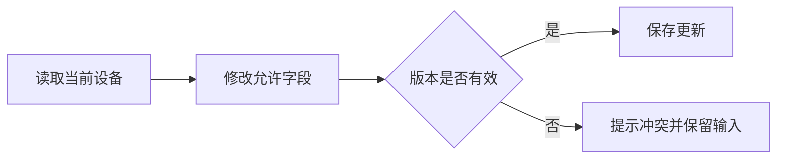

<!-- prd-workspace:{"schemaVersion":1,"docId":"up-sl-back.device-demo","version":"0.1.0-demo","revision":0,"updatedAt":"2026-09-08T02:41:45.123Z"} -->
# 设备台账 · PRD 交互演示

> **合成演示，非真实项目承诺。** 本文用于演示撰写结构、浏览器编辑与双格式导出。没有读取 up-sl-back 仓库，所有业务设计仅为示例；代码测试、性能测试和正式验收均未执行。

**文档状态：草案 / 待决策。** 版本：0.1.0-demo。角色责任人：待指定。

使用提示：点击章节右侧“编辑本节”修改内容，使用“批注”留下问题，最后“导出双格式包”。Markdown 与 HTML 使用同一份正文。

## 修订记录

| 版本 | 日期 | 修改者 | 修改内容 | 批准证据 |
|---|---|---|---|---|
| 0.1.0-demo | 2026-09-08 | 文档生成工具 | 创建合成演示材料 | 无，未批准 |

## 一、背景与目标

### 1.1 用户与任务

示例使用者是设备管理员与只读巡检人员。前者维护授权范围内的设备台账，后者查询设备信息。这里的角色分工尚未与真实项目核验。

### 1.2 目标与范围

**本期范围（演示假设）**：查询、查看详情、创建设备、修改允许字段。

**不在本期范围**：删除、批量导入、远程设备控制、与传感器实时联动。

| 指标 | 定义 | 基线 | 目标 | 观察周期 | 负责人 |
|---|---|---|---|---|---|
| 台账维护效率 | 完成一次有效更新所需时间 | 待调研 | 待确认 | 待确认 | 待指定 |
| 数据正确性 | 必填、编码唯一及并发冲突规则满足率 | 待测量 | 待确认 | 待确认 | 待指定 |

## 二、用户故事、业务规则与验收标准

### 2.1 用户故事

| 编号 | 用户故事 | 优先级 | 关联规则 |
|---|---|---|---|
| US-01 | 作为设备管理员，我需要维护允许管理的设备，以便台账保持准确。 | 示例：P1，待确认 | BR-01、BR-02 |
| US-02 | 作为巡检人员，我需要查看允许访问的设备信息，以便核对现场设备。 | 示例：P1，待确认 | BR-01 |

### 2.2 业务规则

| 编号 | 规则 | 来源与状态 |
|---|---|---|
| BR-01 | 服务端验证动作、对象与数据范围；请求中的设备 ID 不构成授权。 | 建议方案；真实权限模型待 Q-01 |
| BR-02 | 两人并发编辑时不能未经提醒就覆盖他人更新；拟采用版本检查。 | 建议方案；冲突契约待 Q-02 |
| BR-03 | 编码在已确认的作用域内唯一；预检查与数据库约束保持一致。 | 建议方案；唯一范围待 Q-03 |

### 2.3 验收标准

| 编号 | Given | When | Then | 关联 |
|---|---|---|---|---|
| AC-01-01 | 用户对设备具有编辑权限，字段有效且版本未过期 | 提交更新 | 更新允许字段；返回更新后的版本；服务端管理字段不被请求覆盖 | US-01、BR-01、BR-02 |
| AC-01-02 | 用户提交的设备版本已过期 | 请求更新 | 按批准后的冲突契约拒绝；当前数据不被改写；调用方能够识别冲突 | US-01、BR-02、Q-02 |
| AC-02-01 | 用户没有目标设备的数据访问权限 | 查询该设备 | 不返回设备内容；错误是否统一为资源不可见由 Q-01 决定 | US-02、BR-01 |

## 三、字段配置与数据规则

以下字段是**拟新增演示设计**，不是已存在数据库结构。

| 业务含义 | API / Java | 数据库 | 类型建议 | 输入规则 | 默认与权限 |
|---|---|---|---|---|---|
| 设备 ID | id | id | BIGINT | 创建不由普通客户端指定；编辑必须明确目标 | 服务端生成 |
| 设备编码 | code | code | VARCHAR(64) | 创建必填；非空白；长度上限单位待确认 | 修改能力待业务确认 |
| 设备名称 | name | name | VARCHAR(128) | 创建必填；不接受空白字符串 | 无业务默认值 |
| 备注 | remark | remark | TEXT | 可为空；缺失与 null 的编辑语义待 Q-04 | 最大接收长度待确认 |
| 并发版本 | version | version | BIGINT | 编辑携带读取时的版本；不由客户端任意递增 | 服务端维护 |

JSON 中的 `null`、缺失字段与空字符串 `""` 是不同输入，不能自动当作同一含义。

## 四、数据库设计与迁移附录

**DDL：暂不生成可执行建表结论。** 唯一性范围、现有数据模型、租户隔离方式与迁移机制未核验。该部分的正式实施受 Q-01、Q-03 阻断。

下面仅演示代码显示和复制，不是待执行迁移：

```sql
-- 演示片段：需要依据确认后的唯一范围补充约束。
-- 不得将此片段当作完整建表脚本执行。
SELECT 'synthetic-demo-only' AS evidence_label;
```

## 五、接口操作定义

### 5.1 候选接口

| API 编号 | 方法与路径 | 行为 | 来源/状态 |
|---|---|---|---|
| API-01 | GET /api/device/page | 在授权数据范围内分页查询 | 沿用用户提供的 URL 风格；未核验仓库 |
| API-02 | GET /api/device/{id} | 查看可访问设备详情 | 同上 |
| API-03 | POST /api/device | 创建允许管理的设备 | 公开动作不因传入 id 自动变为编辑 |
| API-04 | PUT /api/device | 修改允许字段 | 缺失字段处理与版本冲突待决策 |

### 5.2 响应与输入示例

用户原始规范采用应用层 HTTP 200 和响应体业务 code。下列成功示例仅展示结构，不意味着真实接口已实现：

```json
{
  "code": 200,
  "message": "操作成功",
  "data": {
    "id": 1001,
    "code": "DEMO-DEVICE-001",
    "name": "演示设备",
    "remark": null,
    "version": 1
  }
}
```

| 场景 | HTTP 状态 | 业务 code | 说明 |
|---|---|---|---|
| 应用层参数校验失败 | 用户约定候选：200 | 用户提供：400 | 必须与实际异常处理核验 |
| 版本冲突 | 待核验/批准 | 待分配 | 不虚构项目已有并发错误码 |

## 六、业务状态机

该台账示例暂无已确认的业务状态生命周期。普通编辑不视为“已创建 → 已更新”的业务状态流转。

为展示 Mermaid 源码兜底，下列流程仅是编辑交互示意：



| 输入条件 | 处理结果 | 用户恢复 |
|---|---|---|
| 版本有效且授权满足 | 按确认后的规则保存 | 查看最新结果 |
| 版本过期 | 不覆盖当前数据 | 前端保留未提交输入，提示对比或刷新；需前后端共同确认 |

## 七、非功能需求

性能目标尚未有真实基线，不直接承诺“分页 200ms”。

| 类别 | 验证要求 | 现状 |
|---|---|---|
| 性能 | 数据规模/分布、测试环境、并发、P95/P99、超时口径、错误率 | 均待确认，未执行 |
| 权限 | 查询、详情和写入均验证对象与数据范围 | 权限模型待决策 |
| 安全 | 排序字段使用允许列表；文本输出按上下文安全处理 | 待设计评审 |
| 审计 | 修改记录与失败场景的日志语义需明确，不能记录敏感凭据 | 待核验现有机制 |

## 八、边界、异常与恢复

| 场景 | 期望行为 | 待确认事项 |
|---|---|---|
| 空查询结果 | 返回约定的空集合；界面提示调整筛选条件 | 分页元信息契约 |
| 字段达到上限 | 恰好上限允许，超限按协议拒绝 | 中文、Unicode 与长度单位 |
| 并发编辑 | 不静默覆盖；提示冲突 | 冲突码与重试交互 |
| 资源无权限或不存在 | 不泄露无权访问的详情 | 是否统一对外错误 |
| 编辑字段未传 | 不猜测是清空还是保留 | Q-04 |

## 九、测试关注点与追溯

| TC 编号 | 关联验收 | 输入/操作 | 预期结果 | 执行状态 |
|---|---|---|---|---|
| TC-01-001 | AC-01-01 | 有效权限、有效版本与合法字段 | 保存成功、版本更新、禁止字段不被改写 | 未执行 |
| TC-01-002 | AC-01-02 | 提交旧版本 | 识别冲突、不覆盖数据 | 未执行；Q-02 阻断 |
| TC-02-001 | AC-02-01 | 请求权限范围外的设备 | 不返回详情 | 未执行；Q-01 阻断 |

| 用户故事/规则 | 验收 | 接口 | 测试 |
|---|---|---|---|
| US-01 / BR-01、BR-02 | AC-01-01、AC-01-02 | API-04 | TC-01-001、TC-01-002 |
| US-02 / BR-01 | AC-02-01 | API-02 | TC-02-001 |

**文档编制任务（可点击演示，不是验收证据）**：

- [ ] 收集权限边界的批准依据。
- [ ] 补充真实错误码来源。
- [ ] 评审并发冲突恢复交互。

## 十、验收计划与结果

| 验收项 | 方法 | 状态 | 环境/版本 | 执行证据 |
|---|---|---|---|---|
| 正向与异常接口 | 接口测试 | 未执行 | 未提供 | 无 |
| 对象权限隔离 | 权限测试 | 阻断 | Q-01 未决 | 无 |
| 并发数据正确性 | 并发测试 | 阻断 | Q-02 未决 | 无 |
| 性能 | 代表性负载测试 | 未执行 | 未提供 | 无 |
| 用户任务完成 | 业务场景验收 | 未执行 | 未提供 | 无 |

文档生成、在页面勾选任务或导出文件均不能把上述结果改成“已验收”。

## 十一、技术简报与发布准备

没有读取项目仓库，不能声称存在某个 Controller、DTO、审计表或迁移工具。

正式开发前需由相关角色明确公共协议、复用点、数据兼容、回归范围、发布放行与失败恢复方案。

## 十二、待决策事项

| 编号 | 问题 | 建议/选项 | 决策角色 | 阻断范围 | 状态 |
|---|---|---|---|---|---|
| Q-01 | 授权与租户/数据范围如何定义？ | 按真实组织及租户模型确认，不从模板推定 | 产品/权限负责人 | 查询与写入放行 | 待决策 |
| Q-02 | 并发冲突采用什么契约？ | 版本检查 + 可识别冲突结果 + 输入恢复 | 技术/产品负责人 | 编辑正式实现 | 待决策 |
| Q-03 | 设备编码在哪个范围唯一？ | 明确全局、租户或项目作用域 | 产品/数据负责人 | 数据库唯一约束 | 待决策 |
| Q-04 | 编辑请求缺失/null/空字符串如何处理？ | 明确全量/局部更新与清空语义 | 产品/接口负责人 | API-04 | 待决策 |
