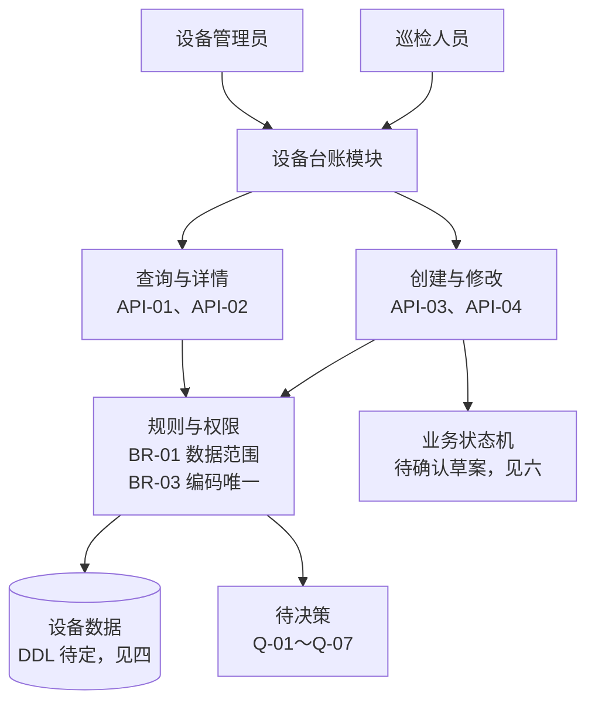
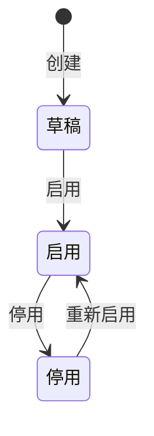

<!-- prd-workspace:{"schemaVersion":1,"docId":"demo.device","version":"0.2.0-demo","revision":4,"updatedAt":"2026-09-12T03:57:27.939Z"} -->
# 设备台账 · PRD 交互演示

> **合成演示，非真实项目承诺。** 本文用于演示撰写结构、浏览器编辑与双格式导出。没有读取 up-sl-back 仓库，所有业务设计仅为示例；代码测试、性能测试和正式验收均未执行。

**文档状态：草案 / 待决策。** 版本：0.2.0-demo。角色责任人：待指定。

使用提示：点击章节右侧“编辑本节”修改内容，使用“批注”留下问题，最后“导出双格式包”。Markdown 与 HTML 使用同一份正文。

### 编号说明

下表解释正文编号前缀；本文未使用的前缀标为“本文未使用”。编号只是文内引用标识，不代表优先级、批准或验收状态。

| 前缀 | 含义 | 格式与示例 | 出现章节 |
|---|---|---|---|
| S | 来源/资料条目 | S-01 | 本文未使用（未读取真实资料） |
| US | 用户故事 | US-01 | 二 |
| BR | 业务规则 | BR-01 | 二 |
| AC | 验收标准；可关联用户故事分层编号 | AC-01-01（US-01 的第 1 条） | 二 |
| API | 接口操作 | API-01 | 五 |
| DB | 数据库设计与迁移条目 | DB-01 | 本文未使用（DDL 未确定） |
| TC | 测试用例 | TC-01-001 | 九 |
| TD | 合成测试数据集 | TD-01 | 九、十 |
| Q | 待决策事项 | Q-01 | 十二 |

## 一图统揽

先看图再读细节：下图的角色、模块、编号与数据均为演示假设，不是已确认业务；图只做导航，判定以正文编号条款为准。



## 修订记录

| 版本 | 日期 | 修改者 | 修改内容 | 批准证据 |
|---|---|---|---|---|
| 0.2.0-demo | 2026-09-12 | 文档生成工具 | 展开测试用例、可复现数据生成和逐项验收；示例假设未批准 | 无，未批准 |
| 0.1.0-demo | 2026-09-08 | 文档生成工具 | 创建合成演示材料 | 无，未批准 |

离线章节编辑验证：中文与 😀。

## 一、背景与目标

### 1.1 用户与任务

示例使用者是设备管理员与只读巡检人员。前者维护授权范围内的设备台账，后者查询设备信息。这里的角色分工尚未与真实项目核验。

### 1.2 目标与范围

**本期范围（演示假设）**：查询、查看详情、创建设备、修改允许字段。

**不在本期范围**：删除、批量导入、远程设备控制、与传感器实时联动。

| 指标 | 定义 | 基线 | 目标 | 观察周期 | 负责人 |
|---|---|---|---|---|---|
| 台账维护效率 | 完成一次有效更新所需时间 | 待调研 | 待确认 | 待确认 | 待指定 |
| 数据正确性 | 必填、编码唯一及并发冲突规则满足率 | 待测量 | 待确认 | 待确认 | 待指定 |

## 二、用户故事、业务规则与验收标准

### 2.1 用户故事

| 编号 | 用户故事 | 优先级 | 关联规则 |
|---|---|---|---|
| US-01 | 作为设备管理员，我需要维护允许管理的设备，以便台账保持准确。 | 示例：P1，待确认 | BR-01、BR-02、BR-03 |
| US-02 | 作为巡检人员，我需要查看允许访问的设备信息，以便核对现场设备。 | 示例：P1，待确认 | BR-01 |

### 2.2 业务规则

| 编号 | 规则 | 来源与状态 |
|---|---|---|
| BR-01 | 服务端验证动作、对象与数据范围；请求中的设备 ID 不构成授权。 | 建议方案；真实权限模型待 Q-01 |
| BR-02 | 两人并发编辑时不能未经提醒就覆盖他人更新；拟采用版本检查。 | 建议方案；冲突契约待 Q-02 |
| BR-03 | 编码在已确认的作用域内唯一；预检查与数据库约束保持一致。 | 建议方案；唯一范围待 Q-03 |

### 2.3 验收标准

| 编号 | Given | When | Then | 关联 |
|---|---|---|---|---|
| AC-01-01 | 用户对设备具有编辑权限，字段有效且版本未过期 | 提交更新 | 更新允许字段；返回更新后的版本；服务端管理字段不被请求覆盖 | US-01、BR-01、BR-02 |
| AC-01-02 | 用户提交的设备版本已过期 | 请求更新 | 按批准后的冲突契约拒绝；当前数据不被改写；调用方能够识别冲突 | US-01、BR-02、Q-02 |
| AC-02-01 | 用户没有目标设备的数据访问权限 | 查询该设备 | 不返回设备内容；错误是否统一为资源不可见由 Q-01 决定 | US-02、BR-01 |
| AC-01-03 | 管理员在允许范围内，编码未使用且必填有效 | 创建一条记录 | 只创建一条，ID/初始版本由服务端生成；不更新已有对象 | US-01、BR-01、BR-03 |
| AC-01-04 | 目标作用域内已有相同编码 | 再次创建 | 返回可识别的重复结果，不产生第二条记录 | US-01、BR-03、Q-03 |
| AC-01-05 | 管理员准备空白或长度边界名称 | 分别提交 | 空白/129 个 ASCII 字符拒绝；128 个允许；非法输入不入库；长度口径待 Q-06 | US-01、三、Q-06 |
| AC-01-06 | 记录备注非空 | 分别缺失/null/空字符串编辑 | 按 Q-04 批准的三种语义分别判定；不得混同 | US-01、三、Q-04 |
| AC-01-07 | 两个请求读取同一版本 | 并发提交 | 至多一条更新成功；另一条可识别冲突，不覆盖胜者 | US-01、BR-02、Q-02 |
| AC-01-08 | 只读人员有对象读取权限 | 提交编辑请求 | 不更新对象、版本或字段，不因可读而获得写权限 | US-01、BR-01、Q-01 |
| AC-02-02 | 只读人员属于范围 A，范围 B 也存在记录 | 查询列表及无匹配筛选 | 仅返回 A 范围记录，无匹配返回空集合；分页元信息待 Q-06 | US-02、BR-01、Q-01、Q-06 |
| AC-02-03 | 只读人员可读取设备 1001 | 查看详情 | 返回允许读取的字段且不修改数据 | US-02、BR-01、Q-01 |
| AC-03-01 | 排序参数包含未允许的列名或表达式 | 分页查询 | 拒绝非法排序，不能执行输入表达式或修改数据；实际允许列表待 Q-06 | 七、安全 |
| AC-03-02 | 设备名称包含 HTML 字样 | 在列表/详情显示名称 | 按纯文本显示，不生成可执行标签、不隐式请求外部图片 | 七、安全 |
| AC-04-01 | 创建条件满足 | 触发创建事件 | 按待批准生命周期进入草稿；只创建一条且生成初始版本 | 六、Q-05 |
| AC-04-02 | 草稿、授权且字段完整/版本有效 | 触发启用 | 变为启用并更新版本；条件不满足则状态不变 | 六、Q-01、Q-05 |
| AC-04-03 | 启用、授权且版本有效 | 触发停用 | 变为停用并更新版本；冲突不覆盖 | 六、Q-01、Q-02、Q-05 |
| AC-04-04 | 停用、授权且版本有效 | 触发重新启用 | 变为启用并更新版本；冲突不覆盖 | 六、Q-01、Q-02、Q-05 |
| AC-04-05 | 处于草稿 | 触发停用事件 | 按图/表拒绝不存在的迁移，状态/版本不变 | 六、Q-05 |
| AC-05-01 | 已批准规模/分布、环境、负载、观测窗口与阈值 | 执行分页负载测试 | P95/P99、超时/错误率均满足批准目标；参数未定不放行 | 七、Q-07 |
| AC-05-02 | 已批准审计字段及成功/失败记录策略 | 执行一次有效更新和一次拒绝请求 | 审计与实际对象/动作/结果一致；无凭据或不应记录的敏感数据 | 七、Q-06 |

## 三、字段配置与数据规则

以下字段是**拟新增演示设计**，不是已存在数据库结构。

| 业务含义 | API / Java | 数据库 | 类型建议 | 输入规则 | 默认与权限 |
|---|---|---|---|---|---|
| 设备 ID | id | id | BIGINT | 创建不由普通客户端指定；编辑必须明确目标 | 服务端生成 |
| 设备编码 | code | code | VARCHAR(64) | 创建必填；非空白；长度上限单位待确认 | 修改能力待业务确认 |
| 设备名称 | name | name | VARCHAR(128) | 创建必填；不接受空白字符串 | 无业务默认值 |
| 备注 | remark | remark | TEXT | 可为空；缺失与 null 的编辑语义待 Q-04 | 最大接收长度待确认 |
| 并发版本 | version | version | BIGINT | 编辑携带读取时的版本；不由客户端任意递增 | 服务端维护 |

JSON 中的 `null`、缺失字段与空字符串 `""` 是不同输入，不能自动当作同一含义。

## 四、数据库设计与迁移附录

**DDL：暂不生成可执行建表结论。** 唯一性范围、现有数据模型、租户隔离方式与迁移机制未核验。该部分的正式实施受 Q-01、Q-03 阻断。

下面仅演示代码显示和复制，不是待执行迁移：

```sql
-- 演示片段：需要依据确认后的唯一范围补充约束。
-- 不得将此片段当作完整建表脚本执行。
SELECT 'synthetic-demo-only' AS evidence_label;
```

## 五、接口操作定义

### 5.1 候选接口

| API 编号 | 方法与路径 | 行为 | 来源/状态 |
|---|---|---|---|
| API-01 | GET /api/device/page | 在授权数据范围内分页查询 | 沿用用户提供的 URL 风格；未核验仓库 |
| API-02 | GET /api/device/{id} | 查看可访问设备详情 | 同上 |
| API-03 | POST /api/device | 创建允许管理的设备 | 公开动作不因传入 id 自动变为编辑 |
| API-04 | PUT /api/device | 修改允许字段 | 缺失字段处理与版本冲突待决策 |

### 5.2 响应与输入示例

用户原始规范采用应用层 HTTP 200 和响应体业务 code。下列成功示例仅展示结构，不意味着真实接口已实现：

```json
{
  "code": 200,
  "message": "操作成功",
  "data": {
    "id": 1001,
    "code": "DEMO-DEVICE-001",
    "name": "离线修改后的设备",
    "remark": null,
    "version": 1
  }
}
```

| 场景 | HTTP 状态 | 业务 code | 说明 |
|---|---|---|---|
| 应用层参数校验失败 | 用户约定候选：200 | 用户提供：400 | 必须与实际异常处理核验 |
| 版本冲突 | 待核验/批准 | 待分配 | 不虚构项目已有并发错误码 |

## 六、业务状态机

该台账示例未核验到已确认的业务状态生命周期；普通编辑不视为“已创建 → 已更新”的业务状态流转。
下面的状态机是**待确认草案**，只演示状态流转图与状态转移表的结构，状态名、事件与副作用均为示例，需业务确认（Q-05）。



| 当前状态 | 事件 | 前置条件 | 允许主体 | 副作用 | 失败处理 | 下一状态 |
|---|---|---|---|---|---|---|
| [*]（初始伪状态） | 创建 | 授权范围内、编码唯一、字段有效 | 设备管理员（示例） | 生成 ID 与初始版本 | 编码重复或校验失败则不创建 | 草稿 |
| 草稿 | 启用 | 必填字段完整、版本未过期 | 待确认（Q-01） | 记录状态与版本 | 校验失败保持草稿 | 启用 |
| 启用 | 停用 | 有停用权限、版本未过期 | 待确认（Q-01） | 记录状态与版本 | 并发冲突不覆盖当前数据 | 停用 |
| 停用 | 重新启用 | 有启用权限、版本未过期 | 待确认（Q-01） | 记录状态与版本 | 并发冲突不覆盖当前数据 | 启用 |

失败时不改变当前状态，界面保留未提交输入并提示冲突或校验原因；正式实现需前后端共同确认恢复交互。

## 七、非功能需求

性能目标尚未有真实基线，不直接承诺“分页 200ms”。

| 类别 | 验证要求 | 现状 |
|---|---|---|
| 性能 | 数据规模/分布、测试环境、并发、P95/P99、超时口径、错误率 | 均待确认，未执行 |
| 权限 | 查询、详情和写入均验证对象与数据范围 | 权限模型待决策 |
| 安全 | 排序字段使用允许列表；文本输出按上下文安全处理 | 待设计评审 |
| 审计 | 修改记录与失败场景的日志语义需明确，不能记录敏感凭据 | 待核验现有机制 |

## 八、边界、异常与恢复

| 场景 | 期望行为 | 待确认事项 |
|---|---|---|
| 空查询结果 | 返回约定的空集合；界面提示调整筛选条件 | 分页元信息契约 |
| 字段达到上限 | 恰好上限允许，超限按协议拒绝 | 中文、Unicode 与长度单位 |
| 并发编辑 | 不静默覆盖；提示冲突 | 冲突码与重试交互 |
| 资源无权限或不存在 | 不泄露无权访问的详情 | 是否统一对外错误 |
| 编辑字段未传 | 不猜测是清空还是保留 | Q-04 |

## 九、测试用例、测试数据与追溯

### 9.1 环境与用例清单

以下全部为待执行的合成业务用例。测试环境、构建版本、执行人/时间未提供，实际结果与业务证据均为无。admin-a/reader-a、范围 A/B 是测试元数据，必须在 Q-01 确认后映射为真实测试身份与权限，不能当作生产租户字段。每例使用独立环境快照，避免前例改变后例版本。

优先级为演示建议：权限、唯一性、并发及安全 P0；功能与状态 P1；性能阈值批准前不排定。API 用例层级为接口集成 + 持久数据核对，涉及页面反馈时追加端到端检查；均未实际运行。

| TC | 场景 | AC | API | TD | 优先级/执行状态 |
|---|---|---|---|---|---|
| TC-01-001 | 合法更新 | AC-01-01 | API-04 | TD-01、TD-02 | P1；阻断：Q-01、Q-02、Q-04、Q-06 |
| TC-01-002 | 旧版本拒绝 | AC-01-02 | API-04 | TD-01、TD-02 | P0；阻断：Q-01、Q-02、Q-04 |
| TC-02-001 | 范围外详情不可见 | AC-02-01 | API-02 | TD-01、TD-03 | P0；阻断：Q-01 |
| TC-01-003 | 创建有效记录 | AC-01-03 | API-03 | TD-01、TD-02 | P1；阻断：Q-01、Q-03、Q-06 |
| TC-01-004 | 同范围编码重复 | AC-01-04 | API-03 | TD-01、TD-02 | P0；阻断：Q-01、Q-03、Q-06 |
| TC-01-005 | 名称空白与长度边界 | AC-01-05 | API-03 | TD-02 | P1；阻断：Q-01、Q-03、Q-06 |
| TC-01-006 | 备注缺失/null/空串 | AC-01-06 | API-04 | TD-01、TD-02 | P1；阻断：Q-01、Q-02、Q-04 |
| TC-01-007 | 同版本并发编辑 | AC-01-07 | API-04 | TD-01、TD-04 | P0；阻断：Q-01、Q-02、Q-04 |
| TC-01-008 | 只读身份不能编辑 | AC-01-08 | API-04 | TD-01、TD-02 | P0；阻断：Q-01 |
| TC-02-002 | 分页范围与空结果 | AC-02-02 | API-01 | TD-01、TD-03 | P1；阻断：Q-01、Q-06 |
| TC-02-003 | 范围内详情读取 | AC-02-03 | API-02 | TD-01、TD-03 | P1；阻断：Q-01、Q-06 |
| TC-03-001 | 非法排序表达式 | AC-03-01 | API-01 | TD-01、TD-03 | P0；阻断：Q-01、Q-06 |
| TC-03-002 | 名称按纯文本输出 | AC-03-02 | API-01、API-02 | TD-01、TD-03 | P0；阻断：Q-01、Q-06 |
| TC-04-001 | [*]经创建到草稿 | AC-04-01 | API-03（仅创建） | TD-01、TD-05 | P1；阻断：Q-01、Q-02、Q-05 |
| TC-04-002 | 草稿经启用到启用 | AC-04-02 | N/A：事件入口待 Q-05 | TD-01、TD-05 | P1；阻断：Q-01、Q-02、Q-05 |
| TC-04-003 | 启用经停用到停用 | AC-04-03 | N/A：事件入口待 Q-05 | TD-01、TD-05 | P1；阻断：Q-01、Q-02、Q-05 |
| TC-04-004 | 停用经重新启用到启用 | AC-04-04 | N/A：事件入口待 Q-05 | TD-01、TD-05 | P1；阻断：Q-01、Q-02、Q-05 |
| TC-04-005 | 拒绝未定义状态迁移 | AC-04-05 | N/A：事件入口待 Q-05 | TD-01、TD-05 | P1；阻断：Q-01、Q-05、Q-06 |
| TC-05-001 | 分页代表性负载 | AC-05-01 | API-01 | TD-01（仅基线） | 待定；阻断：Q-01、Q-06、Q-07 |
| TC-05-002 | 成功与失败审计 | AC-05-02 | API-04 | TD-01、TD-02 | P1；阻断：Q-01、Q-02、Q-06 |

### 9.2 逐条用例详情

#### TC-01-001：合法更新

| 项目 | 具体内容 |
|---|---|
| 关联 | AC-01-01；API-04；TD-01、TD-02；US-01、BR-01、BR-02 |
| 前置与角色 | Q-01、Q-02、Q-04、Q-06 已确认且有隔离测试环境；身份与初始状态以本例步骤为准；未指定时为 admin-a 和 TD-01 基线 |
| 输入 | TD-02.validUpdate：id=1001、name=巡检设备A-更新、remark=测试备注、version=1 |
| 步骤 | 1. 按 TD-01 准备 1001，核对 version=1。2. admin-a 通过编辑表单或 PUT /api/device 提交 validUpdate。3. 刷新详情，对照持久值和响应。 |
| 预期与禁止副作用 | 允许字段更新为请求值；返回服务端新版本且大于 1；id/code 保持原值；无其他记录变化；示例成功 HTTP=200、code=200，实际协议待 Q-06。 |
| 清理与重跑 | 先保存证据，按 9.4 清理本例新增记录并恢复原始快照/版本；仅处理 prd-demo 映射的测试对象，下一组重新装载 |
| 执行记录 | 阻断（Q-01、Q-02、Q-04、Q-06）；实际结果、环境/构建版本、人员/时间、证据：均无 |

#### TC-01-002：旧版本拒绝

| 项目 | 具体内容 |
|---|---|
| 关联 | AC-01-02；API-04；TD-01、TD-02；US-01、BR-02、Q-02 |
| 前置与角色 | Q-01、Q-02、Q-04 已确认且有隔离测试环境；身份与初始状态以本例步骤为准；未指定时为 admin-a 和 TD-01 基线 |
| 输入 | TD-02.staleUpdate：id=1001、version=0、name=不应覆盖 |
| 步骤 | 1. 准备 1001/version=1，保存完整快照。2. admin-a 提交 staleUpdate。3. 比较响应、详情及持久快照。 |
| 预期与禁止副作用 | 返回可识别冲突；HTTP/业务码待 Q-02；持久字段及 version=1 不变；界面保留输入并允许刷新后重新评估，不能自动覆盖。 |
| 清理与重跑 | 先保存证据，按 9.4 清理本例新增记录并恢复原始快照/版本；仅处理 prd-demo 映射的测试对象，下一组重新装载 |
| 执行记录 | 阻断（Q-01、Q-02、Q-04）；实际结果、环境/构建版本、人员/时间、证据：均无 |

#### TC-02-001：范围外详情不可见

| 项目 | 具体内容 |
|---|---|
| 关联 | AC-02-01；API-02；TD-01、TD-03；US-02、BR-01 |
| 前置与角色 | Q-01 已确认且有隔离测试环境；身份与初始状态以本例步骤为准；未指定时为 admin-a 和 TD-01 基线 |
| 输入 | reader-a 属于 A；TD-03.deniedDetailId=1003，scopeById[1003]=B |
| 步骤 | 1. 建立隔离范围 A/B 的测试身份与映射。2. reader-a 请求 GET /api/device/1003。3. 检查返回字段、页面与数据。 |
| 预期与禁止副作用 | 不返回 1003 的设备内容；HTTP/业务码及不可见策略待 Q-01；记录无改动，不在提示中泄露其名称/编码。 |
| 清理与重跑 | 先保存证据，按 9.4 清理本例新增记录并恢复原始快照/版本；仅处理 prd-demo 映射的测试对象，下一组重新装载 |
| 执行记录 | 阻断（Q-01）；实际结果、环境/构建版本、人员/时间、证据：均无 |

#### TC-01-003：创建有效记录

| 项目 | 具体内容 |
|---|---|
| 关联 | AC-01-03；API-03；TD-01、TD-02；US-01、BR-01、BR-03 |
| 前置与角色 | Q-01、Q-03、Q-06 已确认且有隔离测试环境；身份与初始状态以本例步骤为准；未指定时为 admin-a 和 TD-01 基线 |
| 输入 | TD-02.validCreate：code=prd-demo-new、name=新增演示设备、remark=null |
| 步骤 | 1. 确认批准作用域内无 prd-demo-new。2. admin-a 提交 POST /api/device，不传 id。3. 查询创建结果和记录计数。 |
| 预期与禁止副作用 | 新增恰好一条；ID/初始版本由服务端生成；已有 1001～1003 不变；响应 HTTP=200/code=200 为待核验演示约定。 |
| 清理与重跑 | 先保存证据，按 9.4 清理本例新增记录并恢复原始快照/版本；仅处理 prd-demo 映射的测试对象，下一组重新装载 |
| 执行记录 | 阻断（Q-01、Q-03、Q-06）；实际结果、环境/构建版本、人员/时间、证据：均无 |

#### TC-01-004：同范围编码重复

| 项目 | 具体内容 |
|---|---|
| 关联 | AC-01-04；API-03；TD-01、TD-02；US-01、BR-03、Q-03 |
| 前置与角色 | Q-01、Q-03、Q-06 已确认且有隔离测试环境；身份与初始状态以本例步骤为准；未指定时为 admin-a 和 TD-01 基线 |
| 输入 | TD-02.duplicateCreate：code=prd-demo-165167，与 1001 相同 |
| 步骤 | 1. 准备已批准唯一作用域内的 1001。2. admin-a 提交 duplicateCreate。3. 按该编码统计记录并检查原记录。 |
| 预期与禁止副作用 | 重复被识别；HTTP/业务码待 Q-06；该作用域仍只有一条记录，1001 不被改写。跨范围重复策略待 Q-03 后补充分支。 |
| 清理与重跑 | 先保存证据，按 9.4 清理本例新增记录并恢复原始快照/版本；仅处理 prd-demo 映射的测试对象，下一组重新装载 |
| 执行记录 | 阻断（Q-01、Q-03、Q-06）；实际结果、环境/构建版本、人员/时间、证据：均无 |

#### TC-01-005：名称空白与长度边界

| 项目 | 具体内容 |
|---|---|
| 关联 | AC-01-05；API-03；TD-02；US-01、三、Q-06 |
| 前置与角色 | Q-01、Q-03、Q-06 已确认且有隔离测试环境；身份与初始状态以本例步骤为准；未指定时为 admin-a 和 TD-01 基线 |
| 输入 | TD-02.blankName（3 个空格）、nameAtLimit（128 个 A）、nameOverLimit（129 个 A） |
| 步骤 | 1. 每组在独立初始状态执行。2. admin-a 分别 POST 三组请求。3. 检查每组响应及按 code 的计数。 |
| 预期与禁止副作用 | 空白组拒绝且 0 条；128 字符组按待批准长度口径允许且 1 条；129 字符组拒绝且 0 条；失败 HTTP/业务码待 Q-06；中文/组合字符口径另受 Q-06 阻断。 |
| 清理与重跑 | 先保存证据，按 9.4 清理本例新增记录并恢复原始快照/版本；仅处理 prd-demo 映射的测试对象，下一组重新装载 |
| 执行记录 | 阻断（Q-01、Q-03、Q-06）；实际结果、环境/构建版本、人员/时间、证据：均无 |

#### TC-01-006：备注缺失/null/空串

| 项目 | 具体内容 |
|---|---|
| 关联 | AC-01-06；API-04；TD-01、TD-02；US-01、三、Q-04 |
| 前置与角色 | Q-01、Q-02、Q-04 已确认且有隔离测试环境；身份与初始状态以本例步骤为准；未指定时为 admin-a 和 TD-01 基线 |
| 输入 | TD-02.remarkMissing、remarkNull、remarkEmpty；初始 remark=原始备注，version=1 |
| 步骤 | 1. 每组恢复同一初始备注与版本。2. admin-a 分别 PUT 三组请求。3. 比较保存后备注、版本、提示。 |
| 预期与禁止副作用 | 三组分别按 Q-04 批准的“保留/清空/拒绝”结果判定；批准前不能给出通过结论；拒绝时原备注与版本不变。 |
| 清理与重跑 | 先保存证据，按 9.4 清理本例新增记录并恢复原始快照/版本；仅处理 prd-demo 映射的测试对象，下一组重新装载 |
| 执行记录 | 阻断（Q-01、Q-02、Q-04）；实际结果、环境/构建版本、人员/时间、证据：均无 |

#### TC-01-007：同版本并发编辑

| 项目 | 具体内容 |
|---|---|
| 关联 | AC-01-07；API-04；TD-01、TD-04；US-01、BR-02、Q-02 |
| 前置与角色 | Q-01、Q-02、Q-04 已确认且有隔离测试环境；身份与初始状态以本例步骤为准；未指定时为 admin-a 和 TD-01 基线 |
| 输入 | TD-04.requestA/requestB：id=1001、version=1，name 分别为并发甲/并发乙 |
| 步骤 | 1. 两个 admin-a 会话读取同一快照。2. 用测试屏障同时释放两次 PUT，记录开始/结束时间。3. 等待两者完成后查询详情并比较。 |
| 预期与禁止副作用 | 至多一条成功；若无其他失败应恰好一条成功，另一条按 Q-02 冲突契约拒绝；最终名称等于胜者，版本仅一次业务递增，无混合字段。 |
| 清理与重跑 | 先保存证据，按 9.4 清理本例新增记录并恢复原始快照/版本；仅处理 prd-demo 映射的测试对象，下一组重新装载 |
| 执行记录 | 阻断（Q-01、Q-02、Q-04）；实际结果、环境/构建版本、人员/时间、证据：均无 |

#### TC-01-008：只读身份不能编辑

| 项目 | 具体内容 |
|---|---|
| 关联 | AC-01-08；API-04；TD-01、TD-02；US-01、BR-01、Q-01 |
| 前置与角色 | Q-01 已确认且有隔离测试环境；身份与初始状态以本例步骤为准；未指定时为 admin-a 和 TD-01 基线 |
| 输入 | reader-a；TD-02.validUpdate |
| 步骤 | 1. 验证 reader-a 可读 1001 但无编辑权。2. 直接提交 validUpdate。3. 比较所有持久字段和版本。 |
| 预期与禁止副作用 | 拒绝写入，HTTP/业务码待 Q-01；设备全部字段和版本不变；不能仅依靠隐藏按钮控制权限。 |
| 清理与重跑 | 先保存证据，按 9.4 清理本例新增记录并恢复原始快照/版本；仅处理 prd-demo 映射的测试对象，下一组重新装载 |
| 执行记录 | 阻断（Q-01）；实际结果、环境/构建版本、人员/时间、证据：均无 |

#### TC-02-002：分页范围与空结果

| 项目 | 具体内容 |
|---|---|
| 关联 | AC-02-02；API-01；TD-01、TD-03；US-02、BR-01、Q-01、Q-06 |
| 前置与角色 | Q-01、Q-06 已确认且有隔离测试环境；身份与初始状态以本例步骤为准；未指定时为 admin-a 和 TD-01 基线 |
| 输入 | reader-a；基线 A=1001/1002、B=1003；noMatchCode=prd-demo-missing |
| 步骤 | 1. reader-a 在列表页面查询全部，按 Q-06 确认后的分页参数遍历各页。2. 用 noMatchCode 精确筛选。3. 检查集合、分页字段和页面空态。 |
| 预期与禁止副作用 | 全部结果仅有批准可见的 A 范围数据，无 1003；无匹配集合为空且提示调整条件；分页总数不泄露 B；分页字段/筛选参数待 Q-06。 |
| 清理与重跑 | 先保存证据，按 9.4 清理本例新增记录并恢复原始快照/版本；仅处理 prd-demo 映射的测试对象，下一组重新装载 |
| 执行记录 | 阻断（Q-01、Q-06）；实际结果、环境/构建版本、人员/时间、证据：均无 |

#### TC-02-003：范围内详情读取

| 项目 | 具体内容 |
|---|---|
| 关联 | AC-02-03；API-02；TD-01、TD-03；US-02、BR-01、Q-01 |
| 前置与角色 | Q-01、Q-06 已确认且有隔离测试环境；身份与初始状态以本例步骤为准；未指定时为 admin-a 和 TD-01 基线 |
| 输入 | reader-a；allowedDetailId=1001 |
| 步骤 | 1. 记录 1001 快照。2. reader-a 打开详情并 GET /api/device/1001。3. 比较响应与页面、再次核对记录。 |
| 预期与禁止副作用 | 仅返回批准的可读字段，允许字段值与基线一致；HTTP=200/code=200 为待核验候选；读取不更新版本或记录。 |
| 清理与重跑 | 先保存证据，按 9.4 清理本例新增记录并恢复原始快照/版本；仅处理 prd-demo 映射的测试对象，下一组重新装载 |
| 执行记录 | 阻断（Q-01、Q-06）；实际结果、环境/构建版本、人员/时间、证据：均无 |

#### TC-03-001：非法排序表达式

| 项目 | 具体内容 |
|---|---|
| 关联 | AC-03-01；API-01；TD-01、TD-03；七、安全 |
| 前置与角色 | Q-01、Q-06 已确认且有隔离测试环境；身份与初始状态以本例步骤为准；未指定时为 admin-a 和 TD-01 基线 |
| 输入 | TD-03.sortField=id;DROP TABLE x（仅请求字符串，禁止执行为 SQL） |
| 步骤 | 1. 核验排序参数名/白名单。2. 将 sortField 值作为普通 URL 参数传给分页接口。3. 检查响应、日志与数据完整性。 |
| 预期与禁止副作用 | 拒绝未允许排序字段；HTTP/业务码待 Q-06；表达式不执行，所有基线仍可查询，不产生修改。 |
| 清理与重跑 | 先保存证据，按 9.4 清理本例新增记录并恢复原始快照/版本；仅处理 prd-demo 映射的测试对象，下一组重新装载 |
| 执行记录 | 阻断（Q-01、Q-06）；实际结果、环境/构建版本、人员/时间、证据：均无 |

#### TC-03-002：名称按纯文本输出

| 项目 | 具体内容 |
|---|---|
| 关联 | AC-03-02；API-01、API-02；TD-01、TD-03；七、安全 |
| 前置与角色 | Q-01、Q-06 已确认且有隔离测试环境；身份与初始状态以本例步骤为准；未指定时为 admin-a 和 TD-01 基线 |
| 输入 | TD-03.untrustedName；给测试 1001 使用该字符串作为名称，长度在 128 内 |
| 步骤 | 1. 按获准装载工具准备此名称。2. 打开列表与详情。3. 检查可见文字、DOM、网络记录和脚本行为。 |
| 预期与禁止副作用 | 显示文本而非 img 元素；无脚本弹窗，无 invalid.example 请求；不执行 onerror，不影响页面其他字段。 |
| 清理与重跑 | 先保存证据，按 9.4 清理本例新增记录并恢复原始快照/版本；仅处理 prd-demo 映射的测试对象，下一组重新装载 |
| 执行记录 | 阻断（Q-01、Q-06）；实际结果、环境/构建版本、人员/时间、证据：均无 |

#### TC-04-001：[*]经创建到草稿

| 项目 | 具体内容 |
|---|---|
| 关联 | AC-04-01；API-03（仅创建）；TD-01、TD-05；六、Q-05 |
| 前置与角色 | Q-01、Q-02、Q-05 已确认且有隔离测试环境；身份与初始状态以本例步骤为准；未指定时为 admin-a 和 TD-01 基线 |
| 输入 | TD-05.transitions[0]；from=[*]、event=创建、to=草稿 |
| 步骤 | 1. 按批准状态模型准备 [*] 和有权角色。2. 通过 Q-05 确认的入口触发创建，创建对应 API-03。3. 查询目标状态/版本及相关记录。 |
| 预期与禁止副作用 | 成功后状态=草稿，持久状态与响应一致；创建仅一条且有初始版本，其他迁移按批准策略更新版本；校验/权限/冲突失败时不发生迁移或附带更新。 |
| 清理与重跑 | 先保存证据，按 9.4 清理本例新增记录并恢复原始快照/版本；仅处理 prd-demo 映射的测试对象，下一组重新装载 |
| 执行记录 | 阻断（Q-01、Q-02、Q-05）；实际结果、环境/构建版本、人员/时间、证据：均无 |

#### TC-04-002：草稿经启用到启用

| 项目 | 具体内容 |
|---|---|
| 关联 | AC-04-02；N/A：事件入口待 Q-05；TD-01、TD-05；六、Q-01、Q-05 |
| 前置与角色 | Q-01、Q-02、Q-05 已确认且有隔离测试环境；身份与初始状态以本例步骤为准；未指定时为 admin-a 和 TD-01 基线 |
| 输入 | TD-05.transitions[1]；from=草稿、event=启用、to=启用 |
| 步骤 | 1. 按批准状态模型准备 草稿 和有权角色。2. 通过 Q-05 确认的入口触发启用，创建对应 API-03。3. 查询目标状态/版本及相关记录。 |
| 预期与禁止副作用 | 成功后状态=启用，持久状态与响应一致；创建仅一条且有初始版本，其他迁移按批准策略更新版本；校验/权限/冲突失败时不发生迁移或附带更新。 |
| 清理与重跑 | 先保存证据，按 9.4 清理本例新增记录并恢复原始快照/版本；仅处理 prd-demo 映射的测试对象，下一组重新装载 |
| 执行记录 | 阻断（Q-01、Q-02、Q-05）；实际结果、环境/构建版本、人员/时间、证据：均无 |

#### TC-04-003：启用经停用到停用

| 项目 | 具体内容 |
|---|---|
| 关联 | AC-04-03；N/A：事件入口待 Q-05；TD-01、TD-05；六、Q-01、Q-02、Q-05 |
| 前置与角色 | Q-01、Q-02、Q-05 已确认且有隔离测试环境；身份与初始状态以本例步骤为准；未指定时为 admin-a 和 TD-01 基线 |
| 输入 | TD-05.transitions[2]；from=启用、event=停用、to=停用 |
| 步骤 | 1. 按批准状态模型准备 启用 和有权角色。2. 通过 Q-05 确认的入口触发停用，创建对应 API-03。3. 查询目标状态/版本及相关记录。 |
| 预期与禁止副作用 | 成功后状态=停用，持久状态与响应一致；创建仅一条且有初始版本，其他迁移按批准策略更新版本；校验/权限/冲突失败时不发生迁移或附带更新。 |
| 清理与重跑 | 先保存证据，按 9.4 清理本例新增记录并恢复原始快照/版本；仅处理 prd-demo 映射的测试对象，下一组重新装载 |
| 执行记录 | 阻断（Q-01、Q-02、Q-05）；实际结果、环境/构建版本、人员/时间、证据：均无 |

#### TC-04-004：停用经重新启用到启用

| 项目 | 具体内容 |
|---|---|
| 关联 | AC-04-04；N/A：事件入口待 Q-05；TD-01、TD-05；六、Q-01、Q-02、Q-05 |
| 前置与角色 | Q-01、Q-02、Q-05 已确认且有隔离测试环境；身份与初始状态以本例步骤为准；未指定时为 admin-a 和 TD-01 基线 |
| 输入 | TD-05.transitions[3]；from=停用、event=重新启用、to=启用 |
| 步骤 | 1. 按批准状态模型准备 停用 和有权角色。2. 通过 Q-05 确认的入口触发重新启用，创建对应 API-03。3. 查询目标状态/版本及相关记录。 |
| 预期与禁止副作用 | 成功后状态=启用，持久状态与响应一致；创建仅一条且有初始版本，其他迁移按批准策略更新版本；校验/权限/冲突失败时不发生迁移或附带更新。 |
| 清理与重跑 | 先保存证据，按 9.4 清理本例新增记录并恢复原始快照/版本；仅处理 prd-demo 映射的测试对象，下一组重新装载 |
| 执行记录 | 阻断（Q-01、Q-02、Q-05）；实际结果、环境/构建版本、人员/时间、证据：均无 |

#### TC-04-005：拒绝未定义状态迁移

| 项目 | 具体内容 |
|---|---|
| 关联 | AC-04-05；N/A：事件入口待 Q-05；TD-01、TD-05；六、Q-05 |
| 前置与角色 | Q-01、Q-05、Q-06 已确认且有隔离测试环境；身份与初始状态以本例步骤为准；未指定时为 admin-a 和 TD-01 基线 |
| 输入 | TD-05.invalidTransition：from=草稿、event=停用 |
| 步骤 | 1. 准备草稿快照。2. 经批准入口触发停用。3. 比较状态/版本/审计。 |
| 预期与禁止副作用 | 拒绝未定义迁移；状态仍草稿，版本不变；HTTP/业务码与日志规则待 Q-05/Q-06。 |
| 清理与重跑 | 先保存证据，按 9.4 清理本例新增记录并恢复原始快照/版本；仅处理 prd-demo 映射的测试对象，下一组重新装载 |
| 执行记录 | 阻断（Q-01、Q-05、Q-06）；实际结果、环境/构建版本、人员/时间、证据：均无 |

#### TC-05-001：分页代表性负载

| 项目 | 具体内容 |
|---|---|
| 关联 | AC-05-01；API-01；TD-01（仅基线）；七、Q-07 |
| 前置与角色 | Q-01、Q-06、Q-07 已确认且有隔离测试环境；身份与初始状态以本例步骤为准；未指定时为 admin-a 和 TD-01 基线 |
| 输入 | 3 条基线只用于冒烟；代表性规模、分布及生成参数均待 Q-07，不能拿此数量作性能验收 |
| 步骤 | 1. Q-07 批准环境、规模、分布、负载/窗口/阈值后交付扩展 TD 与生成器。2. 校验装载数量并按批准并发施加负载。3. 保存原始样本，计算 P95/P99、超时/错误率。 |
| 预期与禁止副作用 | 各指标与批准阈值逐一比较；无阈值或只有 3 条演示记录时状态阻断，不能宣布性能达标。 |
| 清理与重跑 | 先保存证据，按 9.4 清理本例新增记录并恢复原始快照/版本；仅处理 prd-demo 映射的测试对象，下一组重新装载 |
| 执行记录 | 阻断（Q-01、Q-06、Q-07）；实际结果、环境/构建版本、人员/时间、证据：均无 |

#### TC-05-002：成功与失败审计

| 项目 | 具体内容 |
|---|---|
| 关联 | AC-05-02；API-04；TD-01、TD-02；七、Q-06 |
| 前置与角色 | Q-01、Q-02、Q-06 已确认且有隔离测试环境；身份与初始状态以本例步骤为准；未指定时为 admin-a 和 TD-01 基线 |
| 输入 | validUpdate + staleUpdate，使用独立初始记录，各执行一次 |
| 步骤 | 1. 按 Q-06 确认的审计读取方式记录起点。2. 分别执行有效与旧版本更新。3. 按测试主体/对象/时间区间查询审计并与实际结果对照。 |
| 预期与禁止副作用 | 成功/失败记录是否生成、字段集合/保留方式按 Q-06 判定；生成记录必须主体/对象/动作/结果匹配；无认证凭据；审计不冒充业务成功。 |
| 清理与重跑 | 先保存证据，按 9.4 清理本例新增记录并恢复原始快照/版本；仅处理 prd-demo 映射的测试对象，下一组重新装载 |
| 执行记录 | 阻断（Q-01、Q-02、Q-06）；实际结果、环境/构建版本、人员/时间、证据：均无 |

### 9.3 测试数据清单与样例

所有数据由下一节的 Python 3.10+ 标准库程序生成到一个 JSON 文件，顶层 TD 键就是记录选择器。它不连接数据库、不调用业务接口、不读取任何真实身份或凭据。固定参数 seed=20260912、namespace=prd-demo、参考时间=2026-09-01T00:00:00Z；时间为元数据，非业务更新时间。

| TD | 内容、数量与分布 | 字段关系/范围 | 具体样例与用途 |
|---|---|---|---|
| TD-01 | 3 条合法设备基线、2 个身份、3 条范围映射 | id=1001/1002 属 A，1003 属 B；scopeById 是夹具元数据，不写入未知数据库列 | 1001 / prd-demo-165167 / 演示设备1 / remark=null / version=1；1002 编码 prd-demo-816700，1003 编码 prd-demo-552311 |
| TD-02 | 10 组请求：更新/旧版本/新增/重复/空白/上限/超限/缺失/null/空串 | id 引用 TD-01；duplicateCreate 与 1001 编码相同，非法请求不预先插表 | staleUpdate.version=0；nameAtLimit 为 128 个 A、nameOverLimit 为 129 个 A；备注三组分别省略/null/空字符串 |
| TD-03 | 5 个读取/安全输入 | 两个详情 ID 引用 TD-01；无匹配编码不在基线内 | 1001 可读、1003 不可读；排序字符串 id;DROP TABLE x 只作参数；名称为 HTML 字样 |
| TD-04 | 2 个并发请求 | 同 id=1001、version=1，不预先递增 | 名称并发甲/并发乙；控制同时释放，胜者不预设 |
| TD-05 | 4 条候选合法迁移、1 条未定义迁移 | 状态/事件与第六章一致，仅夹具描述；实际字段与事件入口待 Q-05 | 草稿→启用；草稿触发停用为非法；不能直接装载为实际状态表 |

性能代表性数据集尚未具备定义条件：Q-07 阻断规模/分布和生成参数。TD-01 的 3 条数据只用于冒烟，不能用来证明性能目标。删除、批量导入、真实外部设备调用为本期 N/A；不编造对应业务用例。

### 9.4 数据如何生成、校验、装载与清理

将下方完整代码保存为 generate_device_test_data.py（同包已提供同名文件）；在该文件目录执行。只写指定目录中的 device-fixtures.json 和 manifest.json，同参数重跑内容相同；已有同名不同内容时拒绝覆盖，改用新的隔离目录。

```bash
python generate_device_test_data.py --out-dir ./test-data/run-a --seed 20260912 --namespace prd-demo
python generate_device_test_data.py --out-dir ./test-data/run-b --seed 20260912 --namespace prd-demo
```

```python
#!/usr/bin/env python3
"""Generate synthetic JSON fixtures only; never connect to a business API or DB."""
import argparse
import hashlib
import json
from pathlib import Path
import random
import re


def generate(seed=20260912, namespace='prd-demo'):
    if not re.fullmatch(r'[a-z][a-z0-9-]{0,19}', namespace):
        raise ValueError('namespace requires 1-20 lowercase letters, digits or hyphens')
    rng = random.Random(seed)
    codes = [f'{namespace}-{n:06d}' for n in rng.sample(range(100000, 999999), 3)]
    devices = [dict(id=1001+i, code=codes[i], name=f'演示设备{i+1}', remark=None, version=1) for i in range(3)]
    return {
        'meta': {'synthetic': True, 'seed': seed, 'namespace': namespace,
                 'referenceTime': '2026-09-01T00:00:00Z',
                 'scopeMappingIsFixtureMetadata': True},
        'TD-01': {'devices': devices,
                  'actors': {'admin-a': {'role': 'admin', 'fixtureScope': 'A'},
                             'reader-a': {'role': 'reader', 'fixtureScope': 'A'}},
                  'scopeById': {'1001': 'A', '1002': 'A', '1003': 'B'}},
        'TD-02': {
            'validUpdate': {'id': 1001, 'name': '巡检设备A-更新', 'remark': '测试备注', 'version': 1},
            'staleUpdate': {'id': 1001, 'name': '不应覆盖', 'remark': '测试备注', 'version': 0},
            'validCreate': {'code': f'{namespace}-new', 'name': '新增演示设备', 'remark': None},
            'duplicateCreate': {'code': codes[0], 'name': '重复编码请求', 'remark': None},
            'blankName': {'code': f'{namespace}-blank', 'name': '   ', 'remark': None},
            'nameAtLimit': {'code': f'{namespace}-limit', 'name': 'A'*128, 'remark': None},
            'nameOverLimit': {'code': f'{namespace}-over', 'name': 'A'*129, 'remark': None},
            'remarkMissing': {'id': 1001, 'name': '字段语义', 'version': 1},
            'remarkNull': {'id': 1001, 'name': '字段语义', 'remark': None, 'version': 1},
            'remarkEmpty': {'id': 1001, 'name': '字段语义', 'remark': '', 'version': 1}},
        'TD-03': {'allowedDetailId': 1001, 'deniedDetailId': 1003,
                  'noMatchCode': f'{namespace}-missing', 'sortField': 'id;DROP TABLE x',
                  'untrustedName': ''},
        'TD-04': {'requestA': {'id': 1001, 'name': '并发甲', 'remark': None, 'version': 1},
                  'requestB': {'id': 1001, 'name': '并发乙', 'remark': None, 'version': 1}},
        'TD-05': {'transitions': [
            {'from': '[*]', 'event': '创建', 'to': '草稿'},
            {'from': '草稿', 'event': '启用', 'to': '启用'},
            {'from': '启用', 'event': '停用', 'to': '停用'},
            {'from': '停用', 'event': '重新启用', 'to': '启用'}],
            'invalidTransition': {'from': '草稿', 'event': '停用'}}}


def main():
    parser = argparse.ArgumentParser(description=__doc__)
    parser.add_argument('--out-dir', required=True, type=Path)
    parser.add_argument('--seed', default=20260912, type=int)
    parser.add_argument('--namespace', default='prd-demo')
    args = parser.parse_args()
    fixtures = generate(args.seed, args.namespace)
    data = (json.dumps(fixtures, ensure_ascii=False, indent=2) + '\n').encode('utf-8')
    manifest = {'schemaVersion': 1, 'namespace': args.namespace, 'seed': args.seed,
                'file': 'device-fixtures.json', 'sha256': hashlib.sha256(data).hexdigest(),
                'datasetCount': 5, 'baselineRecords': 3,
                'validation': '合成数据清单；不代表已装载或业务测试通过'}
    outputs = {'device-fixtures.json': data,
               'manifest.json': (json.dumps(manifest, ensure_ascii=False, indent=2)+'\n').encode('utf-8')}
    args.out_dir.mkdir(parents=True, exist_ok=True)
    for name, content in outputs.items():
        path = args.out_dir/name
        if path.exists() and path.read_bytes() != content:
            raise SystemExit(f'Existing content differs; use a new isolated directory: {path}')
    for name, content in outputs.items():
        (args.out_dir/name).write_bytes(content)
    print(json.dumps(manifest, ensure_ascii=False))


if __name__ == '__main__':
    main()
```

生成后必须核对：两个目录的 manifest.sha256 一致且与 device-fixtures.json 的 SHA-256 一致；5 个 TD 均存在；TD-01 有 3 条不同 id/code 的合法记录、2 个角色且映射完整；TD-02 恰有 10 个请求，128/129 长度、null/缺失/空串和旧版本符合各自分类；TD-04 两条请求同版本不同内容；TD-05 的 4 条迁移与第六章图表一致。合法基线应满足类型/唯一性；重复和超限请求必须保留，不能在生成时“修正”。

以下命令在技能目录运行本地生成回归，检查上述分类、可重复性、代码与正文一致及重跑/拒绝覆盖行为；运行成功仅是数据生成检查，不是业务 TC 已通过。

```bash
python scripts/test_test_data.py
```

业务装载：Q-01/Q-03/Q-05/Q-06 批准后，由测试负责人核验实际种子工具或测试接口；先配置隔离身份/数据范围，再写入合法基线并记录合成 id 到实际生成 id 的映射，最后在请求中替换 ID。自增 ID 不由普通创建接口传入；scopeById/actors/meta/TD-05 不能直接当作数据库列。非法请求只发送到待测操作。现阶段未提供真实装载命令且未装载业务库。

清理：保存响应、前后数据快照和适用日志后，按记录映射仅清理本例新增对象，先关联记录后设备，再清理专用身份/范围；共享审计记录不自行删除，按已批准留存策略处理。修改场景通过已核验测试重置工具恢复字段/版本，不能用普通更新接口猜测重置。装载与清理适配仍受 Q-06 阻断。

本地文件清理只涉及 test-data/run-a、run-b 中的 device-fixtures.json 和 manifest.json；确认路径属于本次测试后删除这四个文件即可，不递归删除共享目录。更改种子/命名空间时用新的输出目录。

### 9.5 追溯与缺口

| US/BR/条款 | AC | API | TC | TD | 覆盖与缺口 |
|---|---|---|---|---|---|
| US-01、BR-01、BR-02 | AC-01-01 | API-04 | TC-01-001 | TD-01、TD-02 | 已设计用例；执行/断言缺口：Q-01、Q-02、Q-04、Q-06 |
| US-01、BR-02 | AC-01-02 | API-04 | TC-01-002 | TD-01、TD-02 | 已设计用例；执行/断言缺口：Q-01、Q-02、Q-04 |
| US-02、BR-01 | AC-02-01 | API-02 | TC-02-001 | TD-01、TD-03 | 已设计用例；执行/断言缺口：Q-01 |
| US-01、BR-01、BR-03 | AC-01-03 | API-03 | TC-01-003 | TD-01、TD-02 | 已设计用例；执行/断言缺口：Q-01、Q-03、Q-06 |
| US-01、BR-03 | AC-01-04 | API-03 | TC-01-004 | TD-01、TD-02 | 已设计用例；执行/断言缺口：Q-01、Q-03、Q-06 |
| US-01、三 | AC-01-05 | API-03 | TC-01-005 | TD-02 | 已设计用例；执行/断言缺口：Q-01、Q-03、Q-06 |
| US-01、三 | AC-01-06 | API-04 | TC-01-006 | TD-01、TD-02 | 已设计用例；执行/断言缺口：Q-01、Q-02、Q-04 |
| US-01、BR-02 | AC-01-07 | API-04 | TC-01-007 | TD-01、TD-04 | 已设计用例；执行/断言缺口：Q-01、Q-02、Q-04 |
| US-01、BR-01 | AC-01-08 | API-04 | TC-01-008 | TD-01、TD-02 | 已设计用例；执行/断言缺口：Q-01 |
| US-02、BR-01 | AC-02-02 | API-01 | TC-02-002 | TD-01、TD-03 | 已设计用例；执行/断言缺口：Q-01、Q-06 |
| US-02、BR-01 | AC-02-03 | API-02 | TC-02-003 | TD-01、TD-03 | 已设计用例；执行/断言缺口：Q-01、Q-06 |
| 七、安全 | AC-03-01 | API-01 | TC-03-001 | TD-01、TD-03 | 已设计用例；执行/断言缺口：Q-01、Q-06 |
| 七、安全 | AC-03-02 | API-01、API-02 | TC-03-002 | TD-01、TD-03 | 已设计用例；执行/断言缺口：Q-01、Q-06 |
| 六 | AC-04-01 | API-03（仅创建） | TC-04-001 | TD-01、TD-05 | 已设计用例；执行/断言缺口：Q-01、Q-02、Q-05 |
| 六 | AC-04-02 | N/A：事件入口待 Q-05 | TC-04-002 | TD-01、TD-05 | 已设计用例；执行/断言缺口：Q-01、Q-02、Q-05 |
| 六 | AC-04-03 | N/A：事件入口待 Q-05 | TC-04-003 | TD-01、TD-05 | 已设计用例；执行/断言缺口：Q-01、Q-02、Q-05 |
| 六 | AC-04-04 | N/A：事件入口待 Q-05 | TC-04-004 | TD-01、TD-05 | 已设计用例；执行/断言缺口：Q-01、Q-02、Q-05 |
| 六 | AC-04-05 | N/A：事件入口待 Q-05 | TC-04-005 | TD-01、TD-05 | 已设计用例；执行/断言缺口：Q-01、Q-05、Q-06 |
| 七 | AC-05-01 | API-01 | TC-05-001 | TD-01（仅基线） | 已设计用例；执行/断言缺口：Q-01、Q-06、Q-07 |
| 七 | AC-05-02 | API-04 | TC-05-002 | TD-01、TD-02 | 已设计用例；执行/断言缺口：Q-01、Q-02、Q-06 |

**文档编制任务（可点击演示，不是验收证据）**：

- [x] 收集权限边界的批准依据。
- [ ] 补充真实错误码来源。
- [ ] 评审并发冲突恢复交互。

## 十、逐项验收计划与结果

### 10.1 验收点与放行标准

以下每行对应第二章的独立 AC。方法为按关联 TC 的步骤执行，再独立核对响应、页面、持久数据及适用日志；每项的具体判定如下，不能仅凭“请求返回成功”放行。

| AC | 验收点与明确放行标准 | 验证用例/数据 | 所需证据与重验范围 |
|---|---|---|---|
| AC-01-01 | 合法更新：允许字段更新为请求值；返回服务端新版本且大于 1；id/code 保持原值；无其他记录变化；示例成功 HTTP=200、code=200，实际协议待 Q-06。 | TC-01-001；TD-01、TD-02 | 保留本例输入、响应/页面截图、前后数据快照和适用日志；性能项另需负载参数与原始样本。失败修复后重验本 AC 及受影响规则用例 |
| AC-01-02 | 旧版本拒绝：返回可识别冲突；HTTP/业务码待 Q-02；持久字段及 version=1 不变；界面保留输入并允许刷新后重新评估，不能自动覆盖。 | TC-01-002；TD-01、TD-02 | 保留本例输入、响应/页面截图、前后数据快照和适用日志；性能项另需负载参数与原始样本。失败修复后重验本 AC 及受影响规则用例 |
| AC-02-01 | 范围外详情不可见：不返回 1003 的设备内容；HTTP/业务码及不可见策略待 Q-01；记录无改动，不在提示中泄露其名称/编码。 | TC-02-001；TD-01、TD-03 | 保留本例输入、响应/页面截图、前后数据快照和适用日志；性能项另需负载参数与原始样本。失败修复后重验本 AC 及受影响规则用例 |
| AC-01-03 | 创建有效记录：新增恰好一条；ID/初始版本由服务端生成；已有 1001～1003 不变；响应 HTTP=200/code=200 为待核验演示约定。 | TC-01-003；TD-01、TD-02 | 保留本例输入、响应/页面截图、前后数据快照和适用日志；性能项另需负载参数与原始样本。失败修复后重验本 AC 及受影响规则用例 |
| AC-01-04 | 同范围编码重复：重复被识别；HTTP/业务码待 Q-06；该作用域仍只有一条记录，1001 不被改写。跨范围重复策略待 Q-03 后补充分支。 | TC-01-004；TD-01、TD-02 | 保留本例输入、响应/页面截图、前后数据快照和适用日志；性能项另需负载参数与原始样本。失败修复后重验本 AC 及受影响规则用例 |
| AC-01-05 | 名称空白与长度边界：空白组拒绝且 0 条；128 字符组按待批准长度口径允许且 1 条；129 字符组拒绝且 0 条；失败 HTTP/业务码待 Q-06；中文/组合字符口径另受 Q-06 阻断。 | TC-01-005；TD-02 | 保留本例输入、响应/页面截图、前后数据快照和适用日志；性能项另需负载参数与原始样本。失败修复后重验本 AC 及受影响规则用例 |
| AC-01-06 | 备注缺失/null/空串：三组分别按 Q-04 批准的“保留/清空/拒绝”结果判定；批准前不能给出通过结论；拒绝时原备注与版本不变。 | TC-01-006；TD-01、TD-02 | 保留本例输入、响应/页面截图、前后数据快照和适用日志；性能项另需负载参数与原始样本。失败修复后重验本 AC 及受影响规则用例 |
| AC-01-07 | 同版本并发编辑：至多一条成功；若无其他失败应恰好一条成功，另一条按 Q-02 冲突契约拒绝；最终名称等于胜者，版本仅一次业务递增，无混合字段。 | TC-01-007；TD-01、TD-04 | 保留本例输入、响应/页面截图、前后数据快照和适用日志；性能项另需负载参数与原始样本。失败修复后重验本 AC 及受影响规则用例 |
| AC-01-08 | 只读身份不能编辑：拒绝写入，HTTP/业务码待 Q-01；设备全部字段和版本不变；不能仅依靠隐藏按钮控制权限。 | TC-01-008；TD-01、TD-02 | 保留本例输入、响应/页面截图、前后数据快照和适用日志；性能项另需负载参数与原始样本。失败修复后重验本 AC 及受影响规则用例 |
| AC-02-02 | 分页范围与空结果：全部结果仅有批准可见的 A 范围数据，无 1003；无匹配集合为空且提示调整条件；分页总数不泄露 B；分页字段/筛选参数待 Q-06。 | TC-02-002；TD-01、TD-03 | 保留本例输入、响应/页面截图、前后数据快照和适用日志；性能项另需负载参数与原始样本。失败修复后重验本 AC 及受影响规则用例 |
| AC-02-03 | 范围内详情读取：仅返回批准的可读字段，允许字段值与基线一致；HTTP=200/code=200 为待核验候选；读取不更新版本或记录。 | TC-02-003；TD-01、TD-03 | 保留本例输入、响应/页面截图、前后数据快照和适用日志；性能项另需负载参数与原始样本。失败修复后重验本 AC 及受影响规则用例 |
| AC-03-01 | 非法排序表达式：拒绝未允许排序字段；HTTP/业务码待 Q-06；表达式不执行，所有基线仍可查询，不产生修改。 | TC-03-001；TD-01、TD-03 | 保留本例输入、响应/页面截图、前后数据快照和适用日志；性能项另需负载参数与原始样本。失败修复后重验本 AC 及受影响规则用例 |
| AC-03-02 | 名称按纯文本输出：显示文本而非 img 元素；无脚本弹窗，无 invalid.example 请求；不执行 onerror，不影响页面其他字段。 | TC-03-002；TD-01、TD-03 | 保留本例输入、响应/页面截图、前后数据快照和适用日志；性能项另需负载参数与原始样本。失败修复后重验本 AC 及受影响规则用例 |
| AC-04-01 | [*]经创建到草稿：成功后状态=草稿，持久状态与响应一致；创建仅一条且有初始版本，其他迁移按批准策略更新版本；校验/权限/冲突失败时不发生迁移或附带更新。 | TC-04-001；TD-01、TD-05 | 保留本例输入、响应/页面截图、前后数据快照和适用日志；性能项另需负载参数与原始样本。失败修复后重验本 AC 及受影响规则用例 |
| AC-04-02 | 草稿经启用到启用：成功后状态=启用，持久状态与响应一致；创建仅一条且有初始版本，其他迁移按批准策略更新版本；校验/权限/冲突失败时不发生迁移或附带更新。 | TC-04-002；TD-01、TD-05 | 保留本例输入、响应/页面截图、前后数据快照和适用日志；性能项另需负载参数与原始样本。失败修复后重验本 AC 及受影响规则用例 |
| AC-04-03 | 启用经停用到停用：成功后状态=停用，持久状态与响应一致；创建仅一条且有初始版本，其他迁移按批准策略更新版本；校验/权限/冲突失败时不发生迁移或附带更新。 | TC-04-003；TD-01、TD-05 | 保留本例输入、响应/页面截图、前后数据快照和适用日志；性能项另需负载参数与原始样本。失败修复后重验本 AC 及受影响规则用例 |
| AC-04-04 | 停用经重新启用到启用：成功后状态=启用，持久状态与响应一致；创建仅一条且有初始版本，其他迁移按批准策略更新版本；校验/权限/冲突失败时不发生迁移或附带更新。 | TC-04-004；TD-01、TD-05 | 保留本例输入、响应/页面截图、前后数据快照和适用日志；性能项另需负载参数与原始样本。失败修复后重验本 AC 及受影响规则用例 |
| AC-04-05 | 拒绝未定义状态迁移：拒绝未定义迁移；状态仍草稿，版本不变；HTTP/业务码与日志规则待 Q-05/Q-06。 | TC-04-005；TD-01、TD-05 | 保留本例输入、响应/页面截图、前后数据快照和适用日志；性能项另需负载参数与原始样本。失败修复后重验本 AC 及受影响规则用例 |
| AC-05-01 | 分页代表性负载：各指标与批准阈值逐一比较；无阈值或只有 3 条演示记录时状态阻断，不能宣布性能达标。 | TC-05-001；TD-01（仅基线） | 保留本例输入、响应/页面截图、前后数据快照和适用日志；性能项另需负载参数与原始样本。失败修复后重验本 AC 及受影响规则用例 |
| AC-05-02 | 成功与失败审计：成功/失败记录是否生成、字段集合/保留方式按 Q-06 判定；生成记录必须主体/对象/动作/结果匹配；无认证凭据；审计不冒充业务成功。 | TC-05-002；TD-01、TD-02 | 保留本例输入、响应/页面截图、前后数据快照和适用日志；性能项另需负载参数与原始样本。失败修复后重验本 AC 及受影响规则用例 |

### 10.2 实际执行记录

公共执行信息：业务测试环境/构建版本、执行者/时间均未提供；实际观察结果和证据均无。此声明适用于下表每一行。业务规则尚待决策，不把合成数据生成或文档浏览器测试计入业务验收。

| AC | 状态 | 阻断事项 | 实际观察/证据 |
|---|---|---|---|
| AC-01-01 | 阻断 | Q-01、Q-02、Q-04、Q-06；缺少业务测试环境/版本 | 未执行；无 |
| AC-01-02 | 阻断 | Q-01、Q-02、Q-04；缺少业务测试环境/版本 | 未执行；无 |
| AC-02-01 | 阻断 | Q-01；缺少业务测试环境/版本 | 未执行；无 |
| AC-01-03 | 阻断 | Q-01、Q-03、Q-06；缺少业务测试环境/版本 | 未执行；无 |
| AC-01-04 | 阻断 | Q-01、Q-03、Q-06；缺少业务测试环境/版本 | 未执行；无 |
| AC-01-05 | 阻断 | Q-01、Q-03、Q-06；缺少业务测试环境/版本 | 未执行；无 |
| AC-01-06 | 阻断 | Q-01、Q-02、Q-04；缺少业务测试环境/版本 | 未执行；无 |
| AC-01-07 | 阻断 | Q-01、Q-02、Q-04；缺少业务测试环境/版本 | 未执行；无 |
| AC-01-08 | 阻断 | Q-01；缺少业务测试环境/版本 | 未执行；无 |
| AC-02-02 | 阻断 | Q-01、Q-06；缺少业务测试环境/版本 | 未执行；无 |
| AC-02-03 | 阻断 | Q-01、Q-06；缺少业务测试环境/版本 | 未执行；无 |
| AC-03-01 | 阻断 | Q-01、Q-06；缺少业务测试环境/版本 | 未执行；无 |
| AC-03-02 | 阻断 | Q-01、Q-06；缺少业务测试环境/版本 | 未执行；无 |
| AC-04-01 | 阻断 | Q-01、Q-02、Q-05；缺少业务测试环境/版本 | 未执行；无 |
| AC-04-02 | 阻断 | Q-01、Q-02、Q-05；缺少业务测试环境/版本 | 未执行；无 |
| AC-04-03 | 阻断 | Q-01、Q-02、Q-05；缺少业务测试环境/版本 | 未执行；无 |
| AC-04-04 | 阻断 | Q-01、Q-02、Q-05；缺少业务测试环境/版本 | 未执行；无 |
| AC-04-05 | 阻断 | Q-01、Q-05、Q-06；缺少业务测试环境/版本 | 未执行；无 |
| AC-05-01 | 阻断 | Q-01、Q-06、Q-07；缺少业务测试环境/版本 | 未执行；无 |
| AC-05-02 | 阻断 | Q-01、Q-02、Q-06；缺少业务测试环境/版本 | 未执行；无 |

状态仅可为未执行、阻断、通过、失败、N/A（理由）。待决策解决且有环境后执行上述 TC；记录实际人员、时间、版本与证据后才能改变状态。旧证据不能用于修改后的规则，需重验受影响 AC/TC/TD。

## 十一、技术简报与发布准备

没有读取项目仓库，不能声称存在某个 Controller、DTO、审计表或迁移工具。

正式开发前需由相关角色明确公共协议、复用点、数据兼容、回归范围、发布放行与失败恢复方案。

## 十二、待决策事项

| 编号 | 问题 | 建议/选项 | 决策角色 | 阻断范围 | 状态 |
|---|---|---|---|---|---|
| Q-01 | 授权与租户/数据范围如何定义？ | 按真实组织及租户模型确认，不从模板推定 | 产品/权限负责人 | 查询与写入放行 | 待决策 |
| Q-02 | 并发冲突采用什么契约？ | 版本检查 + 可识别冲突结果 + 输入恢复 | 技术/产品负责人 | 编辑正式实现 | 待决策 |
| Q-03 | 设备编码在哪个范围唯一？ | 明确全局、租户或项目作用域 | 产品/数据负责人 | 数据库唯一约束 | 待决策 |
| Q-04 | 编辑请求缺失/null/空字符串如何处理？ | 明确全量/局部更新与清空语义 | 产品/接口负责人 | API-04 | 待决策 |
| Q-05 | 设备是否存在需要建模的业务状态生命周期？ | 确认状态、事件、允许主体与失败处理，或明确按 N/A 处理 | 产品/技术负责人 | 六、八 | 待决策 |
| Q-06 | 真实接口参数/错误码、字段长度口径、审计及种子/重置工具是什么？ | 核验实际代码与公共协议，明确字段可读/可写范围及可复现装载步骤 | 接口/测试/安全负责人 | 创建/编辑/查询/安全/审计用例的相关断言、夹具业务装载与清理 | 待决策 |
| Q-07 | 性能数据规模/分布、环境、负载窗口与阈值是什么？ | 先确认业务容量与目标，再扩展 TD 并评测 | 产品/性能负责人 | AC-05-01、TC-05-001；代表性数据生成 | 待决策 |


## 文档评审记录

以下为本地填写的评审意见，不是可信签署或业务验收证据。

### RV-MTXUTJ42

> 目标章节：文档说明
> 关联编号：BR-02
> 填写人（未验证）：自动化合成测试
> 记录时间：2026-09-12T03:57:27.938Z

> 合成批注：确认版本冲突。<script>window.__pwned=1</script>

- [ ] RV-MTXUTJ42 已处理（仅评审事项，不代表业务验收）
