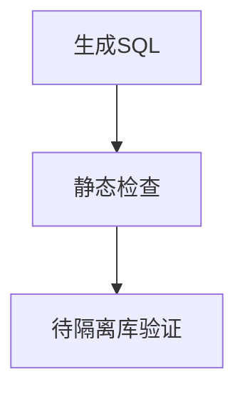

<!-- prd-workspace:{"schemaVersion":1,"docId":"synthetic.toc-ddl","version":"demo","revision":0,"updatedAt":"2026-09-12T05:01:11.078Z"} -->
# DDL 与多级目录演示

合成界面与 SQL 示例，不是授权中心业务方案。数据库执行未验证。

## 四、数据库设计

### 4.1 建表、注释与索引

```sql
-- 合成演示：PostgreSQL 15+ 语法；仅静态示例，未执行数据库。
CREATE TABLE demo_category (
    id BIGINT GENERATED ALWAYS AS IDENTITY PRIMARY KEY,
    name VARCHAR(64) NOT NULL UNIQUE
);
COMMENT ON TABLE demo_category IS '合成设备分类，仅用于技能演示';
COMMENT ON COLUMN demo_category.id IS '分类标识，数据库生成';
COMMENT ON COLUMN demo_category.name IS '分类名称，全局唯一，最多64字符';
CREATE TABLE demo_device (
    id BIGINT GENERATED ALWAYS AS IDENTITY PRIMARY KEY,
    category_id BIGINT NOT NULL REFERENCES demo_category(id) ON DELETE RESTRICT ON UPDATE RESTRICT,
    name VARCHAR(128) NOT NULL,
    status VARCHAR(16) NOT NULL DEFAULT 'active' CHECK (status IN ('active', 'disabled'))
);
COMMENT ON TABLE demo_device IS '合成设备，仅用于技能演示';
COMMENT ON COLUMN demo_device.id IS '设备标识，数据库生成';
COMMENT ON COLUMN demo_device.category_id IS '所属分类，禁止删除被引用分类';
COMMENT ON COLUMN demo_device.name IS '设备名称，最多128字符，不要求唯一';
COMMENT ON COLUMN demo_device.status IS '状态：active可用，disabled停用';
-- 分类设备列表按主键稳定排序；主键和分类唯一名称已由约束建立索引。
CREATE INDEX idx_demo_device_category_id ON demo_device(category_id, id);
```

#### 字段约束

分类名唯一；设备分类为必填引用；状态只能为 active 或 disabled。

##### 校验方法

隔离数据库初始化、唯一性与外键拒绝、检查约束及 EXPLAIN 尚未执行。

###### 执行记录

未执行，无业务验收证据。

### 4.2 索引依据

| 索引 | 查询 | 代价 |
|---|---|---|
| idx_demo_device_category_id | 分类过滤并按 id 排序 | 新增/改分类维护复合索引，待 EXPLAIN 核验 |

### 同名标题

第一个目标。

### 同名标题

第二个目标。

```text
### 代码中的标题
```

## 九、测试说明

##### 跳级标题

用于核对跳级目录。

### 图形


