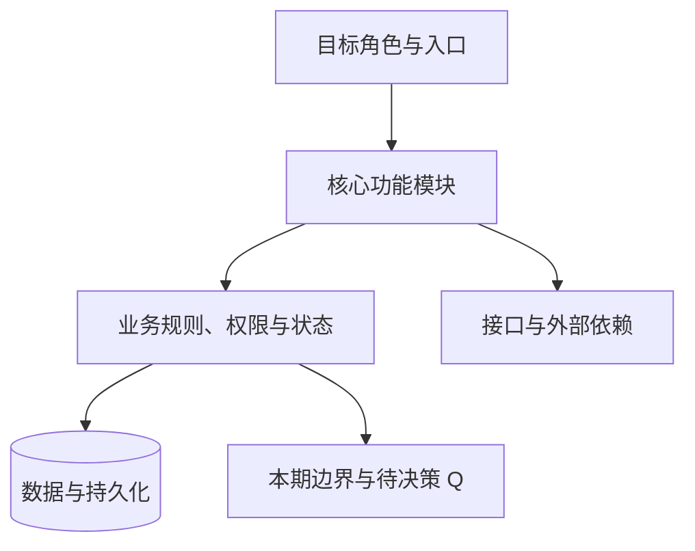

# <模块名> PRD

文档状态：草案 / 待决策 / 待评审 / 评审已批准 / 待验收 / 已验收
任务模式：create / revise；详细程度：lite / standard / full
适用版本：待填写；产品/技术/测试责任角色：待确认
证据说明：已核验材料与核验限制；未执行验证不得写为通过。

### 编号说明

下表解释正文编号前缀；本文未使用的前缀标为“本文未使用”。编号只是文内引用标识，不代表优先级、批准或验收状态；新增前缀必须在此补充含义。

| 前缀 | 含义 | 格式与示例 | 出现章节 |
|---|---|---|---|
| S | 来源/资料条目 | S-01 | 来源与核验限制 |
| US | 用户故事 | US-01 | 二 |
| BR | 业务规则 | BR-01 | 二 |
| AC | 验收标准；可关联用户故事分层编号 | AC-01-01（US-01 的第 1 条） | 二 |
| API | 接口操作 | API-01 | 五 |
| DB | 数据库设计与迁移条目 | DB-01 | 四 |
| TC | 测试用例 | TC-01-001 | 九 |
| TD | 合成测试数据集 | TD-01 | 九、十 |
| Q | 待决策事项 | Q-01 | 十二 |

## 一图统揽

先看图再读细节：下图给出本 PRD 的整体结构，只做导航，判定仍以正文编号条款为准；图与正文不一致时必须同步修正。

## 修订记录

| 版本 | 日期 | 修订人/工具 | 变更摘要 | 影响编号 |
|---|---|---|---|---|

## 一、背景与目标

### 1.1 用户、痛点与现状

目标角色、实际使用任务、当前流程与问题证据。

### 1.2 业务目标与成功指标

| 指标 | 定义 | 基线 | 目标 | 观察周期 | 数据来源 | 负责人 |
|---|---|---|---|---|---|---|

### 1.3 范围、优先级与依赖

区分本期/非本期；列必要依赖及假设，不为凑模板增添功能。

## 二、用户故事、业务规则与验收标准

主流程、分支、失败恢复、用户可见行为及适用的权限矩阵。

| US 编号 | 角色、动作与价值 | 优先级 | 关联 BR |
|---|---|---|---|

| BR 编号 | 规则 | 来源/决策状态 | 影响范围 |
|---|---|---|---|

| AC 编号 | 场景 | Given | When | Then | 关联 US/BR |
|---|---|---|---|---|---|

Then 应包含具体结果与不应发生的效果，不能只有“操作成功”。
对未适用维度标 N/A 并说明理由；不能杜撰字段或接口来满足用例数量。

## 三、字段配置与数据规则

业务含义、来源、API 字段、Java 属性、数据库列分开记录，按语义关联。
请求必填、数据库可空、服务端生成、默认值、长度单位、枚举、敏感性、读写权限分别定义。
说明唯一性作用域、缺失/null/空字符串、时间语义及特殊格式。

## 四、数据库设计与迁移附录

### 4.1 引擎、范围与设计决策

列数据库/版本/schema、来源、适用表、依赖、现状与目标差异、DB/Q 和方案状态。无数据库对象时写 N/A 及依据。

### 4.2 完整建表 SQL（含注释与约束）

按 references/database-ddl.md 写入所有适用表的完整 SQL 围栏，并附同内容的 `<module>.schema.sql`。包含建表、主键/唯一/外键/检查约束、默认值和每张表/列的数据库注释；不能用字段表、问题清单或省略号替代 SQL。

### 4.3 索引 SQL 与查询依据

给出完整索引语句（可合并入4.2同一脚本），并填写下表。已由主键/唯一约束建立的索引注明隐式来源，无额外索引说明理由。

| 索引/约束名 | 表、列顺序/条件 | 类型 | API/查询或规则依据 | 写入代价/验证方式 |
|---|---|---|---|---|

### 4.4 迁移、数据与恢复

区分空库初始化与存量迁移，说明顺序、旧数据处理、锁/兼容影响、回滚或恢复。关联 TC/TD/AC；SQL 默认仅为草案，列实际静态检查与未执行的数据库验证，不能以生成文件代替运行证据。

## 五、接口操作定义

### 5.1 接口总览

| API 编号 | 动作 | 方法与路径 | 权限/范围 | 关联 BR/AC |
|---|---|---|---|---|

### 5.2 公共协议与来源

HTTP 状态与业务 code 分列；明确鉴权、分页、字段错误、序列化和兼容约定。

### 5.3 逐接口契约

每个接口包含请求、响应、示例、校验顺序、权限与对象范围、状态条件、失败效果、幂等和重试。
新增/编辑分别规定 id 与缺失字段语义；分页规定边界、白名单与稳定排序。
只定义实际需要的接口，不强制生成五个 CRUD 接口。

## 六、业务状态机

有真实状态时先给状态流转图，再用状态转移表逐条定义契约；图与表的状态、事件与目标状态必须一致。

| 当前状态 | 事件 | 前置条件 | 允许主体 | 副作用 | 失败处理 | 下一状态 |
|---|---|---|---|---|---|---|

失败处理写明状态不变时的可见效果与恢复路径。
无业务状态时写 N/A 并给理由；单纯创建/修改审计不构成必须绘制的状态机。

## 七、非功能需求

适用的性能、容量、安全、审计、可用性和运行观测。
量化目标需具备测量环境、数据规模/分布、负载、分位数、超时/错误口径与验证方法。
引用平台级基线时说明版本，不无意义复制。

## 八、边界、异常与恢复

输入边界、无权限/无资源、重复请求、并发冲突、引用删除、局部失败、异步超时等按风险覆盖。
记录用户提示、恢复路径与数据不变量；不泄露无权访问对象的信息。

## 九、测试用例、测试数据与追溯

### 9.1 环境、范围与用例总表

填写测试环境/构建版本、角色与范围、依赖、优先级依据及验证层级。逐例覆盖适用的正向、边界、字段语义、权限隔离、并发/幂等、状态/恢复和非功能；不适用项给出理由，待定断言关联 Q。

| TC 编号 | 标题 | 类型/层级 | 优先级及理由 | US/BR/AC/API | TD | 执行状态/阻断 |
|---|---|---|---|---|---|---|

### 9.2 逐条用例详情

按实际 TC 重复以下结构并填入具体内容；不能只保留此提示或只输出覆盖矩阵。

#### TC-<编号>：<可观察的行为>

| 项目 | 具体内容 |
|---|---|
| 关联与角色 | US/BR/AC/API、操作者、动作/对象/字段权限及数据范围 |
| 前置条件 | 环境、依赖、初始记录/状态/版本；未知项关联 Q |
| 输入 | TD 编号、文件与记录选择器、具体字段值或边界计算式 |
| 操作步骤 | 1. 准备与核验初始状态；2. 具体页面/API 操作；3. 查询响应/数据/审计以核对结果 |
| 预期与禁止副作用 | UI、HTTP、业务码、响应、数据/状态/版本、审计按适用性分别判定；不应发生的效果 |
| 清理与重跑 | 精确对象/顺序、恢复初始状态、隔离与幂等策略 |
| 实际执行 | 未执行或阻断；实际值、环境/版本、执行者/时间、证据位置未有记录时写无 |

### 9.3 测试数据集清单与样例

| TD | 用途与关联 TC | 文件/记录选择器 | 类别与数量/分布 | 字段/关系/唯一范围 | 具体样例及预期违规 |
|---|---|---|---|---|---|

明确哪些是合法基线、哪些是故意非法的请求；测试角色/命名空间等元数据不是业务字段。列出固定种子、参考时间/时区、隔离前缀、规模与分布参数。

### 9.4 测试数据如何生成、校验与清理

填写工具/版本、依赖、工作目录、完整脚本或已核验工具配置、准确命令、输出文件和具体内容样例。脚本作为附件交付时，正文仍包含可复制重建的方法；不能留“按需生成”的占位句。无真实 API/DDL 时交付纯本地 JSON 等合成夹具生成器，业务装载适配列 Q。

1. 生成：列完整命令、固定输入参数、输出位置和覆盖策略。
2. 校验：列数量、合法基线约束/引用、故意非法样例的分类断言以及同种子重复生成的比对方法；记录实际执行证据或未执行原因。
3. 装载：列隔离环境、角色配置、父子依赖顺序、已有工具/接口及写操作授权要求；未核验适配不得冒充可执行。
4. 清理：按用例/命名空间定位精确记录，先子后父恢复，列本地文件清单和重跑策略；不得泛删共享数据。

### 9.5 多对多追溯与缺口

| US/BR/状态转移/非功能条款 | AC | API/数据约束或 N/A | TC | TD | 覆盖或具体 Q 缺口 |
|---|---|---|---|---|---|

## 十、逐项验收计划与结果

### 10.1 验收点与放行标准

复用第二章 AC 编号，一行对应一个可独立判定的验收点；逐项覆盖全部适用功能、权限、字段/数据、状态、接口、异常恢复、非功能及迁移。没有依据的码值或阈值列 Q 并阻断受影响验收。

| AC/关联需求 | 验收点与明确放行标准 | 验证步骤/方法 | TC/TD | 所需证据 | 失败后重验范围 |
|---|---|---|---|---|---|

### 10.2 实际执行记录

| AC | 状态/阻断 Q | 实际观察结果 | 环境/构建版本 | 执行时间/主体 | 实际证据位置 |
|---|---|---|---|---|---|

状态仅可为未执行、阻断、通过、失败、N/A（理由）；初稿默认未执行。相同的未提供环境/人员等可在表前统一声明，但每个 AC 仍需独立状态。文档自检、生成合成数据、浏览器交互测试和业务验收分别记录，不得以任一替代其他层级。产品验收还需核对用户任务与异常恢复能否完成。

## 十一、技术简报与发布准备

### 11.1 复用与代码影响

标明实际核验的模块/符号，以及待新增设计；不要把示例目录当已存在实现。

### 11.2 关键技术决策

列方案、取舍、责任角色、决策状态与关联需求；不要静默替用户确认技术选择。

### 11.3 发布、兼容与恢复

按变更风险说明迁移、灰度/放行、监控、回退或前滚恢复和回归范围。

## 十二、待决策事项

| Q 编号 | 问题 | 选项/建议理由 | 决策角色 | 阻断范围 | 状态 | 依据 |
|---|---|---|---|---|---|---|

已确认事实、建议假设与阻断项分别呈现。无新证据不自动将假设改成已确认。
