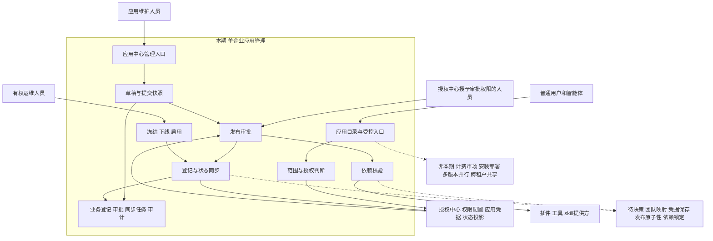
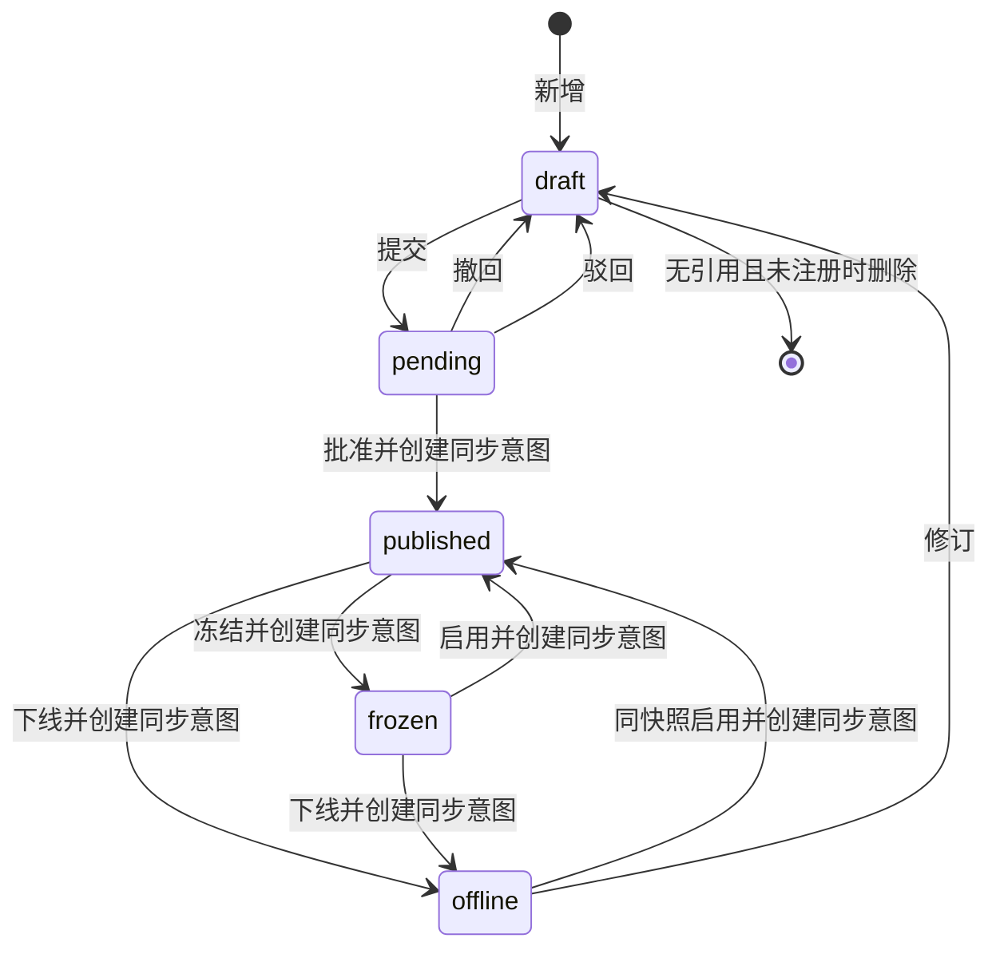
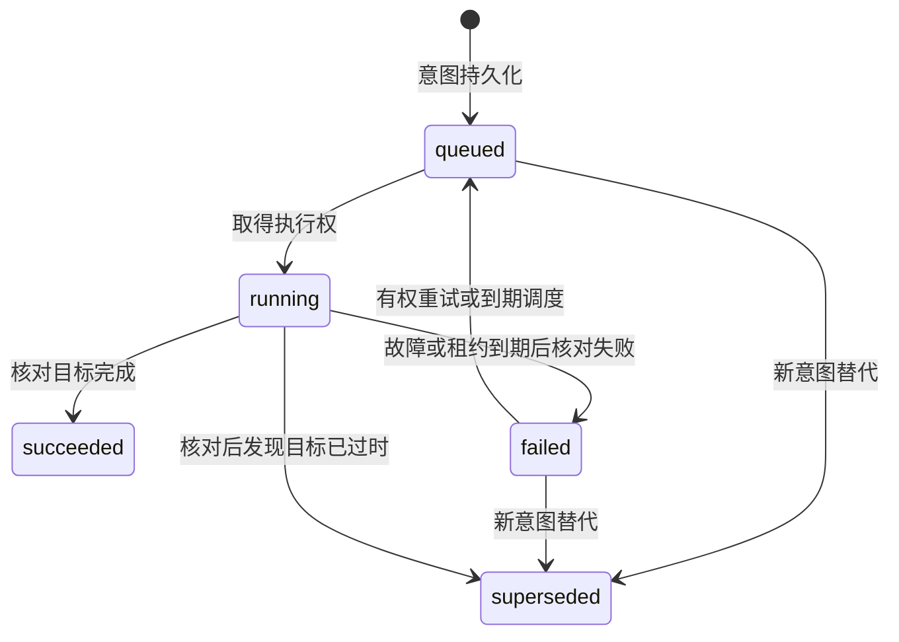

<!-- prd-workspace:{"schemaVersion":1,"docId":"application.center","version":"0.1.0","revision":4,"updatedAt":"2026-09-14T12:28:24.807Z"} -->
# 应用中心产品需求文档

文档 ID：application.center；业务版本：0.1.0；状态：待决策；编制日期：2026-09-14；适用系统：AI安全生产智能体平台，单企业部署。读者为产品、业务管理员、开发和测试；业务负责人、技术负责人及验收签署人均待指定。使用 prd-writer-v3.1 编制，本文是需求与开发设计草案，不证明功能已经实现。浏览器编辑修订号独立于业务版本，不表示批准。

本期让应用维护人员登记应用、提交发布审批，让授权中心配置的有权人员审批，并让运维人员冻结、下线及恢复应用。重点保证审批对象明确、依赖校验可追溯、跨服务同步结果可核对。普通用户与智能体通过受授权的入口使用应用；应用可以没有UI。

### 来源与核验限制

| 来源 | 文件或记录 | 状态与适用范围 |
| --- | --- | --- |
| S-01 | [原始应用中心需求与DDL](DDL.md) | 已核验文件内容；用户提供的目标清单，未证实已部署。原文件有未提交修改，本次保留原样 |
| S-02 | [平台公约](../平台公约.md) v1.0 | 已核验开发约定：路径、分页、HTTP与code、字段与版本、北京时间；不代表接口实现 |
| S-03 | [授权中心PRD](../2-授权中心/授权中心.prd.md) v0.4.2 | 已核验相邻需求：授权中心配置应用可见组、操作权限，应用中心管理生命周期并串行同步状态 |
| S-04 | [总体架构](../总体架构.md) | 已核验规划：应用可无UI、拥有工具和skill入口；多租户表述与本期决定冲突，按S-05执行 |
| S-05 | 本任务用户于2026-09-14反馈 | 已确认：“单企业部署，与授权中心对齐”；“有没有审批权限 走授权中心来设定” |
| S-06 | [prd-writer-v3.1技能](../skills/prd-writer-v3.1/prd-writer/SKILL.md) | 交付和文档验证方法，不作为业务批准依据 |

已读取应用中心全部现有资料及上述相关文件，并在applications内检索相关Java/TypeScript业务实现，未找到可核验的应用中心实现。未连接数据库、鉴权服务、依赖服务或生产系统。除S-02/S-03已有约定与S-05确认项，本文新增路径、字段限制、存储、恢复和交互均为建议方案；关联Q的条款在批准前阻断受影响实现放行。外部组件版本仅转述资料，不作为已验证的环境事实。

### 编号说明

| 前缀 | 含义 | 格式与示例 | 出现章节 |
| --- | --- | --- | --- |
| S | 来源 | S-01 | 文首、一、十一 |
| US | 用户故事 | US-01 | 一、二、九 |
| BR | 业务规则 | BR-01 | 二至十一 |
| AC | 验收标准 | AC-01 | 二、九、十 |
| API | 本模块接口或跨服务操作 | API-01 | 五、九 |
| DB | 数据库设计对象 | DB-01 | 四、九 |
| TC | 测试用例 | TC-01 | 九、十 |
| TD | 合成数据集 | TD-01 | 九、十 |
| Q | 待决策或本轮已确认项 | Q-01 | 各章、十二 |
| RV | 离线工具追加的评审批注 | RV-加工具生成标识 | 本文未使用；添加批注后位于文档评审记录 |

编号不代表优先级、批准或验收通过。Q-01记录已确认的单企业决定，不复用其编号。正文未使用其他需求编号前缀。

## 一图统揽



图仅提供导航，业务判断以BR和AC为准。应用中心不维护另一套角色权限配置；审批操作在授权中心登记后，由授权中心决定谁可执行。

## 修订记录

| 版本 | 日期 | 修改者或工具 | 原因与影响 | 批准证据 |
| --- | --- | --- | --- | --- |
| 0.1.0 | 2026-09-14 | Codex，prd-writer-v3.1 | 基于S-01补齐十二章、字段、流程、接口候选、完整DDL、用例、数据和验收；影响全部初次编号 | S-05只批准单企业及审批权限归授权中心；其余未签署 |

合成章节验证 中文。

## 一、背景与目标

### 1.1 场景与价值

应用维护人员为新增的业务应用登记名称、编码、图片、描述和依赖，提交供审批。审批人需要看到本次申请的固定内容及依赖校验结果；运维人员需要确认冻结、下线或启用是否已在授权中心生效。原始资料没有当前人工耗时、故障次数或用户访谈记录，因此这些问题是待验证的需求风险，不能写成已测量的业务痛点。

### 1.2 范围与优先级

P0覆盖登记、读取、编辑、提交与审批、鉴权、凭据保护、依赖阻断、状态同步与恢复；P1覆盖图片展示、草稿删除、筛选体验、审计查询和下线后修订。P0表示发布必要性，P1不是免除安全要求。基础版本必须实现S-01列出的新增、编辑、删除、详情、列表、发布审批、冻结、启用；S-03要求的下线及同步一并纳入。

非本期：应用市场计费、应用二进制安装部署、自动升级依赖、审批流程设计器、多人实时编辑、同时运行多个应用版本、凭据轮换控制台、应用参数或字典的重复管理、跨企业共享。应用提供的工具与skill不因写入dependencies自动注册或执行；具体操作上报由对应应用接入授权中心完成，应用中心只负责协调登记。

### 1.3 成功指标与依赖

| 指标 | 定义 | 基线 | 目标 | 观察周期/数据源/负责人 |
| --- | --- | --- | --- | --- |
| 发布完成率 | 同版本审批通过且授权同步完成数/审批通过数；待处理不算完成 | 未提供 | Q-10 | 周期待定；审批和同步记录；产品与运维待指定 |
| 发布办理时间 | 提交到依赖与授权确认完成的时长，单独统计人工等待 | 未提供 | Q-10 | 周期待定；申请与同步时间；产品待指定 |
| 状态一致性 | 本地期望状态与授权实时查询一致的应用数/已登记应用数 | 未提供 | Q-10 | 对账记录；运维待指定 |
| 越权返回 | 无权请求中返回受限对象、计数或凭据的次数 | 未提供 | 验收样例必须为0 | TC-03/04/18；安全与测试待指定 |

授权中心是用户身份、操作权限、应用可见权限组和应用鉴权的权威；依赖提供方是插件、工具和skill可用版本的权威；媒体存储、团队归属、凭据存储和初始化受控身份未确定。应用中心关闭时，授权中心仍应独立处理已登记应用的鉴权（S-03）。

## 二、用户故事、规则与验收

### 2.1 用户故事与操作体验

| US | 角色与任务 | 主流程及恢复 | 优先级 |
| --- | --- | --- | --- |
| US-01 | 维护人员登记和修订应用 | 新建→校验→保存草稿→详情；冲突保留输入，重新读取后确认再提交 | P0 |
| US-02 | 用户或智能体寻找可用应用 | 目录筛选→详情→已配置的受控入口；无UI应用展示说明，不提供虚构的打开按钮 | P0 |
| US-03 | 有权人员提交、审批发布 | 提交→固定快照→查看依赖→批准或驳回；依赖故障保留申请并允许重试 | P0 |
| US-04 | 运维人员停止或恢复应用 | 冻结/下线/启用→显示同步操作→核对完成；失败保留意图、原因和重试入口 | P0 |
| US-05 | 有权人员核对依赖和接入状态 | 查看依赖报告、授权同步与诊断标识；不展示凭据明文 | P0 |
| US-06 | 维护人员清理草稿 | 查看引用提示→二次确认→删除；引用未解除时完整保留 | P1 |
| US-07 | 审计与测试人员核对管理行为 | 按应用查看操作和状态证据，按AC验收；不能通过勾选替代执行 | P1 |

列表提供名称、编码、logo、作用域、业务版本、本地状态、同步状态及最近更新时间。管理列表可见本人的或被授予管理范围的草稿；普通目录仅显示满足BR-03且已完成发布同步的应用。无结果时区分“尚无可见应用”和“筛选无结果”，都不显示无权对象数量。详情包含基础信息、依赖、审批记录及有权查看的同步记录；按钮按当前状态与授权显示，服务端仍逐次校验。编辑失败保留用户输入；版本冲突显示“应用已被更新，请读取最新内容后重新确认”。

发布审批页展示提交人、提交时间、releaseVersion、快照及依赖校验时间和结果；批准与驳回均要求原因。审批进行中禁止编辑已提交内容；撤回或驳回回到草稿后才可修改。冻结和下线弹窗必须说明调用限制及同步可能未完成；恢复弹窗展示最新依赖校验。删除弹窗显示名称、编码与是否存在引用，不默认关联删除。

### 2.2 业务规则

| BR | 主题 | 可检查规则 | 依据或待决策 |
| --- | --- | --- | --- |
| BR-01 | 单企业与归属 | 本期一个部署对应一个企业，不新增tenantId；personal/team/enterprise表达可见范围，不是部署租户。创建人来自认证上下文。团队实体映射由Q-03决定。 | S-05；Q-01/Q-03 |
| BR-02 | 授权权威 | 新增、编辑、提交、审批、冻结、下线、启用、删除、审计读取均按授权中心已配置的操作权限逐次鉴权。前端隐藏按钮不替代后端检查；应用中心不配置本地审批人白名单。受控服务调用不能仅凭任意AppKey放行。 | S-03/S-05；Q-02/Q-05 |
| BR-03 | 可见性与调用权限 | 建议普通目录必须同时满足应用published、同步完成、scope归属匹配、授权中心可见权限组判断；调用还要独立核验具体操作权限及实时状态。personal仅owner，team仅团队有效成员，enterprise为本企业用户。管理权不自动扩大普通用户目录范围。权限组并集的结果再与scope取交集，不因scope扩大而授权。团队和交集规则待Q-03。 | S-01/S-03；Q-03 |
| BR-04 | 编码唯一 | 候选appCode为1至64个ASCII小写字母、数字、下划线，首位字母；不自动大小写折叠，单部署唯一、创建后不可改。已登记授权的编码不复用；允许删除的未注册草稿删除后可重建。数据库唯一约束处理并发，冲突40902不覆盖。 | S-01/S-02/S-03；Q-04 |
| BR-05 | 字段与版本 | 新增拒绝id/version/审计/凭据/状态等只读字段；PATCH必须带version并原子比较加1。业务版本改名为releaseVersion，避免占用平台并发version。字段整体校验失败不修改任何字段、关联和版本。 | S-02；Q-04 |
| BR-06 | 可编辑状态 | 只允许draft编辑；pending锁定提交内容。published或frozen必须下线后执行revise进入draft才可改，授权端继续offline。修订再次提交和批准；本期不支持旧版本在线时编辑新版本。 | 建议；Q-02/Q-04 |
| BR-07 | 提交快照 | 提交前验证必填、范围、依赖；一次事务生成不可变业务快照和pending审批记录，将draft变pending且版本加1。依赖不可用返回50301，不创建半份申请；同版本重复提交40901。 | S-01；Q-02/Q-06 |
| BR-08 | 审批决定 | 审批动作由授权中心授予；待审内容与提交版本绑定，批准前重新校验依赖。批准、驳回、撤回必须原子核对应用版本和pending申请；并发只有一个结果。建议禁止自审，待Q-02；撤回仅原提交人且有操作权。驳回、撤回回到draft，不修改授权端。 | S-05；Q-02 |
| BR-09 | 依赖元素 | 候选每项为{kind,code,version}，kind为plugin/tool/skill，code为稳定编码，version为精确版本；同kind+code不得重复。依赖必须存在、可用且版本一致；版本范围、传递依赖及环暂不支持。不自动安装或升级依赖。 | S-01；Q-06 |
| BR-10 | 依赖时效 | 提交、批准、启用分别查询依赖权威；报告记录版本、状态、检查时间和诊断标识。结果只代表检查时点；在版本锁定或卸载联动协议确认前不能承诺检查后一直可用。依赖运行时故障提示不可用并告警，不伪报发布成功。 | S-01；Q-06 |
| BR-11 | 注册与凭据 | 仅批准后的发布流程调用授权中心建立记录。应用中心通过受控服务保管授权ID、AppKey及凭据存储引用；候选不在业务库保存appSecret。普通列表、详情、审批快照、审计、导出和浏览器缓存均不含secret。登记响应丢失先查appCode，不重复生成密钥；秘密不可恢复时停在失败待处理。 | S-01/S-03；Q-05 |
| BR-12 | 发布完成 | 批准原子更新本地published/期望active并生成同步意图；对用户明确显示“审批通过，发布同步中”。只有依赖校验有效、凭据就绪、授权端active核对完成且任务未过时才算发布完成。S-03首次建立记录即active，存在应用中心尚未就绪就能鉴权的窗口；Q-05解决前禁止放行首次发布。 | S-03；Q-05/Q-06 |
| BR-13 | 冻结下线 | published可freeze为frozen；published/frozen可offline为offline。本地立即隐藏入口并保存停止意图，远端确认前显示“冻结/下线同步中，授权端尚未确认”。不能宣称直接调用已全部阻断；授权端确认后旧token调用该应用被拒，其他应用不受影响。 | S-03；Q-07 |
| BR-14 | 启用 | frozen可enable恢复同一批准快照；offline仅在内容未修订且存在同快照批准记录时enable。重新检查依赖并串行同步active；未批准draft/pending禁止启用；恢复不恢复已撤销token、不延长其有效期。 | S-03；Q-06/Q-07 |
| BR-15 | 同步与恢复 | 本地状态、版本、同步任务和成功/受理审计同事务写入；按应用持久串行处理。发送前读取当前期望并废弃旧意图；40901先读取授权端版本和状态，再发送当前期望。响应丢失先查远端，避免反复登记。后台崩溃租约到期后核对远端再恢复；重试不能将过时active覆盖新冻结，详见5.5。 | S-03；Q-07 |
| BR-16 | 删除与引用 | 候选仅删除draft、从未建立授权、无审批/同步/外部引用的应用；返回40401表示已不存在，40903表示引用阻止，40904表示状态不允许。审批历史也算引用，不级联删除、不删除授权记录；已有应用使用下线。无法查询外部引用时50301，禁止当作无引用。 | S-01/S-02/S-03；Q-09 |
| BR-17 | 重试语义 | 沿用平台：新增唯一冲突40902；旧version编辑或动作40901；重复删除40401。业务动作HTTP200可能只表示受理，客户端通过operationId查询；超时先读状态再决定。人工retry只重排failed且仍为当前意图的原任务，重新检查操作权，不生成第二个业务动作。 | S-02；Q-07 |
| BR-18 | 一致响应与分页 | 沿用S-02的message、code、data；不使用S-04旧msg格式。ID及并发version均为十进制字符串。分页先做权限过滤再count与limit，同值排序追加id；未知筛选、字段、排序及超界分页40001。 | S-02 |
| BR-19 | 文本图片 | 名称/描述为纯文本；候选logo/cover只接收批准域名HTTPS资源地址或空值，不允许脚本、data、file协议。前端按文本编码，后端不抓取任意URL；实际上传与资源读权限由Q-11决定。图片加载失败用占位且不阻塞审批信息阅读。 | S-01；Q-11 |
| BR-20 | 审计安全 | 记录主体、动作、对象、范围、结果、时间、前后版本和traceId；差异使用字段白名单排除凭据。成功或受理审计写失败则本地事务回滚；拒绝事件记录失败如何告警和持久化待Q-10。审计读取也受权控，无公开写删接口。 | 建议；Q-10 |
| BR-21 | 性能可用性 | 分页上限100已确定；实际容量、并发、p95、超时、重试间隔/次数、对账频率、告警时限及审计保留期由Q-10批准。测试须记录部署、样本分布、负载和原始结果；不能用本地夹具生成速度替代接口性能。 | S-02；Q-10 |
| BR-22 | 数据与上线 | 新库候选完整DDL与SQL附件同内容；不执行跨库INSERT、不以CREATE TABLE升级未知存量。数据库版本、时区会话、迁移适用条件及恢复由Q-08确认；初始化两个内置应用的受控身份由Q-05解决。 | S-01/S-03；Q-05/Q-08 |


### 2.3 权限矩阵

表中“有权”必须来自授权中心的当前判定；角色名称只用于说明任务和合成测试，不是新增授权中心角色实体。审批按钮对应的具体操作码由Q-02确认并上报授权中心；候选动作名仅见API，不直接当成已有权限码。

| 动作 | 主体与动作权 | 对象/范围 | 状态与字段 | 审计 |
| --- | --- | --- | --- | --- |
| 新增 | 有创建操作权的用户 | 本人；选择团队还需有效成员资格 | 仅可写字段；owner由服务器设置 | 记录成功/拒绝 |
| 管理列表/详情 | 有管理读取权 | 本人或被批准管理的团队/企业范围；映射Q-03 | 隐去secret、凭据引用；AppKey仅接入受控服务 | 读取审计口径Q-10 |
| 普通目录/调用 | 已认证用户或具备对应主体的智能体 | BR-03范围与可见组交集；调用独立动作鉴权 | 已完成发布；不显示管理数据 | 拒绝不泄露目标 |
| 编辑/提交 | 有对应操作权的维护者 | 有管理权的应用 | draft；只可写业务字段 | 记录版本与变更 |
| 批准/驳回 | 授权中心授予审批操作权的用户 | 有权审批该应用；是否自审Q-02 | pending快照；reason必填 | 记录审批人、原因及报告 |
| 撤回 | 原提交人且有撤回权 | 自己的申请 | pending；reason必填 | 固定快照保留 |
| 冻结/下线/启用/修订 | 有对应操作权的人员 | 有管理权的应用 | BR-13/14/06；原因必填 | 本地受理与远端完成分开 |
| 删除 | 有删除权的维护者 | 有管理权的应用 | BR-16；version必填 | 保留无外键的删除审计 |
| 状态同步/凭据保管 | 初始化登记的受控应用中心服务身份 | 仅自己管理的appCode与授权记录 | 不能由前端传入任意状态或凭据 | 记录脱敏结果 |
| 审计读取 | 有审计读取权的人员 | 有审计范围的应用 | 只读，敏感字段不返回 | 审计读取留痕口径Q-10 |

无操作权返回40301；拥有操作权但对象不在可见/管理范围内建议统一40401，避免通过ID枚举对象；应用冻结/下线导致鉴权被拒遵循40302。授权中心不可用返回50301，不凭旧缓存放行高风险写入。字段越权返回40001且整次请求不生效。Q-03收口前，范围相关实现不得放行。

### 2.4 Given–When–Then验收标准

| AC | 关联US/BR | 场景 | Given | When | Then，含禁止效果 |
| --- | --- | --- | --- | --- | --- |
| AC-01 | US-01；BR-04/BR-05 | 登记草稿 | 有创建权的101，尚无prd_app_new | POST新建appCode=prd_app_new、appName=新应用、scope=team、teamId=201 | HTTP200/code200；生成字符串id/version=1，status=draft，无授权登记 |
| AC-02 | US-01；BR-04 | 编码与并发新增 | 101与102都获创建权，编码尚不存在 | 同时发送两份appCode=prd_app_race的相同新建请求；再提交App_A和1app | 并发一份200/200，一份409/40902；非法编码400/40001；不覆盖、不多建授权记录 |
| AC-03 | US-02；BR-01/BR-02/BR-03/BR-18 | 目录隔离和计数 | 103属于201但无操作写权；104属于202；应用1003已完成发布 | 分别用两用户按scope=team查询目录并猜测GET /1003；给103去掉可见组后重复 | 103仅在命中可见组时可见；104列表和total均不含1003，详情404/40401；无权写403/40301 |
| AC-04 | US-01/US-05；BR-02/BR-05/BR-11 | 字段与凭据越权 | 101可编辑1001，version=7 | PATCH appSecret、status、ownerId、id等每个只读字段；读取详情和列表 | 每次写400/40001，字段/版本全不变；普通响应无appSecret、credentialRef、appKey |
| AC-05 | US-01；BR-05/BR-19 | 空值和边界 | 1001草稿，logo为合成允许域名URL，version=7 | 分别从基线测试：省略logo并改名；logo=null；logo空白；appName空/null/129字符；合法128字符；dependencies=null/{}；[] | 省略保留、null/空白清空；非法400/40001整体不变；128字符成功；[]清空依赖；每次有效修改version=8 |
| AC-06 | US-01；BR-05/BR-17 | 陈旧版本与无变更 | 两页面读取1001版本7 | 页面A改名提交7；B改名仍提交7；再测试缺version、仅version及当前值不变 | A200/200且version=8；B409/40901保留输入、不覆盖A；缺失/无变更400/40001且不递增 |
| AC-07 | US-03；BR-06/BR-07/BR-09 | 提交固定快照 | 1001草稿、依赖available、101有提交权 | POST /1001/submit {version:7}；读取申请；尝试修改pending名称 | 提交200/200，pending/version=8，唯一pending快照与提交字段一致；pending编辑409/40904且快照不变 |
| AC-08 | US-03/US-05；BR-07/BR-09/BR-10 | 依赖失败阻断 | 分别准备draft提交、pending批准、frozen启用，版本7 | 对每个操作依次注入missing/disabled/version_mismatch/timeout；同时测试重复kind+code、未知kind及version范围 | 前三类409/40904并给有权查看的依赖项；timeout503/50301；元素非法400/40001；状态/版本不变，无授权写入 |
| AC-09 | US-03；BR-02/BR-08 | 审批权限来自授权中心 | 1002待审，提交人101；102先没有审批操作权 | 102批准被拒；仅在授权中心赋权后重试；撤销该权后对另一个新申请再审批 | 无权403/40301且申请不变；赋权后按审批流程受理；撤权后再次拒绝；应用中心不存在独立赋权入口 |
| AC-10 | US-03；BR-08/BR-11/BR-12 | 批准与发布完成 | 102有审批权；1002待审、依赖可用；受控凭据设施就绪 | 批准版本7且reason=依赖核对通过；暂停同步；查询目录；恢复登记及active核对 | 先200/200返回operationId和queued，本地published/version=8但目录不可用；全部核对成功才syncCompleted=true；快照不含凭据 |
| AC-11 | US-03/US-01；BR-06/BR-08 | 驳回修改再提交 | 1002待审，102有审批权 | 驳回version7/reason=描述缺失；101编辑返回版本；依赖可用后再次提交 | 驳回200/200，draft/version8，旧申请rejected有原因；编辑与再提交各加1，新增申请；旧快照不变，无授权激活 |
| AC-12 | US-03；BR-07/BR-08 | 撤回与决策竞争 | 1002待审，101可撤回、102可审批，均读7 | 从干净基线撤回reason=补充依赖；另一次并发撤回/批准/驳回；再用103撤回 | 单独撤回draft/8且withdrawn；并发最多一个决定，其余409/40901；103无权403/40301；不产生两个决定或两份意图 |
| AC-13 | US-04；BR-13/BR-15 | 冻结生效分层 | 1003已发布，105有冻结权，授权端active | 冻结version7/reason=故障隔离并暂停远端；再恢复同步，用旧token访问本应用和另一应用 | 本地frozen/8，先显示同步中而非全部停用；远端确认frozen后本应用403/40302，另一应用授权不变 |
| AC-14 | US-04；BR-13/BR-15 | 下线两条路径 | 各从1003 published和1004 frozen基线，105有下线权 | 分别POST offline version7/reason=停止运营；等待远端核对 | 各200/200受理，本地offline/8；远端offline后禁止该应用鉴权，授权和组关联仍存在；不删除数据 |
| AC-15 | US-04/US-01；BR-06/BR-14 | 启用和下线修订 | 1004/1005各有与当前内容匹配的批准快照，105有相应权限 | 分别enable；另从offline执行revise后编辑releaseVersion=1.0.1；测试draft/pending enable | frozen/offline可恢复同快照，成功同步后published可用；revise为draft且远端保持offline；未批准enable409/40904；旧撤销token不恢复 |
| AC-16 | US-04/US-05；BR-15/BR-17 | 同步超时和重启 | 冻结意图已持久化，远端可被注入故障 | 逐次注入before_send、response_lost、version_conflict、worker_restart；查询远端并按最新意图恢复 | 不丢意图；响应丢失不重复登记；冲突读取新授权version；重启租约到期核对后恢复；最终frozen；次数与脱敏trace可查 |
| AC-17 | US-04；BR-13/BR-15/BR-17 | 过时激活与重试 | 恢复active任务已排队，随后冻结提交使本地期望frozen | 阻塞旧active发送，先提交冻结，再解除阻塞；并发两次人工retry failed任务；无权用户retry | 过时未发送active变superseded；每应用串行最终frozen；不以新租约容许旧worker继续写；两retry至多一份排队，另409/40904；无权403/40301 |
| AC-18 | US-05；BR-11/BR-12/BR-20 | 凭据丢失与脱敏 | 受控登记返回合成secret，仅在隔离假服务中存在 | 丢弃登记响应后恢复；另模拟凭据保存失败；搜索日志、快照、详情、错误及页面存储 | 按appCode查询同一授权记录，不重复注册；无法恢复secret时标失败并阻断发布；所有普通位置无secret；不以hash代替可用调用凭据 |
| AC-19 | US-06；BR-16/BR-17 | 草稿删除与引用 | 101有删除权，分别准备无引用draft、有review/authorization/sync_job引用draft及published | 分别DELETE ?version=7；成功后重复；注入引用查询超时；并发提交与删除同版本 | 无引用200/200且data=null，重复404/40401；引用409/40903；published409/40904；超时503/50301；并发最多一个成功，不级联、不留下悬空记录 |
| AC-20 | US-02；BR-18 | 分页排序协议 | 准备同名/同状态的有权记录及无权记录，包含大ID | 查询省略分页、pageSize=0/101、未知sortBy和筛选；超末页；按updatedAt同值翻页；读取9007199254740993 | 默认1/20，非法400/40001；超页items=[]且total准确；同值按id稳定排序；ID/version为精确字符串；message存在而msg不存在 |
| AC-21 | US-01/US-02；BR-19 | 文本和图片安全 | 允许的媒体域名由Q-11配置，有权用户编辑draft | 名称或描述写入<script>测试字样；logo/cover分别设javascript:、data:、file:和超512字符；合法HTTPS后令图片加载失败；以键盘完成表单和取消弹窗，在390px窄屏读取状态和依赖 | 文本不执行；非法图片400/40001且不触发后端抓取；合法资源失败显示占位；输入与其他字段不丢失；标签与可见焦点完整、Esc取消不保存、状态有文字且窄屏无页面横向溢出 |
| AC-22 | US-07；BR-15/BR-20 | 审计与事务失败 | 有权编辑/批准/冻结；审计写可注入失败 | 逐个动作令审计写失败，读取业务表和任务；恢复后重试；用无审计权用户读取日志 | 失败500/50001并traceId，本地业务/版本/任务全回滚；成功后记录字段白名单；无权403/40301且不返回日志 |
| AC-23 | US-07；BR-04/BR-05/BR-22 | DDL初始化和非法值 | 获批隔离新库、目标版本/会话时区已批准，DB-01至04 | 按附件建表；逐一插入重复app_code、非法scope、非数组依赖、team缺team_id、version=0、悬空review/sync、重复pending申请、非pending但缺decidedBy/reason、只有observedAuthStatus而无observedAuthVersion；每组独立事务回滚 | 合法基线可装载；逐个非法值被相应约束拒绝，不误报为唯一冲突；所有表列注释可查询；API层仍须补JSON元素与跨服务引用校验 |
| AC-24 | US-07；BR-22 | 存量迁移与恢复 | 如发现已存在application表，则准备其获批脱敏副本和旧版本信息 | 停止套用新库DDL；按4.3盘点、回填映射、隔离校验和切换演练；失败恢复旧应用与匹配数据 | 没有批准映射不迁移；恢复不自动将offline/frozen改active；发布版本与并发版本不混淆；原始数据及凭据不被覆盖 |
| AC-25 | US-02/US-07；BR-18/BR-21 | 负载与索引 | Q-10已确定容量、分布、负载、p95/错误率/时长及环境 | 按批准规模扩充隔离数据；分别查询目录、管理列表、同步任务和审计；采集执行计划与原始请求时序 | 按Q-10逐项阈值判定，total仍按权限；无阈值时状态阻断，不能填性能通过；记录慢查询与任务积压 |
| AC-26 | US-03/US-04/US-05；BR-09/BR-10/BR-12 | 依赖检查后变更 | 审批最后校验通过但尚未完成发布，依赖提供方可模拟升级/卸载 | 在检查后切换版本或移除依赖；尝试完成发布与随后调用；按Q-06锁定或联动方案恢复 | 无法确保审批快照版本可用时不得报完成；运行时失败可观测、不得自动安装升级；联动协议未确认时验收阻断 |
| AC-27 | US-01/US-03/US-04；BR-05/BR-06/BR-08/BR-13/BR-14 | 非法状态与请求 | 每个业务状态均有独立测试副本、有效动作权和version7 | 枚举6.2表以外的状态动作组合；合法状态下另测试reason缺失/null/空白/1001字符、未知字段 | 非法组合409/40904，无状态或授权写入；非法输入400/40001，版本不变；不要用按钮不可见替代服务端测试 |
| AC-28 | US-01/US-03/US-04；BR-02/BR-03 | 身份与授权服务故障 | 1002待审、1003已发布，分别配置用户和受控服务身份 | 无token、过期token、普通AppKey冒充受控调用；依次中断授权校验后创建/批准/冻结/读取 | 按公约40101/40102/40104；有效但无受控权限40301；依赖中断50301；没有未经授权本地变化或敏感数据，已有授权服务无需应用中心在线才能独立工作 |


## 三、字段配置与数据规则

### 3.1 主对象字段

字段限制为候选设计，Q-04批准后成为实现依据。Java列仅是建议DTO属性命名，未发现实际Java类。数据库VARCHAR长度按字符计，前端不得按UTF-16码元截断补充字符；服务端与数据库按相同可接受字符口径检查。空白裁剪只适用用户文本，凭据不裁剪、不从表单接收。

| 业务含义 | API与建议Java属性 | 数据库列 | 类型 | 请求必填 | 数据库可空 | 默认来源 | 枚举与限制 | 缺失/null/空字符串 | 读写权限 |
| --- | --- | --- | --- | --- | --- | --- | --- | --- | --- |
| 应用ID | id | id | BIGINT→字符串 | 否，只读 | 否 | 数据库生成 | 正数 | 新增/PATCH出现即拒绝 | 按对象读取 |
| 应用编码 | appCode | app_code | VARCHAR(64) | 新增是；编辑只读 | 否 | 无 | 小写字母起始，字母数字下划线 | 缺失/null/空白拒绝 | 创建可写 |
| 应用名称 | appName | app_name | VARCHAR(128) | 新增是；PATCH可省略 | 否 | 无 | 裁剪后1—128字符 | 缺失编辑保持；null/空白拒绝 | draft管理者 |
| logo | logo | logo | VARCHAR(512) | 否 | 是 | null | Q-11允许HTTPS地址 | 省略编辑保持；null/空白清空 | draft写；按范围读 |
| 封面 | cover | cover | VARCHAR(512) | 否 | 是 | null | 同logo | 同logo | draft写；按范围读 |
| 可见范围 | scope | scope | VARCHAR(16) | 否 | 否 | 新增team | personal/team/enterprise | null/空白拒绝；省略编辑保持 | draft写，归属联动校验 |
| 归属用户 | ownerId | owner_id | BIGINT→字符串 | 只读 | 否 | 认证用户 | 跨服务有效用户 | 客户端提交拒绝 | 管理详情；普通目录可省略 |
| 归属团队 | teamId | team_id | BIGINT→字符串 | team时必需 | 是，按scope条件 | 无 | team必有有效ID，其他必须null | 省略编辑保持；更换scope时同时明确teamId | draft可写且校验成员 |
| 本地状态 | status | status | VARCHAR(16) | 只读 | 否 | draft | draft/pending/published/frozen/offline | 表单写入拒绝 | 业务动作维护 |
| 业务版本 | releaseVersion | release_version | VARCHAR(32) | 否 | 否 | 1.0.0 | 三段非负数字，候选不支持预发布后缀 | 省略编辑保持；null/空白拒绝 | draft可写；重复历史版本限制Q-04 |
| 并发版本 | version | version | BIGINT→字符串 | 新增禁止；编辑和动作必需 | 否 | 1 | 每次本地更新原子加1 | 缺失/非法40001；陈旧40901 | 只读返回，写时比较 |
| 描述 | description | description | TEXT | 否 | 是 | null | 纯文本最多10000字符 | 省略保持；null/空白清空 | draft写，按范围读 |
| 依赖 | dependencies | dependencies | JSONB | 否 | 否 | [] | 最多项数Q-06；元素kind/code/version | 省略保持；null拒绝；[]清空；整组替换 | draft写，报告另只读 |
| 授权记录 | authorizationId | authorization_id | BIGINT→字符串 | 只读 | 是 | null | 授权中心登记返回 | 表单提交拒绝 | 受控服务 |
| 应用身份标识 | appKey | app_key | VARCHAR(64) | 只读 | 是 | 授权中心返回 | 保密访问；不是普通展示字段 | 表单提交拒绝 | 仅接入受控服务 |
| 密钥 | appSecret | 无 | 外部凭据 | 不接收 | N/A | 授权中心生成 | 仅受控登记/凭据设施内流转 | 一律拒绝客户端写入 | 普通读取不存在 |
| 凭据引用 | credentialRef | credential_ref | VARCHAR(256) | 只读 | 是 | 凭据设施返回 | 不能当密钥使用 | 表单提交拒绝 | 仅受控服务 |
| 授权期望状态 | desiredAuthStatus | desired_auth_status | VARCHAR(16) | 只读 | 否 | offline | active/frozen/offline | 客户端写拒绝 | 管理只读 |
| 授权已观测状态 | observedAuthStatus | observed_auth_status | VARCHAR(16) | 只读 | 是 | null | active/frozen/offline，可能已过期 | 客户端写拒绝 | 管理只读 |
| 授权并发版本 | observedAuthVersion | observed_auth_version | BIGINT→字符串 | 只读 | 是 | null | 与observedAuthStatus同有同无 | 客户端写拒绝 | 受控同步与管理诊断 |
| 创建/更新时间 | createdAt / updatedAt | created_at / updated_at | TIMESTAMP→北京时间字符串 | 只读 | 否 | 插入默认；更新由服务层 | YYYY-MM-DD HH:mm:ss | 客户端写拒绝 | 按对象读取 |
| 创建/更新人员 | createdBy / updatedBy | created_by / updated_by | BIGINT→字符串 | 只读 | 否 | 认证上下文或受控服务账号 | 跨服务ID；非任意客户端ID | 客户端写拒绝 | 管理按范围读取 |


### 3.2 审批、依赖与同步对象

| 对象 | 输入或返回字段 | 语义与校验 |
| --- | --- | --- |
| dependency | kind、code、version，均必填字符串 | kind为plugin/tool/skill；code候选1—128字符；version候选1—64字符精确提供方版本；未知字段拒绝；相同kind+code重复拒绝；版本范围不接受 |
| dependencyReport | checkedAt、items[{kind,code,requestedVersion,resolvedVersion,result}]、traceId | result为available/missing/disabled/version_mismatch/timeout；resolvedVersion可空；报告只读、按对象范围返回，不缓存为永久许可 |
| review | id、applicationId、submittedVersion、snapshot、dependencyReport、status、submittedBy/At、decidedBy/At、reason | ID/版本字符串；snapshot限3.1业务可写字段及appCode；reason决策时裁剪后1—1000字符；决定前为空；数据库列见DB-02 |
| syncJob | id、applicationId、targetStatus、sourceVersion、status、attempts、lastErrorCode、traceId、createdAt、updatedAt | ID/版本字符串；attempts整数；status为queued/running/succeeded/failed/superseded；租约与重试时间仅后台内部维护，普通目录不暴露 |
| 管理详情派生字段 | syncCompleted、currentOperationId、credentialReady | syncCompleted只对当前意图且已核对状态为真；没有意图或凭据未就绪不能据此假装发布完成；credentialReady为布尔值不返回凭据引用 |
| auditEvent | id、applicationId、actorId、action、result、beforeVersion、afterVersion、details、traceId、createdAt | 缺目标或未认证时相应ID可空；details只含允许字段的差异；不输出secret、credentialRef、原始授权响应 |

### 3.3 跨字段校验顺序

先验证调用身份及动作权限，再按有权范围定位对象，之后验证输入字段、当前version、状态及引用/依赖；最后在同一事务再次比较版本和所需状态后写入。已失去对象权限时先拒绝，不能通过409版本冲突泄露对象存在。scope变化与teamId必须同时得到合法组合；任何一项失败整体回滚。数据库只验证可局部表达的条件，跨服务用户/团队/授权引用以及JSON元素内容仍需服务层验证。

## 四、数据库设计与迁移

### 4.1 设计依据与差异

S-01使用PostgreSQL风格BIGSERIAL/JSONB；S-03指定授权中心Docker单实例PostgreSQL 18.6、Spring Boot 4.1.X/MyBatis，但不据此宣称应用中心已经采用或部署。Q-08确认应用中心目标数据库版本、schema、qs__app__前缀和初始化框架。SQL无需扩展，在连接选定schema中顺序建表；连接时区应显式设为Asia/Shanghai，服务层将时间截到秒并维护updated_at。

| DB | 对象 | 用途/来源 | 未决条件 |
| --- | --- | --- | --- |
| DB-01 | qs__app__application | 补cover、归属、release_version与并发version、授权引用及同步期望；来源S-01，新增字段为建议 | Q-03/04/05/08 |
| DB-02 | qs__app__review | 候选审批快照、原因、依赖报告和同应用唯一pending申请 | Q-02/06/08；禁止自审约束待批准 |
| DB-03 | qs__app__sync_job | 候选持久同步意图、租约与重试记录 | Q-07/08 |
| DB-04 | qs__app__audit_event | 候选管理审计，删除应用后仍可定位原ID | Q-08/10 |

原始DDL未包含cover与凭据保管设计，缺少scope归属ID和状态/JSON检查。原version承载业务版本，与平台并发version冲突；本稿明确拆分。app_code已有UNIQUE产生索引，不重复创建等价普通索引。原始跨库app_authorization示例INSERT和COMMENT不属于应用中心建表范围，附件不包含这些写入；登记通过S-03接口完成。原始DDL保留，不能作为本次新库脚本和升级脚本同时执行。

### 4.2 完整建表SQL（候选，未执行）

以下SQL与[应用中心.schema.sql](应用中心.schema.sql)逐字一致。所有表列注释均为数据库COMMENT语句。Q-02未批准前，禁止自审和撤回主体约束仅作为候选，不能绕过授权中心动作鉴权；Q-02若改变选择应同步修改DDL和用例。

```sql
-- 应用中心 v0.1.0 新库候选设计；未经业务批准，未执行。
-- PostgreSQL；目标版本、qs__app__前缀及当前schema由Q-08确认。
-- 跨服务ID不创建跨库外键；禁止在此脚本写授权中心表或凭据。
CREATE TABLE qs__app__application (
    id BIGSERIAL PRIMARY KEY,
    app_code VARCHAR(64) NOT NULL UNIQUE,
    app_name VARCHAR(128) NOT NULL,
    logo VARCHAR(512),
    cover VARCHAR(512),
    scope VARCHAR(16) NOT NULL DEFAULT 'team',
    owner_id BIGINT NOT NULL,
    team_id BIGINT,
    status VARCHAR(16) NOT NULL DEFAULT 'draft',
    release_version VARCHAR(32) NOT NULL DEFAULT '1.0.0',
    version BIGINT NOT NULL DEFAULT 1,
    description TEXT,
    dependencies JSONB NOT NULL DEFAULT '[]'::jsonb,
    authorization_id BIGINT,
    app_key VARCHAR(64),
    credential_ref VARCHAR(256),
    desired_auth_status VARCHAR(16) NOT NULL DEFAULT 'offline',
    observed_auth_status VARCHAR(16),
    observed_auth_version BIGINT,
    created_at TIMESTAMP NOT NULL DEFAULT CURRENT_TIMESTAMP,
    updated_at TIMESTAMP NOT NULL DEFAULT CURRENT_TIMESTAMP,
    created_by BIGINT NOT NULL,
    updated_by BIGINT NOT NULL,
    CONSTRAINT ck_app_code CHECK (app_code ~ '^[a-z][a-z0-9_]{0,63}$'),
    CONSTRAINT ck_app_name CHECK (length(btrim(app_name)) > 0),
    CONSTRAINT ck_app_scope CHECK (scope IN ('personal','team','enterprise')),
    CONSTRAINT ck_app_team CHECK ((scope = 'team' AND team_id IS NOT NULL) OR (scope <> 'team' AND team_id IS NULL)),
    CONSTRAINT ck_app_ids CHECK (owner_id > 0 AND (team_id IS NULL OR team_id > 0) AND created_by > 0 AND updated_by > 0 AND (authorization_id IS NULL OR authorization_id > 0)),
    CONSTRAINT ck_app_status CHECK (status IN ('draft','pending','published','frozen','offline')),
    CONSTRAINT ck_app_release CHECK (release_version ~ '^[0-9]+\.[0-9]+\.[0-9]+$'),
    CONSTRAINT ck_app_version CHECK (version > 0),
    CONSTRAINT ck_app_dependencies CHECK (jsonb_typeof(dependencies) = 'array'),
    CONSTRAINT ck_app_description CHECK (description IS NULL OR length(description) <= 10000),
    CONSTRAINT ck_app_desired CHECK (desired_auth_status IN ('active','frozen','offline')),
    CONSTRAINT ck_app_observed CHECK (observed_auth_status IS NULL OR observed_auth_status IN ('active','frozen','offline')),
    CONSTRAINT ck_app_auth_pair CHECK ((observed_auth_status IS NULL AND observed_auth_version IS NULL) OR (observed_auth_status IS NOT NULL AND observed_auth_version IS NOT NULL AND observed_auth_version > 0)),
    CONSTRAINT ck_app_local_auth CHECK ((status IN ('draft','pending','offline') AND desired_auth_status = 'offline') OR (status = 'published' AND desired_auth_status = 'active') OR (status = 'frozen' AND desired_auth_status = 'frozen'))
);
COMMENT ON TABLE qs__app__application IS '应用中心业务登记；单企业候选，不保存app_secret明文';
COMMENT ON COLUMN qs__app__application.id IS '应用ID；API以十进制字符串返回';
COMMENT ON COLUMN qs__app__application.app_code IS '单部署全局唯一的小写应用编码；创建后不可改，注册后不复用';
COMMENT ON COLUMN qs__app__application.app_name IS '应用名称，最多128个数据库字符';
COMMENT ON COLUMN qs__app__application.logo IS '可选logo地址，最多512字符；媒体规则待确认';
COMMENT ON COLUMN qs__app__application.cover IS '可选封面地址，最多512字符；媒体规则待确认';
COMMENT ON COLUMN qs__app__application.scope IS '候选可见范围：personal个人、team团队、enterprise企业';
COMMENT ON COLUMN qs__app__application.owner_id IS '创建归属用户ID；授权中心引用，无跨库外键';
COMMENT ON COLUMN qs__app__application.team_id IS '团队引用；仅team范围非空，团队实体映射待确认';
COMMENT ON COLUMN qs__app__application.status IS '本地业务状态draft/pending/published/frozen/offline；不证明远端生效';
COMMENT ON COLUMN qs__app__application.release_version IS '业务发布版本，候选格式主版本.次版本.修订版本';
COMMENT ON COLUMN qs__app__application.version IS '并发修订号；服务层每次变更原子比较后加1';
COMMENT ON COLUMN qs__app__application.description IS '可空纯文本描述，最多10000字符';
COMMENT ON COLUMN qs__app__application.dependencies IS '依赖数组，每项kind/code/version；元素及引用由服务层校验';
COMMENT ON COLUMN qs__app__application.authorization_id IS '授权中心授权记录ID；跨服务引用';
COMMENT ON COLUMN qs__app__application.app_key IS '授权中心返回的应用身份标识；普通响应不返回';
COMMENT ON COLUMN qs__app__application.credential_ref IS '受控凭据存储引用；不是密钥密文或明文，存储设施待确认';
COMMENT ON COLUMN qs__app__application.desired_auth_status IS '本地期望授权状态；只能由受控业务动作维护';
COMMENT ON COLUMN qs__app__application.observed_auth_status IS '最近确认的远端状态；可能过期，不作为实时鉴权依据';
COMMENT ON COLUMN qs__app__application.observed_auth_version IS '最近确认的授权中心并发版本';
COMMENT ON COLUMN qs__app__application.created_at IS '创建北京时间，精确到秒；数据库连接时区Asia/Shanghai';
COMMENT ON COLUMN qs__app__application.updated_at IS '最后更新时间，北京时间；服务层每次持久更新维护';
COMMENT ON COLUMN qs__app__application.created_by IS '创建操作者ID，由认证上下文生成';
COMMENT ON COLUMN qs__app__application.updated_by IS '最后操作者ID；后台任务归属受控服务账号';
CREATE INDEX idx_app_scope_status_id ON qs__app__application(scope,status,id DESC);
CREATE INDEX idx_app_owner_status_id ON qs__app__application(owner_id,status,id DESC);
CREATE INDEX idx_app_team_status_id ON qs__app__application(team_id,status,id DESC) WHERE team_id IS NOT NULL;

CREATE TABLE qs__app__review (
    id BIGSERIAL PRIMARY KEY,
    application_id BIGINT NOT NULL REFERENCES qs__app__application(id) ON DELETE RESTRICT ON UPDATE RESTRICT,
    submitted_version BIGINT NOT NULL CHECK (submitted_version > 0),
    snapshot JSONB NOT NULL CHECK (jsonb_typeof(snapshot) = 'object'),
    dependency_report JSONB NOT NULL CHECK (jsonb_typeof(dependency_report) = 'object'),
    status VARCHAR(16) NOT NULL DEFAULT 'pending' CHECK (status IN ('pending','approved','rejected','withdrawn')),
    submitted_by BIGINT NOT NULL CHECK (submitted_by > 0),
    submitted_at TIMESTAMP NOT NULL DEFAULT CURRENT_TIMESTAMP,
    decided_by BIGINT,
    decided_at TIMESTAMP,
    reason VARCHAR(1000),
    CONSTRAINT ck_review_decision CHECK ((status = 'pending' AND decided_by IS NULL AND decided_at IS NULL AND reason IS NULL) OR (status <> 'pending' AND decided_by IS NOT NULL AND decided_by > 0 AND decided_at IS NOT NULL AND reason IS NOT NULL AND length(btrim(reason)) > 0)),
    CONSTRAINT ck_review_separation CHECK (status NOT IN ('approved','rejected') OR decided_by <> submitted_by),
    CONSTRAINT ck_review_withdraw CHECK (status <> 'withdrawn' OR decided_by = submitted_by),
    UNIQUE(application_id,submitted_version)
);
COMMENT ON TABLE qs__app__review IS '发布申请及不可变提交快照；审批分离为待批准建议';
COMMENT ON COLUMN qs__app__review.id IS '申请ID；API字符串';
COMMENT ON COLUMN qs__app__review.application_id IS '所属应用；不允许级联删除';
COMMENT ON COLUMN qs__app__review.submitted_version IS '提交后应用并发版本，与快照绑定';
COMMENT ON COLUMN qs__app__review.snapshot IS '提交时业务字段快照；排除凭据和凭据引用';
COMMENT ON COLUMN qs__app__review.dependency_report IS '提交和最终批准校验的报告记录；不含凭据，格式由服务层验证';
COMMENT ON COLUMN qs__app__review.status IS 'pending待决、approved通过、rejected驳回、withdrawn撤回';
COMMENT ON COLUMN qs__app__review.submitted_by IS '提交者；跨服务用户引用';
COMMENT ON COLUMN qs__app__review.submitted_at IS '提交北京时间';
COMMENT ON COLUMN qs__app__review.decided_by IS '决策或撤回操作者；未决定时为空';
COMMENT ON COLUMN qs__app__review.decided_at IS '决定北京时间；未决定时为空';
COMMENT ON COLUMN qs__app__review.reason IS '批准、驳回或撤回原因，最多1000字符；未决定为空';
CREATE UNIQUE INDEX uq_review_pending ON qs__app__review(application_id) WHERE status = 'pending';
CREATE INDEX idx_review_app_id ON qs__app__review(application_id,id DESC);

CREATE TABLE qs__app__sync_job (
    id BIGSERIAL PRIMARY KEY,
    application_id BIGINT NOT NULL REFERENCES qs__app__application(id) ON DELETE RESTRICT ON UPDATE RESTRICT,
    target_status VARCHAR(16) NOT NULL CHECK (target_status IN ('active','frozen','offline')),
    source_version BIGINT NOT NULL CHECK (source_version > 0),
    status VARCHAR(16) NOT NULL DEFAULT 'queued' CHECK (status IN ('queued','running','succeeded','failed','superseded')),
    attempts INTEGER NOT NULL DEFAULT 0 CHECK (attempts >= 0),
    lease_until TIMESTAMP,
    next_attempt_at TIMESTAMP,
    last_error_code VARCHAR(64),
    trace_id VARCHAR(64) NOT NULL,
    created_at TIMESTAMP NOT NULL DEFAULT CURRENT_TIMESTAMP,
    updated_at TIMESTAMP NOT NULL DEFAULT CURRENT_TIMESTAMP,
    UNIQUE(application_id,source_version),
    CONSTRAINT ck_sync_lease CHECK ((status = 'running' AND lease_until IS NOT NULL) OR (status <> 'running' AND lease_until IS NULL))
);
COMMENT ON TABLE qs__app__sync_job IS '授权状态同步意图；与业务状态同事务写入，按应用串行发送';
COMMENT ON COLUMN qs__app__sync_job.id IS '同步操作ID，供页面查询恢复';
COMMENT ON COLUMN qs__app__sync_job.application_id IS '所属应用；本库外键，禁止级联删除';
COMMENT ON COLUMN qs__app__sync_job.target_status IS '该意图的授权目标状态';
COMMENT ON COLUMN qs__app__sync_job.source_version IS '生成意图时的本地版本；发送前核对最新期望';
COMMENT ON COLUMN qs__app__sync_job.status IS 'queued排队、running执行、succeeded已核对、failed待恢复、superseded已过时';
COMMENT ON COLUMN qs__app__sync_job.attempts IS '已尝试次数，不代表外部成功次数';
COMMENT ON COLUMN qs__app__sync_job.lease_until IS '执行租约到期北京时间；仅running非空';
COMMENT ON COLUMN qs__app__sync_job.next_attempt_at IS '下次重试北京时间；无计划时为空';
COMMENT ON COLUMN qs__app__sync_job.last_error_code IS '脱敏错误分类；不存响应原文、SQL或凭据';
COMMENT ON COLUMN qs__app__sync_job.trace_id IS '服务端生成的诊断标识';
COMMENT ON COLUMN qs__app__sync_job.created_at IS '创建北京时间';
COMMENT ON COLUMN qs__app__sync_job.updated_at IS '状态更新时间；服务层维护北京时间';
CREATE INDEX idx_sync_due ON qs__app__sync_job(status,next_attempt_at,id) WHERE status IN ('queued','failed');
CREATE INDEX idx_sync_app_id ON qs__app__sync_job(application_id,id DESC);

CREATE TABLE qs__app__audit_event (
    id BIGSERIAL PRIMARY KEY,
    application_id BIGINT,
    actor_id BIGINT,
    action VARCHAR(64) NOT NULL,
    result VARCHAR(16) NOT NULL CHECK (result IN ('success','denied','failed','accepted')),
    before_version BIGINT,
    after_version BIGINT,
    details JSONB NOT NULL DEFAULT '{}'::jsonb CHECK (jsonb_typeof(details) = 'object'),
    trace_id VARCHAR(64) NOT NULL,
    created_at TIMESTAMP NOT NULL DEFAULT CURRENT_TIMESTAMP
);
COMMENT ON TABLE qs__app__audit_event IS '应用管理审计；保留期和失败策略待确认，无公开写删接口';
COMMENT ON COLUMN qs__app__audit_event.id IS '审计ID，API字符串';
COMMENT ON COLUMN qs__app__audit_event.application_id IS '目标ID；可为空且不设外键，保留删除与不存在目标审计';
COMMENT ON COLUMN qs__app__audit_event.actor_id IS '已认证操作者ID，认证失败时为空';
COMMENT ON COLUMN qs__app__audit_event.action IS '动作名称，不含用户输入或密钥';
COMMENT ON COLUMN qs__app__audit_event.result IS 'success完成、denied拒绝、failed失败、accepted已受理';
COMMENT ON COLUMN qs__app__audit_event.before_version IS '操作前版本，无目标时为空';
COMMENT ON COLUMN qs__app__audit_event.after_version IS '操作后版本，无变更时可同前版本';
COMMENT ON COLUMN qs__app__audit_event.details IS '白名单业务差异和原因；排除密钥及凭据引用';
COMMENT ON COLUMN qs__app__audit_event.trace_id IS '服务端诊断标识，用于关联请求与同步任务';
COMMENT ON COLUMN qs__app__audit_event.created_at IS '事件北京时间';
CREATE INDEX idx_audit_app_id ON qs__app__audit_event(application_id,id DESC);
```


| 索引 | 查询或约束依据 | 维护代价与验证 |
| --- | --- | --- |
| 各表主键、app_code唯一、review(application_id,submitted_version)唯一、sync(application_id,source_version)唯一 | ID定位、编码查重、同版本只创建一个快照或意图 | PostgreSQL隐式索引，不重复创建 |
| idx_app_scope_status_id | 普通目录scope+状态分页 | 新建/状态变更维护；与权限过滤组合的计划待TC-25 |
| idx_app_owner_status_id、idx_app_team_status_id | 个人和团队管理列表/目录 | 更新scope或归属需维护；团队索引排除null |
| uq_review_pending、idx_review_app_id | 单应用一个待审；按应用查审批历史 | 申请状态变化影响唯一部分索引；保留历史带来增长 |
| idx_sync_due、idx_sync_app_id | 到期重试和应用同步记录分页 | 任务状态/重试时间更新维护；租约恢复查询计划Q-07/10 |
| idx_audit_app_id | 按应用读取审计 | 持续写入增长，保留期与清理Q-10 |

无JSON GIN和名称模糊搜索索引：本稿尚无大规模全文检索证据。sortBy=updatedAt等排序可能额外排序，须TC-25实测后决定索引，不能承诺全部筛选都会使用索引。

### 4.3 存量迁移与恢复

当前未证实业务库存在，不交付冒充可执行升级的ALTER脚本。Q-08阻断存量升级；如确有存量，技术负责人先提供实际版本及脱敏schema，按下列明确步骤补交迁移SQL和验证结果。

1. 盘点application表结构、行数、空白名称、重复编码、scope/status值、dependencies结构、version含义及授权端登记映射；记录备份校验值和恢复点。
2. 明确每个旧scope的owner/team映射、旧TIMESTAMP真实时区、每个应用的授权记录；未知值进入人工处理清单，不默认归入企业可见。旧业务version映射release_version，并发version从批准起始值生成，不能直接类型转换旧版本号。
3. 在隔离副本先添加兼容字段、回填、清理已确认非法值，再建立约束和索引；校验行数、编码、归属、状态、授权引用、抽样时刻和未暴露凭据。旧敏感材料单独执行获批凭据迁移，不导入本稿JSON。
4. 评审停写或兼容读取窗口、锁等待上限与切换步骤；对应脚本没有完成隔离演练前不得部署。失败停止新写入，按已验证备份与匹配应用版本恢复或前滚修复；不无条件删库、不把全部应用设为active。
5. 恢复后先对账远端状态，再开放目录与同步worker；验证冻结/下线状态、凭据可用性和审批快照没有被恢复动作改变。新库初始化失败仅处理此次未提交事务，不能清理共享库。

## 五、接口操作定义

### 5.1 公共协议与边界

API-01至14、17至19的路径为本次新增设计草案，不是已实现接口；应用模块前缀建议 `/api/v1/app-center`，主资源为`applications`，待Q-04。表内用`/applications`等相对路径。API-15/16复用S-03明确的完整路径，其鉴权细节与首次登记结果恢复仍待Q-05。

平台公约采用HTTP200/code200成功，新增/删除也不例外；错误data含服务端traceId，字段错误附fieldErrors。分页page默认1、pageSize默认20且1—100；sortBy候选id/appName/updatedAt，sortOrder默认desc且仅asc/desc，同值追加id。应用列表支持view=catalog（默认）/management、appCode精确、appName子串、scope/status精确；management需要管理读取权；catalog只允许status=published，其他状态过滤返回40001。未知字段或排序40001。review、sync与audit按id稳定排序，不接受未知筛选。时间为北京时间秒字符串，所有BIGINT和version为十进制字符串。

管理接口需要有效Bearer用户身份和平台要求的应用身份；受控后台接口使用初始化批准的应用中心服务身份。X-App-Key仅是身份输入，不能代替Q-05尚未确定的服务认证。无用户40101、到期40102、无效AppKey40104、无操作权40301、不可见40401、旧版本40901、唯一冲突40902、有引用40903、状态或依赖不满足40904、内部错误50001、外部不可用50301；HTTP对应401/403/404/409/500/503。错误不包含SQL或堆栈。所有非GET输入未知字段拒绝；业务动作reason裁剪后1—1000字符，submit除外。

### 5.2 操作总览与逐项定义

| API | 方法与路径 | 授权/状态 | 输入 | 输出 | 关联US | 关联BR |
| --- | --- | --- | --- | --- | --- | --- |
| API-01 | POST /applications | 有创建权且团队有效 | appCode/appName必填，其他3.1可写字段按默认 | 应用普通详情，id/version=1 | 01 | 01/02/04/05 |
| API-02 | GET /applications | 按目录或管理视图范围 | 5.1筛选、分页、排序 | items/page/pageSize/total；不含凭据 | 02 | 03/18/19 |
| API-03 | GET /applications/{id} | 按对象读取权 | 路径字符串id；管理读取附审批与当前操作摘要 | 普通详情或获权管理详情；隐藏凭据 | 02/05 | 02/03/11 |
| API-04 | PATCH /applications/{id} | 管理编辑权；draft | version+至少一个有变更的可写字段；数组替换 | 最新应用，version加1 | 01 | 05/06/19 |
| API-05 | POST /applications/{id}/submit | 提交权；draft | version；服务端校验依赖并生成快照 | applicationId/reviewId/status=pending/version | 03 | 07/09 |
| API-06 | POST /applications/{id}/withdraw | 原提交人且有撤回权；pending | version/reason | status=draft/version、reviewId | 03 | 08 |
| API-07 | DELETE /applications/{id}?version=7 | 删除权；BR-16 | 路径id+query version | data=null；再次删除40401 | 06 | 16/17 |
| API-08 | POST /applications/{id}/approve | 授权中心授予审批操作权；pending | version/reason；绑定当前pending申请 | 应用id/status=published/version/operationId/syncStatus=queued；受理不等于发布完成 | 03 | 08/10/12 |
| API-09 | POST /applications/{id}/reject | 授权中心授予审批操作权；pending | version/reason | status=draft/version、reviewId | 03 | 08 |
| API-10 | POST /applications/{id}/freeze | 冻结权；published | version/reason | status=frozen/version/operationId/syncStatus | 04 | 13/15 |
| API-11 | POST /applications/{id}/enable | 启用权；frozen或未修订offline | version/reason；同快照已批准，依赖重验 | status=published/version/operationId/syncStatus | 04 | 14/15 |
| API-12 | POST /applications/{id}/offline | 下线权；published/frozen | version/reason | status=offline/version/operationId/syncStatus | 04 | 13/15 |
| API-13 | POST /applications/{id}/revise | 编辑权；offline | version/reason；应无进行中的同步，远端已offline | status=draft/version；授权期望仍offline | 01 | 06/14 |
| API-14 | GET /applications/{id}/dependency-check | 管理读取权 | 路径id；调用依赖提供方只读检查，不修改应用 | dependencyReport；故障按50301，缺失等报告可供诊断 | 05 | 09/10 |
| API-15 | POST /api/v1/auth/application-authorizations；GET同集合?appCode=... | 仅受控应用中心服务，S-03 | POST appCode，其他登记字段及返回secret流程Q-05；GET沿用授权分页 | 授权记录ID/AppKey，secret的实际返回与丢失恢复未定；不向普通页面转发 | 05 | 11/12 |
| API-16 | GET /api/v1/auth/application-authorizations/{id}；POST同路径/state-sync | 仅受控应用中心服务，S-03 | state-sync为{version:远端版本,status:当前期望}；GET用于冲突恢复 | 远端最新version/status；40901必须读取后核对再发 | 04/05 | 13/14/15 |
| API-17 | GET /applications/{id}/sync-operations/{operationId} | 管理读取权，操作必须属于该应用 | 路径两个ID | 3.2 syncJob及是否仍为当前意图；不返回原始错误体 | 04/05 | 15/17 |
| API-18 | POST /applications/{id}/sync-operations/{operationId}/retry | 有原业务动作权及重试权；当前failed任务 | version为当前应用版本；reason；重新核对当前期望 | 原operationId、queued和最新应用version；条件更新只排队一次 | 04 | 15/17 |
| API-19 | GET /applications/{id}/audit-events；GET /applications/{id}/reviews | 分别需审计读取/管理读取权 | 分页；audit允许action/result，reviews允许status；排序仅id | 脱敏分页；申请快照与报告按权限返回 | 07/03 | 08/18/20 |


所有接口成功与失败的HTTP/code按5.1。API-14对合法只读检查返回200报告，missing/disabled/version_mismatch在报告中呈现；当报告用于提交/批准/启用时阻断动作并返回40904，超时均50301。API-15的未知请求字段不应凭空补齐；Q-05收口前只实现适配占位的失败提示，不发实际登记请求。

GET可重试；新增和业务动作按BR-17查询恢复，不提供通用幂等键缓存。审批、冻结等只有本地事务成功才返回受理；无法保存意图时50001且本地不变。已受理后远端失败反映在syncJob，不把已经返回的200改成另一HTTP响应。HTTP200中syncStatus=failed/queued不能被监控统计成发布或停止完成。

### 5.3 请求与响应示例

新增示例，返回的字段是普通详情允许子集。示例使用合成ID，不是可调用生产地址或已登记应用。

```json
{"appCode":"prd_app_new","appName":"安全检查应用","scope":"team","teamId":"201","releaseVersion":"1.0.0","dependencies":[{"kind":"plugin","code":"prd_plugin","version":"2.0.0"}]}
```

```json
{"code":200,"message":"成功","data":{"id":"1001","appCode":"prd_app_new","appName":"安全检查应用","scope":"team","releaseVersion":"1.0.0","status":"draft","version":"1"}}
```

编辑请求采用PATCH，version是并发版本；省略字段保持，dependencies数组整体替换。

```json
{"version":"7","appName":"安全检查应用二期","cover":null,"dependencies":[]}
```

冻结受理返回明确操作号，前端随后查询API-17。

```json
{"code":200,"message":"冻结请求已受理，等待授权中心确认","data":{"id":"1003","status":"frozen","version":"8","operationId":"3001","syncStatus":"queued","syncCompleted":false}}
```

```json
{"code":40901,"message":"应用已被更新，请读取最新内容后重新确认","data":{"traceId":"synthetic-trace-001"}}
```

### 5.4 外部接入与权限上报

授权中心负责登记可授权的操作并配置可见组；应用中心调用S-03的`POST /api/v1/auth/operations`上报本模块动作。完整operationCode格式、稳定操作ID、初始化受控权限范围与是否允许自审待Q-02/Q-05；本文动作路径不自动变成操作码。授权中心支持应用关联多个可见权限组，命中任一组为授权侧可见；应用中心scope交集见BR-03，不在本地复制一套权限组配置。应用下线、冻结只同步状态，不能删除授权或关联。

### 5.5 跨服务一致性与失败恢复

本地状态变更和同步意图同事务提交，申请决定也在同一事务内完成；远端HTTP写不能纳入本地数据库事务。每个应用只能有一个正在发往授权端的状态请求；服务重启前先收敛尚不确定结果，不能因租约到期直接让两个worker写同一应用。sourceVersion标识产生意图的本地版本，后台记录观测状态导致本地version增加时，若期望状态未改变，不把该意图误判为过时；判断应同时核对当前目标状态及是否存在更新的冲突意图。

1. worker取得当前应用处理权后，读取最新期望状态与最新意图；已被新的相反意图替代且尚未发送的任务设superseded，不发旧请求。
2. 读取授权端当前状态/version。已达到目标则核对并记录完成；需要变更时携带该远端version执行state-sync。40901意味着远端已变化，重新读取，不盲目复用旧version。
3. 超时或进程崩溃可能发生在远端成功之后。恢复时先查远端；首次登记按appCode查现有记录并核验归属，不能把重复40902当作本次已经取得secret。凭据结果丢失必须走Q-05确认的恢复方案。
4. 本地新冻结可能发生在旧active请求已经发送之后；在缺少远端栅栏协议时仍可能出现短暂active窗口。本稿不承诺瞬时撤销，必须由Q-07批准串行/停旧worker机制与窗口上限，测试覆盖旧worker恢复。只有最新冻结核对完成才显示完全生效。
5. 每次尝试更新attempts、脱敏错误、traceId和重试计划，后台持久变更同时维护updatedAt与应用并发version；当前意图完成后再公开syncCompleted。失败保留failed，人工重试不能覆盖新的目标；retry的本地版本更新与原任务重排原子执行。

## 六、业务状态机

### 6.1 应用业务状态



published为本地批准发布状态；目录可用还必须满足当前同步与凭据完成。授权端已观测状态可暂时不同，本地不得把observedAuthStatus当成当前鉴权结果。草稿和待审通常没有授权记录；由offline修订产生的草稿保留既有offline授权记录。

### 6.2 转移表

| 原状态 | 事件/主体 | 目标 | 前置/副作用 | 失败 | 覆盖 |
| --- | --- | --- | --- | --- | --- |
| 未创建 | 新增/有创建权者 | draft | 唯一编码，owner从上下文，version=1 | 校验/唯一冲突不创建 | TC-01/02 |
| draft | submit/提交权者 | pending | 依赖通过，冻结快照，新增pending申请 | 不留半份申请 | TC-07/08 |
| pending | withdraw/原提交人且有权 | draft | 申请withdrawn，记录原因 | 版本/权限失败不变 | TC-12 |
| pending | reject/授权中心授予审批权者 | draft | 申请rejected，原因必填 | 无双重决定 | TC-09/11/12 |
| pending | approve/授权中心授予审批权者 | published | 依赖重验，申请approved，生成active意图 | 本地失败不变；远端失败保留任务 | TC-08/09/10/12 |
| published | freeze/冻结权者 | frozen | 期望frozen，隐藏入口，持久同步 | 未确认前显示同步中 | TC-13/16/17 |
| frozen | enable/启用权者 | published | 当前批准快照，依赖重验，期望active | 不续期token | TC-08/15 |
| published | offline/下线权者 | offline | 期望offline，保留记录和关联 | 未确认前显示同步中 | TC-14 |
| frozen | offline/下线权者 | offline | 同上 | 同上 | TC-14 |
| offline | enable/启用权者 | published | 同快照批准且未修订，依赖重验 | 未批准/已修订拒绝 | TC-15 |
| offline | revise/编辑权者 | draft | 远端已offline、无进行中任务，内容之后另PATCH | 不激活授权 | TC-15 |
| draft | delete/删除权者 | 不存在 | 未注册且无任何引用；保留删除审计 | 引用/未知查询失败不删除 | TC-19 |

表外动作返回40904；合法动作遇到旧version先40901；原因或字段非法40001。自审规则按Q-02，不以转移图隐含批准。

### 6.3 同步任务状态



| 原状态 | 事件 | 目标 | 处理与测试 |
| --- | --- | --- | --- |
| 无任务 | 与本地变更同事务创建 | queued | 创建失败整体回滚，TC-10/22 |
| queued | 持久取得执行权 | running | 设置租约并确保单应用无并发写，TC-16/17 |
| queued或failed | 被新冲突意图替代 | superseded | 不重放旧目标，TC-17 |
| running | 远端核对成功且意图仍当前 | succeeded | 清租约、更新观测，TC-10/13/16 |
| running | 故障或租约到期后仍无法核对 | failed | 清租约、记录脱敏原因，TC-16/18 |
| failed | 当前意图的授权重试/到期调度 | queued | 不新增任务，按Q-10计划，TC-16/17 |
| running | 已核对且目标过时 | superseded | 不宣称最新动作完成，继续处理最新意图，TC-17 |

succeeded与superseded为本意图终态；新的业务动作生成新意图。重试策略、租约时长和死worker处理由Q-07/Q-10批准，不能以持久队列表已存在声称并发问题自动解决。

## 七、非功能需求

### 7.1 安全与可靠性

BR-02/03/11/19/20要求服务端鉴权、对象隔离、凭据最小暴露、纯文本编码和脱敏审计；分别以AC-03/04/09/18/21/22/28验收。依赖不可用拒绝高风险写入，不能把超时当作权限通过。所有持久意图应在进程重启后可恢复，以AC-16/17验收。冻结不影响其他应用，授权中心可独立运行，以AC-13/28验收。

### 7.2 性能、容量与可观测性

性能环境需记录数据库版本、实例规格、应用实例数、网络拓扑、总应用数、scope分布、每应用依赖数、审批历史量、查询/写入并发和持续时间。采集客户端端到端耗时p50/p95/p99、HTTP/code分布、超时率、依赖耗时、任务排队和状态不一致时长。Q-10批准各项容量和阈值后才能判定AC-25；当前无实测基线，不填写模板数字。

按traceId关联一次请求、本地审计与远端同步；监控分别统计“审批通过”“同步受理”“同步完成”“同步失败”和“状态不一致”，不能只统计HTTP200。对凭据保存失败、持续依赖故障、远端状态不一致、重试积压、审计异常设置告警，接收角色与时限Q-10。

### 7.3 可访问性与运行入口

管理表单需清晰字段标签、可键盘操作的按钮与弹窗、状态文字而非仅颜色，窄屏表格可局部滚动。错误定位字段并保留输入，长依赖清单可展开。无UI应用只展示已提供的接入说明；入口地址/路由资料不足时不编造运行链接，Q-11确认。此处是产品验收要求，交付PRD的离线HTML验证不能替代产品页面验收。

## 八、边界、异常与恢复

| 触发 | 用户反馈与恢复 | 必须保持的数据/权限 | 覆盖 |
| --- | --- | --- | --- |
| 无应用、筛选无结果、超末页 | 有权创建者可见新增入口；保留筛选；超末页空数组 | total不包含无权对象 | AC-03/20 |
| 编辑期间他人修改 | 显示版本冲突，保留输入，读取新值后由用户重新确认 | 不静默覆盖、不自动合并 | AC-06 |
| 待审内容被修改请求 | 提示需先撤回或驳回 | 快照及版本不变 | AC-07 |
| 审批权被撤销或猜测ID | 40301或不可见40401；不提示无权对象细节 | 不产生审批决定 | AC-03/09/28 |
| 依赖缺失或版本冲突 | 展示有权依赖项；修复依赖或修改草稿后重新提交 | 不自动安装，不静默降低版本 | AC-08/26 |
| 凭据结果丢失 | 显示发布未完成，提示接入管理员处理 | 不重复注册，不从日志找回secret | AC-18 |
| 冻结/下线远端不可用 | 同步中或失败，提供trace与重试入口 | 不虚称已彻底阻断远程调用 | AC-13/14/16 |
| 重试遇到新的相反操作 | 显示意图已过时，引导读取当前状态 | 不回放旧active | AC-17 |
| 删除存在无权引用 | 提示“存在无权查看的关联”并阻止 | 不泄露引用详情，不允许关联删除 | AC-19 |
| 新旧协议混用 | 开发期按S-02统一message与version；旧客户端需同步升级 | 不把业务releaseVersion作为并发版本 | AC-06/20/24 |

状态权限的最小确定项是不越权、不覆盖、不提前宣称远端生效。未决的自审、团队映射、凭据保存、原子发布及依赖锁定不能藏在“成功即可”验收中。

## 九、测试用例、测试数据与追溯

### 9.1 执行约定与用例总表

以下为业务测试计划，全部未执行；Q列表示受阻条件，Q-01已确认。测试必须在批准的隔离服务环境执行，版本/环境/执行者/时间待填。表中POST/PATCH对象内容采用JSON字段语义，执行时使用5.2草案路径及5.3标准JSON序列化；并发测试用屏障同时释放两个请求，不能依靠随机sleep。所有步骤从独立测试副本开始，不能把前一用例的版本/副作用带入下一用例。

通用证据要求：保存脱敏请求响应、页面反馈、操作前后数据库投影、外部调用计数及审计/trace；禁止保存secret。通用清理：先停止并核对该用例的隔离同步worker，复位假服务故障，按TD选择器恢复隔离副本；不得通过产品delete绕过历史引用。数据库数据仅在获批临时库中按测试装载清单精确清理review/sync再application，审计按获批保留规则处理；远端测试记录由授权中心获批的隔离环境恢复流程处理，不能编造生产删除接口。

| TC | 目标 | AC | API | TD | 阻断Q |
| --- | --- | --- | --- | --- | --- |
| TC-01 | 登记草稿 | AC-01 | API-01 | TD-01 | Q-01/Q-03/Q-04 |
| TC-02 | 编码与并发新增 | AC-02 | API-01 | TD-01/TD-02 | Q-04 |
| TC-03 | 目录隔离和计数 | AC-03 | API-02/API-03 | TD-01 | Q-03 |
| TC-04 | 字段与凭据越权 | AC-04 | API-01/API-03/API-04 | TD-01/TD-02 | Q-05 |
| TC-05 | 空值和边界 | AC-05 | API-04 | TD-01/TD-02 | Q-04/Q-11 |
| TC-06 | 陈旧版本与无变更 | AC-06 | API-04 | TD-01/TD-02 | Q-04 |
| TC-07 | 提交固定快照 | AC-07 | API-05 | TD-01/TD-03 | Q-02/Q-06 |
| TC-08 | 依赖失败阻断 | AC-08 | API-05/API-08/API-11/API-14 | TD-01/TD-03 | Q-06 |
| TC-09 | 审批权限来自授权中心 | AC-09 | API-08/API-09 | TD-01 | Q-02/Q-05/Q-06 |
| TC-10 | 批准与发布完成 | AC-10 | API-08/API-15/API-16 | TD-01/TD-03 | Q-02/Q-05/Q-06/Q-07 |
| TC-11 | 驳回修改再提交 | AC-11 | API-09/API-04/API-05 | TD-01 | Q-02/Q-06 |
| TC-12 | 撤回与决策竞争 | AC-12 | API-06/API-08/API-09 | TD-01 | Q-02/Q-05/Q-06 |
| TC-13 | 冻结生效分层 | AC-13 | API-10/API-16/API-17 | TD-01/TD-03 | Q-07 |
| TC-14 | 下线两条路径 | AC-14 | API-12/API-16/API-17 | TD-01/TD-04 | Q-07 |
| TC-15 | 启用和下线修订 | AC-15 | API-11/API-13/API-04 | TD-01/TD-03/TD-04 | Q-04/Q-06/Q-07 |
| TC-16 | 同步超时和重启 | AC-16 | API-16/API-17/API-18 | TD-01/TD-03 | Q-05/Q-07/Q-10 |
| TC-17 | 过时激活与重试 | AC-17 | API-10/API-16/API-18 | TD-01/TD-03 | Q-07 |
| TC-18 | 凭据丢失与脱敏 | AC-18 | API-15/API-03/API-19 | TD-01/TD-03 | Q-05/Q-10 |
| TC-19 | 草稿删除与引用 | AC-19 | API-07 | TD-01/TD-04 | Q-09 |
| TC-20 | 分页排序协议 | AC-20 | API-02/API-19 | TD-01/TD-02/TD-04 | Q-03 |
| TC-21 | 文本和图片安全 | AC-21 | API-01/API-04/API-03 | TD-01/TD-02 | Q-11 |
| TC-22 | 审计与事务失败 | AC-22 | API-04/API-08/API-10/API-19 | TD-01/TD-03 | Q-10 |
| TC-23 | DDL初始化和非法值 | AC-23 | N/A | TD-01/TD-02 | Q-08 |
| TC-24 | 存量迁移与恢复 | AC-24 | N/A | TD-01/TD-04 | Q-08 |
| TC-25 | 负载与索引 | AC-25 | API-02/API-17/API-19 | TD-01/TD-04 | Q-03/Q-08/Q-10 |
| TC-26 | 依赖检查后变更 | AC-26 | API-08/API-11/API-14 | TD-01/TD-03 | Q-06 |
| TC-27 | 非法状态与请求 | AC-27 | API-04/API-05/API-06/API-08/API-09/API-10/API-11/API-12/API-13 | TD-01/TD-04 | Q-02/Q-07 |
| TC-28 | 身份与授权服务故障 | AC-28 | API-01/API-02/API-08/API-10/API-15/API-16 | TD-01/TD-03 | Q-05 |


### 9.2 逐条可执行用例


#### TC-01 登记草稿


| 项目 | 内容 |
| --- | --- |
| 目的/优先级/层级 | 登记草稿；P0，影响授权、状态或核心登记放行；接口/集成及适用产品UI验收 |
| 关联 | AC-01；US-01；BR-04/BR-05；API-01 |
| 角色、范围、前置 | 有创建权的101，尚无prd_app_new。身份ID是TD-01合成角色；真实操作权须先通过授权中心配置，范围201/202为Q-03批准后映射的测试团队。 |
| 具体输入/TD | TD-01；POST新建appCode=prd_app_new、appName=新应用、scope=team、teamId=201。JSON夹具选择器及具体值见9.3；同一条参数化输入每次复位到基线。 |
| 编号步骤 | 1. 按前置条件建立独立副本，核对身份权限、对象状态/version和假服务故障开关。2. POST新建appCode=prd_app_new、appName=新应用、scope=team、teamId=201。3. 读取对应应用、申请、同步/审计与远端状态，按下一行逐项比较并保存证据。 |
| 预期/禁止副作用 | HTTP200/code200；生成字符串id/version=1，status=draft，无授权登记。HTTP与code按5.1配对；没有预期写入时应用字段、version、申请及远端记录均不变，允许记录脱敏拒绝审计。 |
| 清理与重跑 | 执行9.1通用清理，精确定位本用例ID和prd_app_命名空间；故障开关恢复，下一参数组重新装载，不能批量清空共享环境。 |
| 状态/实际/证据 | 阻断：Q-01/Q-03/Q-04；业务未执行，实际结果、环境构建、执行者/时间和证据路径均待填。建议路径为隔离测试产出的TC-01目录，本次没有该执行证据。 |


#### TC-02 编码与并发新增


| 项目 | 内容 |
| --- | --- |
| 目的/优先级/层级 | 编码与并发新增；P0，影响授权、状态或核心登记放行；接口/集成及适用产品UI验收 |
| 关联 | AC-02；US-01；BR-04；API-01 |
| 角色、范围、前置 | 101与102都获创建权，编码尚不存在。身份ID是TD-01合成角色；真实操作权须先通过授权中心配置，范围201/202为Q-03批准后映射的测试团队。 |
| 具体输入/TD | TD-01/TD-02；同时发送两份appCode=prd_app_race的相同新建请求；再提交App_A和1app。JSON夹具选择器及具体值见9.3；同一条参数化输入每次复位到基线。 |
| 编号步骤 | 1. 按前置条件建立独立副本，核对身份权限、对象状态/version和假服务故障开关。2. 同时发送两份appCode=prd_app_race的相同新建请求；再提交App_A和1app。3. 读取对应应用、申请、同步/审计与远端状态，按下一行逐项比较并保存证据。 |
| 预期/禁止副作用 | 并发一份200/200，一份409/40902；非法编码400/40001；不覆盖、不多建授权记录。HTTP与code按5.1配对；没有预期写入时应用字段、version、申请及远端记录均不变，允许记录脱敏拒绝审计。 |
| 清理与重跑 | 执行9.1通用清理，精确定位本用例ID和prd_app_命名空间；故障开关恢复，下一参数组重新装载，不能批量清空共享环境。 |
| 状态/实际/证据 | 阻断：Q-04；业务未执行，实际结果、环境构建、执行者/时间和证据路径均待填。建议路径为隔离测试产出的TC-02目录，本次没有该执行证据。 |


#### TC-03 目录隔离和计数


| 项目 | 内容 |
| --- | --- |
| 目的/优先级/层级 | 目录隔离和计数；P0，影响授权、状态或核心登记放行；接口/集成及适用产品UI验收 |
| 关联 | AC-03；US-02；BR-01/BR-02/BR-03/BR-18；API-02/API-03 |
| 角色、范围、前置 | 103属于201但无操作写权；104属于202；应用1003已完成发布。身份ID是TD-01合成角色；真实操作权须先通过授权中心配置，范围201/202为Q-03批准后映射的测试团队。 |
| 具体输入/TD | TD-01；分别用两用户按scope=team查询目录并猜测GET /1003；给103去掉可见组后重复。JSON夹具选择器及具体值见9.3；同一条参数化输入每次复位到基线。 |
| 编号步骤 | 1. 按前置条件建立独立副本，核对身份权限、对象状态/version和假服务故障开关。2. 分别用两用户按scope=team查询目录并猜测GET /1003；给103去掉可见组后重复。3. 读取对应应用、申请、同步/审计与远端状态，按下一行逐项比较并保存证据。 |
| 预期/禁止副作用 | 103仅在命中可见组时可见；104列表和total均不含1003，详情404/40401；无权写403/40301。HTTP与code按5.1配对；没有预期写入时应用字段、version、申请及远端记录均不变，允许记录脱敏拒绝审计。 |
| 清理与重跑 | 执行9.1通用清理，精确定位本用例ID和prd_app_命名空间；故障开关恢复，下一参数组重新装载，不能批量清空共享环境。 |
| 状态/实际/证据 | 阻断：Q-03；业务未执行，实际结果、环境构建、执行者/时间和证据路径均待填。建议路径为隔离测试产出的TC-03目录，本次没有该执行证据。 |


#### TC-04 字段与凭据越权


| 项目 | 内容 |
| --- | --- |
| 目的/优先级/层级 | 字段与凭据越权；P0，影响授权、状态或核心登记放行；接口/集成及适用产品UI验收 |
| 关联 | AC-04；US-01/US-05；BR-02/BR-05/BR-11；API-01/API-03/API-04 |
| 角色、范围、前置 | 101可编辑1001，version=7。身份ID是TD-01合成角色；真实操作权须先通过授权中心配置，范围201/202为Q-03批准后映射的测试团队。 |
| 具体输入/TD | TD-01/TD-02；PATCH appSecret、status、ownerId、id等每个只读字段；读取详情和列表。JSON夹具选择器及具体值见9.3；同一条参数化输入每次复位到基线。 |
| 编号步骤 | 1. 按前置条件建立独立副本，核对身份权限、对象状态/version和假服务故障开关。2. PATCH appSecret、status、ownerId、id等每个只读字段；读取详情和列表。3. 读取对应应用、申请、同步/审计与远端状态，按下一行逐项比较并保存证据。 |
| 预期/禁止副作用 | 每次写400/40001，字段/版本全不变；普通响应无appSecret、credentialRef、appKey。HTTP与code按5.1配对；没有预期写入时应用字段、version、申请及远端记录均不变，允许记录脱敏拒绝审计。 |
| 清理与重跑 | 执行9.1通用清理，精确定位本用例ID和prd_app_命名空间；故障开关恢复，下一参数组重新装载，不能批量清空共享环境。 |
| 状态/实际/证据 | 阻断：Q-05；业务未执行，实际结果、环境构建、执行者/时间和证据路径均待填。建议路径为隔离测试产出的TC-04目录，本次没有该执行证据。 |


#### TC-05 空值和边界


| 项目 | 内容 |
| --- | --- |
| 目的/优先级/层级 | 空值和边界；P0，影响授权、状态或核心登记放行；接口/集成及适用产品UI验收 |
| 关联 | AC-05；US-01；BR-05/BR-19；API-04 |
| 角色、范围、前置 | 1001草稿，logo为合成允许域名URL，version=7。身份ID是TD-01合成角色；真实操作权须先通过授权中心配置，范围201/202为Q-03批准后映射的测试团队。 |
| 具体输入/TD | TD-01/TD-02；分别从基线测试：省略logo并改名；logo=null；logo空白；appName空/null/129字符；合法128字符；dependencies=null/{}；[]。JSON夹具选择器及具体值见9.3；同一条参数化输入每次复位到基线。 |
| 编号步骤 | 1. 按前置条件建立独立副本，核对身份权限、对象状态/version和假服务故障开关。2. 分别从基线测试：省略logo并改名；logo=null；logo空白；appName空/null/129字符；合法128字符；dependencies=null/{}；[]。3. 读取对应应用、申请、同步/审计与远端状态，按下一行逐项比较并保存证据。 |
| 预期/禁止副作用 | 省略保留、null/空白清空；非法400/40001整体不变；128字符成功；[]清空依赖；每次有效修改version=8。HTTP与code按5.1配对；没有预期写入时应用字段、version、申请及远端记录均不变，允许记录脱敏拒绝审计。 |
| 清理与重跑 | 执行9.1通用清理，精确定位本用例ID和prd_app_命名空间；故障开关恢复，下一参数组重新装载，不能批量清空共享环境。 |
| 状态/实际/证据 | 阻断：Q-04/Q-11；业务未执行，实际结果、环境构建、执行者/时间和证据路径均待填。建议路径为隔离测试产出的TC-05目录，本次没有该执行证据。 |


#### TC-06 陈旧版本与无变更


| 项目 | 内容 |
| --- | --- |
| 目的/优先级/层级 | 陈旧版本与无变更；P0，影响授权、状态或核心登记放行；接口/集成及适用产品UI验收 |
| 关联 | AC-06；US-01；BR-05/BR-17；API-04 |
| 角色、范围、前置 | 两页面读取1001版本7。身份ID是TD-01合成角色；真实操作权须先通过授权中心配置，范围201/202为Q-03批准后映射的测试团队。 |
| 具体输入/TD | TD-01/TD-02；页面A改名提交7；B改名仍提交7；再测试缺version、仅version及当前值不变。JSON夹具选择器及具体值见9.3；同一条参数化输入每次复位到基线。 |
| 编号步骤 | 1. 按前置条件建立独立副本，核对身份权限、对象状态/version和假服务故障开关。2. 页面A改名提交7；B改名仍提交7；再测试缺version、仅version及当前值不变。3. 读取对应应用、申请、同步/审计与远端状态，按下一行逐项比较并保存证据。 |
| 预期/禁止副作用 | A200/200且version=8；B409/40901保留输入、不覆盖A；缺失/无变更400/40001且不递增。HTTP与code按5.1配对；没有预期写入时应用字段、version、申请及远端记录均不变，允许记录脱敏拒绝审计。 |
| 清理与重跑 | 执行9.1通用清理，精确定位本用例ID和prd_app_命名空间；故障开关恢复，下一参数组重新装载，不能批量清空共享环境。 |
| 状态/实际/证据 | 阻断：Q-04；业务未执行，实际结果、环境构建、执行者/时间和证据路径均待填。建议路径为隔离测试产出的TC-06目录，本次没有该执行证据。 |


#### TC-07 提交固定快照


| 项目 | 内容 |
| --- | --- |
| 目的/优先级/层级 | 提交固定快照；P0，影响授权、状态或核心登记放行；接口/集成及适用产品UI验收 |
| 关联 | AC-07；US-03；BR-06/BR-07/BR-09；API-05 |
| 角色、范围、前置 | 1001草稿、依赖available、101有提交权。身份ID是TD-01合成角色；真实操作权须先通过授权中心配置，范围201/202为Q-03批准后映射的测试团队。 |
| 具体输入/TD | TD-01/TD-03；POST /1001/submit {version:7}；读取申请；尝试修改pending名称。JSON夹具选择器及具体值见9.3；同一条参数化输入每次复位到基线。 |
| 编号步骤 | 1. 按前置条件建立独立副本，核对身份权限、对象状态/version和假服务故障开关。2. POST /1001/submit {version:7}；读取申请；尝试修改pending名称。3. 读取对应应用、申请、同步/审计与远端状态，按下一行逐项比较并保存证据。 |
| 预期/禁止副作用 | 提交200/200，pending/version=8，唯一pending快照与提交字段一致；pending编辑409/40904且快照不变。HTTP与code按5.1配对；没有预期写入时应用字段、version、申请及远端记录均不变，允许记录脱敏拒绝审计。 |
| 清理与重跑 | 执行9.1通用清理，精确定位本用例ID和prd_app_命名空间；故障开关恢复，下一参数组重新装载，不能批量清空共享环境。 |
| 状态/实际/证据 | 阻断：Q-02/Q-06；业务未执行，实际结果、环境构建、执行者/时间和证据路径均待填。建议路径为隔离测试产出的TC-07目录，本次没有该执行证据。 |


#### TC-08 依赖失败阻断


| 项目 | 内容 |
| --- | --- |
| 目的/优先级/层级 | 依赖失败阻断；P0，影响授权、状态或核心登记放行；接口/集成及适用产品UI验收 |
| 关联 | AC-08；US-03/US-05；BR-07/BR-09/BR-10；API-05/API-08/API-11/API-14 |
| 角色、范围、前置 | 分别准备draft提交、pending批准、frozen启用，版本7。身份ID是TD-01合成角色；真实操作权须先通过授权中心配置，范围201/202为Q-03批准后映射的测试团队。 |
| 具体输入/TD | TD-01/TD-03；对每个操作依次注入missing/disabled/version_mismatch/timeout；同时测试重复kind+code、未知kind及version范围。JSON夹具选择器及具体值见9.3；同一条参数化输入每次复位到基线。 |
| 编号步骤 | 1. 按前置条件建立独立副本，核对身份权限、对象状态/version和假服务故障开关。2. 对每个操作依次注入missing/disabled/version_mismatch/timeout；同时测试重复kind+code、未知kind及version范围。3. 读取对应应用、申请、同步/审计与远端状态，按下一行逐项比较并保存证据。 |
| 预期/禁止副作用 | 前三类409/40904并给有权查看的依赖项；timeout503/50301；元素非法400/40001；状态/版本不变，无授权写入。HTTP与code按5.1配对；没有预期写入时应用字段、version、申请及远端记录均不变，允许记录脱敏拒绝审计。 |
| 清理与重跑 | 执行9.1通用清理，精确定位本用例ID和prd_app_命名空间；故障开关恢复，下一参数组重新装载，不能批量清空共享环境。 |
| 状态/实际/证据 | 阻断：Q-06；业务未执行，实际结果、环境构建、执行者/时间和证据路径均待填。建议路径为隔离测试产出的TC-08目录，本次没有该执行证据。 |


#### TC-09 审批权限来自授权中心


| 项目 | 内容 |
| --- | --- |
| 目的/优先级/层级 | 审批权限来自授权中心；P0，影响授权、状态或核心登记放行；接口/集成及适用产品UI验收 |
| 关联 | AC-09；US-03；BR-02/BR-08；API-08/API-09 |
| 角色、范围、前置 | 1002待审，提交人101；102先没有审批操作权。身份ID是TD-01合成角色；真实操作权须先通过授权中心配置，范围201/202为Q-03批准后映射的测试团队。 |
| 具体输入/TD | TD-01；102批准被拒；仅在授权中心赋权后重试；撤销该权后对另一个新申请再审批。JSON夹具选择器及具体值见9.3；同一条参数化输入每次复位到基线。 |
| 编号步骤 | 1. 按前置条件建立独立副本，核对身份权限、对象状态/version和假服务故障开关。2. 102批准被拒；仅在授权中心赋权后重试；撤销该权后对另一个新申请再审批。3. 读取对应应用、申请、同步/审计与远端状态，按下一行逐项比较并保存证据。 |
| 预期/禁止副作用 | 无权403/40301且申请不变；赋权后按审批流程受理；撤权后再次拒绝；应用中心不存在独立赋权入口。HTTP与code按5.1配对；没有预期写入时应用字段、version、申请及远端记录均不变，允许记录脱敏拒绝审计。 |
| 清理与重跑 | 执行9.1通用清理，精确定位本用例ID和prd_app_命名空间；故障开关恢复，下一参数组重新装载，不能批量清空共享环境。 |
| 状态/实际/证据 | 阻断：Q-02/Q-05/Q-06；业务未执行，实际结果、环境构建、执行者/时间和证据路径均待填。建议路径为隔离测试产出的TC-09目录，本次没有该执行证据。 |


#### TC-10 批准与发布完成


| 项目 | 内容 |
| --- | --- |
| 目的/优先级/层级 | 批准与发布完成；P0，影响授权、状态或核心登记放行；接口/集成及适用产品UI验收 |
| 关联 | AC-10；US-03；BR-08/BR-11/BR-12；API-08/API-15/API-16 |
| 角色、范围、前置 | 102有审批权；1002待审、依赖可用；受控凭据设施就绪。身份ID是TD-01合成角色；真实操作权须先通过授权中心配置，范围201/202为Q-03批准后映射的测试团队。 |
| 具体输入/TD | TD-01/TD-03；批准版本7且reason=依赖核对通过；暂停同步；查询目录；恢复登记及active核对。JSON夹具选择器及具体值见9.3；同一条参数化输入每次复位到基线。 |
| 编号步骤 | 1. 按前置条件建立独立副本，核对身份权限、对象状态/version和假服务故障开关。2. 批准版本7且reason=依赖核对通过；暂停同步；查询目录；恢复登记及active核对。3. 读取对应应用、申请、同步/审计与远端状态，按下一行逐项比较并保存证据。 |
| 预期/禁止副作用 | 先200/200返回operationId和queued，本地published/version=8但目录不可用；全部核对成功才syncCompleted=true；快照不含凭据。HTTP与code按5.1配对；没有预期写入时应用字段、version、申请及远端记录均不变，允许记录脱敏拒绝审计。 |
| 清理与重跑 | 执行9.1通用清理，精确定位本用例ID和prd_app_命名空间；故障开关恢复，下一参数组重新装载，不能批量清空共享环境。 |
| 状态/实际/证据 | 阻断：Q-02/Q-05/Q-06/Q-07；业务未执行，实际结果、环境构建、执行者/时间和证据路径均待填。建议路径为隔离测试产出的TC-10目录，本次没有该执行证据。 |


#### TC-11 驳回修改再提交


| 项目 | 内容 |
| --- | --- |
| 目的/优先级/层级 | 驳回修改再提交；P0，影响授权、状态或核心登记放行；接口/集成及适用产品UI验收 |
| 关联 | AC-11；US-03/US-01；BR-06/BR-08；API-09/API-04/API-05 |
| 角色、范围、前置 | 1002待审，102有审批权。身份ID是TD-01合成角色；真实操作权须先通过授权中心配置，范围201/202为Q-03批准后映射的测试团队。 |
| 具体输入/TD | TD-01；驳回version7/reason=描述缺失；101编辑返回版本；依赖可用后再次提交。JSON夹具选择器及具体值见9.3；同一条参数化输入每次复位到基线。 |
| 编号步骤 | 1. 按前置条件建立独立副本，核对身份权限、对象状态/version和假服务故障开关。2. 驳回version7/reason=描述缺失；101编辑返回版本；依赖可用后再次提交。3. 读取对应应用、申请、同步/审计与远端状态，按下一行逐项比较并保存证据。 |
| 预期/禁止副作用 | 驳回200/200，draft/version8，旧申请rejected有原因；编辑与再提交各加1，新增申请；旧快照不变，无授权激活。HTTP与code按5.1配对；没有预期写入时应用字段、version、申请及远端记录均不变，允许记录脱敏拒绝审计。 |
| 清理与重跑 | 执行9.1通用清理，精确定位本用例ID和prd_app_命名空间；故障开关恢复，下一参数组重新装载，不能批量清空共享环境。 |
| 状态/实际/证据 | 阻断：Q-02/Q-06；业务未执行，实际结果、环境构建、执行者/时间和证据路径均待填。建议路径为隔离测试产出的TC-11目录，本次没有该执行证据。 |


#### TC-12 撤回与决策竞争


| 项目 | 内容 |
| --- | --- |
| 目的/优先级/层级 | 撤回与决策竞争；P0，影响授权、状态或核心登记放行；接口/集成及适用产品UI验收 |
| 关联 | AC-12；US-03；BR-07/BR-08；API-06/API-08/API-09 |
| 角色、范围、前置 | 1002待审，101可撤回、102可审批，均读7。身份ID是TD-01合成角色；真实操作权须先通过授权中心配置，范围201/202为Q-03批准后映射的测试团队。 |
| 具体输入/TD | TD-01；从干净基线撤回reason=补充依赖；另一次并发撤回/批准/驳回；再用103撤回。JSON夹具选择器及具体值见9.3；同一条参数化输入每次复位到基线。 |
| 编号步骤 | 1. 按前置条件建立独立副本，核对身份权限、对象状态/version和假服务故障开关。2. 从干净基线撤回reason=补充依赖；另一次并发撤回/批准/驳回；再用103撤回。3. 读取对应应用、申请、同步/审计与远端状态，按下一行逐项比较并保存证据。 |
| 预期/禁止副作用 | 单独撤回draft/8且withdrawn；并发最多一个决定，其余409/40901；103无权403/40301；不产生两个决定或两份意图。HTTP与code按5.1配对；没有预期写入时应用字段、version、申请及远端记录均不变，允许记录脱敏拒绝审计。 |
| 清理与重跑 | 执行9.1通用清理，精确定位本用例ID和prd_app_命名空间；故障开关恢复，下一参数组重新装载，不能批量清空共享环境。 |
| 状态/实际/证据 | 阻断：Q-02/Q-05/Q-06；业务未执行，实际结果、环境构建、执行者/时间和证据路径均待填。建议路径为隔离测试产出的TC-12目录，本次没有该执行证据。 |


#### TC-13 冻结生效分层


| 项目 | 内容 |
| --- | --- |
| 目的/优先级/层级 | 冻结生效分层；P0，影响授权、状态或核心登记放行；接口/集成及适用产品UI验收 |
| 关联 | AC-13；US-04；BR-13/BR-15；API-10/API-16/API-17 |
| 角色、范围、前置 | 1003已发布，105有冻结权，授权端active。身份ID是TD-01合成角色；真实操作权须先通过授权中心配置，范围201/202为Q-03批准后映射的测试团队。 |
| 具体输入/TD | TD-01/TD-03；冻结version7/reason=故障隔离并暂停远端；再恢复同步，用旧token访问本应用和另一应用。JSON夹具选择器及具体值见9.3；同一条参数化输入每次复位到基线。 |
| 编号步骤 | 1. 按前置条件建立独立副本，核对身份权限、对象状态/version和假服务故障开关。2. 冻结version7/reason=故障隔离并暂停远端；再恢复同步，用旧token访问本应用和另一应用。3. 读取对应应用、申请、同步/审计与远端状态，按下一行逐项比较并保存证据。 |
| 预期/禁止副作用 | 本地frozen/8，先显示同步中而非全部停用；远端确认frozen后本应用403/40302，另一应用授权不变。HTTP与code按5.1配对；没有预期写入时应用字段、version、申请及远端记录均不变，允许记录脱敏拒绝审计。 |
| 清理与重跑 | 执行9.1通用清理，精确定位本用例ID和prd_app_命名空间；故障开关恢复，下一参数组重新装载，不能批量清空共享环境。 |
| 状态/实际/证据 | 阻断：Q-07；业务未执行，实际结果、环境构建、执行者/时间和证据路径均待填。建议路径为隔离测试产出的TC-13目录，本次没有该执行证据。 |


#### TC-14 下线两条路径


| 项目 | 内容 |
| --- | --- |
| 目的/优先级/层级 | 下线两条路径；P0，影响授权、状态或核心登记放行；接口/集成及适用产品UI验收 |
| 关联 | AC-14；US-04；BR-13/BR-15；API-12/API-16/API-17 |
| 角色、范围、前置 | 各从1003 published和1004 frozen基线，105有下线权。身份ID是TD-01合成角色；真实操作权须先通过授权中心配置，范围201/202为Q-03批准后映射的测试团队。 |
| 具体输入/TD | TD-01/TD-04；分别POST offline version7/reason=停止运营；等待远端核对。JSON夹具选择器及具体值见9.3；同一条参数化输入每次复位到基线。 |
| 编号步骤 | 1. 按前置条件建立独立副本，核对身份权限、对象状态/version和假服务故障开关。2. 分别POST offline version7/reason=停止运营；等待远端核对。3. 读取对应应用、申请、同步/审计与远端状态，按下一行逐项比较并保存证据。 |
| 预期/禁止副作用 | 各200/200受理，本地offline/8；远端offline后禁止该应用鉴权，授权和组关联仍存在；不删除数据。HTTP与code按5.1配对；没有预期写入时应用字段、version、申请及远端记录均不变，允许记录脱敏拒绝审计。 |
| 清理与重跑 | 执行9.1通用清理，精确定位本用例ID和prd_app_命名空间；故障开关恢复，下一参数组重新装载，不能批量清空共享环境。 |
| 状态/实际/证据 | 阻断：Q-07；业务未执行，实际结果、环境构建、执行者/时间和证据路径均待填。建议路径为隔离测试产出的TC-14目录，本次没有该执行证据。 |


#### TC-15 启用和下线修订


| 项目 | 内容 |
| --- | --- |
| 目的/优先级/层级 | 启用和下线修订；P0，影响授权、状态或核心登记放行；接口/集成及适用产品UI验收 |
| 关联 | AC-15；US-04/US-01；BR-06/BR-14；API-11/API-13/API-04 |
| 角色、范围、前置 | 1004/1005各有与当前内容匹配的批准快照，105有相应权限。身份ID是TD-01合成角色；真实操作权须先通过授权中心配置，范围201/202为Q-03批准后映射的测试团队。 |
| 具体输入/TD | TD-01/TD-03/TD-04；分别enable；另从offline执行revise后编辑releaseVersion=1.0.1；测试draft/pending enable。JSON夹具选择器及具体值见9.3；同一条参数化输入每次复位到基线。 |
| 编号步骤 | 1. 按前置条件建立独立副本，核对身份权限、对象状态/version和假服务故障开关。2. 分别enable；另从offline执行revise后编辑releaseVersion=1.0.1；测试draft/pending enable。3. 读取对应应用、申请、同步/审计与远端状态，按下一行逐项比较并保存证据。 |
| 预期/禁止副作用 | frozen/offline可恢复同快照，成功同步后published可用；revise为draft且远端保持offline；未批准enable409/40904；旧撤销token不恢复。HTTP与code按5.1配对；没有预期写入时应用字段、version、申请及远端记录均不变，允许记录脱敏拒绝审计。 |
| 清理与重跑 | 执行9.1通用清理，精确定位本用例ID和prd_app_命名空间；故障开关恢复，下一参数组重新装载，不能批量清空共享环境。 |
| 状态/实际/证据 | 阻断：Q-04/Q-06/Q-07；业务未执行，实际结果、环境构建、执行者/时间和证据路径均待填。建议路径为隔离测试产出的TC-15目录，本次没有该执行证据。 |


#### TC-16 同步超时和重启


| 项目 | 内容 |
| --- | --- |
| 目的/优先级/层级 | 同步超时和重启；P0，影响授权、状态或核心登记放行；接口/集成及适用产品UI验收 |
| 关联 | AC-16；US-04/US-05；BR-15/BR-17；API-16/API-17/API-18 |
| 角色、范围、前置 | 冻结意图已持久化，远端可被注入故障。身份ID是TD-01合成角色；真实操作权须先通过授权中心配置，范围201/202为Q-03批准后映射的测试团队。 |
| 具体输入/TD | TD-01/TD-03；逐次注入before_send、response_lost、version_conflict、worker_restart；查询远端并按最新意图恢复。JSON夹具选择器及具体值见9.3；同一条参数化输入每次复位到基线。 |
| 编号步骤 | 1. 按前置条件建立独立副本，核对身份权限、对象状态/version和假服务故障开关。2. 逐次注入before_send、response_lost、version_conflict、worker_restart；查询远端并按最新意图恢复。3. 读取对应应用、申请、同步/审计与远端状态，按下一行逐项比较并保存证据。 |
| 预期/禁止副作用 | 不丢意图；响应丢失不重复登记；冲突读取新授权version；重启租约到期核对后恢复；最终frozen；次数与脱敏trace可查。HTTP与code按5.1配对；没有预期写入时应用字段、version、申请及远端记录均不变，允许记录脱敏拒绝审计。 |
| 清理与重跑 | 执行9.1通用清理，精确定位本用例ID和prd_app_命名空间；故障开关恢复，下一参数组重新装载，不能批量清空共享环境。 |
| 状态/实际/证据 | 阻断：Q-05/Q-07/Q-10；业务未执行，实际结果、环境构建、执行者/时间和证据路径均待填。建议路径为隔离测试产出的TC-16目录，本次没有该执行证据。 |


#### TC-17 过时激活与重试


| 项目 | 内容 |
| --- | --- |
| 目的/优先级/层级 | 过时激活与重试；P0，影响授权、状态或核心登记放行；接口/集成及适用产品UI验收 |
| 关联 | AC-17；US-04；BR-13/BR-15/BR-17；API-10/API-16/API-18 |
| 角色、范围、前置 | 恢复active任务已排队，随后冻结提交使本地期望frozen。身份ID是TD-01合成角色；真实操作权须先通过授权中心配置，范围201/202为Q-03批准后映射的测试团队。 |
| 具体输入/TD | TD-01/TD-03；阻塞旧active发送，先提交冻结，再解除阻塞；并发两次人工retry failed任务；无权用户retry。JSON夹具选择器及具体值见9.3；同一条参数化输入每次复位到基线。 |
| 编号步骤 | 1. 按前置条件建立独立副本，核对身份权限、对象状态/version和假服务故障开关。2. 阻塞旧active发送，先提交冻结，再解除阻塞；并发两次人工retry failed任务；无权用户retry。3. 读取对应应用、申请、同步/审计与远端状态，按下一行逐项比较并保存证据。 |
| 预期/禁止副作用 | 过时未发送active变superseded；每应用串行最终frozen；不以新租约容许旧worker继续写；两retry至多一份排队，另409/40904；无权403/40301。HTTP与code按5.1配对；没有预期写入时应用字段、version、申请及远端记录均不变，允许记录脱敏拒绝审计。 |
| 清理与重跑 | 执行9.1通用清理，精确定位本用例ID和prd_app_命名空间；故障开关恢复，下一参数组重新装载，不能批量清空共享环境。 |
| 状态/实际/证据 | 阻断：Q-07；业务未执行，实际结果、环境构建、执行者/时间和证据路径均待填。建议路径为隔离测试产出的TC-17目录，本次没有该执行证据。 |


#### TC-18 凭据丢失与脱敏


| 项目 | 内容 |
| --- | --- |
| 目的/优先级/层级 | 凭据丢失与脱敏；P0，影响授权、状态或核心登记放行；接口/集成及适用产品UI验收 |
| 关联 | AC-18；US-05；BR-11/BR-12/BR-20；API-15/API-03/API-19 |
| 角色、范围、前置 | 受控登记返回合成secret，仅在隔离假服务中存在。身份ID是TD-01合成角色；真实操作权须先通过授权中心配置，范围201/202为Q-03批准后映射的测试团队。 |
| 具体输入/TD | TD-01/TD-03；丢弃登记响应后恢复；另模拟凭据保存失败；搜索日志、快照、详情、错误及页面存储。JSON夹具选择器及具体值见9.3；同一条参数化输入每次复位到基线。 |
| 编号步骤 | 1. 按前置条件建立独立副本，核对身份权限、对象状态/version和假服务故障开关。2. 丢弃登记响应后恢复；另模拟凭据保存失败；搜索日志、快照、详情、错误及页面存储。3. 读取对应应用、申请、同步/审计与远端状态，按下一行逐项比较并保存证据。 |
| 预期/禁止副作用 | 按appCode查询同一授权记录，不重复注册；无法恢复secret时标失败并阻断发布；所有普通位置无secret；不以hash代替可用调用凭据。HTTP与code按5.1配对；没有预期写入时应用字段、version、申请及远端记录均不变，允许记录脱敏拒绝审计。 |
| 清理与重跑 | 执行9.1通用清理，精确定位本用例ID和prd_app_命名空间；故障开关恢复，下一参数组重新装载，不能批量清空共享环境。 |
| 状态/实际/证据 | 阻断：Q-05/Q-10；业务未执行，实际结果、环境构建、执行者/时间和证据路径均待填。建议路径为隔离测试产出的TC-18目录，本次没有该执行证据。 |


#### TC-19 草稿删除与引用


| 项目 | 内容 |
| --- | --- |
| 目的/优先级/层级 | 草稿删除与引用；P1，保障支持操作与使用体验；接口/集成及适用产品UI验收 |
| 关联 | AC-19；US-06；BR-16/BR-17；API-07 |
| 角色、范围、前置 | 101有删除权，分别准备无引用draft、有review/authorization/sync_job引用draft及published。身份ID是TD-01合成角色；真实操作权须先通过授权中心配置，范围201/202为Q-03批准后映射的测试团队。 |
| 具体输入/TD | TD-01/TD-04；分别DELETE ?version=7；成功后重复；注入引用查询超时；并发提交与删除同版本。JSON夹具选择器及具体值见9.3；同一条参数化输入每次复位到基线。 |
| 编号步骤 | 1. 按前置条件建立独立副本，核对身份权限、对象状态/version和假服务故障开关。2. 分别DELETE ?version=7；成功后重复；注入引用查询超时；并发提交与删除同版本。3. 读取对应应用、申请、同步/审计与远端状态，按下一行逐项比较并保存证据。 |
| 预期/禁止副作用 | 无引用200/200且data=null，重复404/40401；引用409/40903；published409/40904；超时503/50301；并发最多一个成功，不级联、不留下悬空记录。HTTP与code按5.1配对；没有预期写入时应用字段、version、申请及远端记录均不变，允许记录脱敏拒绝审计。 |
| 清理与重跑 | 执行9.1通用清理，精确定位本用例ID和prd_app_命名空间；故障开关恢复，下一参数组重新装载，不能批量清空共享环境。 |
| 状态/实际/证据 | 阻断：Q-09；业务未执行，实际结果、环境构建、执行者/时间和证据路径均待填。建议路径为隔离测试产出的TC-19目录，本次没有该执行证据。 |


#### TC-20 分页排序协议


| 项目 | 内容 |
| --- | --- |
| 目的/优先级/层级 | 分页排序协议；P1，保障支持操作与使用体验；接口/集成及适用产品UI验收 |
| 关联 | AC-20；US-02；BR-18；API-02/API-19 |
| 角色、范围、前置 | 准备同名/同状态的有权记录及无权记录，包含大ID。身份ID是TD-01合成角色；真实操作权须先通过授权中心配置，范围201/202为Q-03批准后映射的测试团队。 |
| 具体输入/TD | TD-01/TD-02/TD-04；查询省略分页、pageSize=0/101、未知sortBy和筛选；超末页；按updatedAt同值翻页；读取9007199254740993。JSON夹具选择器及具体值见9.3；同一条参数化输入每次复位到基线。 |
| 编号步骤 | 1. 按前置条件建立独立副本，核对身份权限、对象状态/version和假服务故障开关。2. 查询省略分页、pageSize=0/101、未知sortBy和筛选；超末页；按updatedAt同值翻页；读取9007199254740993。3. 读取对应应用、申请、同步/审计与远端状态，按下一行逐项比较并保存证据。 |
| 预期/禁止副作用 | 默认1/20，非法400/40001；超页items=[]且total准确；同值按id稳定排序；ID/version为精确字符串；message存在而msg不存在。HTTP与code按5.1配对；没有预期写入时应用字段、version、申请及远端记录均不变，允许记录脱敏拒绝审计。 |
| 清理与重跑 | 执行9.1通用清理，精确定位本用例ID和prd_app_命名空间；故障开关恢复，下一参数组重新装载，不能批量清空共享环境。 |
| 状态/实际/证据 | 阻断：Q-03；业务未执行，实际结果、环境构建、执行者/时间和证据路径均待填。建议路径为隔离测试产出的TC-20目录，本次没有该执行证据。 |


#### TC-21 文本和图片安全


| 项目 | 内容 |
| --- | --- |
| 目的/优先级/层级 | 文本和图片安全；P1，保障支持操作与使用体验；接口/集成及适用产品UI验收 |
| 关联 | AC-21；US-01/US-02；BR-19；API-01/API-04/API-03 |
| 角色、范围、前置 | 允许的媒体域名由Q-11配置，有权用户编辑draft。身份ID是TD-01合成角色；真实操作权须先通过授权中心配置，范围201/202为Q-03批准后映射的测试团队。 |
| 具体输入/TD | TD-01/TD-02；名称或描述写入<script>测试字样；logo/cover分别设javascript:、data:、file:和超512字符；合法HTTPS后令图片加载失败；以键盘完成表单和取消弹窗，在390px窄屏读取状态和依赖。JSON夹具选择器及具体值见9.3；同一条参数化输入每次复位到基线。 |
| 编号步骤 | 1. 按前置条件建立独立副本，核对身份权限、对象状态/version和假服务故障开关。2. 名称或描述写入<script>测试字样；logo/cover分别设javascript:、data:、file:和超512字符；合法HTTPS后令图片加载失败；以键盘完成表单和取消弹窗，在390px窄屏读取状态和依赖。3. 读取对应应用、申请、同步/审计与远端状态，按下一行逐项比较并保存证据。 |
| 预期/禁止副作用 | 文本不执行；非法图片400/40001且不触发后端抓取；合法资源失败显示占位；输入与其他字段不丢失；标签与可见焦点完整、Esc取消不保存、状态有文字且窄屏无页面横向溢出。HTTP与code按5.1配对；没有预期写入时应用字段、version、申请及远端记录均不变，允许记录脱敏拒绝审计。 |
| 清理与重跑 | 执行9.1通用清理，精确定位本用例ID和prd_app_命名空间；故障开关恢复，下一参数组重新装载，不能批量清空共享环境。 |
| 状态/实际/证据 | 阻断：Q-11；业务未执行，实际结果、环境构建、执行者/时间和证据路径均待填。建议路径为隔离测试产出的TC-21目录，本次没有该执行证据。 |


#### TC-22 审计与事务失败


| 项目 | 内容 |
| --- | --- |
| 目的/优先级/层级 | 审计与事务失败；P0，影响授权、状态或核心登记放行；接口/集成及适用产品UI验收 |
| 关联 | AC-22；US-07；BR-15/BR-20；API-04/API-08/API-10/API-19 |
| 角色、范围、前置 | 有权编辑/批准/冻结；审计写可注入失败。身份ID是TD-01合成角色；真实操作权须先通过授权中心配置，范围201/202为Q-03批准后映射的测试团队。 |
| 具体输入/TD | TD-01/TD-03；逐个动作令审计写失败，读取业务表和任务；恢复后重试；用无审计权用户读取日志。JSON夹具选择器及具体值见9.3；同一条参数化输入每次复位到基线。 |
| 编号步骤 | 1. 按前置条件建立独立副本，核对身份权限、对象状态/version和假服务故障开关。2. 逐个动作令审计写失败，读取业务表和任务；恢复后重试；用无审计权用户读取日志。3. 读取对应应用、申请、同步/审计与远端状态，按下一行逐项比较并保存证据。 |
| 预期/禁止副作用 | 失败500/50001并traceId，本地业务/版本/任务全回滚；成功后记录字段白名单；无权403/40301且不返回日志。HTTP与code按5.1配对；没有预期写入时应用字段、version、申请及远端记录均不变，允许记录脱敏拒绝审计。 |
| 清理与重跑 | 执行9.1通用清理，精确定位本用例ID和prd_app_命名空间；故障开关恢复，下一参数组重新装载，不能批量清空共享环境。 |
| 状态/实际/证据 | 阻断：Q-10；业务未执行，实际结果、环境构建、执行者/时间和证据路径均待填。建议路径为隔离测试产出的TC-22目录，本次没有该执行证据。 |


#### TC-23 DDL初始化和非法值


| 项目 | 内容 |
| --- | --- |
| 目的/优先级/层级 | DDL初始化和非法值；P0，影响授权、状态或核心登记放行；隔离数据库验证 |
| 关联 | AC-23；US-07；BR-04/BR-05/BR-22；API N/A：隔离数据库操作 |
| 角色、范围、前置 | 获批隔离新库、目标版本/会话时区已批准，DB-01至04。身份ID是TD-01合成角色；真实操作权须先通过授权中心配置，范围201/202为Q-03批准后映射的测试团队。 |
| 具体输入/TD | TD-01/TD-02；按附件建表；逐一插入重复app_code、非法scope、非数组依赖、team缺team_id、version=0、悬空review/sync、重复pending申请、非pending但缺decidedBy/reason、只有observedAuthStatus而无observedAuthVersion；每组独立事务回滚。JSON夹具选择器及具体值见9.3；同一条参数化输入每次复位到基线。 |
| 编号步骤 | 1. 按前置条件建立独立副本，核对身份权限、对象状态/version和假服务故障开关。2. 按附件建表；逐一插入重复app_code、非法scope、非数组依赖、team缺team_id、version=0、悬空review/sync、重复pending申请、非pending但缺decidedBy/reason、只有observedAuthStatus而无observedAuthVersion；每组独立事务回滚。3. 读取对应应用、申请、同步/审计与远端状态，按下一行逐项比较并保存证据。 |
| 预期/禁止副作用 | 合法基线可装载；逐个非法值被相应约束拒绝，不误报为唯一冲突；所有表列注释可查询；API层仍须补JSON元素与跨服务引用校验。HTTP与code按5.1配对；没有预期写入时应用字段、version、申请及远端记录均不变，允许记录脱敏拒绝审计。 |
| 清理与重跑 | 执行9.1通用清理，精确定位本用例ID和prd_app_命名空间；故障开关恢复，下一参数组重新装载，不能批量清空共享环境。 |
| 状态/实际/证据 | 阻断：Q-08；业务未执行，实际结果、环境构建、执行者/时间和证据路径均待填。建议路径为隔离测试产出的TC-23目录，本次没有该执行证据。 |


#### TC-24 存量迁移与恢复


| 项目 | 内容 |
| --- | --- |
| 目的/优先级/层级 | 存量迁移与恢复；P0，影响授权、状态或核心登记放行；隔离数据库验证 |
| 关联 | AC-24；US-07；BR-22；API N/A：隔离数据库操作 |
| 角色、范围、前置 | 如发现已存在application表，则准备其获批脱敏副本和旧版本信息。身份ID是TD-01合成角色；真实操作权须先通过授权中心配置，范围201/202为Q-03批准后映射的测试团队。 |
| 具体输入/TD | TD-01/TD-04；停止套用新库DDL；按4.3盘点、回填映射、隔离校验和切换演练；失败恢复旧应用与匹配数据。JSON夹具选择器及具体值见9.3；同一条参数化输入每次复位到基线。 |
| 编号步骤 | 1. 按前置条件建立独立副本，核对身份权限、对象状态/version和假服务故障开关。2. 停止套用新库DDL；按4.3盘点、回填映射、隔离校验和切换演练；失败恢复旧应用与匹配数据。3. 读取对应应用、申请、同步/审计与远端状态，按下一行逐项比较并保存证据。 |
| 预期/禁止副作用 | 没有批准映射不迁移；恢复不自动将offline/frozen改active；发布版本与并发版本不混淆；原始数据及凭据不被覆盖。HTTP与code按5.1配对；没有预期写入时应用字段、version、申请及远端记录均不变，允许记录脱敏拒绝审计。 |
| 清理与重跑 | 执行9.1通用清理，精确定位本用例ID和prd_app_命名空间；故障开关恢复，下一参数组重新装载，不能批量清空共享环境。 |
| 状态/实际/证据 | 阻断：Q-08；业务未执行，实际结果、环境构建、执行者/时间和证据路径均待填。建议路径为隔离测试产出的TC-24目录，本次没有该执行证据。 |


#### TC-25 负载与索引


| 项目 | 内容 |
| --- | --- |
| 目的/优先级/层级 | 负载与索引；P1，保障支持操作与使用体验；接口/集成及适用产品UI验收 |
| 关联 | AC-25；US-02/US-07；BR-18/BR-21；API-02/API-17/API-19 |
| 角色、范围、前置 | Q-10已确定容量、分布、负载、p95/错误率/时长及环境。身份ID是TD-01合成角色；真实操作权须先通过授权中心配置，范围201/202为Q-03批准后映射的测试团队。 |
| 具体输入/TD | TD-01/TD-04；按批准规模扩充隔离数据；分别查询目录、管理列表、同步任务和审计；采集执行计划与原始请求时序。JSON夹具选择器及具体值见9.3；同一条参数化输入每次复位到基线。 |
| 编号步骤 | 1. 按前置条件建立独立副本，核对身份权限、对象状态/version和假服务故障开关。2. 按批准规模扩充隔离数据；分别查询目录、管理列表、同步任务和审计；采集执行计划与原始请求时序。3. 读取对应应用、申请、同步/审计与远端状态，按下一行逐项比较并保存证据。 |
| 预期/禁止副作用 | 按Q-10逐项阈值判定，total仍按权限；无阈值时状态阻断，不能填性能通过；记录慢查询与任务积压。HTTP与code按5.1配对；没有预期写入时应用字段、version、申请及远端记录均不变，允许记录脱敏拒绝审计。 |
| 清理与重跑 | 执行9.1通用清理，精确定位本用例ID和prd_app_命名空间；故障开关恢复，下一参数组重新装载，不能批量清空共享环境。 |
| 状态/实际/证据 | 阻断：Q-03/Q-08/Q-10；业务未执行，实际结果、环境构建、执行者/时间和证据路径均待填。建议路径为隔离测试产出的TC-25目录，本次没有该执行证据。 |


#### TC-26 依赖检查后变更


| 项目 | 内容 |
| --- | --- |
| 目的/优先级/层级 | 依赖检查后变更；P0，影响授权、状态或核心登记放行；接口/集成及适用产品UI验收 |
| 关联 | AC-26；US-03/US-04/US-05；BR-09/BR-10/BR-12；API-08/API-11/API-14 |
| 角色、范围、前置 | 审批最后校验通过但尚未完成发布，依赖提供方可模拟升级/卸载。身份ID是TD-01合成角色；真实操作权须先通过授权中心配置，范围201/202为Q-03批准后映射的测试团队。 |
| 具体输入/TD | TD-01/TD-03；在检查后切换版本或移除依赖；尝试完成发布与随后调用；按Q-06锁定或联动方案恢复。JSON夹具选择器及具体值见9.3；同一条参数化输入每次复位到基线。 |
| 编号步骤 | 1. 按前置条件建立独立副本，核对身份权限、对象状态/version和假服务故障开关。2. 在检查后切换版本或移除依赖；尝试完成发布与随后调用；按Q-06锁定或联动方案恢复。3. 读取对应应用、申请、同步/审计与远端状态，按下一行逐项比较并保存证据。 |
| 预期/禁止副作用 | 无法确保审批快照版本可用时不得报完成；运行时失败可观测、不得自动安装升级；联动协议未确认时验收阻断。HTTP与code按5.1配对；没有预期写入时应用字段、version、申请及远端记录均不变，允许记录脱敏拒绝审计。 |
| 清理与重跑 | 执行9.1通用清理，精确定位本用例ID和prd_app_命名空间；故障开关恢复，下一参数组重新装载，不能批量清空共享环境。 |
| 状态/实际/证据 | 阻断：Q-06；业务未执行，实际结果、环境构建、执行者/时间和证据路径均待填。建议路径为隔离测试产出的TC-26目录，本次没有该执行证据。 |


#### TC-27 非法状态与请求


| 项目 | 内容 |
| --- | --- |
| 目的/优先级/层级 | 非法状态与请求；P0，影响授权、状态或核心登记放行；接口/集成及适用产品UI验收 |
| 关联 | AC-27；US-01/US-03/US-04；BR-05/BR-06/BR-08/BR-13/BR-14；API-04/API-05/API-06/API-08/API-09/API-10/API-11/API-12/API-13 |
| 角色、范围、前置 | 每个业务状态均有独立测试副本、有效动作权和version7。身份ID是TD-01合成角色；真实操作权须先通过授权中心配置，范围201/202为Q-03批准后映射的测试团队。 |
| 具体输入/TD | TD-01/TD-04；枚举6.2表以外的状态动作组合；合法状态下另测试reason缺失/null/空白/1001字符、未知字段。JSON夹具选择器及具体值见9.3；同一条参数化输入每次复位到基线。 |
| 编号步骤 | 1. 按前置条件建立独立副本，核对身份权限、对象状态/version和假服务故障开关。2. 枚举6.2表以外的状态动作组合；合法状态下另测试reason缺失/null/空白/1001字符、未知字段。3. 读取对应应用、申请、同步/审计与远端状态，按下一行逐项比较并保存证据。 |
| 预期/禁止副作用 | 非法组合409/40904，无状态或授权写入；非法输入400/40001，版本不变；不要用按钮不可见替代服务端测试。HTTP与code按5.1配对；没有预期写入时应用字段、version、申请及远端记录均不变，允许记录脱敏拒绝审计。 |
| 清理与重跑 | 执行9.1通用清理，精确定位本用例ID和prd_app_命名空间；故障开关恢复，下一参数组重新装载，不能批量清空共享环境。 |
| 状态/实际/证据 | 阻断：Q-02/Q-07；业务未执行，实际结果、环境构建、执行者/时间和证据路径均待填。建议路径为隔离测试产出的TC-27目录，本次没有该执行证据。 |


#### TC-28 身份与授权服务故障


| 项目 | 内容 |
| --- | --- |
| 目的/优先级/层级 | 身份与授权服务故障；P0，影响授权、状态或核心登记放行；接口/集成及适用产品UI验收 |
| 关联 | AC-28；US-01/US-03/US-04；BR-02/BR-03；API-01/API-02/API-08/API-10/API-15/API-16 |
| 角色、范围、前置 | 1002待审、1003已发布，分别配置用户和受控服务身份。身份ID是TD-01合成角色；真实操作权须先通过授权中心配置，范围201/202为Q-03批准后映射的测试团队。 |
| 具体输入/TD | TD-01/TD-03；无token、过期token、普通AppKey冒充受控调用；依次中断授权校验后创建/批准/冻结/读取。JSON夹具选择器及具体值见9.3；同一条参数化输入每次复位到基线。 |
| 编号步骤 | 1. 按前置条件建立独立副本，核对身份权限、对象状态/version和假服务故障开关。2. 无token、过期token、普通AppKey冒充受控调用；依次中断授权校验后创建/批准/冻结/读取。3. 读取对应应用、申请、同步/审计与远端状态，按下一行逐项比较并保存证据。 |
| 预期/禁止副作用 | 按公约40101/40102/40104；有效但无受控权限40301；依赖中断50301；没有未经授权本地变化或敏感数据，已有授权服务无需应用中心在线才能独立工作。HTTP与code按5.1配对；没有预期写入时应用字段、version、申请及远端记录均不变，允许记录脱敏拒绝审计。 |
| 清理与重跑 | 执行9.1通用清理，精确定位本用例ID和prd_app_命名空间；故障开关恢复，下一参数组重新装载，不能批量清空共享环境。 |
| 状态/实际/证据 | 阻断：Q-05；业务未执行，实际结果、环境构建、执行者/时间和证据路径均待填。建议路径为隔离测试产出的TC-28目录，本次没有该执行证据。 |


### 9.3 可复现合成数据

所有数据为本地合成夹具。使用Python 3.10以上、标准库、固定seed=3101（无随机抽样）、固定北京时间2026-09-14 10:00:00和prd_app_命名空间。不读取环境秘密，不连接服务，不产生可登录token或AppKey。TD-01中的snake_case是候选DB行，整数ID采用字符串以便精确传输，装载器须显式转换BIGINT；TD-02是请求，不得当数据库合法行装载。

| TD | 内容与选择器 | 数量与分布 | 用途 |
| --- | --- | --- | --- |
| TD-01 | actors、applications | 6个合成身份；5个应用，draft/pending/published/frozen/offline各1；team201归属owner101 | 权限、状态、版本基线；角色标签和teamIds是测试元数据，不是应用库列 |
| TD-02 | requests、validName128、bigId | 8个故意非法或冲突请求；128字符合法边界；超过JS安全整数的ID | 空值、长度、只读、版本、精度 |
| TD-03 | dependencyStates、syncFaults | 5类依赖状态，5类同步故障 | 注入隔离假服务，非数据库装载行 |
| TD-04 | page、pageSizeInvalid、references、legalTransitions | 1组默认分页、2个越界页大小、3类引用、10个业务内部转移 | 分页、删除、状态；新建和删除终态另见TC-01/19 |

脚本对五个主对象验证数量、编码唯一、owner引用、scope/team与版本。它不代替数据库约束或权限测试。pending及已批准状态的review历史、远端授权映射、合法媒体URL与故障服务需要隔离装载器补齐；夹具字段与四张表DDL可映射，但这些对象不是一套已经可直接运行的完整业务库。该装载适配列Q-12，禁止将合成的observed状态视为已经同步成功。

在仓库根目录运行（路径含中文，保留引号）：

```powershell
python -X utf8 "applications/PRD/3-应用中心/测试数据/生成测试数据.py" --out-dir "applications/PRD/3-应用中心/测试数据/v0.1.0"
```

同目录相同内容重跑允许；目标文件内容不同则拒绝覆盖。以下完整脚本可另存为生成测试数据.py独立运行；输出application-fixtures.json及控制台SHA-256。清理纯本地夹具只删除此次输出的确切文件，若已编辑应保留并使用新目录，不提供递归清理命令。

```python
"""生成应用中心PRD的本地合成JSON；不连接数据库或业务服务。"""
import argparse
import hashlib
import json
from pathlib import Path

FIXED_TIME = "2026-09-14 10:00:00"
SEED = 3101


def generate():
    """返回固定顺序、固定参数的数据；测试身份不是实际账号。"""
    actors = [
        {"id": "101", "role": "owner", "teamIds": ["201"]},
        {"id": "102", "role": "reviewer", "teamIds": ["201"]},
        {"id": "103", "role": "viewer", "teamIds": ["201"]},
        {"id": "104", "role": "outsider", "teamIds": ["202"]},
        {"id": "105", "role": "operator", "teamIds": ["201"]},
        {"id": "106", "role": "service", "teamIds": []},
    ]
    apps = []
    for i, state in enumerate(["draft", "pending", "published", "frozen", "offline"], 1):
        remote = {"draft": None, "pending": None, "published": "active", "frozen": "frozen", "offline": "offline"}[state]
        apps.append({"id": str(1000 + i), "app_code": "prd_app_" + state,
                     "app_name": "合成应用" + str(i), "logo": None, "cover": None,
                     "scope": "team", "owner_id": "101", "team_id": "201", "status": state,
                     "release_version": "1.0.0", "version": "7", "description": "仅供需求验证",
                     "dependencies": [{"kind": "plugin", "code": "prd_plugin", "version": "2.0.0"}],
                     "authorization_id": str(2000 + i) if remote else None,
                     "app_key": None, "credential_ref": None,
                     "desired_auth_status": remote or "offline", "observed_auth_status": remote,
                     "observed_auth_version": "3" if remote else None,
                     "created_at": FIXED_TIME, "updated_at": FIXED_TIME,
                     "created_by": "101", "updated_by": "101"})
    invalid = [
        {"name": "name_null", "patch": {"version": "7", "appName": None}, "code": 40001},
        {"name": "name_blank", "patch": {"version": "7", "appName": "   "}, "code": 40001},
        {"name": "name_long", "patch": {"version": "7", "appName": "中" * 129}, "code": 40001},
        {"name": "dependencies_null", "patch": {"version": "7", "dependencies": None}, "code": 40001},
        {"name": "dependencies_object", "patch": {"version": "7", "dependencies": {}}, "code": 40001},
        {"name": "readonly", "patch": {"version": "7", "appSecret": "synthetic-not-a-secret"}, "code": 40001},
        {"name": "stale_version", "patch": {"version": "6", "appName": "过期修改"}, "code": 40901},
        {"name": "no_change", "patch": {"version": "7"}, "code": 40001},
    ]
    data = {"metadata": {"seed": SEED, "time": FIXED_TIME, "namespace": "prd_app_", "synthetic": True},
            "TD-01": {"actors": actors, "applications": apps},
            "TD-02": {"requests": invalid, "validName128": "中" * 128, "bigId": "9007199254740993"},
            "TD-03": {"dependencyStates": ["available", "missing", "disabled", "version_mismatch", "timeout"],
                      "syncFaults": ["before_send", "response_lost", "version_conflict", "worker_restart", "old_active_after_freeze"]},
            "TD-04": {"page": {"page": 1, "pageSize": 20}, "pageSizeInvalid": [0, 101],
                      "references": ["review", "authorization", "sync_job"],
                      "legalTransitions": [["draft", "submit", "pending"], ["pending", "withdraw", "draft"],
                                           ["pending", "reject", "draft"], ["pending", "approve", "published"],
                                           ["published", "freeze", "frozen"], ["frozen", "enable", "published"],
                                           ["published", "offline", "offline"], ["frozen", "offline", "offline"],
                                           ["offline", "enable", "published"], ["offline", "revise", "draft"]]}}
    assert len(apps) == 5 and len(invalid) == 8
    assert len({a["app_code"] for a in apps}) == 5
    assert all(a["owner_id"] in {p["id"] for p in actors} for a in apps)
    assert all(a["scope"] == "team" and a["team_id"] == "201" for a in apps)
    assert all(isinstance(a["dependencies"], list) and int(a["version"]) > 0 for a in apps)
    assert len(data["TD-04"]["legalTransitions"]) == 10
    return data


if __name__ == "__main__":
    parser = argparse.ArgumentParser(description=__doc__)
    parser.add_argument("--out-dir", required=True, type=Path)
    args = parser.parse_args()
    args.out_dir.mkdir(parents=True, exist_ok=True)
    raw = (json.dumps(generate(), ensure_ascii=False, indent=2) + "\n").encode("utf-8")
    target = args.out_dir / "application-fixtures.json"
    if target.exists() and target.read_bytes() != raw:
        raise SystemExit("拒绝覆盖不同内容；请使用新的输出目录")
    target.write_bytes(raw)
    print(json.dumps({"file": str(target), "sha256": hashlib.sha256(raw).hexdigest(), "datasets": 4}, ensure_ascii=False))
```


合法请求示例与故意非法请求分别如下；这两份请求不能混作数据库种子。

```json
{"appCode":"prd_app_new","appName":"合成应用","scope":"team","teamId":"201","dependencies":[{"kind":"plugin","code":"prd_plugin","version":"2.0.0"}]}
```

```json
{"version":"7","appName":null}
```

装载顺序：先在批准隔离授权环境配置用户101—106的实际ID映射、团队201/202、审批等操作权及可见组，再准备依赖假服务；装载应用合法基线，之后按场景补review快照及sync任务，再建立远端授权的测试映射。角色、元数据、故障列表和非法请求不能插入业务表。优先让数据库生成真实ID并记录映射，避免显式ID破坏序列；实际序列处理脚本需Q-12批准。完成后校验应用、申请、授权与操作ID映射，校验没有凭据明文，执行每个测试时从独立基线恢复。

复现检查在两个临时目录使用同参数执行生成器并比较文件字节/SHA-256，再运行不同内容覆盖拒绝检查；实际证据见[交付验证报告](交付验证报告.md)。夹具输出成功只证明本地生成可重复。

### 9.4 多对多覆盖与缺口

| BR | AC与TC | API或数据约束 |
| --- | --- | --- |
| BR-01 | AC-03/TC-03 | 接口按9.1关联；无独立数据库约束 |
| BR-02 | AC-03/TC-03；AC-04/TC-04；AC-09/TC-09；AC-28/TC-28 | 接口按9.1关联；无独立数据库约束 |
| BR-03 | AC-03/TC-03；AC-28/TC-28 | 接口按9.1关联；无独立数据库约束 |
| BR-04 | AC-01/TC-01；AC-02/TC-02；AC-23/TC-23 | DB-01至04按第四章；接口按9.1关联 |
| BR-05 | AC-01/TC-01；AC-04/TC-04；AC-05/TC-05；AC-06/TC-06；AC-23/TC-23；AC-27/TC-27 | DB-01至04按第四章；接口按9.1关联 |
| BR-06 | AC-07/TC-07；AC-11/TC-11；AC-15/TC-15；AC-27/TC-27 | 接口按9.1关联；无独立数据库约束 |
| BR-07 | AC-07/TC-07；AC-08/TC-08；AC-12/TC-12 | DB-01至04按第四章；接口按9.1关联 |
| BR-08 | AC-09/TC-09；AC-10/TC-10；AC-11/TC-11；AC-12/TC-12；AC-27/TC-27 | DB-01至04按第四章；接口按9.1关联 |
| BR-09 | AC-07/TC-07；AC-08/TC-08；AC-26/TC-26 | 接口按9.1关联；无独立数据库约束 |
| BR-10 | AC-08/TC-08；AC-26/TC-26 | 接口按9.1关联；无独立数据库约束 |
| BR-11 | AC-04/TC-04；AC-10/TC-10；AC-18/TC-18 | 接口按9.1关联；无独立数据库约束 |
| BR-12 | AC-10/TC-10；AC-18/TC-18；AC-26/TC-26 | 接口按9.1关联；无独立数据库约束 |
| BR-13 | AC-13/TC-13；AC-14/TC-14；AC-17/TC-17；AC-27/TC-27 | 接口按9.1关联；无独立数据库约束 |
| BR-14 | AC-15/TC-15；AC-27/TC-27 | 接口按9.1关联；无独立数据库约束 |
| BR-15 | AC-13/TC-13；AC-14/TC-14；AC-16/TC-16；AC-17/TC-17；AC-22/TC-22 | DB-01至04按第四章；接口按9.1关联 |
| BR-16 | AC-19/TC-19 | DB-01至04按第四章；接口按9.1关联 |
| BR-17 | AC-06/TC-06；AC-16/TC-16；AC-17/TC-17；AC-19/TC-19 | 接口按9.1关联；无独立数据库约束 |
| BR-18 | AC-03/TC-03；AC-20/TC-20；AC-25/TC-25 | 接口按9.1关联；无独立数据库约束 |
| BR-19 | AC-05/TC-05；AC-21/TC-21 | 接口按9.1关联；无独立数据库约束 |
| BR-20 | AC-18/TC-18；AC-22/TC-22 | DB-01至04按第四章；接口按9.1关联 |
| BR-21 | AC-25/TC-25 | 接口按9.1关联；无独立数据库约束 |
| BR-22 | AC-23/TC-23；AC-24/TC-24 | DB-01至04按第四章；接口按9.1关联 |


BR-01单企业由Q-01确认，TC-03同时验证scope不是租户；所有US、API操作和状态转移的对应关系见9.1与6.2/6.3。业务可访问性要求7.3在TC-03/06/07/13/21的产品页面步骤中检查标签、键盘焦点、弹窗取消、状态文本与窄屏局部滚动。权限、Q-05首次active窗口、Q-07死worker窗口、Q-06依赖检查后变更和Q-12装载适配是显式缺口，不能用覆盖表代替解决。

## 十、逐项验收计划与结果

### 10.1 放行标准与证据

每行复用第二章AC，不另造验收编号。方法为执行对应TC的全部参数组，并逐项核对请求响应、前后状态/版本、适用的外部动作和审计；UI要求还需实际产品页面操作证据。所有业务环境、构建版本、执行人、执行时间、实际结果和证据位置均未提供，当前均未执行；Q未收口的条目保持阻断，不因文档生成或复现脚本通过而改变。

| AC | 来源/需求 | 可判定放行标准 | 验证步骤/TC/TD | 所需证据 | 状态/重验范围 |
| --- | --- | --- | --- | --- | --- |
| AC-01 | S-01/S-02/S-03/S-05；BR-04/BR-05 | HTTP200/code200；生成字符串id/version=1，status=draft，无授权登记 | 完整执行TC-01的步骤1—3及全部参数组；TD-01 | 脱敏HTTP/code、字段/版本前后、适用远端调用与审计；涉及UI补页面证据 | 阻断Q-01/Q-03/Q-04；修复后重跑TC-01全部子例和关联BR的其他用例 |
| AC-02 | S-01/S-02/S-03/S-05；BR-04 | 并发一份200/200，一份409/40902；非法编码400/40001；不覆盖、不多建授权记录 | 完整执行TC-02的步骤1—3及全部参数组；TD-01/TD-02 | 脱敏HTTP/code、字段/版本前后、适用远端调用与审计；涉及UI补页面证据 | 阻断Q-04；修复后重跑TC-02全部子例和关联BR的其他用例 |
| AC-03 | S-01/S-02/S-03/S-05；BR-01/BR-02/BR-03/BR-18 | 103仅在命中可见组时可见；104列表和total均不含1003，详情404/40401；无权写403/40301 | 完整执行TC-03的步骤1—3及全部参数组；TD-01 | 脱敏HTTP/code、字段/版本前后、适用远端调用与审计；涉及UI补页面证据 | 阻断Q-03；修复后重跑TC-03全部子例和关联BR的其他用例 |
| AC-04 | S-01/S-02/S-03/S-05；BR-02/BR-05/BR-11 | 每次写400/40001，字段/版本全不变；普通响应无appSecret、credentialRef、appKey | 完整执行TC-04的步骤1—3及全部参数组；TD-01/TD-02 | 脱敏HTTP/code、字段/版本前后、适用远端调用与审计；涉及UI补页面证据 | 阻断Q-05；修复后重跑TC-04全部子例和关联BR的其他用例 |
| AC-05 | S-01/S-02/S-03/S-05；BR-05/BR-19 | 省略保留、null/空白清空；非法400/40001整体不变；128字符成功；[]清空依赖；每次有效修改version=8 | 完整执行TC-05的步骤1—3及全部参数组；TD-01/TD-02 | 脱敏HTTP/code、字段/版本前后、适用远端调用与审计；涉及UI补页面证据 | 阻断Q-04/Q-11；修复后重跑TC-05全部子例和关联BR的其他用例 |
| AC-06 | S-01/S-02/S-03/S-05；BR-05/BR-17 | A200/200且version=8；B409/40901保留输入、不覆盖A；缺失/无变更400/40001且不递增 | 完整执行TC-06的步骤1—3及全部参数组；TD-01/TD-02 | 脱敏HTTP/code、字段/版本前后、适用远端调用与审计；涉及UI补页面证据 | 阻断Q-04；修复后重跑TC-06全部子例和关联BR的其他用例 |
| AC-07 | S-01/S-02/S-03/S-05；BR-06/BR-07/BR-09 | 提交200/200，pending/version=8，唯一pending快照与提交字段一致；pending编辑409/40904且快照不变 | 完整执行TC-07的步骤1—3及全部参数组；TD-01/TD-03 | 脱敏HTTP/code、字段/版本前后、适用远端调用与审计；涉及UI补页面证据 | 阻断Q-02/Q-06；修复后重跑TC-07全部子例和关联BR的其他用例 |
| AC-08 | S-01/S-02/S-03/S-05；BR-07/BR-09/BR-10 | 前三类409/40904并给有权查看的依赖项；timeout503/50301；元素非法400/40001；状态/版本不变，无授权写入 | 完整执行TC-08的步骤1—3及全部参数组；TD-01/TD-03 | 脱敏HTTP/code、字段/版本前后、适用远端调用与审计；涉及UI补页面证据 | 阻断Q-06；修复后重跑TC-08全部子例和关联BR的其他用例 |
| AC-09 | S-01/S-02/S-03/S-05；BR-02/BR-08 | 无权403/40301且申请不变；赋权后按审批流程受理；撤权后再次拒绝；应用中心不存在独立赋权入口 | 完整执行TC-09的步骤1—3及全部参数组；TD-01 | 脱敏HTTP/code、字段/版本前后、适用远端调用与审计；涉及UI补页面证据 | 阻断Q-02/Q-05/Q-06；修复后重跑TC-09全部子例和关联BR的其他用例 |
| AC-10 | S-01/S-02/S-03/S-05；BR-08/BR-11/BR-12 | 先200/200返回operationId和queued，本地published/version=8但目录不可用；全部核对成功才syncCompleted=true；快照不含凭据 | 完整执行TC-10的步骤1—3及全部参数组；TD-01/TD-03 | 脱敏HTTP/code、字段/版本前后、适用远端调用与审计；涉及UI补页面证据 | 阻断Q-02/Q-05/Q-06/Q-07；修复后重跑TC-10全部子例和关联BR的其他用例 |
| AC-11 | S-01/S-02/S-03/S-05；BR-06/BR-08 | 驳回200/200，draft/version8，旧申请rejected有原因；编辑与再提交各加1，新增申请；旧快照不变，无授权激活 | 完整执行TC-11的步骤1—3及全部参数组；TD-01 | 脱敏HTTP/code、字段/版本前后、适用远端调用与审计；涉及UI补页面证据 | 阻断Q-02/Q-06；修复后重跑TC-11全部子例和关联BR的其他用例 |
| AC-12 | S-01/S-02/S-03/S-05；BR-07/BR-08 | 单独撤回draft/8且withdrawn；并发最多一个决定，其余409/40901；103无权403/40301；不产生两个决定或两份意图 | 完整执行TC-12的步骤1—3及全部参数组；TD-01 | 脱敏HTTP/code、字段/版本前后、适用远端调用与审计；涉及UI补页面证据 | 阻断Q-02/Q-05/Q-06；修复后重跑TC-12全部子例和关联BR的其他用例 |
| AC-13 | S-01/S-02/S-03/S-05；BR-13/BR-15 | 本地frozen/8，先显示同步中而非全部停用；远端确认frozen后本应用403/40302，另一应用授权不变 | 完整执行TC-13的步骤1—3及全部参数组；TD-01/TD-03 | 脱敏HTTP/code、字段/版本前后、适用远端调用与审计；涉及UI补页面证据 | 阻断Q-07；修复后重跑TC-13全部子例和关联BR的其他用例 |
| AC-14 | S-01/S-02/S-03/S-05；BR-13/BR-15 | 各200/200受理，本地offline/8；远端offline后禁止该应用鉴权，授权和组关联仍存在；不删除数据 | 完整执行TC-14的步骤1—3及全部参数组；TD-01/TD-04 | 脱敏HTTP/code、字段/版本前后、适用远端调用与审计；涉及UI补页面证据 | 阻断Q-07；修复后重跑TC-14全部子例和关联BR的其他用例 |
| AC-15 | S-01/S-02/S-03/S-05；BR-06/BR-14 | frozen/offline可恢复同快照，成功同步后published可用；revise为draft且远端保持offline；未批准enable409/40904；旧撤销token不恢复 | 完整执行TC-15的步骤1—3及全部参数组；TD-01/TD-03/TD-04 | 脱敏HTTP/code、字段/版本前后、适用远端调用与审计；涉及UI补页面证据 | 阻断Q-04/Q-06/Q-07；修复后重跑TC-15全部子例和关联BR的其他用例 |
| AC-16 | S-01/S-02/S-03/S-05；BR-15/BR-17 | 不丢意图；响应丢失不重复登记；冲突读取新授权version；重启租约到期核对后恢复；最终frozen；次数与脱敏trace可查 | 完整执行TC-16的步骤1—3及全部参数组；TD-01/TD-03 | 脱敏HTTP/code、字段/版本前后、适用远端调用与审计；涉及UI补页面证据 | 阻断Q-05/Q-07/Q-10；修复后重跑TC-16全部子例和关联BR的其他用例 |
| AC-17 | S-01/S-02/S-03/S-05；BR-13/BR-15/BR-17 | 过时未发送active变superseded；每应用串行最终frozen；不以新租约容许旧worker继续写；两retry至多一份排队，另409/40904；无权403/40301 | 完整执行TC-17的步骤1—3及全部参数组；TD-01/TD-03 | 脱敏HTTP/code、字段/版本前后、适用远端调用与审计；涉及UI补页面证据 | 阻断Q-07；修复后重跑TC-17全部子例和关联BR的其他用例 |
| AC-18 | S-01/S-02/S-03/S-05；BR-11/BR-12/BR-20 | 按appCode查询同一授权记录，不重复注册；无法恢复secret时标失败并阻断发布；所有普通位置无secret；不以hash代替可用调用凭据 | 完整执行TC-18的步骤1—3及全部参数组；TD-01/TD-03 | 脱敏HTTP/code、字段/版本前后、适用远端调用与审计；涉及UI补页面证据 | 阻断Q-05/Q-10；修复后重跑TC-18全部子例和关联BR的其他用例 |
| AC-19 | S-01/S-02/S-03/S-05；BR-16/BR-17 | 无引用200/200且data=null，重复404/40401；引用409/40903；published409/40904；超时503/50301；并发最多一个成功，不级联、不留下悬空记录 | 完整执行TC-19的步骤1—3及全部参数组；TD-01/TD-04 | 脱敏HTTP/code、字段/版本前后、适用远端调用与审计；涉及UI补页面证据 | 阻断Q-09；修复后重跑TC-19全部子例和关联BR的其他用例 |
| AC-20 | S-01/S-02/S-03/S-05；BR-18 | 默认1/20，非法400/40001；超页items=[]且total准确；同值按id稳定排序；ID/version为精确字符串；message存在而msg不存在 | 完整执行TC-20的步骤1—3及全部参数组；TD-01/TD-02/TD-04 | 脱敏HTTP/code、字段/版本前后、适用远端调用与审计；涉及UI补页面证据 | 阻断Q-03；修复后重跑TC-20全部子例和关联BR的其他用例 |
| AC-21 | S-01/S-02/S-03/S-05；BR-19 | 文本不执行；非法图片400/40001且不触发后端抓取；合法资源失败显示占位；输入与其他字段不丢失；标签与可见焦点完整、Esc取消不保存、状态有文字且窄屏无页面横向溢出 | 完整执行TC-21的步骤1—3及全部参数组；TD-01/TD-02 | 脱敏HTTP/code、字段/版本前后、适用远端调用与审计；涉及UI补页面证据 | 阻断Q-11；修复后重跑TC-21全部子例和关联BR的其他用例 |
| AC-22 | S-01/S-02/S-03/S-05；BR-15/BR-20 | 失败500/50001并traceId，本地业务/版本/任务全回滚；成功后记录字段白名单；无权403/40301且不返回日志 | 完整执行TC-22的步骤1—3及全部参数组；TD-01/TD-03 | 脱敏HTTP/code、字段/版本前后、适用远端调用与审计；涉及UI补页面证据 | 阻断Q-10；修复后重跑TC-22全部子例和关联BR的其他用例 |
| AC-23 | S-01/S-02/S-03/S-05；BR-04/BR-05/BR-22 | 合法基线可装载；逐个非法值被相应约束拒绝，不误报为唯一冲突；所有表列注释可查询；API层仍须补JSON元素与跨服务引用校验 | 完整执行TC-23的步骤1—3及全部参数组；TD-01/TD-02 | 脱敏HTTP/code、字段/版本前后、适用远端调用与审计；涉及UI补页面证据 | 阻断Q-08；修复后重跑TC-23全部子例和关联BR的其他用例 |
| AC-24 | S-01/S-02/S-03/S-05；BR-22 | 没有批准映射不迁移；恢复不自动将offline/frozen改active；发布版本与并发版本不混淆；原始数据及凭据不被覆盖 | 完整执行TC-24的步骤1—3及全部参数组；TD-01/TD-04 | 脱敏HTTP/code、字段/版本前后、适用远端调用与审计；涉及UI补页面证据 | 阻断Q-08；修复后重跑TC-24全部子例和关联BR的其他用例 |
| AC-25 | S-01/S-02/S-03/S-05；BR-18/BR-21 | 按Q-10逐项阈值判定，total仍按权限；无阈值时状态阻断，不能填性能通过；记录慢查询与任务积压 | 完整执行TC-25的步骤1—3及全部参数组；TD-01/TD-04 | 脱敏HTTP/code、字段/版本前后、适用远端调用与审计；涉及UI补页面证据 | 阻断Q-03/Q-08/Q-10；修复后重跑TC-25全部子例和关联BR的其他用例 |
| AC-26 | S-01/S-02/S-03/S-05；BR-09/BR-10/BR-12 | 无法确保审批快照版本可用时不得报完成；运行时失败可观测、不得自动安装升级；联动协议未确认时验收阻断 | 完整执行TC-26的步骤1—3及全部参数组；TD-01/TD-03 | 脱敏HTTP/code、字段/版本前后、适用远端调用与审计；涉及UI补页面证据 | 阻断Q-06；修复后重跑TC-26全部子例和关联BR的其他用例 |
| AC-27 | S-01/S-02/S-03/S-05；BR-05/BR-06/BR-08/BR-13/BR-14 | 非法组合409/40904，无状态或授权写入；非法输入400/40001，版本不变；不要用按钮不可见替代服务端测试 | 完整执行TC-27的步骤1—3及全部参数组；TD-01/TD-04 | 脱敏HTTP/code、字段/版本前后、适用远端调用与审计；涉及UI补页面证据 | 阻断Q-02/Q-07；修复后重跑TC-27全部子例和关联BR的其他用例 |
| AC-28 | S-01/S-02/S-03/S-05；BR-02/BR-03 | 按公约40101/40102/40104；有效但无受控权限40301；依赖中断50301；没有未经授权本地变化或敏感数据，已有授权服务无需应用中心在线才能独立工作 | 完整执行TC-28的步骤1—3及全部参数组；TD-01/TD-03 | 脱敏HTTP/code、字段/版本前后、适用远端调用与审计；涉及UI补页面证据 | 阻断Q-05；修复后重跑TC-28全部子例和关联BR的其他用例 |


### 10.2 执行结果登记


| AC | 环境/构建 | 执行者/时间 | 实际结果 | 实际证据 | 状态 |
| --- | --- | --- | --- | --- | --- |
| AC-01 | 待提供 | 待提供 | 未执行 | 无业务执行证据 | 阻断，待对应Q收口 |
| AC-02 | 待提供 | 待提供 | 未执行 | 无业务执行证据 | 阻断，待对应Q收口 |
| AC-03 | 待提供 | 待提供 | 未执行 | 无业务执行证据 | 阻断，待对应Q收口 |
| AC-04 | 待提供 | 待提供 | 未执行 | 无业务执行证据 | 阻断，待对应Q收口 |
| AC-05 | 待提供 | 待提供 | 未执行 | 无业务执行证据 | 阻断，待对应Q收口 |
| AC-06 | 待提供 | 待提供 | 未执行 | 无业务执行证据 | 阻断，待对应Q收口 |
| AC-07 | 待提供 | 待提供 | 未执行 | 无业务执行证据 | 阻断，待对应Q收口 |
| AC-08 | 待提供 | 待提供 | 未执行 | 无业务执行证据 | 阻断，待对应Q收口 |
| AC-09 | 待提供 | 待提供 | 未执行 | 无业务执行证据 | 阻断，待对应Q收口 |
| AC-10 | 待提供 | 待提供 | 未执行 | 无业务执行证据 | 阻断，待对应Q收口 |
| AC-11 | 待提供 | 待提供 | 未执行 | 无业务执行证据 | 阻断，待对应Q收口 |
| AC-12 | 待提供 | 待提供 | 未执行 | 无业务执行证据 | 阻断，待对应Q收口 |
| AC-13 | 待提供 | 待提供 | 未执行 | 无业务执行证据 | 阻断，待对应Q收口 |
| AC-14 | 待提供 | 待提供 | 未执行 | 无业务执行证据 | 阻断，待对应Q收口 |
| AC-15 | 待提供 | 待提供 | 未执行 | 无业务执行证据 | 阻断，待对应Q收口 |
| AC-16 | 待提供 | 待提供 | 未执行 | 无业务执行证据 | 阻断，待对应Q收口 |
| AC-17 | 待提供 | 待提供 | 未执行 | 无业务执行证据 | 阻断，待对应Q收口 |
| AC-18 | 待提供 | 待提供 | 未执行 | 无业务执行证据 | 阻断，待对应Q收口 |
| AC-19 | 待提供 | 待提供 | 未执行 | 无业务执行证据 | 阻断，待对应Q收口 |
| AC-20 | 待提供 | 待提供 | 未执行 | 无业务执行证据 | 阻断，待对应Q收口 |
| AC-21 | 待提供 | 待提供 | 未执行 | 无业务执行证据 | 阻断，待对应Q收口 |
| AC-22 | 待提供 | 待提供 | 未执行 | 无业务执行证据 | 阻断，待对应Q收口 |
| AC-23 | 待提供 | 待提供 | 未执行 | 无业务执行证据 | 阻断，待对应Q收口 |
| AC-24 | 待提供 | 待提供 | 未执行 | 无业务执行证据 | 阻断，待对应Q收口 |
| AC-25 | 待提供 | 待提供 | 未执行 | 无业务执行证据 | 阻断，待对应Q收口 |
| AC-26 | 待提供 | 待提供 | 未执行 | 无业务执行证据 | 阻断，待对应Q收口 |
| AC-27 | 待提供 | 待提供 | 未执行 | 无业务执行证据 | 阻断，待对应Q收口 |
| AC-28 | 待提供 | 待提供 | 未执行 | 无业务执行证据 | 阻断，待对应Q收口 |


### 10.3 放行记录

- [x] 产品与相关服务负责人逐项确认Q及本期边界。
- [ ] 开发提交真实接口、DDL隔离执行与恢复证据。
- [ ] 测试执行全部适用TC并填写对应AC结果。
- [ ] 安全与运维核对凭据、跨服务停止窗口及告警。
- [ ] 有权业务验收人记录环境、版本、日期和签署证据。

以上勾选是文档编辑，不代表程序执行、正式审批或验收。性能无批准阈值、依赖/凭据/同步协议未闭合时不能签署上线放行。

## 十一、技术简报与发布

### 11.1 复用与拟新增

真实可复用的是S-02平台开发约定、S-03授权中心的路径及职责约定，以及S-06文档构建器；未核验任何已实现应用业务API。拟新增应用登记、审批快照、依赖适配、同步意图与管理界面。应用不一定有UI；不为每个应用强制新增URL、部署包、计费或多版本实体。业务字段、状态、DDL和TC如随Q改变，必须同版同步，不只修改一处图或字段表。

本次文档使用用户明确指定的PRD十二章和中文交付结构，保留完整SQL与逐例测试作为需求评审材料；不是DSH运行包README或已实现架构说明。原始DDL和相邻授权中心/平台公约不在本次写入范围。

### 11.2 开发与发布顺序

1. 先确认Q-02/03/05/06/07，确定授权范围、凭据、首次发布和依赖变更的可实现协议，再定Q-04/08/10/11/12。审批权限源和单企业决定按S-05直接采用。
2. 在批准隔离环境建立数据库与受控初始化身份，先实现只读/草稿/权限，再实现提交快照和审批，最后串行接入授权登记与状态同步；应用中心自身的授权操作也必须通过授权中心配置。
3. 运行TC并填AC结果，核验与授权中心字段/版本/错误协议。首次登记active窗口或旧worker写入窗口没有闭合，不开放发布、启用或宣称完整停止能力。
4. 发布时先禁用新的发布/启用入口，核对基础内置应用权限、依赖和远端投影，再逐步开放。冻结/下线和诊断入口须可用；部署回退不能自行激活被冻结应用。

### 11.3 兼容、迁移与恢复

本稿API是新草案，未发现旧应用客户端，兼容现状未核验；如发现已有客户端，先盘点version字符串用途、msg/message、旧路径和scope语义，按Q-08安排同步升级。schema.sql用于新库候选，存量需4.3补充迁移SQL后单独放行。恢复需要匹配应用构建、数据与远端状态；存在副作用不能只回滚数据库。停止意图、审计和凭据就绪检查必须在恢复后保留。

### 11.4 文档验证边界

本次执行的文档静态检查、合成数据复现与HTML浏览器检查详见[交付验证报告](交付验证报告.md)，其中逐项列实际工具和结果。没有执行业务接口、SQL初始化/迁移、负载、授权接入或业务验收。单文件HTML可离线阅读、搜索、编辑、批注和导出；本机缓存不等于云端协作或写回原文件。

## 十二、待决策事项

### 12.1 决策表

责任栏为角色建议，未指定真人；期限统一为对应开发/验收放行前，具体日期待定。Q-01已确认，不重复询问；Q-02中的权限来源也已确认，剩余项目单列。

| Q | 问题 | 选项/建议及依据 | 决策角色 | 阻断范围 | 状态 | 决策证据 |
| --- | --- | --- | --- | --- | --- | --- |
| Q-01 | 部署模式 | 单企业，与授权中心对齐；个人/团队/企业为可见范围 | 产品负责人 | 无；已收口 | 已确认 | S-05用户明确选择 |
| Q-02 | 审批规则及操作登记 | 审批权由授权中心配置已确认；待定：可否自审、管理对象范围和实际操作码。候选禁止自审、锁定pending快照、批准/驳回原因必填；如允许自审需移除DB-02对应约束 | 产品与授权中心负责人 | BR-02/07/08、审批与撤回、DB-02 | 部分确认，其余待决策 | S-05只确认权限归属 |
| Q-03 | scope归属与可见组关系 | 团队映射用户组还是组织？建议指定一个权威实体；普通目录采用scope与可见权限组交集，管理范围另由授权判定。不得把多个概念默默等同 | 产品与授权中心负责人 | BR-01/03，范围过滤、team_id、目录/管理权限 | 待决策 | S-01有scope但无归属ID；S-03有可见组 |
| Q-04 | 字段、编码和发布版本 | 批准候选编码字符集、创建后不可改、releaseVersion格式与复用规则、模块前缀；建议分离业务版本和并发version。本期是否接受下线后才能修订 | 产品与技术负责人 | DB-01、表单校验、新路径、旧客户端映射 | 待决策 | S-01的version是业务版本；S-02要求并发version |
| Q-05 | 服务身份、凭据与首次active窗口 | 授权中心登记响应有哪些字段、secret如何存取/轮换/丢失恢复、两个内置应用如何初始化？建议批准不可调用状态的登记协议或可验证的发布就绪屏障；不能静默改S-03首次active。凭据设施不存在时不能仅写credential_ref假装解决 | 授权中心、安全、运维负责人 | 首次注册/发布/恢复，安全放行 | 待决策，关键阻断 | S-03首次登记active；凭据和初始化未闭合 |
| Q-06 | 依赖提供方和变更保护 | 确认plugin/tool/skill的目录API、稳定编码、精确版本、禁用语义及清单上限；建议版本锁定或升级卸载前反查引用，批准检查到使用间的保护与告警方案 | 依赖各服务与产品负责人 | 提交/批准/启用、运行可用承诺 | 待决策，关键阻断 | S-01仅要求发布时存在校验 |
| Q-07 | 停止和恢复的一致性 | 确认按应用串行机制、死worker恢复、远端请求取消/栅栏、同步窗口上限和人工重试权限。S-03提供version但不保证瞬时撤销；短暂active窗口须明确接受或消除 | 应用与授权中心技术、安全、运维负责人 | 冻结/下线/启用及恢复放行 | 待决策，关键阻断 | S-03串行及冲突读取约定 |
| Q-08 | 数据库和已有数据 | 是否应用中心也是全新库？确认版本、schema、前缀、会话时区、迁移/备份工具。若已有表，必须补实际结构与迁移SQL，不能直接运行初始化脚本 | 数据库与应用技术负责人 | DDL执行、迁移、恢复 | 待决策 | S-01 PostgreSQL语法；S-03环境只属于授权中心 |
| Q-09 | 删除边界 | 建议仅未注册无引用draft可删除；有审批历史也保留，下线替代删除。是否需要删除历史应用、引用清理和编码回收需业务单独决定 | 产品与审计负责人 | 删除与引用行为 | 待决策 | S-01要求删除；S-03授权记录保留 |
| Q-10 | 非功能与审计 | 确认容量/分布、性能阈值、重试次数间隔、租约、对账/告警时间、审计保留和读取策略、拒绝审计失败处理及责任人 | 运维、安全、测试负责人 | 性能、同步运行参数、审计放行 | 待决策 | 缺少实际基线与批准阈值 |
| Q-11 | 图片与运行入口 | 确认上传由谁提供、允许域名/大小/资源权限及是否需要UI入口字段。建议本期先接收受控HTTPS资源地址，无UI应用不展示打开按钮 | 产品与媒体/前端负责人 | logo/cover和产品入口体验 | 待决策 | S-01字段；S-04应用可无UI |
| Q-12 | 隔离环境与夹具装载 | 提供实际用户/团队/操作映射、假服务故障接口、review/sync补齐方法及精确清理脚本。纯JSON生成已可做，业务装载不能编造 | 测试与各服务负责人 | 全部业务TC执行、DB约束与恢复测试 | 待决策 | 本轮没有业务执行环境 |


### 12.2 四视角评审记录

| 视角 | 本稿处理 | 仍需真人确认 |
| --- | --- | --- |
| 产品经理 | 单企业、角色任务、本期/非本期与成功指标口径明确；基础操作有对应验收 | 团队归属、删除、版本修订和自审 |
| 技术负责人 | 首次active与旧worker窗口、跨库写入、凭据保管、迁移风险显式列Q | 各服务提供可实现协议与运行阈值 |
| 开发者 | version与releaseVersion分离，字段/接口/DDL/状态/用例关联，新增方案标记 | 实际接口返回、操作码、依赖提供方与装载器 |
| 业务用户 | 空态、审批内容、冲突保留输入、同步中/失败/完成与恢复入口明确 | 实际产品界面体验和业务验收 |

这是编制工具的文档自检记录，不是四位实际审批人的签署。S-05两项反馈已保留，其他待决策没有代填批准人。

合成快速编辑2


## 文档评审记录

以下为本地填写的评审意见，不是可信签署或业务验收证据。

### RV-MU17YBFQ

> 目标章节：文档说明
> 关联编号：Q-05
> 填写人（未验证）：合成文档测试
> 记录时间：2026-09-14T12:28:24.806Z

> 合成批注 <script>window.__prd_attack=1</script>

- [ ] RV-MU17YBFQ 已处理（仅评审事项，不代表业务验收）
